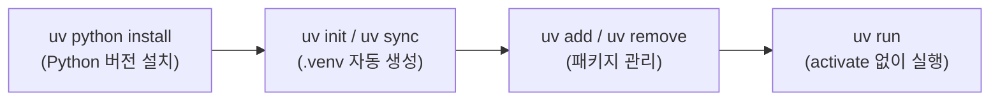
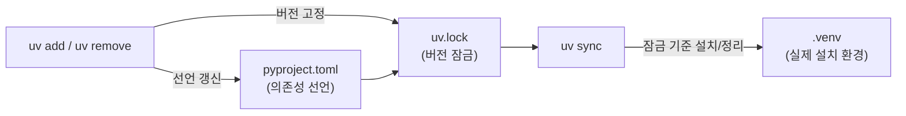

# uv — Python 올인원 패키지·버전 관리 — 설치 · 버전 · 프로젝트 · 패키지 · 실행

> Python 버전 관리부터 가상환경·패키지 설치·실행까지를 하나로 합친 도구 uv 의 큰 그림과 자주 쓰는 명령을 모았다. 백엔드는 전부 uv 로 의존성을 관리한다(`pyproject.toml` + `uv.lock`). 전 백엔드 공통 runbook.

---

## 0. 큰 그림

uv(Astral 이 Rust 로 만든 Python 통합 관리 도구) 하나가 "버전 → 가상환경 → 패키지 → 실행" 의 전 단계를 담당한다. 예전엔 단계마다 다른 도구(pyenv, venv, pip, poetry …)를 갈아 끼웠지만, uv 는 같은 흐름을 단일 CLI 로 처리한다.



> 핵심 한 줄: **버전·환경·패키지·실행을 따로 외우지 말고 `uv` 한 도구로 통일한다.** dev 컨테이너에는 이미 깔려 있으니, 신규 합류자는 로컬에서만 §3 을 한 번 하면 된다.

---

## 1. uv 란?

uv 는 그동안 단계별로 쓰던 여러 도구를 하나로 통합한 패키지·버전 관리 도구다. 아래 표의 "기존 도구" 를 따로 설치·학습할 필요 없이 uv 명령 하나로 같은 일을 한다.

| 기존 도구         | 역할             |
| ----------------- | ---------------- |
| pyenv / conda     | Python 버전 관리 |
| venv / virtualenv | 가상환경 생성    |
| pip               | 패키지 설치      |
| pip-tools         | 의존성 고정      |
| poetry / pipenv   | 프로젝트 관리    |

용어 한 줄 풀이:

- **가상환경(virtual environment)** = 프로젝트별로 격리된 Python·패키지 공간. 프로젝트끼리 버전 충돌을 막는다. uv 에선 `.venv` 폴더가 이 역할.
- **의존성 고정(lock)** = 설치된 패키지의 정확한 버전을 파일에 박아 두는 것. uv 는 `uv.lock` 에 기록해 "내 PC 에선 되는데" 를 막는다.

---

## 2. 주요 특징

- **속도** — pip 대비 10~100배 빠른 패키지 설치
- **통합** — Python 버전부터 패키지 관리까지 단일 도구
- **표준 호환** — `pyproject.toml`, `uv.lock` 등 표준 형식 사용
- **크로스 플랫폼** — macOS, Linux, Windows 모두 지원

> 왜 표준 형식이 중요한가: `pyproject.toml`(프로젝트 메타·의존성 선언 파일)과 `uv.lock`(고정된 버전 잠금 파일)은 uv 전용 포맷이 아니라 공용 표준이라, 팀원이 같은 정의로 동일한 환경을 재현할 수 있다.

---

## 3. 설치

사내 dev 컨테이너에는 이미 설치되어 있다. 로컬에 별도 설치하려면:

```bash
# macOS / Linux
curl -LsSf https://astral.sh/uv/install.sh | sh

# Windows (PowerShell)
powershell -ExecutionPolicy ByPass -c "irm https://astral.sh/uv/install.ps1 | iex"
```

✅ **검증**: 새 터미널을 열고 `uv --version` 으로 버전이 출력되면 설치 성공. (출력이 없으면 §10 PATH 함정 참고.)

---

## 4. Python 버전 관리

uv 가 시스템과 별개로 Python 인터프리터 자체를 설치·관리한다 — pyenv 없이도 원하는 버전을 골라 쓴다.

```bash
uv python install 3.12               # 버전 설치
uv python list --only-installed      # 설치된 버전 확인
uv python pin 3.12                   # 전역 기본 버전 지정
```

✅ **검증**: `uv python list --only-installed` 출력에 `3.12` 가 보이면 설치 완료.

---

## 5. 프로젝트 초기화

새 프로젝트의 골격(`pyproject.toml` 등)을 만든다.

```bash
uv init my-project --python 3.12
```

- `uv sync` 실행 시 `.venv` 자동 생성
- 별도 activate 없이 `uv run` 으로 바로 실행

> 왜 activate 가 필요 없나: `uv run` 이 명령을 자동으로 프로젝트의 `.venv` 안에서 실행한다. `source .venv/bin/activate` 를 깜빡해 시스템 Python 으로 잘못 도는 실수를 원천 차단한다.

`pyproject.toml` 구조 예시:

```toml
[project]
name = "my-project"
version = "0.1.0"
requires-python = ">=3.12"
dependencies = [
    "fastapi~=0.115",
    "uvicorn~=0.34",
]

[dependency-groups]
main = [ "sqlalchemy~=2.0", ]
dev = [ "pytest~=8.3", "ruff~=0.11", ]
```

> `[project].dependencies` 는 런타임 필수 패키지, `[dependency-groups]` 는 선택/개발용 그룹(예: 테스트·린트). 어느 쪽에 넣을지의 정책은 [동시성/런타임 정책](../3-기법/동시성-가이드.md) §6.4 정본 참고.

✅ **검증**: `my-project/pyproject.toml` 이 생성되고 위와 같은 `[project]` 블록이 들어 있으면 초기화 성공.

---

## 6. 패키지 관리

```bash
uv add requests       # 패키지 추가
uv remove requests    # 패키지 제거
uv sync               # 의존성 동기화
```

- `uv add`/`uv remove` 는 `pyproject.toml` 과 `uv.lock` 을 함께 갱신한다.
- `uv sync` 는 `uv.lock` 기준으로 `.venv` 를 잠금 상태와 일치시킨다(빠진 건 설치, 어긋난 건 맞춤).



✅ **검증**: `uv add requests` 후 `pyproject.toml` 의 `dependencies` 에 `requests` 가 추가되고 `.venv` 에 설치된다.

---

## 7. 명령 실행

`.venv` 를 activate 하지 않고도 그 환경으로 바로 실행한다.

```bash
uv run python main.py
uv run main.py
```

✅ **검증**: `uv run python --version` 이 §4 에서 핀(pin)한 버전을 출력하면, 시스템 Python 이 아니라 프로젝트 환경으로 도는 것이다.

---

## 8. VSCode 인터프리터 설정

- 인터프리터 선택: `(my_project) ./.venv/bin/python`
- ipynb 파일: `uv add ipykernel` 설치

✅ **검증**: VSCode 우하단 인터프리터 표시가 `.venv` 경로를 가리키면, 에디터의 lint·자동완성이 프로젝트 환경 기준으로 동작한다.

---

## 9. 주요 명령어 요약

| 작업          | 명령어                   |
| ------------- | ------------------------ |
| Python 설치   | `uv python install 3.12` |
| 패키지 추가   | `uv add requests`        |
| 의존성 설치   | `uv sync`                |
| 스크립트 실행 | `uv run python main.py`  |

---

## 10. 흔한 실수

- **`uv` 가 command not found** — 설치 직후 PATH 에 안 잡힌 경우. 새 터미널을 열거나 셸을 재시작한다(§3).
- **activate 후 `python` 직접 실행** — uv 흐름에선 activate 가 불필요하다. 시스템 Python 으로 잘못 도는 사고를 막으려면 `uv run` 으로 실행한다(§7).
- **`pip install` 직접 사용** — `.venv` 에는 들어가도 `pyproject.toml`/`uv.lock` 에 기록되지 않아 팀원 환경과 어긋난다. 패키지는 `uv add` 로 추가한다(§6).
- **버전 핀 누락** — `uv python pin` 을 안 하면 다른 버전으로 돌 수 있다. 프로젝트 버전을 명시한다(§4).

---

## 11. 요약 체크리스트

- [ ] uv 가 pyenv/venv/pip/poetry 를 하나로 대체한다는 큰 그림을 안다(§0–1)
- [ ] (로컬만) `uv --version` 으로 설치를 확인했다(§3)
- [ ] `uv python install` / `uv python pin` 으로 버전을 맞춘다(§4)
- [ ] 패키지는 `pip` 대신 `uv add`/`uv remove` 로 관리하고 `uv sync` 로 동기화한다(§6)
- [ ] 실행은 activate 없이 `uv run` 으로 한다(§7)

---

관련 문서: [동시성/런타임 정책](../3-기법/동시성-가이드.md) (의존성 그룹 정책 §6.4)
