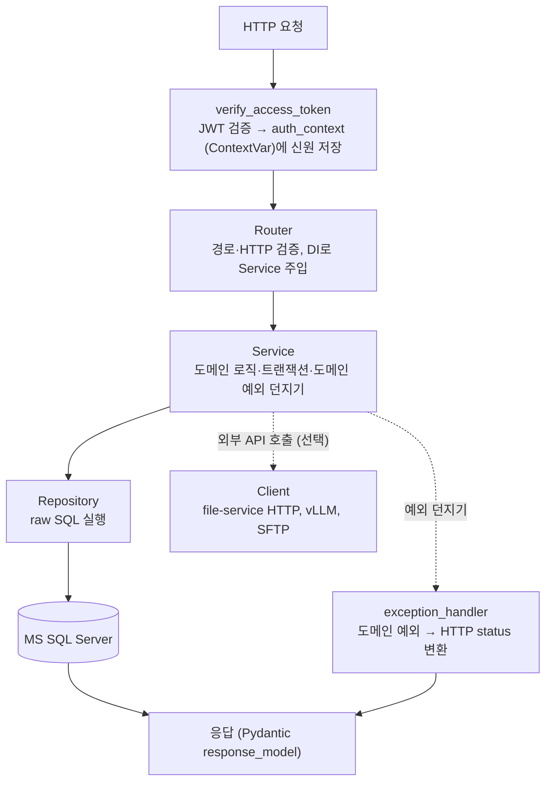
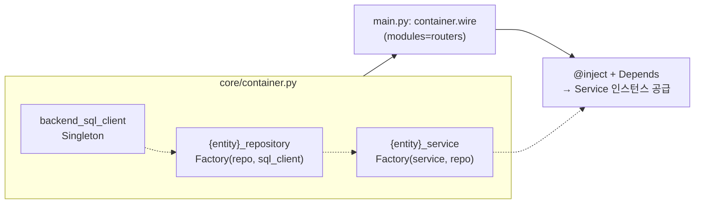
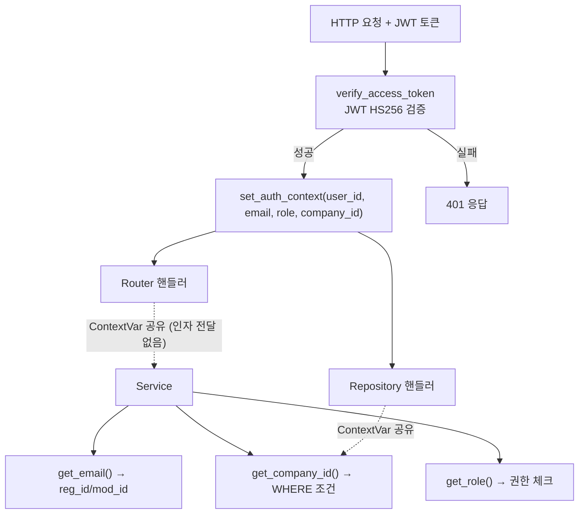
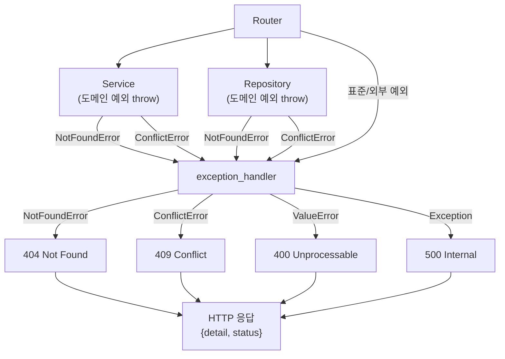
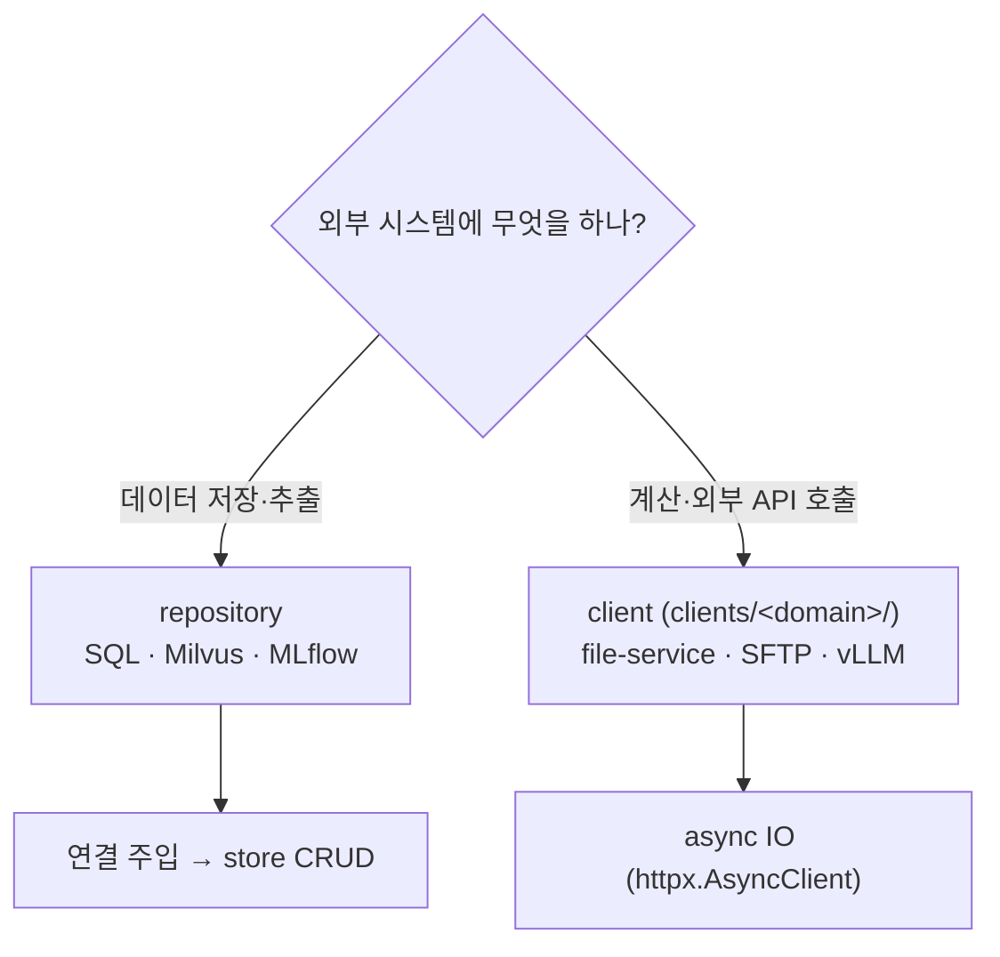

# FastAPI 백엔드 개발 — full-stack-template 기준

> 풀스택 템플릿 백엔드(FastAPI)에 처음 입문하는 사람이 **레이어 구조·DI·인증·예외·동시성**을 한 번에 잡는 입문 가이드. uv + Python 3.12 + SQLAlchemy raw SQL + dependency-injector 기준. `app/main.py`가 있는 모든 backend가 같은 구조다.

---

## 용어

- **DI**(의존성 주입) = 객체가 필요한 협력 객체를 직접 만들지 않고 밖에서 받아 쓰기
- **raw SQL** = SQL 문자열을 직접 작성하고 실행하는 방식 (ORM 이 객체에서 쿼리를 만들어주는 것과 다름)
- **ContextVar** = Python 3.7+의 요청 스레드별 전역 저장소. 같은 요청 안에서 어디서나 읽고 쓸 수 있다
- **Middleware**(미들웨어) = 요청→응답 흐름 사이에 끼어 동작하는 코드. 인증/로깅 등 전역 처리에 쓴다

---

## 0. 큰 그림 — 요청이 도착해 DB를 거쳐 응답이 되돌아가는 길

HTTP 요청 한 편이 들어오면 **인증 → 레이어(Router → Service → Repository) → DB**를 거쳐 응답이 나간다. 도중에 던져진 예외는 한 곳(`exception_handler`)에서 HTTP status로 변환한다.



> **두 가지 핵심 규칙** — 이 repo 백엔드의 동작을 이해하는 열쇠다:
>
> 1. **신원은 인자로 안 넘긴다.** `auth_context`라는 ContextVar(요청별 전역 저장소)가 흐르고, Service/Repository는 `get_company_id()` 같은 getter로 읽는다. 함수 시그니처가 깔끔해지고, background task에서도 같은 패턴으로 작동한다.
> 2. **예외도 일일이 처리하지 않는다.** Service/Repository는 "데이터가 없습니다" 같은 도메인 예외만 던지고, HTTP 상태 코드(404/409 등)로 변환하는 건 `exception_handler`가 일괄 처리한다.

---

## 1. 스택·환경

- **Python 3.12**, 의존성 관리 **uv** (`pyproject.toml` + `uv.lock`). poetry/pip를 쓰지 않는다. 설정 방법은 [../1-개발환경/uv-파이썬환경.md](../1-개발환경/uv-파이썬환경.md).
- **FastAPI + uvicorn** (웹 프레임워크), **SQLAlchemy Core `text()`** (raw SQL 실행 — 문자열을 직접 쓰고 실행, ORM 자동 생성 아님), **pyodbc** (MS SQL Server 드라이버).
- **dependency-injector** (DI 프레임워크 — 객체를 직접 `new`하지 않고 컨테이너가 알아서 만든다), **PyJWT HS256** (토큰 서명/검증).
- 환경 파일: `.env.development` / `.env.staging` / `.env.production`. **cwd=app**에서 구동해야 한다 (config/import 경로가 app 폴더 기준이기 때문).

---

## 2. 폴더 구조

```text
<service>/app/
├── main.py          # 진입점 — 앱 수명주기, 라우터 등록, DI 배선
├── core/            # 설정, DI 컨테이너, 인증, 예외 핸들러, 데이터베이스, 미들웨어
├── routers/         # API 엔드포인트 (URL 경로 정의, HTTP 검증만)
├── services/        # 비즈니스 로직 + 트랜잭션 + 예외 던지기
├── repositories/    # SQL 실행 (thin wrapper — where/order/pagination만)
├── schemas/         # Pydantic 모델 (요청/응답 데이터 구조 정의)
├── models/          # 테이블 구조 정의 (SQLAlchemy Table — 실행 쿼리는 아님)
├── clients/         # 외부 시스템 호출 (file-service, SFTP, vLLM...)
├── managers/         (선택) 스케줄러, Kafka consumer 등 장수명 백그라운드
└── utils/           # 교차 헬퍼(common/) + 도메인별 순수 함수
```

> 백엔드는 **여러 개 동시에 존재할 수 있다** — `app/main.py`가 있는 모든 폴더가 백엔드 서비스다 (`backend-service/`, `file-service/`, `etl-pipeline/` 등). 전 서비스가 같은 폴더 구조를 복제한다.

---

## 3. 레이어 — Router → Service → Repository

한 엔티티(예: Todo CRUD)를 추가하면 세 레이어에 각각 파일을 만든다.

### 3.1 각 레이어의 책임

```mermaid
flowchart LR
    subgraph RT["Router"]
        RT1["URL 경로 + HTTP 검증"]
    end
    subgraph SVC["Service"]
        SVC1["도메인 규칙 적용 · 트랜잭션"]
    end
    subgraph REPO["Repository"]
        REPO1["raw SQL 실행"]
    end
    subgraph DB[("MS SQL")]
    end

    RT1 -->|DI 주입| SVC1
    SVC1 --> REPO1
    REPO1 --> DB
```

| 레이어 | 무슨 일을 하나 | 하지 말 것 |
| --- | --- | --- |
| **Router** | URL 경로 정의, 인증, DI로 Service 주입, HTTP 검증 | 비즈니스 로직, SQL, 도메인 예외 직접 던지기 |
| **Service** | 도메인 규칙 적용, 트랜잭션 관리, 도메인 예외(`NotFoundError` 등) 던지기 | `HTTPException` 직접 던지기, HTTP 상태 코드 생각하기 |
| **Repository** | SQL 실행, 필터/정렬/페이지네이션 처리 | 비즈니스 디폴트, 검증, 도메인 예외 |

> **왜 세 레이어인가?** — "로터에 그냥 다 넣으면 안 되나?" → 된다. 하지만 서비스 로직이 router에 있으면: ① 테스트할 수 없다 (HTTP 서버가 돌려야 함), ② 백그라운드_task에서도 같은 로직을 못 쓴다, ③ 라우트 URL이 바뀔 때 비즈니스 코드도 같이 고쳐야 한다. 레이어를 나누면 각 레이어가 독립적으로 작동하고 테스트를 할 수 있다.

### 3.2 예시 — "Todo 조회"가 레이어를 건너가는 모습

❌ **실수** — 루터가 직접 SQL을 실행한다:

```python
# routers/todo/todo_router.py — ❌
@router.get("/{todo}")
async def get_todo(todo: str, conn = Depends(...)):
    result = conn.execute(text("SELECT * FROM TN_todo WHERE todo = :todo"), {"todo": todo})
    row = result.fetchone()
    if not row:
        raise HTTPException(status_code=404, detail="데이터 없음")
    return row
```

→ 테스트가 HTTP 서버가 돌려야 하고, 백그라운드에서 같은 로직을 쓰려면 복사-붙여넣기 해야 한다.

✅ **올바른 패턴** — Service를 통한다:

```python
# routers/todo/todo_router.py — ✅
@router.get("/{todo}", response_model=TodoOut, dependencies=[Depends(verify_access_token)])
@inject
async def select_todo(
    request: Request,
    todo: str,
    todo_service: TodoService = Depends(Provide[Container.todo_service]),
):
    return todo_service.select_todo({"todo": todo})

# services/todo/todo_service.py — ✅
def select_todo(self, args: dict) -> dict:
    item = self.todo_repository.select_todo(args)
    if not item:
        raise NotFoundError("데이터를 찾을 수 없습니다.")
    return item
```

→ Service는 HTTP를 모른다. background task, MCP tool, 단위 테스트 어디서든 호출 가능하다.

---

## 4. DI — 컨테이너가 객체를 만들어주다

**DI(의존성 주입)**는 "Service가 Repository를 직접 `new`해서 만들지 않고, 컨테이너가 알아서 만들어서 주입한다"는 뜻이다.



```python
# core/container.py — DI 컨테이너 (유일한 객체 생성 지점)
todo_repository = providers.Factory(TodoRepository, sql_client=backend_sql_client)
todo_service    = providers.Factory(TodoService, todo_repository=todo_repository)
```

❌ **실수** — 직접 인스턴스화:

```python
# ❌ — DI 우회
service = TodoService(repo=TodoRepository(sql_client))
```

→ Mock을 주입하면 단위 테스트를 할 수 없다. 환경(개발/스테이징)에 따라 다른 설정을 주입하기 어렵다.

✅ **올바른 패턴** — 컨테이너 주입:

```python
@inject
async def endpoint(
    service: TodoService = Depends(Provide[Container.todo_service]),
):
    return service.select_todo_list(args)
```

컨테이너가 테스트 시 `sql_client`를 mock 객체로 교체하면, 전체 레이어가 자동으로 mock DB를 사용한다.

---

## 5. 인증 — ContextVar로 신원이 흐르다

JWT 토큰을 검증한 후 사용자 정보를 **ContextVar**에 저장하면, 같은 요청 내 어디서나 getter 함수로 읽을 수 있다.



```python
# auth_context.py — ContextVar (요청 스레드별 전역 저장소)
from contextvars import ContextVar

_company_id: ContextVar[str | None] = ContextVar("_company_id", default=None)

def get_company_id() -> str | None:
    return _company_id.get()

def set_company_id(value: str) -> None:
    _company_id.set(value)
```

```python
# routers/ — 검증
dependencies=[Depends(verify_access_token)]

# services/ → 읽기
from core.auth_context import get_company_id
company = get_company_id()
```

실제 서비스 코드에서는 `get_email()` → 감사 `reg_id`/`mod_id`, `get_company_id()` → 테넌트 격리 `WHERE company_id = ...`, `get_role()` → 권한 체크에 쓴다.

> **왜 ContextVar인가?** — `threading.local()` 과 비슷하지만 async에서도 안전하게 작동한다. 요청 한 번이 여러 코루틴으로 나뉘어도 같은값을 읽는다. 인자로 계속 내려보내지 않아도 되서 코드 시그니처가 단순해진다.

---

## 6. 예외 처리 — Service는 도메인 예외만 던지고 handler 가 HTTP로 변환

Service/Repository는 `HTTPException`을 직접 던지면 안 된다. 도메인 의미의 예외(`NotFoundError`/`ConflictError`)만 던지고, HTTP 상태 코드로 변환하는 건 `exception_handler`가 일괄 처리한다.



```python
# core/exception_handler.py — 전역 예외 핸들러
@app.exception_handler(NotFoundError)
async def not_found_handler(request, exc):
    return JSONResponse(status_code=404, content={"detail": str(exc)})
```

❌ **실수** — Service에서 HTTPException 직접 던지기:

```python
# services/ — ❌
def update_todo(self, args):
    if not self.todo_repository.select_todo(args):
        raise HTTPException(status_code=404, detail="데이터 없음")  # HTTP 의존성
    self.todo_repository.update_todo(args)
```

→ Service 코드가 HTTP 라이브러리에 의존하게 되어 test 할 때 HTTPException을 import 해야 하고, background task에서도 같은 코드를 못 쓴다.

✅ **올바른 패턴** — 도메인 예외 사용:

```python
# services/ — ✅
def update_todo(self, args):
    if not self.todo_repository.select_todo(args):
        raise NotFoundError("데이터를 찾을 수 없습니다.")
    self.todo_repository.update_todo(args)
```

### 6.1 예외 언제 어떤 걸 던지나?

```mermaid
flowchart TD
    Q{"어떤 상황이 발생하나?"}
    Q -->|"리소스 없음"<br/>(조회/수정/삭제 시 None)| ERR404["NotFoundError → 404"]
    Q -->|"중복 PK / 종속 충돌"<br/>(insert 시 이미 존재)| ERR409["ConflictError → 409"]
    Q -->|"입력값 위반"<br/>(비즈니스 규칙 실패)| ERR422["ValueError → 400"]
    Q -->|"권한 부족"<br/>(작성자 아닌 사용자 수정)| ERR403["PermissionError → 403"]
    Q -->|"외부 서비스 연결 불가"<br/>(LLM/Milvus 미설정)| ERR503["ConnectionError → 503"]
    Q -->|"예측 못한 오류"<br/>(의도하지 않은 예외)| ERR500["raise 안 함 → handler 가 500 자동 변환"]
```

> 도메인 예외 (`NotFoundError`, `ConflictError`)는 `core/exceptions.py`에 정의, 표준 예외 (`ValueError`, `PermissionError`)는 Python builtin 그대로 사용. 상세 매핑은 [design-patterns-backend.md](../../.claude/docs/design-patterns-backend.md) "예외 선택 가이드".

---

## 7. 동시성 — async 세계에서 sync 코드가 막으면 안 되다

FastAPI는 async로 돌아간다. sync로만 동작하는 코드(DB 쿼리)를 async 컨텍스트에서 직접 실행하면 **다른 모든 응답이 느려진다**.

```mermaid
flowchart TD
    Q{"async 컨텍스트에서 sync 호출?"}
    Q -->|"아니오"| OK["그대로 실행"]
    Q -->|"예"| Q2{"critical path?"<br/>(초 단위 CPU / N+1 loop / polling)}
    Q2 -->|"예"| WRAP["run_in_threadpool<br/>with ContextVar 복사"]
    Q2 -->|"아니오"<br/>(단일 5ms select/insert / µs CPU / 작은 파싱)| SKIP["wrap 금지<br/>오버헤드 100-200µs 더 큼"]
```

❌ **실수** — 백그라운드 where sync DB가 event loop를 막는다:

```python
# ❌ — sync DB가 event loop를 블로킹 → 다른 요청도 같이 느려짐
async def _process_background(self):
    df = self.service.build_recipe(...)         # heavy sync 계산 (초 단위)
    for col in columns:
        self.repo.insert_column(col)            # N+1 sync DB
```

✅ **올바른 패턴** — `run_in_threadpool`로 sync 작업을 thread로 보낸다:

```python
from fastapi.concurrency import run_in_threadpool

async def _process_background(self):
    df = await run_in_threadpool(self.service.build_recipe)

    def _insert_columns():
        for col in columns:
            self.repo.insert_column(col)
    await run_in_threadpool(_insert_columns)
```

> **왜 `run_in_threadpool`인가?** — `asyncio.to_thread()`도 비슷한 일을 하지만, FastAPI의 AnyIO thread pool과 **별개 pool**을 사용해서 thread 예산이 분리된다. `run_in_threadpool`은 FastAPI가 제공하는 표준으로 전체 thread pool을 공유한다.

---

## 8. 외부 시스템 — repository vs client 판별



판별 기준: **데이터 store 면 repository, compute/외부 API 면 client**.

- **repository** ← SQL · Milvus(벡터DB) · MLflow(tracking) 처럼 **데이터를 담는 store**. 연결을 주입받아 CRUD 담당.
- **client** (`clients/<domain>/`) ← **compute/외부 API**. `httpx.AsyncClient` 기반 (모든 IO 메서드 async).

---

## 9. 동작 예시 — Todo CRUD 한 개를 처음부터 끝까지

이 절은 위에서 배운 모든 규칙이 **한 엔티티에 어떻게 적용되는지** 처음부터 끝까지 따른다. Todo 엔티티(이름+카테고리+마감일)를 만드는 전체 과정이다.


### 9.1 Schema — `schemas/todo/todo_schema.py`

요청 들어오는 모양(`In`)과 응답 나가는 모양(`Out`)을 정의한다. Pydantic 모델이다.

```python
from pydantic import BaseModel, Field
from schemas.common_schema import CommonEntity, TrimmedBaseModel

class Todo(TrimmedBaseModel):
    name: str | None = Field(None, max_length=200)
    category: str | None = Field(None, max_length=5)
    due_date: str | None = Field(None)

class TodoOut(Todo, CommonEntity):
    todo: str

class TodosOut(BaseModel):
    items: list[TodoOut]
    total_count: int

class TodoCreateIn(Todo):
    todo: str = Field(..., max_length=20)

class TodoUpdateIn(Todo):
    pass
```

> `CommonEntity` — `rn`, `reg_dt`, `reg_id`, `mod_dt`, `mod_id`를 상속하는 base 모델. `TrimmedBaseModel` — 빈 문자열을 `None`으로 자동 변환.

### 9.2 Repository — `repositories/todo/todo_repository.py`

SQL만 실행한다. 필터/정렬/페이지네이션 헬퍼(`build_filter_params`/`parse_sort`)를 쓰면 WHERE/ORDER BY/Pagination 이 자동 생성된다.

```python
from sqlalchemy import text
from utils.common.devextreme_utils import build_filter_params, parse_sort

class TodoRepository:
    def __init__(self, sql_client):
        self.sql_client = sql_client

    def query_select_todo(self) -> str:
        return """
            SELECT * FROM (
                SELECT todo, name, category, due_date,
                       FORMAT(reg_dt, 'yyyy-MM-dd HH:mm:ss') AS reg_dt, reg_id,
                       FORMAT(mod_dt, 'yyyy-MM-dd HH:mm:ss') AS mod_dt, mod_id
                FROM TN_todo
            ) A WHERE 1 = 1
        """

    def select_todo_list(self, args: dict) -> tuple[list[dict], int]:
        base_sql = self.query_select_todo()
        sql_where, sql_params = build_filter_params(args)
        order_by = parse_sort(args.get("sort")) or "todo ASC"
        skip = int(args.get("skip", 0))
        take = args.get("take")

        count_sql = f"SELECT COUNT(*) AS cnt FROM ({base_sql} {sql_where}) TB"

        if take is not None:
            take = int(take)
            final_sql = f"""
                SELECT * FROM (
                    SELECT ROW_NUMBER() OVER (ORDER BY {order_by}) AS rn, TB.*
                    FROM ({base_sql} {sql_where}) TB
                ) TB WHERE rn BETWEEN {skip + 1} AND {skip + take}
            """
        else:
            final_sql = f"SELECT ROW_NUMBER() OVER (ORDER BY {order_by}) AS rn, TB.* FROM ({base_sql} {sql_where}) TB"

        with self.sql_client.connect() as conn:
            rows = conn.execute(text(final_sql), sql_params).mappings().all()
            total = conn.execute(text(count_sql), sql_params).scalar()
            return [dict(r) for r in rows], total

    def select_todo(self, args: dict) -> dict | None:
        sql = self.query_select_todo() + " AND todo = :todo"
        with self.sql_client.connect() as conn:
            row = conn.execute(text(sql), args).mappings().fetchone()
            return dict(row) if row else None

    def insert_todo(self, args: dict) -> tuple:
        sql = """
            INSERT INTO TN_todo (todo, name, category, due_date,
                                 reg_id, reg_dt, mod_id, mod_dt)
            OUTPUT INSERTED.todo
            VALUES (:todo, :name, :category, :due_date,
                    :reg_id, CURRENT_TIMESTAMP, :reg_id, CURRENT_TIMESTAMP)
        """
        with self.sql_client.connect() as conn:
            with conn.begin():
                return conn.execute(text(sql), args).fetchone()

    def update_todo(self, args: dict) -> None:
        sql = """UPDATE TN_todo SET name = :name, category = :category,
                    due_date = :due_date, mod_id = :mod_id, mod_dt = CURRENT_TIMESTAMP
              WHERE todo = :todo"""
        with self.sql_client.connect() as conn:
            with conn.begin():
                conn.execute(text(sql), args)

    def delete_todo(self, args: dict) -> None:
        sql = "DELETE FROM TN_todo WHERE todo = :todo"
        with self.sql_client.connect() as conn:
            with conn.begin():
                conn.execute(text(sql), args)
```

> sync `def`로 작성한다 (pyodbc는 sync only — anti-pattern 12). INSERT/UPDATE 에 감사 컬럼(`reg_id`/`mod_id`)이 포함된다.

### 9.3 Service — `services/todo/todo_service.py`

비즈니스 규칙을 적용하고, 도메인 예외를 던진다.

```python
from core.exceptions import ConflictError, NotFoundError
from core.auth_context import get_email
from repositories.todo.todo_repository import TodoRepository

class TodoService:
    def __init__(self, todo_repository: TodoRepository):
        self.todo_repository = todo_repository

    def select_todo_list(self, args: dict) -> tuple[list, int]:
        return self.todo_repository.select_todo_list(args)

    def select_todo(self, args: dict) -> dict:
        item = self.todo_repository.select_todo(args)
        if not item:
            raise NotFoundError("데이터를 찾을 수 없습니다.")
        return item

    def insert_todo(self, args: dict) -> tuple:
        if self.todo_repository.select_todo(args):
            raise ConflictError("이미 존재하는 데이터입니다.")
        args["reg_id"] = get_email()
        return self.todo_repository.insert_todo(args)

    def update_todo(self, args: dict) -> None:
        if not self.todo_repository.select_todo(args):
            raise NotFoundError("데이터를 찾을 수 없습니다.")
        args["mod_id"] = get_email()
        self.todo_repository.update_todo(args)

    def delete_todo(self, args: dict) -> None:
        if not self.todo_repository.select_todo(args):
            raise NotFoundError("데이터를 찾을 수 없습니다.")
        self.todo_repository.delete_todo(args)
```

### 9.4 Router — `routers/todo/todo_router.py`

URL 경로 + HTTP 검증만 담당한다. Service 에 위임한다.

```python
from core.container import Container
from core.auth_context import get_email
from core.security import verify_access_token
from dependency_injector.wiring import Provide, inject
from fastapi import APIRouter, Depends, Query, Request
from schemas.common_schema import CreateOut, DeleteOut, UpdateOut
from schemas.todo.todo_schema import TodoCreateIn, TodoOut, TodosOut, TodoUpdateIn
from services.todo.todo_service import TodoService
from utils.common.devextreme_utils import parse_filter_sort

router = APIRouter(prefix="/todo", tags=["todo"])

@router.get("", response_model=TodosOut, dependencies=[Depends(verify_access_token)])
@inject
async def select_todo_list(
    request: Request,
    skip: int = Query(0), take: int | None = None,
    filter: str | None = None, sort: str | None = None,
    todo_service: TodoService = Depends(Provide[Container.todo_service]),
):
    filter_obj, sort_obj = parse_filter_sort(filter, sort)
    args = {"skip": skip, "take": take, "filter": filter_obj, "sort": sort_obj}
    items, total = todo_service.select_todo_list(args)
    return TodosOut(items=items, total_count=total)

@router.post("", response_model=CreateOut, dependencies=[Depends(verify_access_token)])
@inject
async def insert_todo(
    request: Request, body: TodoCreateIn,
    todo_service: TodoService = Depends(Provide[Container.todo_service]),
):
    args = body.model_dump()
    args["reg_id"] = get_email()
    keys = todo_service.insert_todo(args)
    return CreateOut(data={"todo": keys[0]} if keys else None)

@router.get("/{todo}", response_model=TodoOut, dependencies=[Depends(verify_access_token)])
@inject
async def select_todo(
    request: Request, todo: str,
    todo_service: TodoService = Depends(Provide[Container.todo_service]),
):
    return todo_service.select_todo({"todo": todo})

@router.put("/{todo}", response_model=UpdateOut, dependencies=[Depends(verify_access_token)])
@inject
async def update_todo(
    request: Request, todo: str, body: TodoUpdateIn,
    todo_service: TodoService = Depends(Provide[Container.todo_service]),
):
    args = body.model_dump()
    args["todo"] = todo
    args["mod_id"] = get_email()
    todo_service.update_todo(args)
    return UpdateOut()

@router.delete("/{todo}", response_model=DeleteOut, dependencies=[Depends(verify_access_token)])
@inject
async def delete_todo(
    request: Request, todo: str,
    todo_service: TodoService = Depends(Provide[Container.todo_service]),
):
    todo_service.delete_todo({"todo": todo})
    return DeleteOut()
```

### 9.5 DI 등록 — `core/container.py`

```python
todo_repository = providers.Factory(TodoRepository, sql_client=backend_sql_client)
todo_service    = providers.Factory(TodoService, todo_repository=todo_repository)
```

### 9.6 main.py

```python
from routers.todo.todo_router import router as todo_router
app.include_router(todo_router)

# container.py 의 router_modules 리스트에 추가:
#   "routers.todo.todo_router"
```

→ 이걸로 `/api/todo` 엔드포인트 5개(`GET` / `GET/{id}` / `POST` / `PUT/{id}` / `DELETE/{id}`)가 모두 작동한다.

> 자연어로 "'프로젝트' 엔티티 만들어줘"하면 `scaffold-backend` 에이전트가 위 패턴으로 자동 생성한다. 1:N 부모-자식 CRUD 도 제공 패턴 있다 — 상세는 [design-patterns-backend.md](../../.claude/docs/design-patterns-backend.md).

---

## 10. 흔한 실수 체크리스트

작업 중 이 규칙을 바로 점검하면 된다. 상세 코드 예시·검출 명령·예외는 [anti-patterns-backend.md](../../.claude/docs/anti-patterns-backend.md).

1. ~~Router에 SQL/비즈니스 로직~~ → Service 위임
2. ~~Repository에 비즈니스 디폴트/검증~~ → Pydantic/Service
3. ~~반환값 안 쓰는 `select_X` 호출~~ → 결과 확인 + 도메인 예외 던지기
4. ~~ORM 쿼리(`session.query()`) 사용~~ → `text()` + `.mappings()`
5. ~~감사 컬럼 누락~~ → INSERT `reg_id`/`reg_dt`, UPDATE `mod_id`/`mod_dt`
6. ~~페이지네이션 안 함~~ → `ROW_NUMBER()` + skip/take
7. ~~response_model / list wrapper 누락~~ → `{items, total_count}` 패턴
8. ~~인증 미적용~~ → `Depends(verify_access_token)`
9. ~~catch-all `try/except Exception`~~ → handler가 매핑하므로 try/except 지우기
10. ~~`HTTPException` 직접 던짐 (Service/Repository)~~ → 도메인 예외
11. ~~직접 인스턴스화~~ → DI 컨테이너
12. ~~async DB 메서드~~ → `def` + `engine.connect()` (pyodbc는 sync only)
13. ~~sync blocking을 threadPool에 안 위임~~ → `run_in_threadpool` (critical path만)

---

## 요약 — 체크리스트

**신규 엔티티 추가 시 체크리스트** — 작업 완료판정을 위한 확인 목록:

- [ ] 폴더 구조가 `schemas/`→`repositories/`→`services/`→`routers/` 순서로 파일 생성했는가
- [ ] Service/Repository는 도메인 예외만던지고 `HTTPException`를 안 썼는가
- [ ] Router는 `dependencies=[Depends(verify_access_token)]`가 적용됐는가
- [ ] DI 컨테이너에 등록하고 `main.py`에서 include했는가
- [ ] INSERT/UPDATE에 감사 컬럼(`reg_dt`, `reg_id`, `mod_dt`, `mod_id`)이 포함됐는가
- [ ] 리스트 조회는 `ROW_NUMBER()` 페이지네이션이 적용됐는가
- [ ] 응답은 `response_model`과 `{items, total_count}` wrapper가 있는가
- [ ] DB 메서드는 sync `def`로 작성했는가 (pyodbc는 sync only)
- [ ] sync blocking 작업을 async 컨텍스트에서 `run_in_threadpool`로 wrap했는가 (critical path만)

---

## 실행

```bash
# 단일 백엔드 서비스 (cwd=app 필수)
cd <service>/app && uv run uvicorn main:app --reload

# dev 전체 서비스 일괄 기동
process-compose up        # staging+ 는 docker-compose

# lint/format 일괄 실행 (Backend ruff + Frontend ESLint/Prettier)
rtk pre-commit run --all
```

---

관련 문서: [design-patterns-backend.md](../../.claude/docs/design-patterns-backend.md) · [anti-patterns-backend.md](../../.claude/docs/anti-patterns-backend.md) · [동시성 가이드](../3-기법/동시성-가이드.md) · [동시성 인덱스](../3-기법/동시성-출처인덱스.md) · [인증 토큰 전략](../4-아키텍처/인증토큰전략.md) · [SaaS 멀티테넌트](../4-아키텍처/saas-멀티테넌트.md) · [FastMCP 서버 개발](fastmcp-서버개발.md) · [React/Next.js 프론트 개발](react-nextjs-프론트개발.md)
