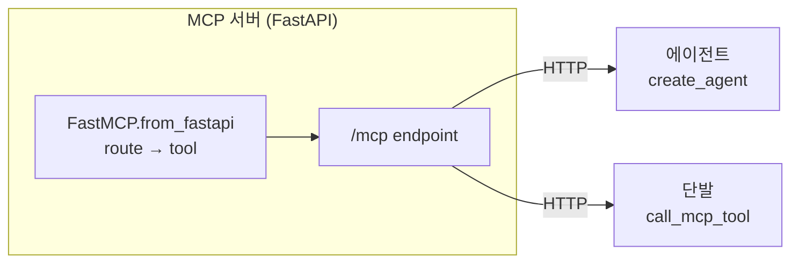
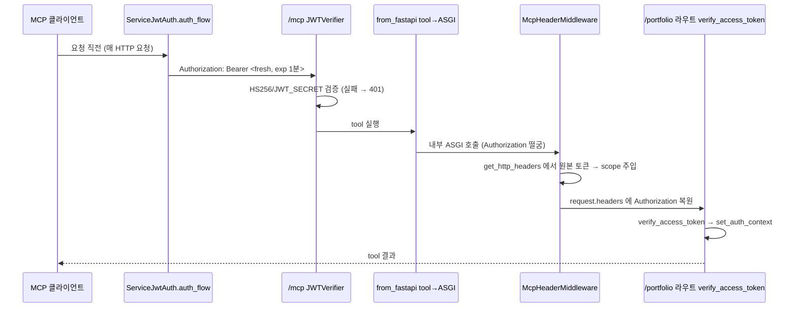
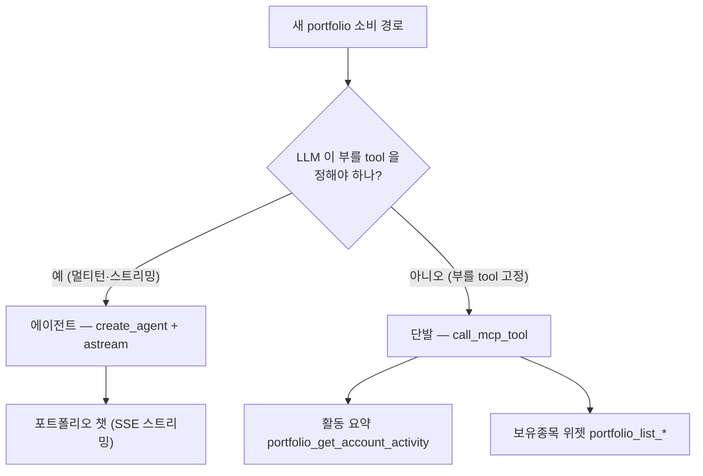

# FastMCP 서버 개발 — full-stack-template 기준

> FastAPI 백엔드를 `FastMCP.from_fastapi` 로 **MCP(Model Context Protocol) 서버**로 만들어 LLM 에이전트가 도구를 직접 골라 부르게 하는 전 과정 — **결정(from_fastapi vs native) → RPC 설계 → tool/서비스 추가 → 큐레이션 규칙 → 2단 인증 → 소비(에이전트·단발·SSE) → 멀티서버 → 신규 서비스·multi-agent 바인딩·테스트(§10~14)**. 이 문서 하나로 완결되게 썼다(self-contained). 정본 예제는 `portfolio-mcp-service`(서버)·`devactivity-service`(소비자)·`multi-agent-service`(멀티서버 소비자). LLM 공통 토픽(일반 프롬프트 기법·가드레일·토큰 수명)만 각 정본으로 링크하고, **MCP 전용 슬라이스는 전부 인라인**한다. backend 레이어 기초([fastapi-백엔드개발.md](fastapi-백엔드개발.md))는 전제로 깐다.

---

## 0. 큰 그림

우리 MCP 서버는 특별한 게 아니라 **평범한 FastAPI backend + `from_fastapi` 한 줄**이다. REST 라우터(`@inject` → service → client/repository)를 그대로 두고, `FastMCP.from_fastapi` 가 그 라우트를 MCP tool 로 변환한다. tool 실행은 ASGI 로 **같은 앱의 라우트를 다시 호출**하므로 인증·예외핸들러·DI 가 그대로 작동한다. 소비는 두 경로 — **LLM 이 무엇을 부를지 정하면 에이전트, 우리가 부를 걸 이미 알면 단발**.



> AG 와 ONE 은 서로 다른 소비 방식이지만, 아래에 같은 `MultiServerMCPClient` 를 쓴다(§8).

> Backend 지식(API 레이어·DI·인증·예외)이 그대로 통한다. tool 정의를 따로 쓰지 않는다 — 라우터가 곧 tool 이다.

용어:

- **MCP**(Model Context Protocol) — LLM 이 도구를 표준 규약으로 발견·호출하는 프로토콜.
- **MCP tool** — MCP 로 노출된 함수. 본질은 **RPC**(이름 + 인자 묶음 호출). 여기선 REST endpoint 의 그림자.
- **`from_fastapi`** — FastAPI 앱의 OpenAPI 를 읽어 라우트를 tool 로 자동 변환.
- **native tool** — `@mcp.tool` 데코레이터로 손수 작성한 tool.
- **에이전트** — LLM 이 스스로 tool 을 선택→호출→재호출하는 루프(`create_agent`).
- **SSE**(Server-Sent Events) — 서버→브라우저 단방향 토큰 스트림.

이 repo 는 `portfolio-mcp-service` 가 계좌·보유·거래 데이터 접근을 단독 소유해 MCP tool 로만 노출(파일·SFTP 를 `file-service` 가 단독 소유하는 것과 동일). `devactivity-service` 가 하나의 `MultiServerMCPClient` 를 두 경로로 쓴다 — 포트폴리오 챗(에이전트)과 활동 요약 리포트·위젯(단발).

---

## 1. 먼저 결정 — `from_fastapi` 인가 native 인가

MCP tool 은 본질이 RPC 라, **RESTful 리소스 API 를 그대로 미러링하면 LLM 에게 나쁜 tool 표면**이 된다. FastMCP 공식 권고도 "큰 REST API 자동변환은 프로토타이핑용, 프로덕션 미러링 금지 — 큐레이션된 tool 이 훨씬 낫다"다. 그렇다고 \`from_fastapi\` 가 나쁜 건 아니다 — **큐레이션하면 native 와 사실상 동급**이다.

`from_fastapi` 의 핵심 메리트는 **기존 FastAPI 인프라를 그대로 쓴다**는 거다:

| 인프라                           | `from_fastapi`                       | native `@mcp.tool`                          |
| -------------------------------- | ------------------------------------ | ------------------------------------------- |
| **DI** (`@inject`/`Depends`)     | ✅ 자동                              | ❌ tool 에 Depends 없음 → 수동 연동         |
| **인증** (`verify_access_token`) | ✅ 자동 (ASGI 라우트 Depends)        | ❌ tool 내부에서 수동 검증                  |
| **예외핸들러**                   | ✅ `@app.exception_handler` 자동     | ❌ try/except + MCP 에러 맵핑               |
| **lifespan**                     | ✅ 그대로                            | ❌ tool 에서 컨테이너 수동 호출             |
| **granularity**                  | ❌ 1 route = 1 tool 고정             | ✅ 여러 엔드포인트 → 1 tool (consolidation) |
| **기존 REST 호출자 공유**        | ✅ 같은 라우트 다시 서빙             | ❌ 라우트·tool 별도 정의                    |
| **테스트**                       | ✅ Swagger UI 직접 호출 + TestClient | ❌ MCP client 세팅 또는 함수 직접 호출      |

> **핵심 기준** — 기존 FastAPI 인프라를 손대지 않고 MCP 면만 얹고 싶으면 **`from_fastapi`**. 한 task 가 여러 엔드포인트를 엮어야 한다면 **native**.

| 상황                                                | 권장                                                         | 왜                                                                                                        |
| --------------------------------------------------- | ------------------------------------------------------------ | --------------------------------------------------------------------------------------------------------- |
| 서비스를 MCP 목적으로 신설 (라우트 에이전트용 설계) | **`from_fastapi`**                                           | 라우터 단일 정본 + 큐레이션으로 native 품질. DI·인증·예외·lifespan 자동. portfolio-mcp-service 가 이 경우  |
| 작고 잘 다듬은 서비스 **여럿**                      | **`from_fastapi`** (서비스별)                                | FastMCP 공식 권고의 경고는 "오픈API 통째로 MCP tool 을 남발"이지 "작고 큐레이션된 소규모 서비스"가 아니다 |
| 기존 거대 CRUD API 를 LLM 에 붙여야                 | `RouteMap(EXCLUDE)` 로 subset 만 + 큐레이션, 또는 **native** | 1:1 자동변환은 무관 라우트·verbose 응답을 쏟는다                                                          |
| 한 agent task 가 **여러 엔드포인트**를 엮음         | **native**(또는 통합 tool)                                   | `from_fastapi` 는 1 route=1 tool 고정 — 워크플로를 한 tool 로 못 묶음                                     |

> 이분법이 아니다 — `from_fastapi` + 핵심은 native `@mcp.tool` 섞어쓰기 가능.

---

## 2. RPC 스럽게 설계 (REST 미러링 함정 피하기)

`from_fastapi` 를 native 품질로 끌어올리는 첫 단계는 **라우트를 RESTful 리소스가 아니라 RPC(액션·쿼리)로 설계**하는 것이다.

> **배경** — MCP tool 이 LLM 에게 보이는 것은 **함수 호출**이다. `get_financials(corp="삼성전자", year=2024, fs_type="CFS")` 식으로. RESTful 자원 탐색(`GET /financials?skip=0&take=50`) 이 아니라 **목표 달성용 함수**여야 한다. LLM 이 인자를 직관적으로 채우고, 반환값이 곧 다음 추론의 입력이 됨을 전제로 디자인한다.

- **granularity 는 task 단위** — 각 라우트 = 완결된 에이전트 작업 1개(`disclosure-financials`, `market-quote`). `GET /disclosures/{rcept_no}` 상세 → 목록 → 재조회 같은 CRUD 내비게이션 체인을 만들지 않는다.
- **인자는 의미 있는 타입** — `filter: str = "{}"`(JSON 문자열)가 아니라 `corp: str`, `year: int`, `report_code: str` 등 LLM 이 목적을 직관적으로 이해하는 개별 필드. `Field(description=)` 로 필수.
- **복잡한 인자는 POST + body** — 파라미터가 여러 개면 `GET ?a=&b=&c=` 쿼리스트링보다 단일 request 모델(POST body)이 tool input schema 로 깔끔하다.
- **닫힌 집합은 `Literal`** — `Literal["1d", "1w", "1mo"]` → JSON 스키마 `enum` 으로 모델·검증이 강제된다. (출력/외부 런타임 값은 `str`)
- **tool 이름은 `operation_id` 로 path 와 디커플** — REST path 는 REST 소비자용, tool 이름은 RPC 함수명으로 따로 준다. 양쪽 누구도 타협 안 함.
- **`response_model` 은 에이전트에 필요한 필드만** — tool 결과가 곧 LLM 프롬프트의 입력이 됨. verbose 응답은 토큰 낭비 + 컨텍스트 오염. `total_count`/`source` 같은 의미 플래그 포함.

```python
# ❌ REST 미러링 — LLM 에 나쁜 tool 표면
@router.get("/disclosures")          # tool: list_disclosures_disclosures_get (망가진 이름)
async def list_disclosures(skip: int = 0, take: int = 50, filter: str = "{}"): ...
#  → 기계용 skip/take/filter(JSON) 를 LLM 이 채워야 함, 상세는 별 호출로 체이닝

# ✅ RPC — task-shaped, 깨끗한 이름·인자
@router.post("/disclosure/financials", operation_id="disclosure_financials")
async def get_financials(body: FinancialsIn) -> DisclosureSearchOut:
    """기업 재무제표(매출·영업이익·자본·부채 등)를 공시 기준으로 조회. 배당·주주구조는 disclosure_dividend / disclosure_major_shareholder 로 — 재무조회로 배당 찾지 마라."""
    ...
#  → corp/year/report_code/fs_type 등 의미 있는 타입 인자 + 도구 선택 라우팅이 docstring 에
```

정본 패턴은 [disclosure_router.py](../../disclosure-mcp-service/app/routers/disclosure/disclosure_router.py)·[disclosure_schema.py](../../disclosure-mcp-service/app/schemas/disclosure/disclosure_schema.py). REST 라우트 컨벤션("CRUD=단수명사+동사 / 프로세스·RPC=`/domain/sub`+동사")은 [design-patterns-backend.md](../../.claude/docs/design-patterns-backend.md) "라우트 (REST) 컨벤션".

---

## 3. 새 tool 한 개 추가 (레시피)

`from_fastapi(app=...)` 가 앱의 **OpenAPI spec 을 파싱**하고, `operation_id`(= tool 이름) · 파라미터 모델(= input schema) · 응답 모델(= output schema) · docstring(= description) 을 그대로 MCP tool 로 변환하므로 MCP 측에서 별도 `@mcp.tool` 등록이 필요 없다. REST 라우트만 추가하면 tool 도 된다.

1. **schema** (`schemas/<domain>/`) — 요청 `XxxIn`(= tool input), 응답 `XxxOut`(= tool output). 모든 필드에 `Field(description=)`. 닫힌 집합은 `Literal`(§5).
2. **service** (`services/<domain>/`) — 도메인 로직. 레이어 규칙은 [fastapi-백엔드개발.md §3](fastapi-백엔드개발.md).
3. **router** (`routers/<domain>/`) — `@router.post(..., operation_id="...")` + **docstring 에 도구 선택 라우팅**. 끝. `from_fastapi` 가 변환해준다.

```python
# schemas/market/market_schema.py
class MarketQuoteIn(BaseModel):
    symbol: str = Field(description="종목 티커 또는 종목코드 (예: '005930', 'AAPL')")

class MarketOhlcIn(BaseModel):
    symbol: str = Field(description="종목 티커 또는 종목코드")
    interval: Literal["1d", "1w", "1mo"] = Field(default="1d", description="캔들 주기 (1d=일봉, 1w=주봉, 1mo=월봉)")

# routers/market/market_router.py
@router.post("/market/quote", operation_id="market_quote")   # ← operation_id = tool 이름
@inject
async def market_quote(body: MarketQuoteIn,
                      market_service: MarketService = Depends(Provide[Container.market_service])) -> MarketQuoteOut:
    """단일 종목의 현재 시세(현재가·등락률·거래량)를 조회. 과거 캔들 추이는 market_ohlc, 지수는 market_index 로."""   # ← docstring = tool description
    return await market_service.get_quote(body)
```

> **큐레이션 체크** (native 품질의 핵심 — §5) — 새 tool 마다: ① `operation_id` 가 `<도메인>_<동사>` 인가 ② docstring 이 "언제 이 도구/언제 형제 도구" 라우팅을 담나 ③ 모든 `Field(description=)` 채웠나 ④ 닫힌 집합은 `Literal` 인가 ⑤ `response_model` 이 에이전트에 필요한 필드만 트리밍됐나.

---

## 4. 새 MCP 서비스 추가 (레시피)

서비스 하나를 통째로 MCP 서버로 세울 때 (portfolio-mcp-service 본뜨기):

1. **평범한 FastAPI backend 생성** — `app/main.py` + 레이어. `scaffold-backend` 또는 [design-patterns-backend.md](../../.claude/docs/design-patterns-backend.md). DB 가 필요 없으면(외부 API 프록시형) repository 대신 client 만.
2. **`main.py` 에 MCP 배선 추가** — REST 앱을 그대로 두고 아래 블록:

```python
# <service>/app/main.py
from fastmcp import FastMCP
from fastmcp.server.auth.providers.jwt import JWTVerifier
from fastmcp.server.providers.openapi import MCPType, RouteMap

INSTRUCTIONS = """..."""   # 서버 도메인 자기소개 (§5 — 도구설명 밖 운용·답변 지침)

mcp = FastMCP.from_fastapi(
    app=app,
    name="<Domain> MCP",
    instructions=INSTRUCTIONS,
    route_maps=[RouteMap(mcp_type=MCPType.TOOL)],            # GET 포함 전 라우트 → tool
    auth=JWTVerifier(public_key=settings.JWT_SECRET, algorithm="HS256"),  # MCP 층 게이트
)
mcp_app = mcp.http_app(path="/mcp")
app.mount("/", mcp_app)   # REST(/domain/*)·/openapi.json 먼저 매칭, 나머지는 mcp_app
```

3. **lifespan** — `mcp_app.lifespan` 이 Streamable HTTP 세션매니저 task group 을 띄운다(미실행 시 transport 사망). 기존 lifespan 안에서 `async with mcp_app.lifespan(app):` 로 감싸고 종료 시 client 를 정리한다.

```python
@asynccontextmanager
async def lifespan(app: FastAPI):
    async with mcp_app.lifespan(app):   # 세션매니저 task group
        yield
    await app.container.portfolio_client().aclose()
```

4. **`--workers=1`** 로 구동 (§9).
5. **소비자에 등록** — devactivity 의 `MCP_SERVERS`(config)에 `{name, url, path, enabled}` 한 줄. **코드·프롬프트 0 수정** (멀티서버 §8).

정본: [main.py](../../portfolio-mcp-service/app/main.py).

---

## 5. 큐레이션 규칙·컨벤션 (= native 품질)

> **MCP 의 두 개념** — `from_fastapi` 가 REST 라우트를 MCP 로 변환할 때 **Tool** 과 **Resource** 둘 중 하나로 매핑한다.
>
> - **Tool**(함수 호출) — LLM 이 `call_tool()` 로 호출. `search`, `quote` 등 액션에 사용.
> - **Resource**(정적 데이터) — LLM 이 `read_resource()` 로 읽음. 코드베이스, 설정 값, 템플릿, 문서 등 읽기 전용 데이터에 사용.
>
> 이 repo 의 MCP 소비자는 `call_tool()` 만 쓰므로, **모든 라우트를 tool 로 만든다**. (`read_resource()` 를 지원하는 데이터가 없는 구조이므로 Tool 로 호출 가능해야 한다). 따라서 `route_maps=[RouteMap(mcp_type=MCPType.TOOL)]` 은 GET 라우트도 tool 이 될 수 있게 만든다.

| 항목                    | 규칙                                                                | 왜                                                                                                                                                                                                                                                              |
| ----------------------- | ------------------------------------------------------------------- | --------------------------------------------------------------------------------------------------------------------------------------------------------------------------------------------------------------------------------------------------------------- |
| **tool 이름**           | `operation_id="<도메인>_<동사>"` (`disclosure_financials`)          | FastAPI 자동생성 망가진 이름 회피. 도메인 prefix 가 멀티서버 충돌 1차 방어(§8)                                                                                                                                                                                  |
| **RPC path**            | kebab-case, `/domain/sub`+동사 허용. path 와 tool 이름 디커플       | REST 소비자용 path + RPC tool 이름 분리 — 양쪽 비타협                                                                                                                                                                                                           |
| **입력 스키마**         | `XxxIn` + 전 필드 `Field(description=)`. **닫힌 집합은 `Literal`**  | `Literal` → JSON 스키마 `enum` 으로 LLM·검증이 강제 (설명문 의존 탈피). 단 출력/외부 런타임 값은 `str` (예상외 값에 검증 깨짐)                                                                                                                                  |
| **ALL → tool 강제**     | `route_maps=[RouteMap(mcp_type=MCPType.TOOL)]`                      | `from_fastapi` 의 기본 매핑은 **GET → Resource**(정적 데이터), **POST/PUT/DELETE/PATCH → Tool**(함수 호출). MCP 클라이언트는 `call_tool()` 로 tool 만 호출하므로 GET 도 tool 이 되어야 consumer 가 닿음. `route_maps` 설정이 **모든 메서드를 tool 로 강제**한다 |
| **노출 표면**           | 에이전트 무관 라우트는 `RouteMap(mcp_type=MCPType.EXCLUDE)`         | 1:1 자동변환이 내부/헬스 라우트까지 쏟는 것 차단                                                                                                                                                                                                                |
| **docstring**           | "언제 이 도구 / 언제 형제 도구" 라우팅·데이터 한계를 담는다         | 도구 선택은 소비자 공통 지식 → 프롬프트 아닌 도구설명에 두면 모든 소비자가 혜택                                                                                                                                                                                 |
| **서버 `instructions`** | 도구설명 밖 도메인 운용·답변 정책(날짜·범위·0건·표시)               | 서버가 단독 소유 → 소비자가 모아 시스템 프롬프트에 주입(§7·§8). 서버 늘려도 소비자 코드 불변                                                                                                                                                                    |
| **`response_model`**    | 에이전트에 필요한 필드만. `total_count`/`source` 같은 의미 플래그 노출 | output schema(structuredContent) = 트리밍된 페이로드. verbose 응답이 토큰·혼란 누적                                                                                                                                                                             |

> **INSTRUCTIONS·docstring 함정** — 모델이 그대로 출력할 문장(출력 형식·"무엇을 할 수 있는지" 안내)을 프롬프트에 그대로 박으면, 출력 가드가 재현으로 오인해 정상 응답을 거절한다. 플레이스홀더로 두거나 "네 말로 풀어서"라고 지시한다. 프롬프트 일반 기법은 [llm-프롬프트엔지니어링.md](../3-기법/llm-프롬프트엔지니어링.md), 안전·redaction 은 [llm-가드레일.md](../3-기법/llm-가드레일.md).

### 5.1 단계적 검색(staged_search) — 0건 폴백을 코드로 보장

**무엇** — 외부 검색·조회 API 는 선택 필터를 많이 걸수록 0건이 되기 쉽다. docstring 에 "0건이면 조건을 줄여 재시도" 라고 적어도 그건 **LLM 이 같은 tool 을 다시 부르길 기대하는 확률적 지시**일 뿐 — sub-agent 가 안 줄이거나 엉뚱한 필드를 빼면 그대로 빈손이다. `staged_search` 는 그 폴백을 **service 계층의 결정론적 코드**로 옮긴다: 전체 조건으로 한 번, 0건이면 핵심 조건만 남긴 stage 로 한 번 더 — **1회 tool 호출 안에서 완화 검색까지 끝난다**.

**어디에** — service 계층에만 둔다. repository(파싱·호출)·router(operation_id·시그니처)·schema 는 건드리지 않는다. 공용 헬퍼는 `utils/common/staged_search.py` (전 MCP 서비스 byte-identical 복사).

**적용 기준** — **다중 선택 필터가 있는 검색만**. 핵심 식별자(기업·종목) 외에 보고서 유형·기간·공시 유형 같은 _조이는_ 선택 필터가 2개 이상일 때 진가다. **단일 파라미터 검색**(웹검색 `keyword` 하나)·**단건 조회/명칭 일치**(공시 접수번호 lookup, 종목코드 정확 조회)는 완화할 선택 필드가 없어 **적용 안 한다**.

```python
# disclosure-mcp-service/app/services/disclosure/disclosure_service.py
from utils.common.staged_search import staged_search   # schemas import 보다 뒤 (isort 순서)

async def get_financials(self, params: FinancialsIn) -> DisclosureSearchOut:
    # 단계적 조회: 요청 보고서 → 0건이면 사업보고서(연간)·연결로 완화해 재시도
    relaxed = params.model_copy(update={"report_code": "11011", "fs_type": "CFS"})
    stages = [lambda: self.disclosure_repo.get_financials(params)]
    if relaxed.model_dump() != params.model_dump():     # 완화가 원본과 같으면 stage 안 늘림
        stages.append(lambda: self.disclosure_repo.get_financials(relaxed))
    return await staged_search(stages)
```

`staged_search(stages, is_empty=is_empty_out)` 는 stages 를 순서대로 시도해 **첫 비-0건 결과를 즉시 반환**하고, 모두 0건이면 마지막 결과를 돌려준다. 기본 `is_empty_out` 은 응답모델 `.data` 가 비면 True — 응답이 dict 면 `is_empty=lambda out: not out["data"]` 처럼 명시한다.

> **왜 보고서/연결 완화인가** — `model_copy(update={선택필드: 기본값})` 로 _선택_ 필터만 표준값(사업보고서 `11011`·연결 `CFS`)으로 리셋한 사본을 만들고, 그게 원본과 다를 때만 stage 를 추가한다. 핵심(기업·연도) 은 남으므로 "기업은 맞지만 분기보고서·별도재무라 0건" 인 흔한 케이스가 1회 호출로 구제된다. nullable 선택 필터(공시 유형·기간)는 `None`/`ALL` 로 떨궈 같은 효과를 낸다.

---

## 6. 인증 — MCP 층 + REST 층 2단

portfolio-mcp-service 인증은 **두 층**이다. tool 실행이 ASGI 로 내부 라우트를 재호출할 때 `from_fastapi` 가 **Authorization 을 기본 제외**하기 때문. `devactivity → portfolio-mcp-service` 는 사용자 JWT 가 아니라 **서비스 토큰**(`create_access_token`, `{sub: SERVICE_NAME}`, exp 1분)으로 호출한다(role/company 게이트 없음 — 내부 전용).



- **MCP 층** (`/mcp` 핸드셰이크·tool 호출) — `from_fastapi(auth=JWTVerifier(...))`
- **헤더 브리지** — `McpHeaderMiddleware` 가 `get_http_headers()`(FastMCP ContextVar, 원본 MCP 요청 헤더)에서 토큰을 꺼내 내부 ASGI 호출의 `request.scope` 에 주입. fastmcp 미설치 백엔드에선 import 실패 → no-op. 정본 [middlewares.py](../../portfolio-mcp-service/app/core/middlewares.py).
- **REST 층** (`/domain/*`) — `verify_access_token` 이 헤더(미들웨어 주입분 포함) → query 순으로 읽어 검증·`set_auth_context`. 직접호출이든 tool 내부호출이든 같은 의존성. 정본 [security.py](../../portfolio-mcp-service/app/core/security.py).
- **소비자 토큰** — `ServiceJwtAuth(httpx.Auth)` 가 **요청마다** fresh 토큰 발급:

```python
# devactivity-service/app/clients/mcp/mcp_auth.py
class ServiceJwtAuth(httpx.Auth):
    def auth_flow(self, request: httpx.Request):
        request.headers["Authorization"] = f"Bearer {create_access_token()}"
        yield request
```

- **정적 `headers={...}` 금지** — MCP 는 `initialize`·tool 호출·SSE 재연결마다 별도 요청이라, exp 1분 토큰을 한 번 박으면 곧 만료. `auth_flow` 는 요청 직전 호출돼 항상 신선.
- **`JWT_SECRET` 3중 동일 필수** — frontend·소비자·MCP 서버 byte-identical(불일치 시 401). `JWTVerifier.public_key` 가 이름과 달리 HS256 대칭키 = `JWT_SECRET`.

→ 토큰 수명·refresh 전략은 [인증토큰전략.md](../4-아키텍처/인증토큰전략.md), 권한·회사 격리는 [saas-멀티테넌트.md](../4-아키텍처/saas-멀티테넌트.md).

---

## 7. 소비 — 에이전트 루프 / 단발 / SSE

만든 MCP 서버는 두 경로로 소비된다. **클라이언트(`MultiServerMCPClient`)는 공유**, tool 선택 주체만 다르다(LLM vs 코드). 결정 규칙: **LLM 이 무엇을 부를지 정해야 하면 에이전트, 우리가 부를 걸 이미 알면 단발.**



### 7.1 에이전트 루프

도메인 서비스(`PortfolioChatService`)는 프롬프트·메시지만 구성하고, **MCP 연결·에이전트 루프·스트림 매핑은 도메인 무관 러너 `stream_mcp_agent`** 에 위임한다.

```python
# devactivity-service/app/clients/mcp/mcp_agent.py
async def stream_mcp_agent(chat_client, mcp_client, system_prompt, messages,
                           recursion_limit=_RECURSION_LIMIT):   # 20 — tool 무한루프 상한
    yield {"status": "도구 준비 중…"}
    tools = await get_cached_tools(mcp_client)                  # 모듈 캐시 + ServiceJwtAuth
    agent = create_agent(chat_client, tools, system_prompt=system_prompt)
    async for msg, meta in agent.astream(
        {"messages": messages}, {"recursion_limit": recursion_limit}, stream_mode="messages"
    ):
        for tc in msg.tool_call_chunks or []:
            if tc.get("name"):
                yield {"status": f"{tc['name']} 호출 중…"}      # 어떤 tool 부르는지 진행표시
        if isinstance(msg.content, str) and msg.content:
            yield {"content": msg.content}                      # 최종답 토큰 델타
```

- **`create_agent`**(`langchain.agents`)가 정본 — tool-call → 실행 → 재호출 루프를 내장. 구식 `langgraph.prebuilt.create_react_agent` 아님.
- **`stream_mode="messages"`**: 토큰 단위 스트림. `tool_call_chunks` 로 tool 호출 status 를, `AIMessageChunk.content` 로 최종답을 흘린다.
- **system = 베이스(안전·출력 규칙) + 서버 `instructions`(도메인) + 동적 컨텍스트**: `compose_system_prompt` 가 조립([mcp_prompt.py](../../devactivity-service/app/clients/mcp/mcp_prompt.py)). 도구 선택·인자 규칙은 도구 설명(§5), 도메인 운용은 서버 `instructions` 가 소유.
- **UI 범위(scope)는 프롬프트로 주입** — 계좌/포트폴리오/기간/종목을 system 에 넣으면 LLM 이 tool 인자에 반영. 강제 필터가 아닌 컨텍스트.
- **멀티턴 무상태**: 프론트가 직전 대화(`history`)를 매 요청 동봉, 서버의 `trim_messages` 가 최근분만 환원.

### 7.2 SSE 프레이밍

러너가 yield 하는 dict 이벤트를 라우터가 그대로 SSE 프레임(`data: <json>\n\n`)으로 감싼다.

```python
# devactivity-service/app/routers/chat/chat_router.py
@router.post("", response_class=StreamingResponse)
async def chat(question: str = Body(..., embed=True), ...):
    async def event_stream():
        try:
            async for event in chat_service.chat(question, ...):
                yield "data: " + json.dumps(event, ensure_ascii=False) + "\n\n"
        except Exception as e:
            yield "data: " + json.dumps({"error": _user_error(e)}, ensure_ascii=False) + "\n\n"
        yield "data: [DONE]\n\n"
    return StreamingResponse(event_stream(), media_type="text/event-stream")
```

- 이벤트 3종: `{status}`(진행) · `{content}`(답변 델타) · `{error}`(실패) → 마지막 `[DONE]`.
- 예외는 catch 해서 `{error}` 이벤트로 — 스트림 중단 대신 프론트 토스트.

### 7.3 단발 호출

부를 tool 이 고정이면(활동 요약 리포트 = 항상 `portfolio_get_account_activity` 한 번) 에이전트 런타임을 끌고 오지 않고 **같은 `MultiServerMCPClient`** 에 `call_mcp_tool` 로 단발 호출한다.

```python
# devactivity-service/app/clients/mcp/mcp_client.py
async def call_mcp_tool(client, tool_name, tool_args=None) -> dict:
    tools = await get_cached_tools(client)
    matched = next((t for t in tools if t.name == tool_name), None)
    if matched is None:
        raise ValueError(f"도구 '{tool_name}'을(를) 찾을 수 없습니다.")
    result = await matched.ainvoke(tool_args or {})   # list[dict] content block (text/json)
    return _parse_json(_extract_payload(result, tool_name))
```

- 리포트 요약: `summarize_client.with_structured_output(...)`. 목록 위젯: LLM 없이 결과 그대로 드롭다운에. 정본 [mcp_client.py](../../devactivity-service/app/clients/mcp/mcp_client.py)·[activity_report_service.py](../../devactivity-service/app/services/report/activity_report_service.py).

---

## 8. 멀티서버 오케스트레이션

`MultiServerMCPClient` 는 connections dict 를 받는다. `MCP_SERVERS`(config)를 돌려 enabled 서버만 등록 — **코드 변경 없이 서버 추가**.

```python
# devactivity-service/app/clients/mcp/mcp_client.py
def build_mcp_connections(config) -> dict[str, dict]:
    return {
        s.name: {
            "transport": "streamable_http",
            "url": s.url.rstrip("/") + s.path,   # 서버별 /mcp 경로 분리 가능
            "auth": ServiceJwtAuth(),            # 정적 headers 금지 — 매 요청 fresh (§6)
            "timeout": timedelta(seconds=30),
            "sse_read_timeout": timedelta(seconds=300),
        }
        for s in config.MCP_SERVERS if s.enabled
    }
```

- 서버 N개면 `get_cached_tools()` 가 전 서버 tool 을 합쳐 에이전트에 준다 — LLM 이 서버 경계를 모른 채 도구만 본다. tool 스키마는 런타임 불변이라 모듈 캐시.
- **이름 충돌은 `operation_id` 도메인 prefix(`market_*`·`disclosure_*`)로 막는다** (adapter `tool_name_prefix=True` 의 `<server>__<tool>` 도 가능하나 prefix 가 1차 방어).
- **도메인 지식은 각 서버가 자기 `instructions` 로 들고 온다.** langchain-mcp-adapters 는 tool 만 변환하고 **`instructions` 는 LLM 에 전달하지 않으므로**, `initialize` 핸드셰이크에서 직접 끌어온다:

```python
async def get_cached_instructions(client) -> list[str]:
    blocks = []
    for name in client.connections:                       # 연결된 전 서버
        async with client.session(name, auto_initialize=False) as session:
            result = await session.initialize()           # ← InitializeResult.instructions
        if text := (result.instructions or "").strip():
            blocks.append(text)
    return blocks   # compose_system_prompt(blocks, dynamic) 로 베이스에 주입 (§7.1)
```

> **서버 추가 = `MCP_SERVERS` 설정 + 그 서버 `instructions` 작성, 소비자 코드·프롬프트 0 수정.**

> **tool 총량 주의** — 서버를 늘려 LLM 이 보는 tool 이 많아지면 선택 정확도가 떨어짐. 이건 `from_fastapi` vs native 와 무관한 문제 — 완화는 에이전트 층(이름 prefix·tool 필터·도메인별 서브에이전트).

---

## 9. 주의사항

- **`--workers=1` 필수** — Streamable HTTP 세션이 워커별 in-memory. 멀티워커면 `initialize` 와 후속 요청이 다른 워커로 흩어지고 `Session terminated` 됨.
- **민감정보 마스킹은 소스**(MCP tool 아님) — redaction 은 LLM 호출 전 결정론 전처리여야 한다. tool 결과 만드는 지점에서 처리하면 챗·리포트 둘 다 보호됨. 상세 [llm-가드레일.md](../3-기법/llm-가드레일.md).
- **GET 이 Resource 로 빠짐** — `route_maps` 없으면 GET 은 tool 이 아님 → `call_tool` 이 못 닿음. 전부 `TOOL` 강제(§5).
- **`auth` 는 `from_fastapi(auth=)` 로** — `http_app(auth=)` 은 안 받음(§6).
- **정적 헤더 토큰 금지** — `ServiceJwtAuth` 로 매 요청 fresh 토큰(§6).

---

## 10. 신규 MCP 서비스 추가 — 교본과 핵심 규칙

§4 가 main.py 배선 레시피라면, **서비스 하나를 통째로 새로 세울 때의 교본은 `template-mcp-service/`** 다 — 디렉토리 구조·단계별 체크리스트는 그 안 README 가 정본으로 소유한다 (여기 중복하지 않음). 어떤 서비스든 핵심 규칙은 4가지:

- **`operation_id` = MCP tool 이름의 SoT** — 소비자(multi-agent-service `SUBAGENT_SPECS.mcp_tools`, devactivity-service `call_mcp_tool`)가 이 문자열로 tool 을 찾는다. 변경 시 양쪽 lockstep (§11).
- **docstring = tool description** — "언제 이 도구 / 언제 형제 도구" 라우팅 포함 (§5).
- **실응답 구조는 실호출로 확인** — 외부 API 응답 필드는 문서와 다른 경우가 흔하다. 파싱 코드는 반드시 실호출 1회로 검증 (§14).
- **외부 API 오류는 도메인 예외로** — 오류 응답을 빈 결과로 위장하지 않는다:

```python
# market-data-mcp-service/app/repositories/market/market_repository.py
@staticmethod
def _parse(raw: dict) -> tuple[list[dict], int]:
    # 벤더 레벨 오류(잘못된 파라미터·키 미등록 등)를 빈 결과로 위장하지 않고 즉시 노출
    if isinstance(raw, dict) and raw.get("error"):
        raise BadRequestError(f"시세 API 오류: {raw.get('error')}")
    items = (raw or {}).get("items", []) or []
    ...
```

> **왜 도메인 예외인가** — 오류가 빈 결과로 위장되면 LLM 은 "자료 없음"으로 답해버려 키 미등록·파라미터 누락 같은 운영 문제가 영영 안 보인다. 예외로 올리면 exception_handler 가 HTTP status 로 매핑하고 에이전트 trace 에 실패로 잡힌다.

---

## 11. tool ↔ multi-agent 바인딩

multi-agent-service 는 §8 의 `MultiServerMCPClient` 로 전 서버 tool 을 모은 뒤, **`SUBAGENT_SPECS.mcp_tools` 의 이름 문자열로 tool 을 sub-agent 에 분배**한다. 결합점은 이름뿐 — import 도 타입 공유도 없다.

```python
# multi-agent-service/app/agents/domains/financials.py
"financials_sub": SubAgentSpec(
    domain="financials",
    description="기업 재무제표·실적·재무비율(매출·영업이익·ROE 등) 분석 전문가",
    mcp_tools=[
        "disclosure_financials",        # ← disclosure_router 의 operation_id 와 정확 일치
        "disclosure_company",
        "doc_search_topic_earnings",
    ],
    ...
)
```

```python
# multi-agent-service/app/agents/sub_agents.py
for tool_name in spec.mcp_tools:
    t = tool_map.get(tool_name)
    if t is not None:
        tools.append(t)
    else:
        logger.warning("[sub_agents] MCP 도구 없음: %s (하위 에이전트: %s)", tool_name, name)
```

- **미존재 tool 은 경고 후 제외** — 기동 실패가 아니다. 서버가 그 tool 을 나중에 구현하면 재기동만으로 **자동 바인딩**된다.
- **변경은 lockstep** — `operation_id` 를 바꾸면 `mcp_tools` 의 문자열도 같이. 어긋나도 기동은 통과하고 sub-agent 가 조용히 그 도구를 잃는다 — 경고 로그가 유일한 신호.
- **기동 로그로 확인** — multi-agent-service 기동 시:

```
[AgentService] MCP tools 수집: 26개          ← 전 서버 합계 (0개면 MCP_SERVERS·서버 기동 확인)
[sub_agents] MCP 도구 없음: doc_search_topic_commodity (하위 에이전트: macro_sub)   ← 미바인딩
[sub_agents] 생성: financials_sub (domain=financials, tools=3)   ← tools= 숫자가 기대치인지
```

---

## 12. 신규 도메인 / sub-agent 추가 (multi-agent-service)

**도메인 추가** — `agents/registry.py` 모듈 docstring 이 정본. 연결점 5곳:

1. `agents/domains/<도메인>.py` — `SUBAGENT_SPECS` + `DOMAIN_SPEC` + `register()` (domain_key 는 `<도메인>_domain` 컨벤션)
2. `agents/registry.py` 의 `_DOMAIN_MODULES` 에 등록
3. `core/config.py` 의 `MULTI_AGENT_DOMAINS` 에 키 추가 (env 로도 토글)
4. `graphs/plan_execute/domains_map.py` — `_DOMAIN_LABELS` 에 라벨 1줄 + `_build_subagent_domain_map()` 의 SUBAGENT_SPECS import 목록 (Map-Reduce 도메인 분류·라벨)
5. `utils/agent/events.py` — `DOMAIN_KO_LABEL` 에 라벨 (UI step 이벤트)

플래너 프롬프트의 에이전트 목록과 plan 스키마는 `DOMAIN_SPEC.description` 으로 동적 구성 — 별도 수정 없음.

**sub-agent 1개만 추가** (기존 도메인에) — 3곳, 모두 그 도메인 모듈 안:

1. `SUBAGENT_SPECS` 에 `SubAgentSpec` 추가 — `mcp_tools` 는 §11 이름 결합, prompt 는 `build_subagent_prompt()` 권장
2. `DOMAIN_SPEC.sub_agents` 리스트에 이름 추가
3. `DOMAIN_SPEC.prompt`(도메인 관리자 프롬프트)의 "━━ 하위 에이전트 ━━" 목록에 한 줄 — 관리자 LLM 은 이 목록으로 위임을 정하므로 빠뜨리면 새 sub-agent 가 호출되지 않는다

**Writer 권한 분리 적용 기준** — `services/agent/agent_service.py` 의 `_WRITER_SUB_AGENTS` 집합에 이름을 넣으면 그 sub-agent 의 최종 답변을 tool evidence 기반 Writer LLM 이 따로 작성한다. fabrication(수치·식별자 임의 생성) 빈발 sub-agent 가 대상 — 주가·재무수치·종목코드처럼 "그럴듯한 거짓"이 잘 나오는 도메인이면 추가, 사내 자료 인용형이면 불필요.

---

## 13. MCP 서버 추가 — 소비자 측 1줄

서버를 새로 세웠으면(§4·§10) 소비자는 **`MCP_SERVERS` env 한 항목**이 전부다 (devactivity·multi-agent 동일한 config 모델):

```bash
# .env.* — JSON 배열에 한 항목 추가
MCP_SERVERS='[..., {"name": "market-data", "url": "http://localhost:8004", "path": "/mcp"}]'
```

- `build_mcp_connections()` 가 enabled 서버만 등록하고 `get_cached_tools()` 가 전 서버 tool 을 합친다 — **소비자 코드·프롬프트 0 수정** (§8).
- 도메인 운용 지침의 위치는 소비자마다 다르다 — devactivity 에이전트는 서버 `instructions` 를 `get_cached_instructions()` 로 자동 수집해 시스템 프롬프트에 주입(§8), multi-agent 는 도메인 지침을 `SUBAGENT_SPECS.prompt` 가 소유하므로 instructions 수집 없이 tool 만 가져온다.
- 단, multi-agent 에서 새 서버의 tool 을 실제로 쓰려면 §11 바인딩(`mcp_tools` 에 이름 추가)이 따라와야 한다 — env 만으론 tool 이 수집될 뿐 어느 sub-agent 에도 분배되지 않는다.

---

## 14. 테스트 절차 — "FastAPI = MCP 동등성" 위에서

`from_fastapi` 는 tool 호출을 ASGI 로 **같은 앱의 라우트에 되돌리므로**(§0), REST 실호출이 통과하면 tool 의 비즈니스 로직 검증은 끝난 것이다 — 로직 테스트를 MCP 핸드셰이크로 반복할 필요가 없다. 그래도 **MCP 경로로만 확인되는 것 2가지**는 남는다:

1. **tool 메타 노출** — 이름(`operation_id`)·description(docstring)·input schema(`Literal`→enum)가 의도대로 변환됐는지 (§5 큐레이션의 결과물)
2. **JWT 전송 경로** — `JWTVerifier`(MCP 층) + 헤더 브리지(§6)가 서비스 토큰으로 실제 통과하는지

**신규 tool 은 반드시 실호출 1회** — 기동 스모크(서버 뜨고 tool 목록 나옴)만으론 외부 API 응답 구조 버그를 못 잡는다. 예컨대 시세 벤더는 총 건수 위치가 API 군마다 이원화(`body.items.total` vs `response.count.totalCount`)돼 있거나, 재무 공시 조회는 보고서코드(`report_code`)·재무유형(`fs_type`) 누락 시 빈 결과로 떨어진다 — 둘 다 실호출에서만 드러난다.

검증 명령 3종:

```python
# ① REST 실호출 (cwd=<service>/app) — 로직 + 실응답 구조 검증
from fastapi.testclient import TestClient
from core.security import create_access_token
from main import app

headers = {"Authorization": f"Bearer {create_access_token()}"}   # 서비스 JWT (exp 1분)
with TestClient(app) as c:   # with 블록이 lifespan(MCP 세션매니저 포함) 실행
    r = c.post("/disclosure/financials", json={"corp": "삼성전자", "year": 2024}, headers=headers)
    print(r.status_code, r.json()["total_count"])
```

```python
# ② MCP tool 메타 + 실호출 (cwd=소비자 서비스 app, 서버 기동 후) — 큐레이션 + JWT 경로 검증
import asyncio
from clients.mcp.mcp_auth import ServiceJwtAuth
from langchain_mcp_adapters.client import MultiServerMCPClient

async def main():
    client = MultiServerMCPClient({
        "disclosure": {"transport": "streamable_http", "url": "http://localhost:8005/mcp", "auth": ServiceJwtAuth()},
    })
    tools = await client.get_tools()
    print([t.name for t in tools])                          # operation_id 들이 그대로 나오는지
    out = await tools[0].ainvoke({"corp": "삼성전자", "year": 2024})   # JWT 경로 + tool 실행
    print(str(out)[:300])

asyncio.run(main())
```

```bash
# ③ multi-agent 바인딩 확인 — 기동 로그 (§11)
cd multi-agent-service/app && APP_ENV=development uv run uvicorn main:app --port 8003 2>&1 \
  | grep -E "MCP tools 수집|도구 없음|sub_agents.*생성"
```

---

## 15. few-shot 예시 — tool 사용 지식 노출

tool 이 "이런 질문엔 이렇게 호출한다"는 예시를 자기 `_meta` 로 노출하면, 소비 에이전트가 모아
시스템 프롬프트에 주입해 LLM 인자 정확도를 높인다 (특히 파라미터가 복잡한 tool). few-shot 은
`operation_id` 와 같은 **MCP tool 메타데이터**라 라우터 데코레이터에서 선언한다 — schema(요청/응답
검증 계약) 오염도, 새 파일도 없이.

- `utils/common/few_shot.py`: `few_shot(examples)`(선언 설탕 → operation `x-fewshot`) + `attach_tool_meta`
  (`from_fastapi(mcp_component_fn=)` 훅 — `route.extensions` → `component.meta`). FastMCP 공식 커스터마이즈 훅.
- `main.py`: `FastMCP.from_fastapi(..., mcp_component_fn=attach_tool_meta)` + 기동 시 부착 tool 수 로그(누락 가시화).

```python
@router.post(
    "/news/search", operation_id="news_search",
    openapi_extra=few_shot([{"질문": "반도체 실적 관련 뉴스 검색", "호출": {"keyword": "실적", "category": "실적"}}]),
)
```

- 철학: 관찰된 오호출에서 귀납해 tool당 2~5개, 예방적 확장 금지. `호출` 은 그 tool In 스키마 인자 —
  drift 검사(예시 `호출` 을 In 모델로 인스턴스화)로 스키마 변경 시 깨짐을 잡는다.
- 소비자측(에이전트) 수집·주입은 [multi-agent-development.md](../guides/multi-agent-development.md) §7 참조.

---

관련 문서: [fastapi-백엔드개발.md](fastapi-백엔드개발.md) (backend 레이어 베이스) · [인증토큰전략.md](../4-아키텍처/인증토큰전략.md) (토큰 수명·refresh 미사용) · [llm-프롬프트엔지니어링.md](../3-기법/llm-프롬프트엔지니어링.md) (일반 프롬프트 기법) · [llm-가드레일.md](../3-기법/llm-가드레일.md) (redaction·모더레이션) · [design-patterns-backend.md](../../.claude/docs/design-patterns-backend.md) (REST 레이어 스캐폴드) · [경량msa.md](../4-아키텍처/경량msa.md) (서비스 토폴로지·단일소유)
</content>
</invoke>
