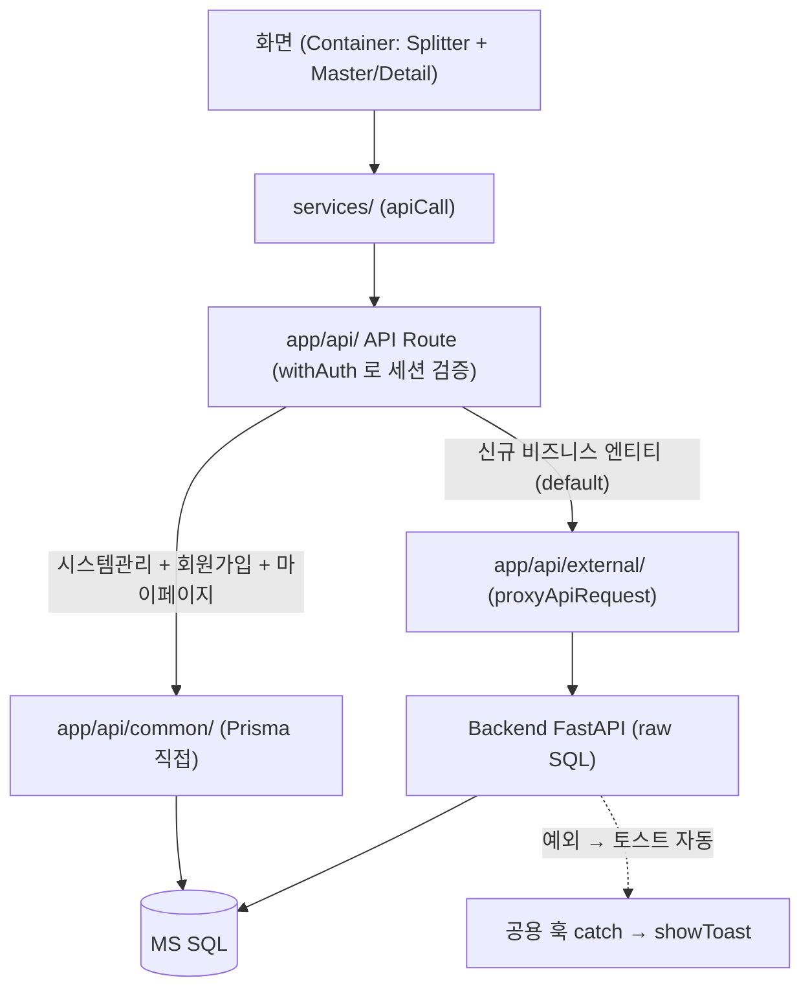
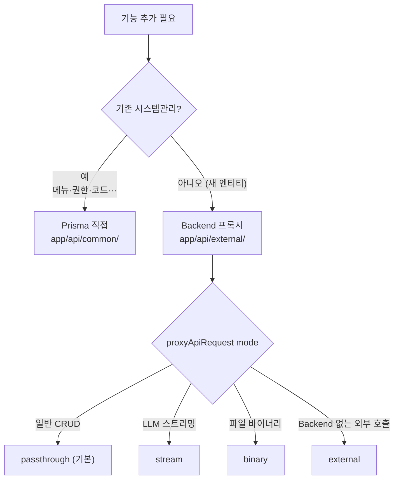
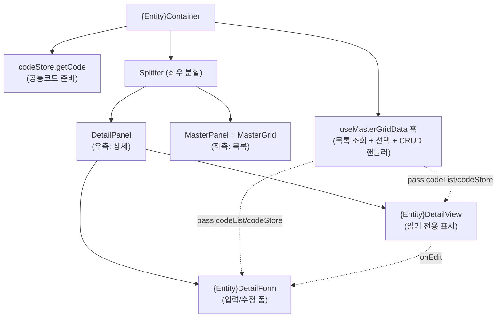
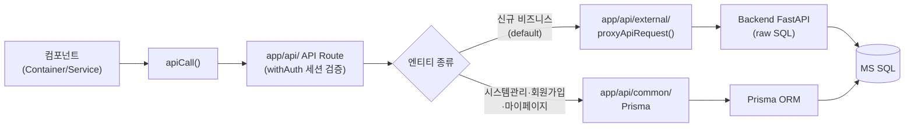
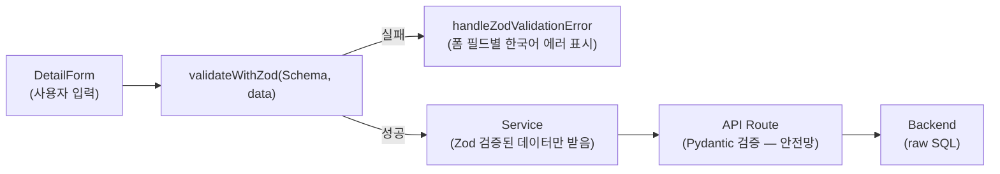
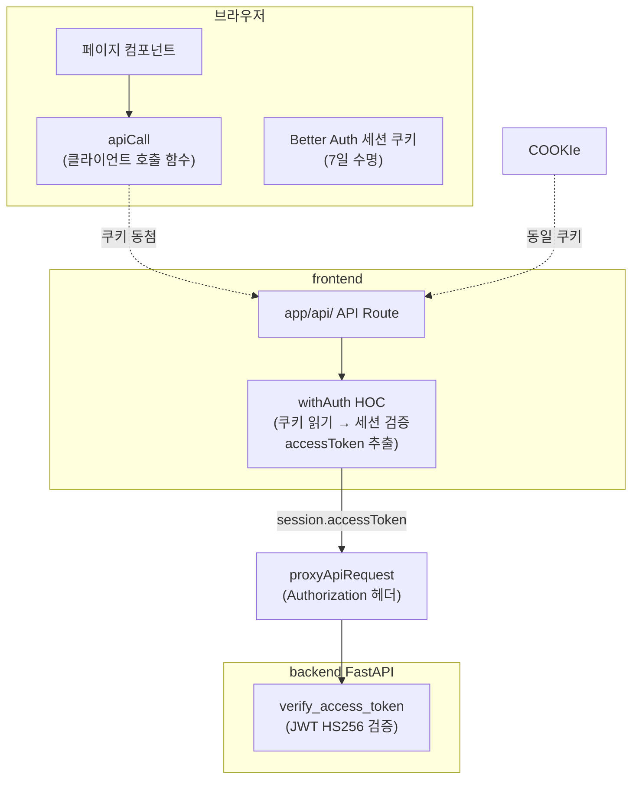
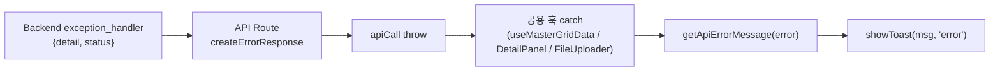
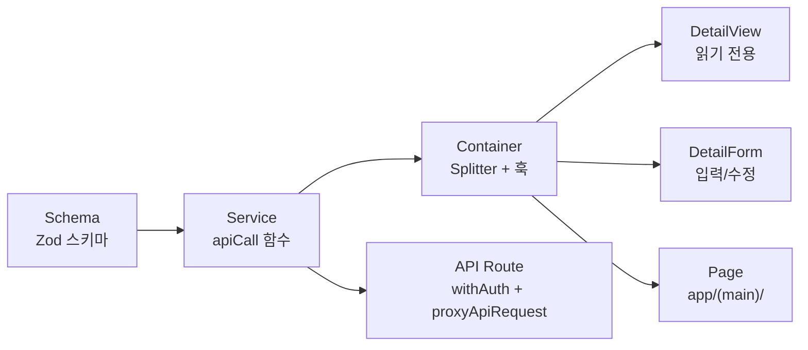

# React / Next.js 프론트엔드 개발 — full-stack-template 기준

> 풀스택 템플릿의 프론트엔드 **폴더 구조·Container 패턴·재사용 훅/컴포넌트·데이터 흐름·인증**을 한 번에 잡는다. Next.js 16 + React 19 + TypeScript + Prisma + Better Auth + DevExtreme + Tailwind 기준. **정확한 룰·코드 패턴의 SoT** 는 [frontend CLAUDE.md](../../frontend/CLAUDE.md) 와 `.claude/docs/` (본문에서 해당 위치로 링크).

---

## 용어

- **Zod** = 런타임 검증 + TS 타입을 한 번에 정의하는 스키마 라이브러리
- **Container**(컨테이너) = 페이지의 데이터·상태·CRUD 핸들러를 쥐고 자식 패널에 내려주는 최상위 컴포넌트. 자식 View/Form 은 화면만 그린다
- **DevExtreme**(데브익스트림) = 상용 UI 컴포넌트 셋. 그리드·폼·선택박스 등 웹 위젯을 제공한다
- ** zustand** = React 상태 관리 라이브러리. 전역 스토어(codeStore/tabStore 등)를 만든다
- **Better Auth** = 인증 라이브러리. next-auth 가 아니라, 별도 라이브러리(Better Auth)를 쓴다

---

## 0. 큰 그림

화면 한 칸이 데이터를 받아오기까지의 전체 길이다. **컴포넌트가 직접 `fetch` 하지 않는다** — 항상 `services/` → `app/api/` 의 API Route 를 거치고, 거기서 길이 둘로 갈린다(아래 표·5절). 인증은 API Route 의 `withAuth` 가, 에러 토스트는 공용 훅이 자동으로 처리한다(7·8절).





> 신입이 가장 자주 헷갈리는 지점: "내 컴포넌트에서 `axios`로 바로 부르면 안 되나?" → 안 된다. 호출은 `apiCall`/`proxyApiRequest` 로만(anti-pattern 6), 길은 엔티티당 하나만 고른다(anti-pattern 7). 아래 절들은 이 그림의 각 칸을 하나씩 채운다.

---

## 1. 스택·환경

- **Next.js 16 + React 19 + TypeScript**, **Prisma**(ORM, push 방식), **Better Auth**(인증 라이브러리 — next-auth 아님), **DevExtreme**(상용 UI 컴포넌트 셋 — 그리드·폼 위젯), **Tailwind**(CSS 프레임워크).
- **의존성 핀**: `better-auth` `1.6.11` / `kysely`(+adapter) `0.28.17` **정확 고정** (캐럿 `^` 금지 — 1.6.12 가 kysely 0.29 를 끌어와 adapter 깨짐). `uuid`(v7) 직접 의존성 필수.
- 환경 파일은 **`env-cmd` 로 명시 로딩** (Next.js 기본 동작 아님). `npm run dev` = `env-cmd -f .env.development next dev`.
- 네이밍: 컴포넌트 `PascalCase.tsx`, 훅/유틸 `camelCase.ts`. **Props 는 camelCase**, DB/API payload key 만 snake_case (anti-pattern 3).

---

## 2. 폴더 구조

```text
frontend/
├── app/(main)/      # Layout, Page (폴더 경로 = URL)
├── app/api/         #   common/ → Prisma 직접 · external/ → Backend 프록시
├── components/      # features/{Entity}/(PascalCase) · shared/ · providers/ · layouts/
├── hooks/shared/    # 재사용 훅 (useMasterGridData 등)
├── stores/shared/   # zustand 전역 (codeStore 등)
├── services/        # 클라이언트 → API Route 호출 함수
├── schemas/         # Zod 스키마/타입
├── lib/             # auth/, prisma/, devextreme/, zod/ 등 외부 라이브러리 경계
├── utils/           # apiCall, proxyApiRequest, 에러 유틸 등
├── constants/       # protected.ts(권한 ID) 등
└── prisma/          # schema.prisma
```

컴포넌트는 **4 폴더만**: `features/{Entity}/` / `shared/` / `providers/` / `layouts/` (anti-pattern 2).

---

## 3. Container 구조 (모든 CRUD 페이지의 기본)

Container = 페이지의 데이터·상태·CRUD 핸들러를 쥐고 자식 패널에 내려주는 최상위 컴포넌트. 자식 View/Form 은 화면만 그린다 — **로직과 표시의 분리**. 모든 CRUD 페이지가 같은 골격을 복제한다.



> **왜 Container 패턴인가?** — "DetailView/Form 에 직접 fetchData 하는 컴포넌트 만들면 안 되나?" → 된다. 하지만 Container 가 데이터를 쥐면: ① 훅(`useMasterGridData`)으로 목록 조회·선택·CRUD 핸들러가 자동 생성되고, ② 생성 시 DetailPanel 이 create 모드로 전환 등 상태 흐름이 표준이 된다, ③ View/Form 은 **화면만 그리므로 도메인마다 자유롭게 스타일/레이아웃만 변경** 하면 된다.

`Splitter` 로 좌측(목록) + 우측(상세) 분할.

```tsx
<Splitter>
  <MasterPanel title buttons>
    <MasterGrid dataSource columns onSelectionChanged />
  </MasterPanel>
  <DetailPanel data ViewComponent FormComponent apiService onComplete />
</Splitter>
```

**변형**:

- **2-depth 스코프**: `Splitter` 위 `ConditionBar`/`{Scope}ControlBar` 로 부모 스코프 선택 후 자식 CRUD (예: Document = Project 선택 → 문서 목록).
- **비-CRUD**: 대화형/워크스페이스(채팅)는 `Splitter` + 도메인 패널 (`MasterPanel`/`DetailPanel` 없음).
- **추출 상세 섹션**: View/Form 공유 섹션은 `editable` prop 으로 모드 전환 (View=false / Form 기본 true).

---

## 4. 재사용 훅/컴포넌트 (새로 만들지 말 것)

자체 구현 전에 **반드시 먼저 찾는다** (anti-pattern 1).

**훅 (`hooks/shared/`)** — `useMasterGridData`(목록+선택+CRUD 핸들러), `useMasterGridActions`(툴바 버튼), `useDetailGridData`/`useDetailGridActions`(2-depth), `useFormState`(폼 상태+검증), `useExcelExport`, `useTreeGridData`, `useFileList`, `useFileGroups`, `useSelectGridData`, `useDetailModal`, `useSessionContext`, `useWebSocketService`.

**컴포넌트 (`components/shared/`)** — `DataGrid/`(MasterGrid·DetailGrid·SelectGrid·DualSelectGrid), `DataPanel/`(MasterPanel·DetailPanel·SelectGridPanel·TreeGridPanel), `ui/`(TextBox·DateBox·DropdownBox·CheckBox — **DevExtreme 래퍼**, 직접 import 금지 anti-pattern 4), `Layout/FormModal`, `Feedback/MessagePopup`.

**스토어 (`stores/shared/`)** — `codeStore.getCode("그룹코드")`(공통코드, 가장 자주 씀 — 직접 호출 금지 anti-pattern 9), `navStore`, `messageStore`, `uploadProgressStore`, `tabStore`.

---

## 5. 데이터 흐름 (둘 중 하나만 — 혼재 금지 anti-pattern 7)

**Backend 프록시** — 신규 비즈니스 엔티티 **default**.

**Prisma 직접** — 기존 시스템관리(메뉴·권한·코드·사용자·이메일로그) + 회원가입 + 마이페이지 한정.



- 클라이언트 호출은 **`apiCall`**, API Route 의 Backend 호출은 **`proxyApiRequest`** (`fetch`/`axios` 직접 금지 anti-pattern 6). `proxyApiRequest` mode: `stream`/`binary`/`passthrough`/`external`.
- external proxy 경로의 `{prefix}` 는 backend `APIRouter(prefix=...)` 와 **byte-identical** (backend SoT, 변경 시 lockstep — anti-pattern 13).

---

## 6. Schema — Zod-first

Zod = 런타임 검증 + TS 타입을 한 번에 정의하는 스키마 라이브러리. **Zod-first** = 입력 검증을 클라이언트의 Zod 가 먼저 막아, 백엔드 Pydantic 422 까지 갈 일이 거의 없게 한다는 뜻.



- Zod 를 `@/lib/zod/helpers` 헬퍼(`str()`/`int()`/`float()`/`bool()`/`date()`/`StrRange()`/`Field()`/`Optional()`/`object()` …)로 작성 — `z.*` 직접 호출 금지 (anti-pattern 10).
- Backend 프록시 시 Pydantic → Zod 번역 규칙·디스커버리는 [design-patterns-frontend.md](../../.claude/docs/design-patterns-frontend.md) "Schema (Zod-first)".
- 입력 검증은 Zod 가 사전 차단 → Pydantic 422 도달 거의 없음(STATUS_MESSAGES 는 안전망).

❌ **실수** — Zod 직접 호출:

```ts
// ❌ — helpers 우회
import { z } from "zod";
const Schema = z.object({
  name: z.string().min(1).max(100),
  age: z.number().int().min(0).max(120),
});
```

✅ **올바른 패턴** — helpers 사용:

```ts
// ✅ — helpers 통일
import { object, StrRange, IntRange, Optional } from "@/lib/zod/helpers";
const Schema = object({
  name: StrRange(1, 100),
  age: Optional(IntRange(0, 120)),
});
```

→ helpers 는 Zod 스키마 + Pydantic 필드(`max_length` 등) 를 한 번에 생성하므로, backend schema 변경 시 양쪽 동기화가 용이하다.

---

## 7. 인증 — Better Auth (브라우저 ↔ API Route ↔ Backend)



`lib/auth/`: `auth.ts`(서버), `auth-client.ts`(`signIn`/`signOut`/`useSession`), `withAuth.ts`(API Route 보호 — 세션 검증 후 `session.accessToken` 전달). 미들웨어 `proxy.ts` 의 경로별 규칙. **모든 API Route 는 `withAuth`** (면제는 `PUBLIC_RULES` 등록 — anti-pattern 8).

- 권한 3종: `admin`(글로벌)/`operator`(자기 회사)/`user`. `constants/protected.ts` 의 `*_AUTHOR_ID`.
- 세션 쿠키(7일) + 단기 access JWT(1분) + refresh 미사용 구조는 [../4-아키텍처/인증토큰전략.md](../4-아키텍처/인증토큰전략.md), 회사·권한·메뉴 격리 흐름은 [../4-아키텍처/saas-멀티테넌트.md](../4-아키텍처/saas-멀티테넌트.md).
- **`JWT_SECRET` 은 frontend·backend 동일값 필수**.

❌ **실수** — API Route 에 인증 없음:

```ts
// ❌ — 세션 검증 없이 직접 데이터 접근
export async function GET(request: NextRequest) {
  return Response.json(getData());
}
```

✅ **올바른 패턴** — `withAuth` HOC 래핑:

```ts
// ✅
export const GET = withAuth(async (request, session) => {
  // session.accessToken 으로 backend 인증 가능
  return Response.json(getData());
});
```

> public route(회원가입, OTP 등) 면 `frontend/proxy.ts` 의 `PUBLIC_RULES` 에 등록 — 미들웨어가 인증 검사를 면제한다.

---

## 8. 에러 처리 — Backend 예외가 자동으로 토스트로

Backend ← 사용자 토스트가 **자동**으로 흐른다 — 페이지·feature 컴포넌트에서 `try/catch` 불필요.



Service 에서 `validateWithZod` 실패 시 `handleZodValidationError` 가 폼 필드별 한국어 에러를 표시하고, API 호출 실패 시 공용 훅(`useMasterGridData` 등)이 catch → 토스트. 이 흐름이 표준이므로 페이지/feature 컴포넌트에서 추가로 try/catch 를 붙이면 중복 처리가 된다.

---

## 9. 동작 예시 — Todo CRUD 한 개를 처음부터 끝까지

이 절은 위에서 배운 모든 규칙이 **한 엔티티에 어떻게 적용되는지** 처음부터 끝까 지 따른다. Todo 엔티티(이름+카테고리+마감일)를 만들어 본다.



### 9.1 Schema — `schemas/todo/todo.ts`

요청 들어오는 모양(`CreateIn`)과 응답 나가는 모양(`Out`)을 정의한다.

```ts
import { object, StrRange, date, enums, Field, Optional } from "@/lib/zod/helpers";

export const TodoSchema = object({
  todo: StrRange(1, 20),
  name: Optional(Field({ max_length: 200 }).str()),
  category: Optional(Field({ max_length: 5 }).str()),
  due_date: Optional(date()),
  use_at: enums(["Y", "N"]),
});

export const TodoCreateInSchema = TodoSchema;
export const TodoUpdateInSchema = TodoSchema.omit({ todo: true });

export type Todo = z.infer<typeof TodoSchema>;
export type TodoOut = Todo & CommonEntity;
export interface TodosOut {
  items: TodoOut[];
  total_count: number;
}
```

### 9.2 Service — `services/todo/todoService.ts`

`apiCall` + Zod 검증. 클라이언트 ↔ API Route 을 이어준다.

```ts
import { CreateOut, UpdateOut, DeleteOut } from "@/schemas/common/types";
import { TodoCreateInSchema, TodoUpdateInSchema, TodosOut, TodoOut } from "@/schemas/todo/todo";
import { apiCall } from "@/utils/common/api/client";
import { handleZodValidationError, validateWithZod } from "@/lib/zod/validation";

const BASE_URL = "/api/external/backend-service/todo";

export const selectTodoList = async (params: any): Promise<TodosOut | null> => {
  const queryParams: Record<string, any> = { ...params };
  if (queryParams.filter) queryParams.filter = JSON.stringify(queryParams.filter);
  if (queryParams.sort) queryParams.sort = JSON.stringify(queryParams.sort);
  return apiCall<TodosOut>(BASE_URL, { method: "GET", params: queryParams });
};

export const selectTodo = async (data: any): Promise<TodoOut | null> => {
  const { todo } = data;
  return apiCall<TodoOut>(`${BASE_URL}/${todo}`, { method: "GET" });
};

export const createTodo = async (data: any): Promise<CreateOut | null> => {
  try {
    const validatedData = validateWithZod(TodoCreateInSchema, data);
    return apiCall<CreateOut>(BASE_URL, { method: "POST", data: validatedData });
  } catch (error) {
    handleZodValidationError(error);
  }
};

export const updateTodo = async (data: any): Promise<UpdateOut | null> => {
  try {
    const { todo, ...baseData } = data;
    const validatedData = validateWithZod(TodoUpdateInSchema, baseData);
    return apiCall<UpdateOut>(`${BASE_URL}/${todo}`, { method: "PUT", data: validatedData });
  } catch (error) {
    handleZodValidationError(error);
  }
};

export const deleteTodo = async (data: any): Promise<DeleteOut | null> => {
  const { todo } = data;
  return apiCall<DeleteOut>(`${BASE_URL}/${todo}`, { method: "DELETE" });
};
```

### 9.3 Container — `components/features/Todo/TodoContainer.tsx`

`useMasterGridData` 훅이 목록 조회 + 선택 + CRUD 핸들러 생성하고, `Splitter` 로 좌우 분할.

```tsx
"use client";

import { useRef } from "react";
import Splitter, { Item } from "devextreme-react/splitter";
import { DataGridTypes } from "devextreme-react/data-grid";
import { MasterPanel, DetailPanel } from "@/components/shared/DataPanel";
import { MasterGrid } from "@/components/shared/DataGrid";
import { useMasterGridData } from "@/hooks/shared/useMasterGridData";
import { useMasterGridActions } from "@/hooks/shared/useMasterGridActions";
import { useCodeStore } from "@/stores/shared/codeStore";
import { useExcelExport } from "@/hooks/shared/useExcelExport";
import { selectTodoList, selectTodo, createTodo, updateTodo, deleteTodo } from "@/services/todo/todoService";
import TodoDetailView from "./TodoDetailView";
import TodoDetailForm from "./TodoDetailForm";

export default function TodoContainer() {
  const gridRef = useRef<any>(null);

  const { getCode } = useCodeStore();
  const codeList = { category: getCode("CATEGORY") };

  const GRID_COLUMNS: DataGridTypes.Column[] = [
    { dataField: "rn", caption: "#", width: 50, dataType: "number", allowSorting: false, allowFiltering: false },
    { dataField: "todo", caption: "PK", width: 100 },
    { dataField: "name", caption: "이름", width: 150 },
    { dataField: "category", caption: "카테고리", width: 100,
      lookup: { dataSource: codeList.category, displayExpr: "code_nm", valueExpr: "code" } },
    { dataField: "due_date", caption: "마감일", width: 120, dataType: "date" },
    { dataField: "reg_dt", caption: "생성일시", width: 160, dataType: "datetime" },
  ];

  const {
    dataSource, selectedData, isSelectLoading,
    handleSelect, handleCreate, handleRefresh, handleCompleteWithRefresh,
  } = useMasterGridData({ fetchGrid: selectTodoList, fetchData: selectTodo });

  const { handleExcelDownload } = useExcelExport({ gridRef, columns: GRID_COLUMNS, fileName: "todo" });

  const buttons = useMasterGridActions({
    onCreate: handleCreate, onRefresh: handleRefresh, onExcelDownload: handleExcelDownload,
    customActions: [],
  });

  const apiService = { select: selectTodo, create: createTodo, update: updateTodo, delete: deleteTodo };

  return (
    <div className="h-full flex flex-col">
      <div className="flex-1 min-h-0 border-t">
        <Splitter height="100%" orientation="horizontal" allowKeyboardNavigation>
          <Item size="60%" resizable>
            <MasterPanel title="Todo 목록" buttons={buttons}>
              <MasterGrid ref={gridRef} dataSource={dataSource} columns={GRID_COLUMNS}
                onSelectionChanged={handleSelect} selectedData={selectedData} />
            </MasterPanel>
          </Item>
          <Item resizable>
            <DetailPanel title="Todo 정보" data={selectedData}
              initialMode={selectedData ? "view" : "create"}
              isSelectLoading={isSelectLoading}
              ViewComponent={TodoDetailView}
              FormComponent={TodoDetailForm}
              viewProps={{ codeList }}
              formProps={{ codeList }}
              defaultFormData={{ use_at: "Y" }}
              onComplete={handleCompleteWithRefresh}
              apiService={apiService} />
          </Item>
        </Splitter>
      </div>
    </div>
  );
}
```

> `useMasterGridData` 가 `fetchGrid`(목록 조회) + `fetchData`(단건 조회) 만 받으면 선택·생성·새로고침·완료 핸들러를 자동 생성한다. Container 는 그 핸들러를 자식 컴포넌트에 넘겨주는 역할만 한다.

### 9.4 DetailView — `components/features/Todo/TodoDetailView.tsx`

`TableGroup/TableRow/TableCell` 로 읽기 전용 표시. 코드→라벨 변환은 `<TableCell items={...}>` prop 으로 자동 변환.

```tsx
"use client";

import { Button } from "@/components/shared/ui";
import { TableRow, TableCell, TableGroup } from "@/components/shared/Layout";
import { TodoOut } from "@/schemas/todo/todo";

interface Props {
  data: TodoOut;
  codeList?: any;
  onEdit: () => void;
  onDelete?: () => void;
}

export default function TodoDetailView({ data, codeList, onEdit, onDelete }: Props) {
  return (
    <div className="h-full flex flex-col">
      <div className="flex-shrink-0 mb-2">
        <div className="flex gap-2 justify-end">
          <Button text="수정" onClick={onEdit} />
          {onDelete && <Button text="삭제" onClick={onDelete} stylingMode="outlined" type="danger" />}
        </div>
      </div>
      <div className="flex-1 min-h-0 overflow-auto">
        <TableGroup title="기본 정보">
          <TableRow>
            <TableCell label="PK">{data.todo}</TableCell>
            <TableCell label="이름">{data.name}</TableCell>
          </TableRow>
          <TableRow>
            <TableCell label="카테고리" items={codeList?.category}>{data.category}</TableCell>
            <TableCell label="마감일">{data.due_date}</TableCell>
          </TableRow>
          <TableRow>
            <TableCell label="사용여부">{data.use_at}</TableCell>
          </TableRow>
        </TableGroup>
      </div>
    </div>
  );
}
```

### 9.5 DetailForm — `components/features/Todo/TodoDetailForm.tsx`

`useFormState` 훅으로 폼 상태 + 유효성 검증 자동 처리. UI 컴포넌트는 **shared/ui 의 래퍼만** 사용 (DevExtreme 직접 import 금지).

```tsx
"use client";

import { useFormState } from "@/hooks/shared/useFormState";
import { Button, TextBox, SelectBox, DateBox } from "@/components/shared/ui";
import { TableRow, TableCell, TableGroup } from "@/components/shared/Layout";
import { Todo } from "@/schemas/todo/todo";

interface Props {
  isNew: boolean;
  initialData: Partial<Todo>;
  codeList?: any;
  onSubmit: (data: Todo) => Promise<boolean>;
  onCancel?: () => void;
}

export default function TodoDetailForm({ initialData, isNew, codeList, onSubmit, onCancel }: Props) {
  const { formData, handleFieldChange, getFieldProps, handleSubmit } = useFormState<Todo>(initialData);

  return (
    <div className="h-full flex flex-col">
      <div className="flex-shrink-0 mb-2">
        <div className="flex gap-2 justify-end">
          <Button text="저장" onClick={() => handleSubmit(onSubmit)} />
          {onCancel && !isNew && <Button text="취소" onClick={onCancel} stylingMode="outlined" type="normal" />}
        </div>
      </div>
      <div className="flex-1 min-h-0 overflow-auto">
        <TableGroup title="기본 정보">
          <TableRow>
            <TableCell label="PK" required>
              <TextBox fieldName="todo" value={formData.todo} readOnly={!isNew}
                onValueChanged={handleFieldChange} getFieldProps={getFieldProps} />
            </TableCell>
            <TableCell label="이름">
              <TextBox fieldName="name" value={formData.name}
                onValueChanged={handleFieldChange} getFieldProps={getFieldProps} />
            </TableCell>
          </TableRow>
          <TableRow>
            <TableCell label="카테고리">
              <SelectBox fieldName="category" value={formData.category} items={codeList?.category}
                displayExpr="code_nm" valueExpr="code"
                onValueChanged={handleFieldChange} getFieldProps={getFieldProps} />
            </TableCell>
            <TableCell label="마감일">
              <DateBox fieldName="due_date" value={formData.due_date}
                onValueChanged={handleFieldChange} getFieldProps={getFieldProps} />
            </TableCell>
          </TableRow>
          <TableRow>
            <TableCell label="사용여부" required>
              <SelectBox fieldName="use_at" value={formData.use_at}
                items={[{ value: "Y", text: "사용" }, { value: "N", text: "미사용" }]}
                displayExpr="text" valueExpr="value"
                onValueChanged={handleFieldChange} getFieldProps={getFieldProps} />
            </TableCell>
          </TableRow>
        </TableGroup>
      </div>
    </div>
  );
}
```

### 9.6 Page — `app/(main)/admin/backend-service/todo/page.tsx`

```tsx
import TodoContainer from "@/components/features/Todo/TodoContainer";

export default function Page() {
  return <TodoContainer />;
}
```

### 9.7 API Route — `app/api/external/backend-service/todo/route.ts`

method 별로 handler 분리 후 `withAuth` HOC 래핑. `proxyApiRequest` 로 Backend 호출.

```ts
import { env } from "@/env";
import { withAuth } from "@/lib/auth/withAuth";
import { NextRequest } from "next/server";
import { proxyApiRequest } from "@/utils/common/api/server";
import { createSuccessResponse, createErrorResponse } from "@/utils/common/api/responses";

const BACKEND_URL = env.BACKEND_SERVICE_SERVICE_URL + "/todo";

const getHandler = async (req: NextRequest, session: any) => {
  const url = new URL(req.url);
  const result = await proxyApiRequest(BACKEND_URL, {
    method: "GET",
    params: Object.fromEntries(url.searchParams.entries()),
    headers: { Authorization: `Bearer ${session.accessToken}` },
  });
  return createSuccessResponse(result, "GET");
};

const postHandler = async (req: NextRequest, session: any) => {
  const body = await req.json();
  const result = await proxyApiRequest(BACKEND_URL, {
    method: "POST",
    data: body,
    headers: { Authorization: `Bearer ${session.accessToken}` },
  });
  return createSuccessResponse(result, "POST");
};

export const GET = withAuth(getHandler);
export const POST = withAuth(postHandler);
```

→ `[{todo}]/route.ts` 에 `GET`/`PUT`/`DELETE` handler 추가 시 동일 패턴으로 작성.

> 자연어로 "'프로젝트' 엔티티 만들어줘"하면 `scaffold-frontend` 에이전트가 위 패턴으로 자동 생성한다. 1:N 부모-자식 CRUD 도 제공 패턴 있다 — 상세는 [design-patterns-frontend.md](../../.claude/docs/design-patterns-frontend.md).

---

## 10. anti-pattern 체크리스트

작업 중 즉시 회피 (상세·예시·grep·예외는 [anti-patterns-frontend.md](../../.claude/docs/anti-patterns-frontend.md)):

1. 재사용 훅/컴포넌트 무시하고 자체 구현
2. 컴포넌트 위치 위반 (4 폴더만)
3. 자식 Props snake_case (camelCase 위반)
4. DevExtreme 직접 import → `shared/ui` 래퍼
5. Container 구조 위반 (`Splitter`+`MasterPanel`+`DetailPanel`)
6. `fetch`/`axios` 직접 → `apiCall`/`proxyApiRequest`
7. 데이터 흐름 혼재 (한 엔티티는 한 방식만)
8. API Route 인증 누락 → `withAuth`
9. codeStore 무시 → `getCode('GROUP')`
10. Zod 직접 호출 → `@/lib/zod/helpers`
11. Prisma 마이그레이션 명령 → push-only (`npm run dev:prisma:push`)
12. Server/Client Component 혼동 → 훅 쓰면 첫 줄 `'use client'`
13. 라우트 경로가 backend prefix 와 불일치

---

## 요약 — 체크리스트

**신규 엔티티 추가 시 체크리스트** — 작업 완료판정을 위한 확인 목록:

- [ ] 폴더 구조가 `schemas/`→`services/`→`components/features/`→`app/(main)/`→`app/api/` 순서로 파일 생성했는가
- [ ] 모든 hooks/component 는 재훅/shared 컴포넌트 먼저 확인했는가 (useState/useEffect 자체 구현 안 했나)
- [ ] 컴포넌트는 `features/`/`shared/`/`providers/`/`layouts/` 4 폴더 안에만 두었는가
- [ ] Props 는 camelCase 로 작성했는가 (DB key 는 snake_case 유지)
- [ ] DevExtreme 컴포넌트는 `@/components/shared/ui` 의 래퍼만 사용했는가
- [ ] API Route 는 `withAuth` 로 인증 적용했는가 (public 면 `proxy.ts` PUBLIC_RULES 등록)
- [ ] Zod schema 는 `@/lib/zod/helpers` 헬퍼로 작성했는가 (z.* 직접 호출 아님)
- [ ] HTTP 호출은 `apiCall`(클라이언트) / `proxyApiRequest`(API Route) 로만 했는가
- [ ] 공통코드는 `codeStore.getCode()` 로 호출했는가
- [ ] `'use client'`를 훅을 쓰는 컴포넌트 첫 줄에 두었는가
- [ ] external proxy path 가 backend prefix 와 byte-identical 한가

---

## 실행

```bash
npm run dev                 # env-cmd -f .env.development next dev
npm run dev:prisma:push     # 스키마 → DB (마이그레이션 없음)
npm run dev:build           # .env.development 로 빌드 (git push 전 점검)
```

---

관련 문서: [design-patterns-frontend.md](../../.claude/docs/design-patterns-frontend.md) · [anti-patterns-frontend.md](../../.claude/docs/anti-patterns-frontend.md) · [인증 토큰 전략](../4-아키텍처/인증토큰전략.md) · [SaaS 멀티테넌트](../4-아키텍처/saas-멀티테넌트.md) · [FastAPI 백엔드 개발](fastapi-백엔드개발.md)
