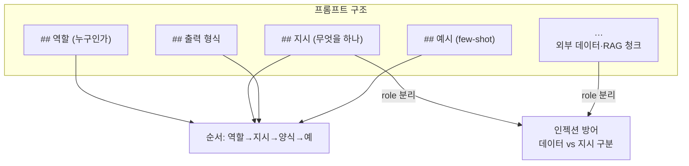
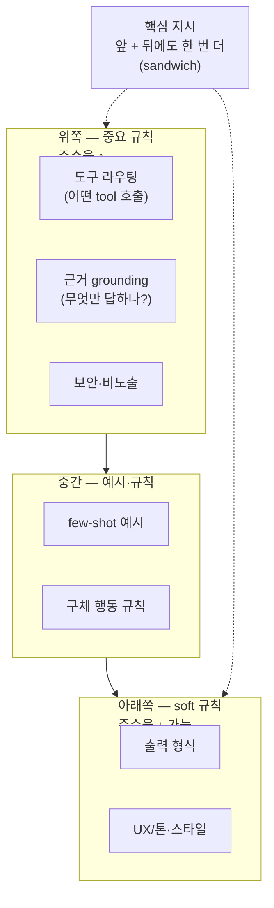
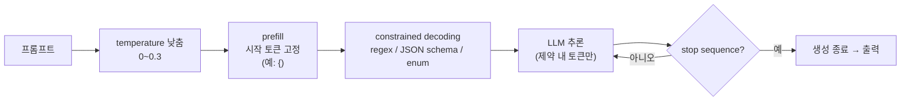
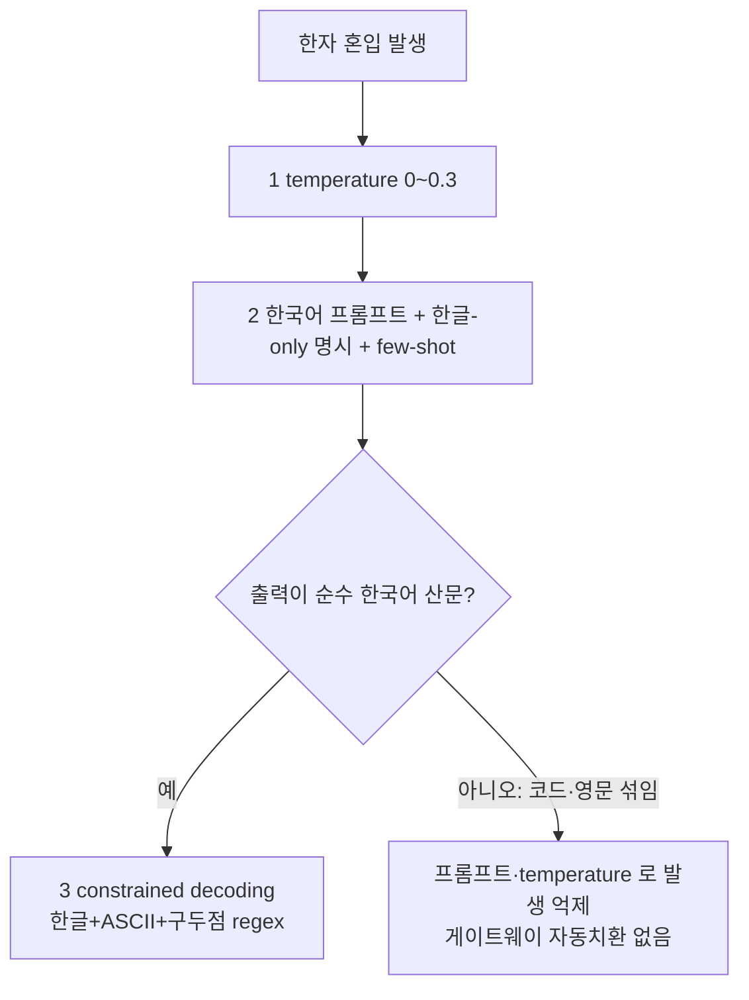

# LLM 프롬프트 엔지니어링 — 작성 요령 · 디코딩 제약 · Qwen 한자/thinking · 로컬 모델 꿀팁

> LLM 챗/에이전트의 **시스템 프롬프트를 어떻게 써야 잘 따르나**(신뢰성·품질). 구조·순서·예시·언어·길이, 날짜/계산을 코드로 미리 주입, SGLang 디코딩 제약(constrained decoding·prefill), Qwen 한자 혼입·thinking 모드 같은 로컬 모델 특성. **보안·방어**(유출/모더레이션/PII)는 [llm-가드레일.md](llm-가드레일.md), **서빙 배포**는 [llm서빙-sglang-litellm.md](../5-인프라셋팅/llm서빙-sglang-litellm.md). 기법은 **LLM 쓰는 모든 서비스** 공통(특히 로컬 Qwen 기준), 구체 사례는 `multi-agent-service` 투자 리서치 챗·`devactivity-service` 포트폴리오 활동 챗.
>
> **용어** — **시스템 프롬프트**: 모델에 매 요청 주는 행동 규칙(역할·도구·금지). **few-shot**: 원하는 입출력 예시를 프롬프트에 박기. **constrained decoding**: 출력 토큰을 문법(regex/JSON schema)으로 강제. **prefill**: 어시스턴트 응답의 시작 토큰을 미리 채워 이어쓰게 함. **code-switching**: 한국어 생성 중 한자/중국어가 섞여 나오는 현상. **lost-in-the-middle**: 긴 프롬프트에서 중간 지시를 모델이 놓치는 현상.

---

## 0. 한눈에 보기

프롬프트는 3층 방어([가드레일 §0](llm-가드레일.md))의 **1층 — 가이드**다. 깨지기 쉬우니, 신뢰성을 끌어올리는 진짜 레버는 **형식 그 자체보다 구조·순서·예시 + "계산은 코드로 강제"**다.

| 레버 | 효과 | 절 |
|---|---|---|
| 구조(마크다운/XML) | 규칙 충돌·누락 ↓ (특히 긴 프롬프트) | §1 |
| 순서(중요한 것 먼저) | lost-in-the-middle 완화 | §2 |
| 예시(few-shot) | 추상 규칙 열 줄보다 강함 | §3 |
| 언어 매칭 | 출력 언어 드리프트 ↓ | §4 |
| 코드 주입(날짜 등) | LLM 계산 오류 제거 | §6 |
| 디코딩 제약 | 형식·문자집합 **강제**(프롬프트보다 확실) | §8 |

> 핵심 — **프롬프트로 "빌지" 말고, 강제 가능한 건 디코딩/코드로 강제한다.** 분류·플래그·날짜 같은 건 프롬프트로 부탁해봤자 모델이 어긴다(§6·§8).

---

## 1. 구조 — 마크다운 섹션 + XML 데이터 격리

평문 한 덩어리로 던지지 말고 섹션을 줘라. 모델 학습 데이터에 마크다운·XML 구조가 많아 지시 인식률이 높다.

| 형식 | 지시(instruction) | 데이터/출력 스키마 |
|---|---|---|
| 마크다운(`##`·불릿) | ✅ 최적 — 사람·모델 다 읽기 좋음, qwen·Claude·GPT 다 잘 따름 | △ |
| XML 태그(`<rules>`,`<data>`) | ✅ 특히 **신뢰 못할 입력을 지시와 분리**할 때(인젝션 방어) | △ |
| JSON | ❌ 지시를 JSON 으로 쓰면 손해(이스케이프·장황, 준수율 이득 없음) | ✅ 데이터 전달 — 단 출력 스키마는 프롬프트보다 **tool/function calling** 으로 강제 |

```text
# 역할 / # 지시 / # 출력 형식 / <context>…</context> / # 질문   ← 섹션 분리
```



> **왜**: 요즘 모델은 자연어 파싱이 좋아 형식 자체 이득은 줄지만, **규칙 20개 넘는 긴 프롬프트**에선 섹션 구분이 충돌·누락을 줄인다. JSON-지시가 더 잘 먹힌다는 건 오해다. **과용은 역효과** — 헤더 4단계 이상이나 이모지 떡칠은 토큰 낭비이자 노이즈다. 1~2단계로 유지한다. 데이터 경계 격리는 XML 태그가 강하다([인젝션 §2](llm-가드레일.md)). Gemma 계열은 제어 토큰이 `<| |>` 라 그 형태 구분자 사용 금지(§9).

---

## 2. 순서 — 중요한 것 먼저

모델은 프롬프트가 길수록 **턴마다 따르는 규칙 수가 준다**(lost-in-the-middle). 도구 라우팅·근거(grounding)·보안을 위쪽에, soft UX 규칙(출력 형식 등)을 뒤에. 핵심 지시는 앞 + 한 번 더 뒤에(sandwich).



---

## 3. 예시 — few-shot 이 prose 규칙보다 강하다

가장 헷갈리는 동작 1~2개에 예시를 박는다. 추상 규칙 열 줄보다 예시 한 줄. 로컬 모델일수록 예시 의존도가 높다.

```text
## 예시 (도메인 라우팅·기간 변환)
- "삼성전자 최근 분기 영업이익률" → financials 도메인(공시·재무 검색). (시세 검색 아님)
- "지난달 코스피 흐름" → market 도메인(지수·환율), since="2026-05-01", until="2026-05-31".
```

> "이렇게 하면 안 됨" 반례(negative example)도 넣으면 경계가 또렷해진다.

> **참고**: 위 **도구 선택** few-shot 은 *소비자 공통 지식*이라, multi-agent-service 의 리서치 챗에선 도구명을 프롬프트에 박지 않고 **MCP 도구 설명(operation_id·Field docstring)** 에 둔다 — sub-agent 가 받는 writer 카탈로그(`catalog`)가 "이름: 설명"으로 도구를 노출하고, 프롬프트엔 검색 전략(의도)만 적는다([`pipeline_subagent.py`](../../multi-agent-service/app/graphs/pipeline_subagent.py) `_WRITER_SYSTEM`, [`specs.py`](../../multi-agent-service/app/agents/specs.py) `build_subagent_prompt`). 도메인 적합성·기간 판단은 plan/clarify 노드가 소유하고([`system.py`](../../multi-agent-service/app/graphs/system.py) `CLARIFY_SYSTEM`/`PLAN_SYSTEM_TEMPLATE`), sub-agent 프롬프트엔 안전·진실성 footer 만 자동 append 된다([fastmcp-서버개발 §5·§8](../2-개발가이드/fastmcp-서버개발.md)). few-shot 원칙 자체는 동일하고 위 블록은 기법 설명용.

---

## 4. 언어 — 출력 언어 = 프롬프트 언어로 맞춰라

| 선택 | 판단 |
|---|---|
| 한국어 프롬프트 → 한국어 출력 | ✅ **권장.** 프롬프트 언어가 출력 언어를 끌어당김(드리프트 방지) |
| 영어 프롬프트 | 일부 모델서 지시준수 마진 이득(영어중심 RLHF)이나 **줄어드는 추세 + 다국어 모델엔 거의 0**. 한국어 고유 규칙(한자 금지·"지난주/이번달")이 부자연 |
| 비-한국어 프롬프트 부작용 | **응답 언어 드리프트** — 거절·에러·짧은 입력·긴 대화에서 프롬프트 언어로 샘. 중국어 프롬프트 → 중국어 회귀(특히 Qwen) |

> **왜**: 출력이 한국어여야 하면 프롬프트도 한국어가 드리프트를 줄인다. 영어로 바꾸면 마진 없는 이득에 드리프트 실패면만 추가. **드리프트 나기 쉬운 거절/에러 문구는 코드에 한국어 상수로 고정**하면 프롬프트 언어와 무관하게 한국어가 보장된다([가드레일 §8](llm-가드레일.md)).

---

## 5. 길이 — 컨텍스트 크기 ≠ 지시 준수율

256k 컨텍스트는 "잘리냐"의 문제고, 진짜 제약은 **준수율**(컨텍스트 크기와 무관). 길수록 규칙을 흘린다.

- 길이 자체는 정상 범위면 OK(제품 프롬프트는 보통 1~5천 토큰). 단 **무한정 늘리지 말 것**.
- 줄이기보다 **순서·예시·코드강제**(§2·§3·§6·§8)가 레버. 특정 규칙이 자주 무시되면 그때 그 규칙만 위로/압축.

---

## 6. 날짜·계산은 LLM 말고 코드로

LLM 은 요일·주경계 같은 날짜 계산을 신뢰할 수 없다. "이번 주"를 지난주로 계산하는 사례가 흔하다. 상대 기간은 **코드로 미리 계산해 프롬프트에 주입**한다. LLM 은 계산이 아니라 값을 고르게 한다.

```text
## 오늘 날짜와 기간 기준 (KST)
오늘: 2026-06-05 (금)
- 이번 주: 2026-06-01 ~ 2026-06-07
- 지난 주: 2026-05-25 ~ 2026-05-31
- 이번 달 / 지난 달 / 최근 7·30일 …
```

> **실제로 겪음**: "이번 주 포트폴리오 활동" 질문에 LLM 이 이번 주를 05-26~06-01(지난주)로 계산해 빈 기간을 조회했다. 최근 활동이 전부 빠져 0건의 결과를 내뱉었다. 코드 주입 후 해결. 정본: [`chat_utils.py`](../../devactivity-service/app/utils/chat/chat_utils.py) 의 `date_context()` (서비스가 `now_kst()` 를 넘겨 호출). 멀티에이전트 쪽도 시세·지수의 상대 기간을 plan 노드가 코드로 정규화한다([`time_utils.py`](../../multi-agent-service/app/utils/common/time_utils.py)). 일반화 — **계산·정규화·경계 처리는 프롬프트가 아니라 코드로**.

---

## 7. 함정 — 모델이 그대로 출력할 고정 문자열은 한 곳에서만 강제한다

답변 말미에 **반드시 그대로 붙어야 하는 고정 문자열**(컴플라이언스 고지 — `ⓘ 정보 제공 목적이며 투자 조언이 아닙니다`)을 프롬프트가 "이 한 줄을 그대로 덧붙이라"고 지시하면, 모델이 잊거나 변형해 **고지가 누락·왜곡**된다. 반대로 여러 노드(answer·synthesis·map·reduce) 프롬프트마다 따로 적어두면 **드리프트**(표현이 노드별로 갈림)가 생긴다.

```text
❌ 프롬프트 의존만: "끝에 면책 한 줄 붙여줘"  # 모델이 빠뜨리거나 문구를 바꿈 → 컴플라이언스 누락
✅ 프롬프트(soft)로 유도 + 코드(hard)로 보장: 프롬프트엔 정확한 한 줄을 명시하되,
   최종 답변 조립 시 코드가 누락을 검사해 결정론적으로 보강(이미 있으면 중복 추가 안 함)
```

> **실제 구현**: ANSWER/SYNTHESIS/MAP/REDUCE 노드 프롬프트가 모두 `"답변 맨 끝에 반드시 다음 한 줄을 그대로 덧붙이세요: ⓘ 정보 제공 목적이며 투자 조언이 아닙니다"`로 동일 문구를 지시하고(soft), 그래프가 final_answer 를 내보내기 직전 `_ensure_disclaimer()` 가 `"투자 조언이 아닙니다"` 포함 여부를 검사해 없으면 `COMPLIANCE_DISCLAIMER` 상수를 한 줄 덧붙인다(hard 백스톱, 중복 미추가). → 모델이 면책을 흘려도 컴플라이언스 불변식이 깨지지 않는다. 정본: 고지 상수·결정론 보강은 [`plan_execute/compliance.py`](../../multi-agent-service/app/graphs/plan_execute/compliance.py) `COMPLIANCE_DISCLAIMER`/`_ensure_disclaimer`, 노드 프롬프트 문구는 [`system.py`](../../multi-agent-service/app/graphs/system.py) `ANSWER_SYSTEM`/`REDUCE_SYSTEM`. 같은 마인드셋이 [가드레일 §8](llm-가드레일.md) "코드 강제 vs 프롬프트".

---

## 8. 디코딩 제약 — 프롬프트보다 확실한 강제 (로컬 특화 무기)

로컬(SGLang/vLLM)은 디코딩을 직접 제어할 수 있어 상용 API 보다 **출력 강제력이 훨씬 세다.** 분류·플래그·형식은 프롬프트로 빌지 말고 강제한다.

| 기법 | 무엇 | 쓰임 |
|---|---|---|
| **constrained decoding** | 출력을 regex/JSON schema/enum 으로 강제(SGLang xgrammar) | 분류·플래그·날짜 포맷 — 파싱 실패가 구조적으로 불가능 |
| **prefill** | 어시스턴트 응답 시작 토큰을 미리 채움 | `{` 로 시작시켜 JSON 강제, 회피 서두("죄송") 차단 |
| **stop sequences** | 특정 문자열에서 생성 중단 | 누설·반복 폭주 방지 |
| **temperature 낮추기** | `0~0.3` | 방어·분류·추출의 일관성·예측가능성 ↑ |

```python
# SGLang(OpenAI 호환): 분류를 enum 으로 강제 — 부연 못 붙임
client.chat.completions.create(
    model="Qwen3.6-27B", messages=[...], temperature=0.2,
    extra_body={"regex": r"(긍정|부정)"},   # 또는 {"json_schema": {...}}, {"choice": [...]}
)
```



> 분류·라우팅·플래그 판정에 "yes/no 만 답해"라고 프롬프트로 빌어봤자 모델이 부연을 붙인다. **regex/enum 제약으로 강제하는 게 정답.** prefill + constrained decoding 을 조합하면 거의 확정적. 한 요청에 제약 파라미터는 **하나만**, xgrammar 는 Rust-style regex. SGLang 활성화·엔진별 키 차이는 [llm서빙-sglang-litellm.md §constrained decoding](../5-인프라셋팅/llm서빙-sglang-litellm.md).
>
> 우리 챗은 자유 서술 답변이라 출력 전체엔 grammar 를 안 쓴다(자연어 답변 제약은 부적합). 챗 에이전트 모델은 `ChatOpenAI(streaming=True, enable_thinking=True, temperature=0)` — 멀티스텝 tool 추론에 reasoning **켬**(리포트 요약용 `get_llm_client` 는 **끔**)([llm_client.py](../../devactivity-service/app/clients/llm/llm_client.py)).

---

## 9. Qwen 한자 code-switching · thinking 모드 (+ Gemma 차이)

### 9.1 Qwen 한자 혼입 — 원인과 대응

Qwen 은 중국어 비중이 큰 모델이라, 한국어 생성 중 **한국 한자어(시간→時間, 정보→情報)가 한글 대신 한자로 디코딩**되거나 중국어가 섞인다. 대응(우선순위 순):

1. **temperature 낮추기**(`0~0.3`) — 즉효·무료. 한자/중국어는 고온에서 더 튄다.
2. **시스템 프롬프트를 한국어로 + 명시 지시 + few-shot** — "모든 답변은 한글로만, 한자·중국어 금지(時間→시간)". 영어 지시+한국어 답변 요구는 혼입을 유발.
3. **constrained decoding**(순수 한국어 산문일 때) — 한글+ASCII+구두점만 허용하는 regex 로 한자 토큰을 구조적으로 못 뽑게. 코드·영문 용어가 섞이면 부적합.



> 우리는 **2(프롬프트 "한자 금지") 기본 + 잦으면 1(temperature)** 조합. grammar(3)는 챗이 자유 서술이라 안 씀. **게이트웨이 자동 독음 병기는 하지 않는다** — 과거 `hanja` 로 했으나 번역·다국어 출력 훼손 + 라이선스 회색지대로 제거(한자가 남으면 그대로 통과하니 발생 자체를 줄이는 게 핵심). 근본 해결이 잦으면 한국어 특화/continual-pretrain Qwen 파생을 후보로(단 OEM 라이선스 확인).

### 9.2 Qwen3 thinking 모드

Qwen3 는 하이브리드 추론 모델 — 작업에 맞게 켜고 끈다. 분류·추출·단답은 **off**(속도↑·토큰↓), 다단계 추론·코드는 **on**(정확도↑). `enable_thinking` 또는 `/think`·`/no_think`. thinking 출력(`<think>…`)은 파싱 시 분리하고 사용자엔 최종답만. → 우리도 용도별 분리: **챗 에이전트 on**(멀티스텝 tool 추론), **리포트 요약 off**(속도·과확장 회피)(§8).

### 9.3 Gemma 4 차이 (참고)

- **한자 혼입 약함** — Gemma 는 중국어 중심이 아니라 §9.1 한자 대응이 거의 불필요.
- **제어 토큰이 `<| |>`** (`<|turn>`·`<|channel>` 등) — 프롬프트 구조화는 **마크다운 권장**, `<|`/`|>` 들어간 구분자 금지(예약 토큰 충돌). 일반 `<context>` 태그는 OK.
- thinking 은 토큰 기반(`<|think|>`)이고 델리미터가 Qwen 과 다름 — 엔진 reasoning parser 로 분리.

---

## 10. 로컬 모델 꿀팁

- **명확하고 구체적으로** — "좋게 써줘" ❌ → "3문장 이내, 존댓말, 불릿 없이" ✅.
- **역할 부여** — "당신은 OO 전문가" 로 도메인과 톤을 고정한다.
- **긍정형 우선** — "~하지 마라"보다 "~하라"가 잘 먹는다. 둘 다 쓰되 원하는 행동을 명시한다.
- **작업 분리** — 한 프롬프트에 여러 작업을 욱여넣지 말고 체인으로 연결한다. 로컬 모델은 멀티태스크에 약하다.
- **언어 고정** — "항상 한국어로" 명시하지 않으면 영어로 새기 쉬움(§4).
- **prefix caching** — 고정(system)은 앞, 가변부(입력)는 뒤에 두면 캐시 히트가 일어나 TTFT와 비용이 줄어든다. system 앞쪽에 타임스탬프나 랜덤값을 넣지 않는다.
- **샘플링** — 방어·분류·추출은 temperature `0~0.3` + `seed` 고정을 쓴다. repetition_penalty `1.05~1.15` 로 반복 루프를 방지한다.
- **chat template 준수** — 직접 프롬프트 조립 시 모델 chat template 이 깨지면 성능이 급락한다. 서빙 엔진이 보통 자동 적용한다.
- **robust 파싱** — 구조화 출력도 가끔 깨진다. 코드펜스 제거·괄호 균형 보정 등 방어적 파서를 둔다.

---

## 11. 체크리스트 (새 LLM 프롬프트 작성 시)

- [ ] 마크다운 섹션 구조, 중요한 규칙(도구·근거·보안) 위쪽 배치(§1·§2)
- [ ] 가장 헷갈리는 동작에 few-shot 예시 1~2개(§3)
- [ ] 출력 언어 = 프롬프트 언어 매칭, 거절/에러는 코드 한국어 상수(§4)
- [ ] 무한정 길이 금지 — 안 지키면 순서·예시·코드강제로(§5)
- [ ] 날짜·상대기간·정규화는 **코드로 미리 계산해 주입**(§6)
- [ ] 모델이 그대로 출력할 예시 문자열은 **플레이스홀더**로(출력 가드 오탐 방지, §7)
- [ ] 분류·플래그·형식은 프롬프트로 빌지 말고 **constrained decoding/prefill 로 강제**(§8)
- [ ] (Qwen) 한국어 프롬프트 + 한글-only 명시, 후처리는 게이트웨이(§9.1)
- [ ] thinking 은 작업별 on/off (단답은 off)(§9.2)

## 12. 흔한 실수

- **JSON 으로 지시를 작성한다** — 손해다. 지시는 마크다운으로, 구조화 데이터는 tool-calling 으로 처리한다(§1).
- **영어/타언어 프롬프트로 한국어 답을 기대한다** — 거절·에러에서 언어 드리프트가 발생한다(§4).
- **LLM 에게 날짜·요일 계산을 맡긴다** — "이번 주"를 지난주로 계산해 빈 기간을 조회한다. 코드로 주입한다(§6).
- **프롬프트에 재현될 긴 예시 문자열을 넣는다** — 출력 가드가 자가 오탐한다(§7).
- **분류·플래그를 프롬프트로만 부탁한다** — 모델이 부연을 붙인다. constrained decoding 으로 강제한다(§8).
- **막연한 "내/어떤 종목"을 특정 종목 도구로 라우팅한다** — 모델이 종목코드를 지어내 0건·오답을 낸다. 사람이 종목을 특정하지 않으면 clarify(종목·섹터·기간 중 1개 질의)로 보낸다([`system.py`](../../multi-agent-service/app/graphs/system.py) `CLARIFY_SYSTEM`).
- **프롬프트 "기본값" 규칙이 사용자 선택(enabled_mcps)을 덮어쓰게 둔다** — 예: "기본 전체 MCP 사용" 이 사용자가 끈 스위치를 무시한다. 요청별 게이팅(`_build_graph` 의 enabled_mcps)을 우선하고, 미지정 시에만 기본값을 적용한다.
- **영어/중국어 프롬프트로 Qwen 한자 혼입을 유발한다** — 한국어 프롬프트를 쓴다(§9.1).

---

관련 문서: [FastMCP 서버 개발](../2-개발가이드/fastmcp-서버개발.md)(챗이 어떻게 도는지 §7) · [llm-가드레일.md](llm-가드레일.md) · [llm서빙-sglang-litellm.md](../5-인프라셋팅/llm서빙-sglang-litellm.md)
