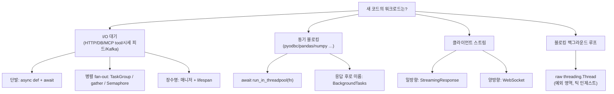
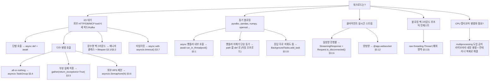
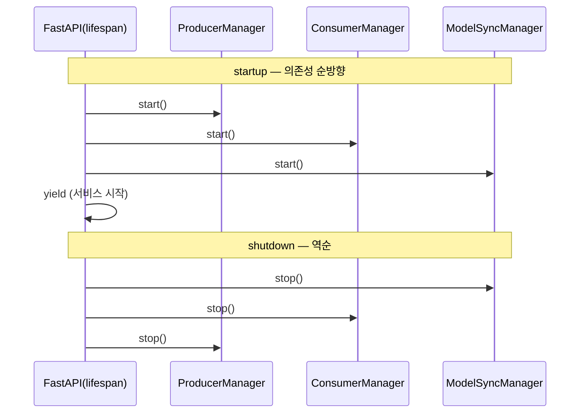
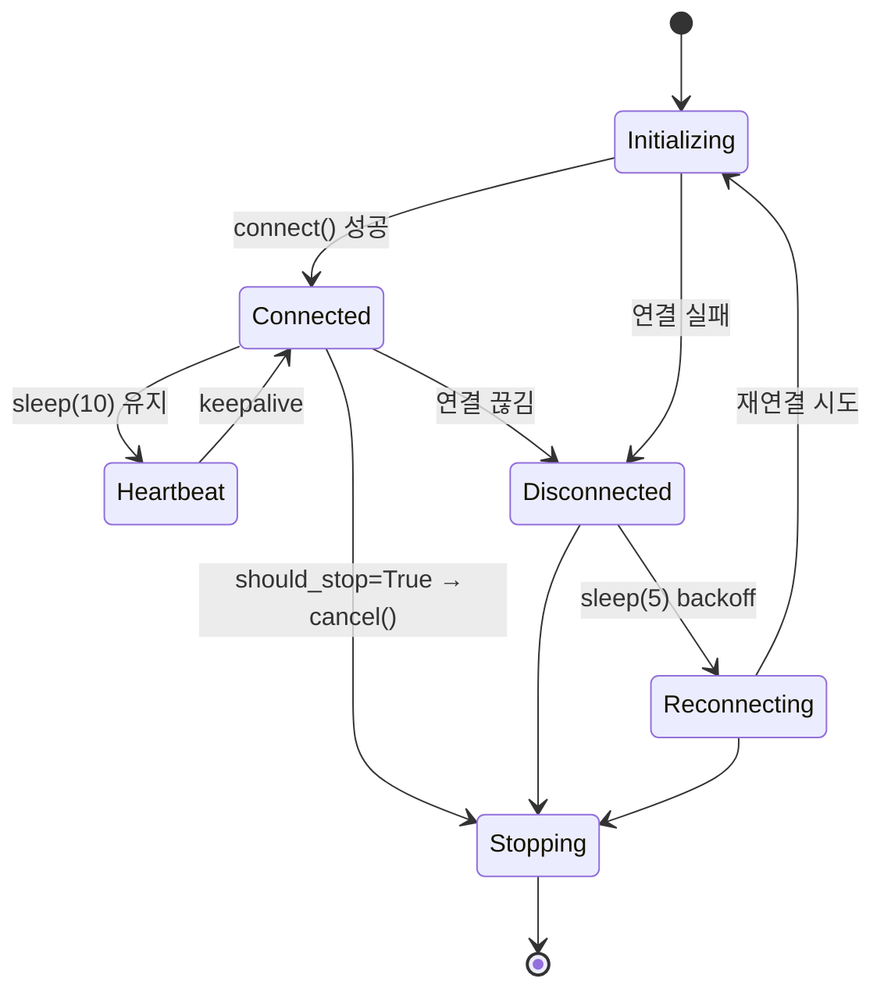
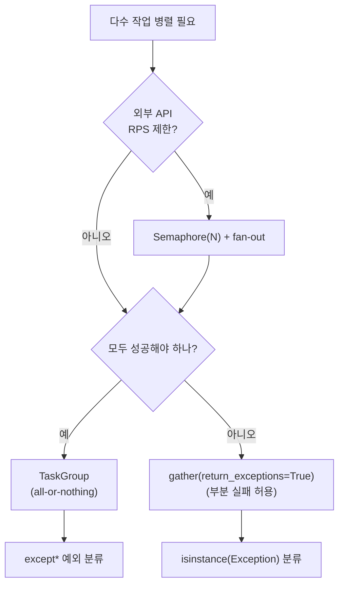
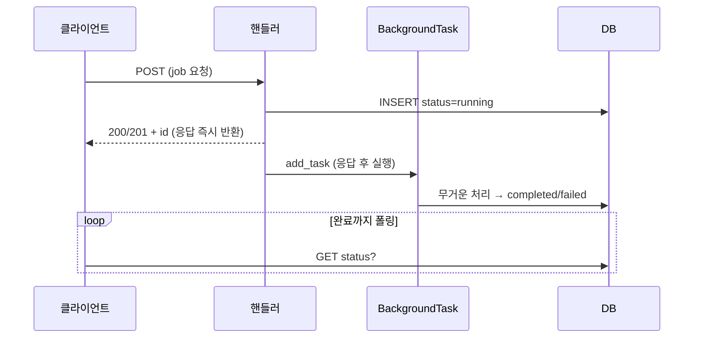

# FastAPI 동시성·비동기 표준 가이드 — 결정 규칙 · 코드 템플릿 · DO/DON'T

> Python 3.12 + FastAPI + uvicorn + AnyIO 환경에서 **새 백엔드 코드를 작성할 때 따르는 결정 규칙과 표준 패턴**. FastAPI 가 자동으로 제공하는 기능은 표준 라이브러리 함수 대신 사용한다. 한 가지 일은 한 가지 방법으로. 전 서비스(backend-service · multi-agent-service · devactivity-service · 도메인 MCP 서버 · single-agent-service · file-service) backend **공통 규칙**.

---

## 0. 큰 그림

워크로드 4갈래가 각자의 표준 도구로 간다. 한 가지 일은 한 가지 방법으로 — 세부 분기는 §0 결정 트리, 도구별 템플릿은 §4.



### 0.1 용어

- **이벤트 루프** — 단일 스레드가 `await` 마다 작업을 바꿔 끼우며 다수 코루틴을 처리하는 비동기 실행기. uvicorn 이 생성한다.
- **AnyIO threadpool** — Starlette/FastAPI 가 동기 코드를 위임하는 공유 스레드풀(기본 40 토큰). `run_in_threadpool`·`def` 핸들러·`yield` 의존성이 동일한 예산을 사용한다.
- **`run_in_threadpool`** — 동기 블로킹 함수를 위 스레드풀에서 실행하고 결과를 `await` 으로 받는 FastAPI 표준 래퍼.
- **fan-out** — 여러 작업을 동시에 띄워 한꺼번에 기다리는 패턴. 전부 성공해야 하면 `TaskGroup`, 일부 실패 허용이면 `gather(return_exceptions=True)`.
- **GIL** — CPython 의 전역 잠금. 파이썬 바이트코드는 한 스레드만 실행 → CPU 병렬은 라이브러리 내장 멀티코어 + 컨테이너 복제로 해결.
- **ContextVar** — 비동기 태스크/스레드 경계를 넘어 추적되는 요청-스코프 변수(여기선 인증 신원 `user_id`/`company_id`).
- **RPS** — Requests Per Second. 외부 API 동시/초당 호출 한도. `Semaphore` 로 제한.

---

## 1. 한 줄 결정 트리



---

## 2. 4 계층 모델

| 계층 | 단위 | 메커니즘 | 빈도 |
| --- | --- | --- | --- |
| **L1 프로세스** | OS 프로세스 | uvicorn 워커, docker-compose | 운영 — 보통 1 워커 |
| **L2 OS 스레드** | thread / pool | ① `run_in_threadpool` (정본) ② 틱 인제스트 raw thread ③ `ThreadPoolExecutor` | run_in_threadpool 다수 파일 / raw thread 예외 영역 |
| **L3 asyncio 태스크** | `asyncio.Task` | lifespan 매니저, TaskGroup, gather, Semaphore, Event | **핵심** — 거의 모든 비동기 |
| **L4 응답 후 처리** | `BackgroundTasks` | `bg.add_task(fn)` | ~48 파일 |

신규 코드의 손가락 우선순위: **L3 매니저/태스크 → L2 `run_in_threadpool` → L4 `BackgroundTasks`**. L1 은 운영 레이어, L2 raw thread 는 예외(시세/체결 틱 인제스트 한정).

---

## 3. 핵심 원칙 (강제 규칙 — 코드 리뷰에서 차단)

### 3.1 동기 블로킹은 `fastapi.concurrency.run_in_threadpool` 로만

```python
# 올바름
from fastapi.concurrency import run_in_threadpool
await run_in_threadpool(blocking_fn, arg1, arg2)

# 금지
await asyncio.to_thread(blocking_fn, ...)              # AnyIO 와 분리된 풀
loop = asyncio.get_running_loop()
await loop.run_in_executor(None, blocking_fn, ...)     # 기본 executor + ContextVar 미복사
```

**이유**:

- `run_in_threadpool` 은 Starlette/AnyIO 단일 풀(기본 40 토큰)을 공유 → FastAPI sync 엔드포인트·`yield` 의존성·`UploadFile` 과 **스레드 예산이 한 곳에서 관리**.
- **`ContextVar` 복사** — 스레드 안의 sync 코드도 호출 시점의 인증 신원(`user_id`/`company_id`)을 본다. `run_in_executor(None)` 은 미복사.
- 단발 5ms sync DB op 은 굳이 감싸지 않는다 — **critical path** (heavy CPU / N+1 / polling) 만.

**유일한 예외**: CPU 바운드를 GIL 밖으로 빼고 싶을 때 `run_in_executor(ProcessPoolExecutor)`. 현재 코드에는 없다.

### 3.2 단순 동기 핸들러는 `def` 로 선언

```python
# FastAPI 가 자동으로 스레드풀에 위임
@app.get("/sync")
def sync_endpoint():
    return blocking_call()

# async def 안에서 run_in_threadpool 한 번만 호출하지 마라 — def 로 충분
@app.get("/sync")
async def sync_endpoint():
    return await run_in_threadpool(blocking_call)
```

`def` 핸들러도 동일한 AnyIO 풀을 쓴다. 내부에서 추가 async 작업이 있을 때만 `async def` + `run_in_threadpool`.

### 3.3 앱 수명 관리는 `lifespan` 만

```python
# lifespan
@asynccontextmanager
async def lifespan(app: FastAPI):
    await kafka_producer_manager.start()
    yield
    await kafka_producer_manager.stop()

app = FastAPI(lifespan=lifespan)

# deprecated
@app.on_event("startup")
async def startup(): ...

# FastAPI 안에서 호출하지 않는다 — uvicorn 이 루프 관리
asyncio.run(main())
with asyncio.Runner() as runner: ...
```

`Runner` / `asyncio.run` 은 CLI 스크립트나 별도 워커 진입점에서만.

### 3.4 `asyncio.get_event_loop()` 호출 금지

```python
# 3.12 에서 DeprecationWarning
loop = asyncio.get_event_loop()

# 실행 중 루프 참조가 필요하면
loop = asyncio.get_running_loop()
```

### 3.5 `multiprocessing` 도입 금지

병렬성은 **컨테이너 복제**(L1) 또는 **라이브러리 내장 멀티코어**(numpy / pandas / polars / pyarrow BLAS·OpenMP) 로 해결. 코드에서 `multiprocessing` import 는 **0 건** 유지.

### 3.6 `threading.Thread` 는 정당한 사유에만

허용 영역 두 곳:

- **틱 인제스트**: 시세/체결 틱 피드 수신 같은 블로킹 백그라운드 루프 (§3.13).
- **동기 잡 큐**: 동기 인덱싱·문서 동기화 잡 큐 (`ThreadPoolExecutor`).

그 외 새 코드의 비동기 기본은 `asyncio.Task`. 신규 raw thread 도입은 리뷰에서 차단.

### 3.7 매니저 있는 서비스는 `--workers=1`

Kafka consumer / 시세 피드 구독 / 스케줄러 매니저는 앱 프로세스 안의 `asyncio.Task` 다. 워커 2개 = 매니저 2개 = **토픽 이중 소비 + 시세 틱 이중 구독**. 매니저가 있는 서비스(devactivity-service 스케줄러 / multi-agent backend / 틱 인제스트) 는 단일 프로세스로 운영. 매니저 없는 REST 서비스(backend-service / MCP 서버 / file-service) 는 컨테이너 복제로 수평 확장.

---

## 4. 표준 패턴 (코드 템플릿)

### 4.1 `lifespan` — 앱 수명 리소스

```python
from contextlib import asynccontextmanager
from fastapi import FastAPI

@asynccontextmanager
async def lifespan(app: FastAPI):
    # startup — 순방향
    backend_sql_client = app.container.backend_sql_client()
    await message_consumer_manager.start()
    await metric_producer_manager.start()
    yield
    # shutdown — 역순
    await metric_producer_manager.stop()
    await message_consumer_manager.stop()
    backend_sql_client.dispose()

app = FastAPI(lifespan=lifespan)
```



**규칙**:

- start 는 의존성 순방향, stop 은 역순. producer 먼저 띄우고 consumer 나중 → 종료는 반대.
- 여러 리소스를 동시에 열어야 하면 `contextlib.AsyncExitStack` 활용.
- 요청 단위 setup/teardown 은 `Depends` + `yield` 의존성 (`lifespan` 의 짝).

### 4.2 백그라운드 매니저 골격

장수명 백그라운드 작업의 표준. Kafka / 시세 피드 구독 / 스케줄러 매니저 전부 이 구조를 복제한다.

```python
class XxxManager:
    def __init__(self):
        self.task: asyncio.Task | None = None
        self.should_stop = False

    async def start(self):
        async def loop():
            retry_delay = 5
            while not self.should_stop:
                try:
                    await xxx_service.connect()
                    while not self.should_stop:
                        await asyncio.sleep(10)            # keepalive heartbeat
                except asyncio.CancelledError:
                    raise
                except Exception:
                    logger.warning(f"failed. retry in {retry_delay}s")
                finally:
                    await xxx_service.disconnect()
                if not self.should_stop:
                    await asyncio.sleep(retry_delay)       # 재연결 backoff
        self.task = asyncio.create_task(loop())

    async def stop(self):
        self.should_stop = True
        if self.task and not self.task.done():
            self.task.cancel()
            try:
                async with asyncio.timeout(3.0):           # 강제 종료 안전장치
                    await self.task
            except (TimeoutError, asyncio.CancelledError):
                pass
```



**규칙**:

- `sleep(10)` = 연결 유지 heartbeat / `sleep(5)` = 실패 backoff. 의미 구분.
- shutdown 안전장치는 `async with asyncio.timeout()`. **`wait_for(task, timeout=)` 는 새 코드에 쓰지 않는다**.
- `CancelledError` 는 한 번만 삼키고 그 위로는 통과.

### 4.3 `run_in_threadpool` — 동기 블로킹 오프로드

```python
from fastapi.concurrency import run_in_threadpool

await run_in_threadpool(factor_engine.compute, returns_df)
await run_in_threadpool(nav_service.bulk_insert, rows)
```

**감싸야 할 것**:

- pyodbc N+1 INSERT 루프, pandas/polars 시계열 전처리(수익률·NAV·리스크 지표 계산), numpy 벡터 연산, openssl subprocess, pymilvus(공시/리서치 임베딩 검색), `requests`+BeautifulSoup(공시 원문 파싱), 시세 틱 윈도우 DB 저장.

**감싸지 말 것**:

- 단발 sync SELECT 같은 5ms op. 스레드 전환 비용이 이득보다 크다.

**중첩 구조**: 네이티브 멀티코어 라이브러리(numpy / pandas / polars / pyarrow BLAS·OpenMP) 는 `run_in_threadpool` 안에서 호출. 흐름은 "이벤트 루프 → 스레드풀 1 워커 → 라이브러리가 전 코어 점유".

### 4.4 `asyncio.TaskGroup` — all-or-nothing fan-out

한 작업 실패 시 전체 취소가 옳은 경우 (포트폴리오 종목 일괄 시세 조회, 다중 외부 연결 등). **신규 코드 fan-out 의 기본값**.

```python
async with asyncio.TaskGroup() as tg:
    for ticker in tickers:
        tg.create_task(_load_one(ticker))
# 컨텍스트 종료 = 전 태스크 완료 보장
# 한 개라도 실패 = 나머지 자동 cancel + ExceptionGroup 전파
```

예외 타입별 분류 (`except*` — PEP 654):

```python
try:
    async with asyncio.TaskGroup() as tg:
        tg.create_task(connect_kafka())
        tg.create_task(connect_quote_feed())
except* ConnectionError as eg:
    for err in eg.exceptions:
        logger.error("connect failed: %s", err)
except* asyncio.TimeoutError:
    logger.error("connect timeout")
```

> **옵션 없는 `asyncio.gather(*coros)` 는 새 코드에 등장하지 않는다**. all-or-nothing 이면 `TaskGroup`, 부분 실패 허용이면 `gather(return_exceptions=True)`.

### 4.5 `gather(return_exceptions=True)` — 부분 실패 허용 fan-out

한 태스크 실패해도 나머지 계속 진행해야 하는 경우 (file-service 멀티파일 SFTP, 다중 종목 공시·뉴스 fan-out, multi-agent sub-agent MCP tool 병렬 호출 등). `TaskGroup` 에는 이 모드가 없으므로 **그대로 유지**.

```python
semaphore = asyncio.Semaphore(4)

async def _upload_one(f):
    async with semaphore:
        return await sftp_upload(f)

tasks = [_upload_one(f) for f in files]
results = await asyncio.gather(*tasks, return_exceptions=True)

for f, result in zip(files, results):
    if isinstance(result, Exception):
        logger.warning("upload failed: %s — %s", f, result)
```

### 4.6 `asyncio.Semaphore` — 외부 시스템 보호 게이트

**한 워크플로 안의 동시 제한**:

```python
semaphore = asyncio.Semaphore(FETCH_WORKERS)

async def _load_one(ticker):
    async with semaphore:
        await run_in_threadpool(self._fetch_quote, ticker)

async with asyncio.TaskGroup() as tg:
    for ticker in tickers:
        tg.create_task(_load_one(ticker))
```

**프로세스 전역 RPS 게이트 — 모듈 싱글턴**:

외부 API RPS 한도(시세 벤더 무료 티어 = 2 동시 요청) 같은 전역 제약은 모듈 싱글턴으로 강제.

```python
# market_data_client.py
_market_semaphore: asyncio.Semaphore | None = None

def _get_semaphore() -> asyncio.Semaphore:
    global _market_semaphore
    if _market_semaphore is None:
        _market_semaphore = asyncio.Semaphore(2)   # 벤더 무료 티어 RPS=2
    return _market_semaphore
```



### 4.7 `asyncio.timeout()` — 타임아웃 표준

```python
async with asyncio.timeout(5.0):
    await fetch_many(urls)
```

```python
# 절대 시각 deadline
loop = asyncio.get_running_loop()
async with asyncio.timeout_at(loop.time() + 5.0):
    await op()
```

**규칙**: `async with asyncio.timeout(s):` 가 기본. `asyncio.wait_for(awaitable, timeout=s)` 는 **단일 awaitable** 만 감쌀 때만 허용. 블록 안 여러 await 를 묶을 때는 반드시 `timeout()`.

### 4.8 `asyncio.Event` — 매니저 간 의존 신호

연결 → 구독 같은 의존 관계 표현.

```python
class ConnectionManager:
    def __init__(self):
        self.connected_event = asyncio.Event()
    async def _on_connected(self):
        self.connected_event.set()
    async def _on_disconnected(self):
        self.connected_event.clear()

class SubscriptionManager:
    async def loop(self):
        while not self.should_stop:
            await connection_manager.connected_event.wait()    # 연결까지 블록
            await subscribe_all()
            while not self.should_stop and connection_manager.connected_event.is_set():
                await asyncio.sleep(1)
```

### 4.9 GC-safe `_create_task` — fire-and-forget 보호

이벤트 루프는 태스크를 weak ref 로만 잡으므로, 콜백·이벤트 핸들러에서 띄우는 태스크는 강한 참조 보관 필요.

```python
class XxxService:
    def __init__(self):
        self._tasks: set[asyncio.Task] = set()

    def _create_task(self, coro):
        task = asyncio.create_task(coro)
        self._tasks.add(task)
        task.add_done_callback(self._tasks.discard)
        return task
```

시세 피드 `on_tick` 같은 **sync 콜백 안에서 async 작업을 띄울 때 필수**. 콜백 안에서 `await` 직접 호출은 불가능 — 반드시 `_create_task` 로 스케줄.

### 4.10 `BackgroundTasks` — 응답 후 처리 (L4)

```python
@router.post("/research-reports")
async def create_report(args: ReportIn, background_tasks: BackgroundTasks):
    keys = await run_in_threadpool(report_service.insert_report, args)
    report_id = keys[0]
    if report_id:
        background_tasks.add_task(
            _generate_report_background, report_id, args.ticker
        )
    return {"id": report_id, "status": "running"}
```

**표준 흐름**:

1. DB 메타를 `running` 상태로 즉시 INSERT.
2. ID 를 200/201 로 반환.
3. `add_task` 로 무거운 처리 미룸.
4. 클라이언트는 `running → completed/failed` 폴링.



**규칙**:

- 응답 후 처리에 **`asyncio.create_task(...)` 직접 사용 X** — 요청 컨텍스트 정리 보장이 없다. 반드시 `BackgroundTasks`.
- 요청 컨텍스트 없음 → background 감사 컬럼은 `mod_id='system'`.
- 매우 무거운 / 분산 / 재시도 필요 → **외부 큐(Celery / RQ / Dramatiq / ARQ)**. `BackgroundTasks` 는 같은 프로세스에서 도므로 부적합.
- 요청 내에서 여러 외부 호출을 *병렬로 모아 응답* 하는 건 `TaskGroup` 영역, `BackgroundTasks` 가 아니다.

### 4.11 `StreamingResponse` + `Request.is_disconnected()` — SSE / 장기 응답

프론트엔드 SSE(`ReadableStream` + `AbortSignal`) 의 백엔드 짝.

```python
from fastapi import Request
from fastapi.responses import StreamingResponse

@router.get("/sse-progress/{job_id}")
async def sse_progress(job_id: int, request: Request):
    async def gen():
        async with asyncio.timeout(300):
            while not is_done(job_id):
                if await request.is_disconnected():
                    break                                  # 클라이언트 단절 → 즉시 종료
                yield f"data: {render_progress(job_id)}\n\n"
                await asyncio.sleep(1)
    return StreamingResponse(gen(), media_type="text/event-stream")
```

multi-agent 리서치 생성 진행률 노출, 공시 임베딩 인덱싱 진행률 등에 응용.

### 4.12 WebSocket

```python
from fastapi import WebSocket, WebSocketDisconnect

@app.websocket("/ws/metrics")
async def metrics_ws(websocket: WebSocket):
    await websocket.accept()
    try:
        async with asyncio.TaskGroup() as tg:
            tg.create_task(_send_loop(websocket))
            tg.create_task(_recv_loop(websocket))
    except* WebSocketDisconnect:
        pass
    finally:
        await websocket.close()
```

송신·수신 루프를 `TaskGroup` 으로 묶으면 한 쪽 종료 시 자동 정리.

### 4.13 raw `threading.Thread` — 틱 인제스트 예외 영역

블로킹 시세/체결 틱 수신 루프 한정.

```python
# tick_ingest_manager.py
stop_event = threading.Event()
worker_thread = threading.Thread(
    target=safe_feed_worker,
    args=(tick_ingest_service, feed, stop_event, service_identity),
    daemon=True,
)
worker_thread.start()

# 정리
stop_event.set()
worker_thread.join(timeout=2.0)
```

**규칙**:

- supervisor 1 + worker N 구조. `self.workers` dict 는 supervisor 만 수정 → **GIL + 단일 writer** 가정으로 Lock 생략.
- `daemon=True` — 프로세스 종료를 막지 않음.
- 폴링 주기 고정값: supervisor 5초 / worker 1초 / heartbeat 0.5초 (adaptive 아님).
- lifespan 에서 `manager.start()` 는 **sync 호출** (await 아님 — 스레드 spawn 후 즉시 리턴).

**일반 백엔드 작업에 적용 금지**. 틱 인제스트 / 동기 잡 큐 외 신규 도입은 차단.

---

## 5. FastAPI 자동 제공 ↔ stdlib 매핑 (이것만 외우면 된다)

| 하려는 일 | 쓰지 마라 | FastAPI 표준 |
| --- | --- | --- |
| 동기 함수 호출 | `asyncio.to_thread(fn, ...)` | `await run_in_threadpool(fn, ...)` |
| 동기 함수 호출 | `loop.run_in_executor(None, fn, ...)` | `await run_in_threadpool(fn, ...)` |
| 단순 동기 핸들러 | `async def` + `run_in_threadpool` 한 번 | path 를 `def` 로 (자동 오프로드) |
| 이벤트 루프 시작 | `asyncio.run(main())` | uvicorn 이 관리 — 앱 코드 없음 |
| 이벤트 루프 시작 | `with asyncio.Runner() as r:` | 마찬가지 |
| 앱 시작·종료 훅 | `@app.on_event("startup"\|"shutdown")` | `lifespan` 컨텍스트 매니저 |
| 동기 컨텍스트 매니저를 스레드풀로 | 직접 `with` 래핑 | `contextmanager_in_threadpool` (또는 `yield` 의존성이 자동 적용) |
| 요청 단위 setup/teardown | 핸들러에서 직접 `try-finally` | `Depends` + `yield` 의존성 |
| 요청·앱 스코프 상태 | `contextvars` 직접 다룸 | `request.state` / `app.state` (또는 `app.container` DI) |
| 응답 후 fire-and-forget | `asyncio.create_task(...)` | `BackgroundTasks.add_task` |
| 비동기 파일 업로드 I/O | `aiofiles` | `UploadFile` (`.read()`/`.write()` 이미 비동기) |
| 클라이언트 단절 감지 | 직접 raw 소켓 체크 | `await request.is_disconnected()` |
| 응답 스트리밍 | 직접 ASGI send | `StreamingResponse(async_gen)` |
| 양방향 실시간 | `asyncio` 소켓 직접 | `@app.websocket` + `WebSocket` |
| 동기 이터레이터 → 비동기 변환 | 직접 wrapper | `iterate_in_threadpool` (`fastapi.concurrency`) |
| 코루틴 경합 — 하나 끝나면 나머지 cancel | 직접 `asyncio.wait(FIRST_COMPLETED)` + cancel | `run_until_first_complete` (`fastapi.concurrency`) |
| `Request`/`WebSocket` 공통 타입 | union 직접 | `HTTPConnection` 베이스 |
| 스레드풀 한계 조정 | 자체 `ThreadPoolExecutor` | `anyio.to_thread.current_default_thread_limiter().total_tokens` |

---

## 6. DO / DON'T 한 페이지

### DO

- **L3 우선** — 새 비동기 작업은 `asyncio.Task`. 매니저가 필요하면 §4.2 골격을 복사한다.
- **L2 오프로드** — 동기 블로킹은 `await run_in_threadpool(...)` 하나만 쓴다. critical path 만 감싼다.
- **fan-out — all-or-nothing** → `TaskGroup` + `except*`.
- **fan-out — 부분 실패 허용** → `gather(*tasks, return_exceptions=True)`.
- **외부 시스템 보호** → `Semaphore(N)`. 프로세스 전역 RPS 한도는 모듈 싱글턴.
- **타임아웃** → `async with asyncio.timeout(s):`.
- **fire-and-forget 콜백** → §4.9 GC-safe `_create_task`.
- **응답 후 처리** → `BackgroundTasks.add_task`. 감사 컬럼 `mod_id='system'`.
- **앱 수명 리소스** → `lifespan` (start 순/stop 역).
- **요청 수명 리소스** → `Depends` + `yield`.
- **매니저 있는 서비스** → `--workers=1`. 매니저 없는 REST 는 컨테이너 복제.

### DON'T

- `asyncio.to_thread` / `loop.run_in_executor(None, ...)` — `run_in_threadpool` 만.
- `asyncio.run` / `asyncio.Runner` 를 FastAPI 앱 안에서.
- `@app.on_event("startup"|"shutdown")` — `lifespan` 만.
- `asyncio.get_event_loop()` — `get_running_loop()`.
- 옵션 없는 `asyncio.gather(*coros)` — `TaskGroup` 또는 `gather(return_exceptions=True)`.
- `asyncio.wait_for(task, timeout=)` 를 새 코드에서 — `asyncio.timeout()` 사용. (단일 awaitable 만 감쌀 때는 허용.)
- `multiprocessing` import — 코드 0건 유지.
- 신규 `threading.Thread` — 틱 인제스트 / 동기 잡 큐 두 곳 외 금지.
- 응답 후 작업에 `asyncio.create_task(...)` — `BackgroundTasks`.
- 매니저 있는 서비스를 멀티워커로 — 토픽 / 노드 이중 소비.
- 단발 5ms sync op 을 `run_in_threadpool` 로 — 스레드 전환 손해.
- 시세 피드 `on_tick` 콜백 안에서 `await` 직접 — `_create_task` 로 스케줄.
- `aiofiles` 직접 import — `UploadFile` 또는 `run_in_threadpool` 로 처리.

---

## 7. 운영 / 의존성 정책

### 7.1 워커 수

| 서비스군 | 워커 수 | 이유 |
| --- | --- | --- |
| 매니저 있음 (devactivity 스케줄러 / multi-agent / 틱 인제스트) | **1** | 매니저 중복 방지 |
| 매니저 없음 (backend-service / MCP 서버 / file 등 순수 REST) | N (컨테이너 복제) | 수평 확장으로 처리량 |

#### `--workers=1` 이 처리 한계가 아닌 이유

- 워커 수 ≠ 동시성. 단일 워커 + AnyIO threadpool 40 토큰으로:
  - 순수 async 엔드포인트: 수백~수천 동시 연결(이벤트 루프 한 개로 충분).
  - `def` 핸들러 / `run_in_threadpool`: 동시 40개 (§6.2 로 상향 가능).
- DB 커넥션 풀이 보통 더 먼저 바닥난다 → 워커를 늘려도 DB 가 진짜 병목.

#### 매니저 있는 서비스의 엔드포인트는 대부분 control-plane

control-plane = 매니저 구성/상태 조회/관리 명령. 데이터 평면(Kafka·시세 틱 피드)의 throughput 과 무관하게 HTTP QPS 는 한 자릿수~수십에 머문다. 그래서 `--workers=1` 의 실질적 한계가 닿지 않는다.

| 서비스 | HTTP 엔드포인트 성격 | 예시 |
| --- | --- | --- |
| 틱 인제스트 | 시세 피드 구독 등록/해제, 토픽 설정, 매니저 상태 | 저빈도 |
| multi-agent-service | 리서치 질의, 재계획 트리거, 상태 조회 | 저~중빈도 |
| devactivity-service | 스케줄러 잡 등록, 주간 메일 트리거, 상태 조회 | 저빈도 |
| backend-service | 사용자·권한·watchlist·portfolio 관리 API | 저빈도 |

#### "매니저 있는 서비스 + 핫 엔드포인트" 조합 자체가 설계 시그널

핫 엔드포인트(수백 QPS+ / 다수 SSE·WebSocket 동접 / 무거운 fan-out)가 매니저 있는 서비스에 들어오려 하면 둘 중 하나다. **양쪽 다 답은 "현 서비스 안에 두지 않는다"** 다.

| 매니저와의 관계 | 의미 | 해결 |
| --- | --- | --- |
| **커플링 없음** | 그냥 별도 도메인 기능이 잘못된 곳에 들어옴 | **매니저 없는 서비스로 분리** → 컨테이너 N개로 수평 확장 |
| **커플링 있음** (매니저 출력에 의존) | 호출 빈도는 본질적으로 **매니저 처리율에 bounded** — 매니저가 처리하지 않은 데이터를 엔드포인트가 더 빨리 소비할 수 없음 | "핫"이라고 느껴진다면 매니저 throughput 부터 측정. 매니저가 진짜 병목이면 **매니저 자체를 재설계** (외부 큐 / 파티션 샤딩 / Redis pub-sub 외부화) |

즉, **threadpool 상향(§6.2)은 임시 미봉책이지 근본 해결이 아니다**. 핫 엔드포인트는 매니저 있는 서비스 밖으로 빼거나, 매니저 구조 자체를 바꾸는 게 정답이다.

### 7.2 스레드풀 한계 조정

`run_in_threadpool` + `def` 핸들러는 AnyIO 공유 풀(기본 40 토큰)을 쓴다. DB 커넥션 풀 크기와 맞추는 게 일반적.

```python
@asynccontextmanager
async def lifespan(app: FastAPI):
    import anyio
    limiter = anyio.to_thread.current_default_thread_limiter()
    limiter.total_tokens = 100      # DB pool 크기와 매치
    yield
```

### 7.3 DB 커넥션 풀

SQLAlchemy Engine 은 프로세스마다 자기 `QueuePool`. 멀티워커 환경에서는 **총 커넥션 = 풀 크기 × 워커 수**. pyodbc 동기 드라이버는 `run_in_threadpool` 워커가 풀에서 빌린다.

### 7.4 의존성 정책

- **`[project].dependencies`**: 웹 프레임워크 + DB 만 공통.
- **`[dependency-groups].main`**: 실사용 서비스만 등록 (예: `asyncssh` 는 file-service, `pymilvus` 는 doc-search-mcp).
- **`aiofiles`** — 앱 코드 사용 0건이라 직접 의존성에서 제거. 시세 벤더 SDK 만 전이 의존으로 잔존.
- **`uvloop`** — `uvicorn[standard]` 가 자동으로 끌어옴. 코드에서 직접 참조 X.

---

## 8. 신규 코드 체크리스트

새 핸들러 / 매니저 / 백그라운드 작업을 작성할 때 한 번씩 확인:

- [ ] 이 작업은 I/O 인가 CPU 인가? 답이 안 나오면 §0 결정 트리.
- [ ] 동기 블로킹이 섞이면 `run_in_threadpool`. critical path 인가 점검.
- [ ] fan-out 이면: all-or-nothing → `TaskGroup`, 부분 실패 허용 → `gather(return_exceptions=True)`.
- [ ] 외부 시스템에 무제한 fan-out 하는가? → `Semaphore`.
- [ ] 매니저 클래스라면 §4.2 골격을 그대로 복사.
- [ ] 콜백·이벤트 핸들러에서 `create_task` 가 등장하면 §4.9 GC-safe 헬퍼.
- [ ] 응답을 막을 만큼 무거운가? → `BackgroundTasks`. 분산·재시도 필요하면 외부 큐.
- [ ] 새 매니저 추가 시 해당 서비스가 `--workers=1` 인지 확인.
- [ ] 다음이 코드에 없는지: `asyncio.to_thread` / `run_in_executor(None)` / `asyncio.run` / `Runner` / `on_event` / `get_event_loop` / `multiprocessing` / 신규 `threading.Thread`.
- [ ] timeout 은 `async with asyncio.timeout(s):`. `wait_for(task, timeout=)` 는 단일 awaitable 만.
- [ ] 라이브러리 내장 멀티코어(`n_jobs=-1` / OpenMP / polars 등)는 `run_in_threadpool` 안에서 호출.
- [ ] 응답 스트리밍에는 `StreamingResponse` + `request.is_disconnected()`.
- [ ] WebSocket 송수신 루프는 `TaskGroup` 으로 묶기.

---

## 9. 짝 문서

이 가이드는 **결정 규칙과 표준 패턴** 만 담는다. 더 깊은 내용은 짝 문서를 본다.

- [동시성-레퍼런스.md](동시성-레퍼런스.md) — Python 3.12 표준 라이브러리·FastAPI 도구의 PEP/공식 문서 레벨 설명. "왜 이 도구인가" 의 근거.
- [동시성-출처인덱스.md](동시성-출처인덱스.md) — 6 서비스 실제 적용 사례·파일 경로·매트릭스. "어디에 어떻게 쓰여 있는가" 의 출처 인덱스.

---

관련 문서: [동시성-레퍼런스.md](동시성-레퍼런스.md) 도구 근거 · [동시성-출처인덱스.md](동시성-출처인덱스.md) 서비스별 출처 인덱스
