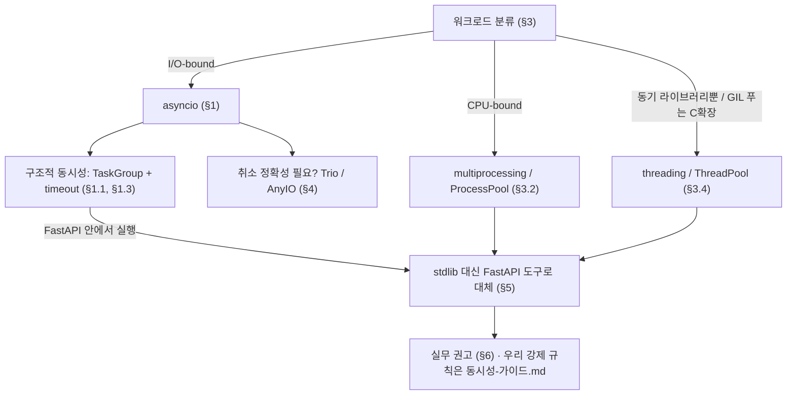
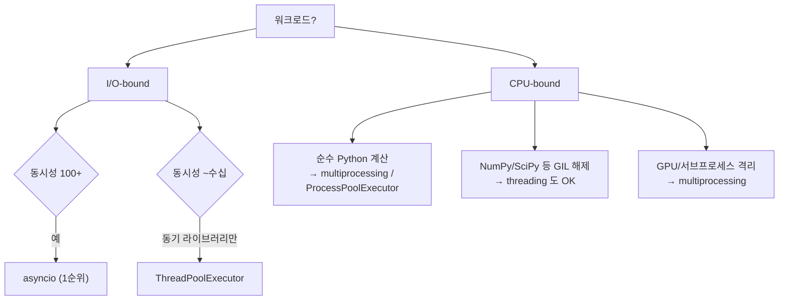
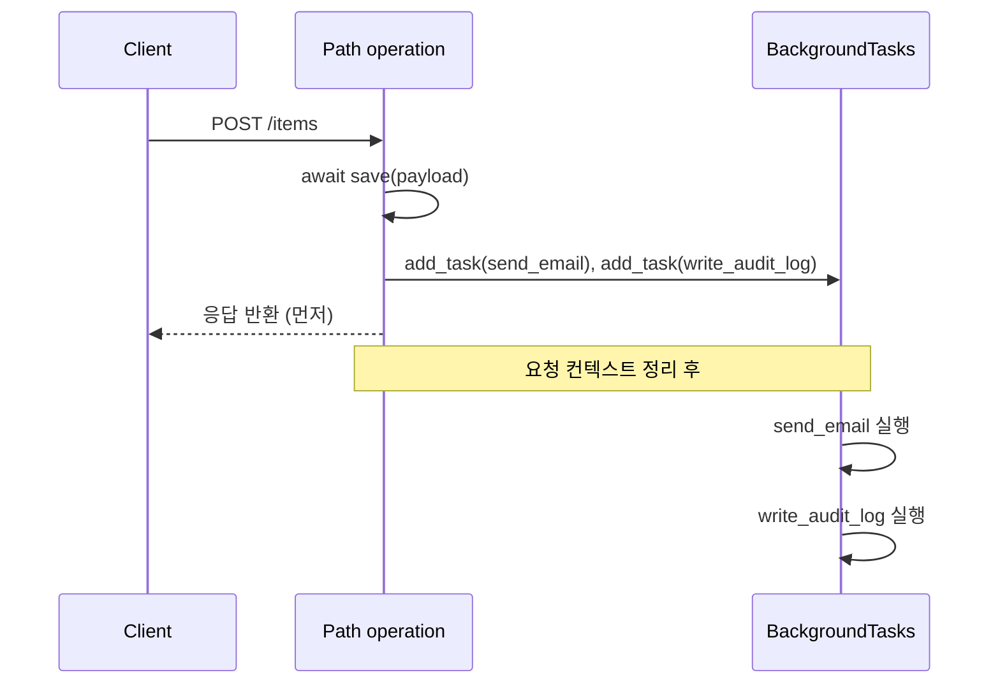
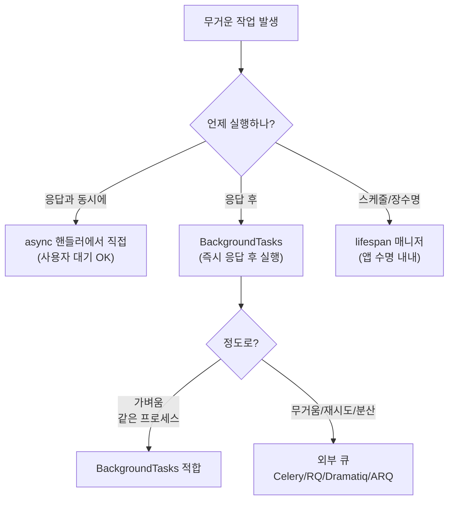
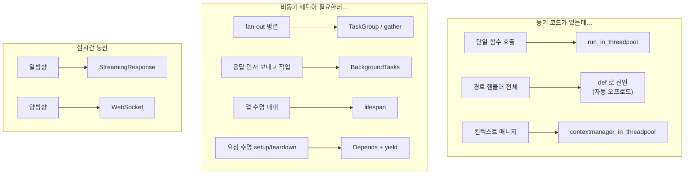

# Python 3.12 동시성·비동기 레퍼런스 — asyncio · threading · multiprocessing · FastAPI 도구

> Python 3.12(CPython) 시점의 동시성·비동기 표준 라이브러리와 FastAPI 도구를 PEP/공식 문서 레벨로 정리한 **외부 지식 레퍼런스**. "왜 이 도구를 쓰는가" 의 근거를 담는다 — 우리 코드베이스 무관, 도구 자체의 의미·선택 기준. asyncio 신기능(3.11–3.12), threading/multiprocessing/asyncio 선택 기준, 서브인터프리터(PEP 684), Trio/AnyIO, FastAPI 동시성 도구. `TaskGroup`+`ExceptionGroup`(3.11)으로 구조적 동시성이 표준에 포함, `Runner`/`timeout()`/`eager_task_factory` 도입. PEP 684로 서브인터프리터 병렬 실행 가능(opt-in). GIL 여전→CPU-bound는 multiprocessing, I/O-bound는 asyncio.

## 0. 큰 그림

세 갈래로 본다 — **(1) 워크로드로 모델을 고르고 → (2) asyncio면 신기능으로 더 안전하게 쓰고 → (3) FastAPI 안이면 stdlib 대신 프레임워크 도구로 대체**한다. 절 번호가 이 흐름을 따른다.



## 1. 핵심 용어

- **GIL(Global Interpreter Lock)** — 한 인터프리터에서 Python 바이트코드를 한 번에 한 스레드만 실행하게 막는 잠금. CPU-bound 코드가 threading 으로 가속되지 않는 원인.
- **I/O-bound vs CPU-bound** — 시간 대부분을 네트워크/디스크 *대기*에 쓰면 I/O-bound, *계산* 에 쓰면 CPU-bound. 선택 기준의 출발점.
- **구조적 동시성(structured concurrency)** — 자식 태스크의 수명을 부모 블록 안에 가두는 모델. 블록을 벗어나면 모든 자식이 끝났음이 보장된다(누수·고아 태스크 없음).
- **edge-triggered vs level-triggered 취소** — asyncio 는 `CancelledError` 를 한 번 잡으면 더는 안 올라온다(edge). Trio 는 취소된 블록이 계속 취소 상태를 유지한다(level) — §4.1 의 핵심 차이.

---

## 2. asyncio의 최신 변화 (3.11 → 3.12)

### 2.1 `asyncio.TaskGroup`(3.11+) — 구조적 동시성

```python
async def main():
    async with asyncio.TaskGroup() as tg:
        tg.create_task(fetch(url1))
        tg.create_task(fetch(url2))
    # 컨텍스트 종료 시 모든 태스크 완료가 보장됨
```

핵심 속성 ([asyncio-task 문서](https://docs.python.org/3/library/asyncio-task.html)):

- 그룹 내 임의 태스크가 `CancelledError` 이외의 예외로 실패하면 **나머지 태스크 전부 취소**.
- 모든 태스크 종료 후 예외는 **`ExceptionGroup`/`BaseExceptionGroup`로 묶여 재발생**.
- 공식 문서: "TaskGroup은 `gather`보다 더 강한 안전성 보장 — `gather`는 하위 태스크 예외 시 나머지를 취소하지 않지만 TaskGroup은 취소한다."

이 기능은 **PEP 654**(`ExceptionGroup`, `except*` 구문)가 선행 조건이었다 ([PEP 654](https://peps.python.org/pep-0654/)).

```python
try:
    async with asyncio.TaskGroup() as tg:
        tg.create_task(might_fail_a())
        tg.create_task(might_fail_b())
except* ValueError as eg:
    for err in eg.exceptions:
        log.warning("value error: %s", err)
except* ConnectionError as eg:
    ...
```

### 2.2 `asyncio.Runner`(3.11+)

여러 개의 최상위 `async` 함수를 **하나의 이벤트 루프 + 공유 `contextvars.Context`**에서 실행하기 위한 컨텍스트 매니저 ([asyncio-runner 문서](https://docs.python.org/3/library/asyncio-runner.html)).

```python
with asyncio.Runner() as runner:
    runner.run(setup())
    runner.run(main())
    runner.run(teardown())
```

- `SIGINT` 핸들러를 자동 설치/제거 → `KeyboardInterrupt`가 메인 태스크를 취소하므로 `try/finally` 정리 코드가 실행된다.
- `loop_factory` 인자를 받아 이벤트 루프 구성을 제어할 수 있다(3.12부터 `asyncio.run`에도 `loop_factory` 지원).

> **FastAPI에서 대체**: uvicorn/hypercorn이 이벤트 루프를 직접 관리하므로 앱 코드에서 `Runner`를 호출할 일이 없다. **앱 수명 동안의 리소스 setup/teardown은 `lifespan` 컨텍스트 매니저로 대체**한다(§6.3 참고). `Runner`는 CLI 스크립트나 별도 백그라운드 워커 진입점에만 의미가 있다.

### 2.3 `asyncio.timeout()` / `timeout_at()`(3.11+)

```python
async with asyncio.timeout(5.0):
    await fetch_many(urls)  # 5초 안에 끝나지 않으면 TimeoutError
```

`wait_for()`보다 우월한 이유 ([asyncio-task 문서](https://docs.python.org/3/library/asyncio-task.html)):

- **블록 안 여러 await를 한꺼번에 묶는다.**
- 만료 시 `CancelledError → TimeoutError` 변환이 컨텍스트 매니저 밖에서 잡힌다.
- `timeout_at(deadline)`은 절대 시각 기반, `Timeout.reschedule()`로 도중 변경 가능.
- 안전하게 중첩 가능.

> **FastAPI에서 보완**: `Request.is_disconnected()`로 클라이언트 단절을 함께 감지해 의미 없어진 작업을 조기 취소할 수 있다(§6.6).

### 2.4 Eager Task Factory(3.12+)

```python
loop = asyncio.get_running_loop()
loop.set_task_factory(asyncio.eager_task_factory)
```

코루틴을 **태스크 생성 시점에 동기적으로 즉시 실행**하고, **블록(await)이 발생할 때만 이벤트 루프에 스케줄**한다. 캐시·메모이제이션처럼 동기로 끝나는 경우가 많을 때 루프 스케줄링 오버헤드를 제거한다 ([asyncio-task 문서](https://docs.python.org/3/library/asyncio-task.html)).

- 주의: **태스크 실행 순서가 바뀐다.** "create_task는 항상 한 번 양보 후 실행" 가정에 의존하는 코드는 깨질 수 있다.
- 커스텀 Task 서브클래스에는 `asyncio.create_eager_task_factory(MyTask)`.

### 2.5 `contextvars` 통합

`Task` / `create_task` / `TaskGroup.create_task` 모두 **`context=` 키워드 인자**로 명시 컨텍스트를 지정할 수 있다(3.11+). 미지정 시 호출 시점 컨텍스트의 **사본**이 사용된다. `Task.get_context()`(3.12+)로 사후 조회 가능 ([asyncio-task 문서](https://docs.python.org/3/library/asyncio-task.html), [contextvars](https://docs.python.org/3/library/contextvars.html)).

> **FastAPI에서 대체**: 요청 스코프 상태는 보통 `request.state` / `app.state`로, 요청 단위 setup/teardown은 `Depends` + `yield` 의존성으로 처리한다(§6.3). `contextvars`는 미들웨어·로깅 컨텍스트 등 *프레임워크가 직접 가시화하지 못하는 cross-cutting 데이터*에만 남겨두면 된다.

### 2.6 스케줄러 가속(3.12)

3.12에서 asyncio 핵심 경로가 빨라졌다 ([Python 3.12 What's New](https://docs.python.org/3/whatsnew/3.12.html)):

- `asyncio.current_task()`의 C 구현 → **4–6배 속도 향상**.
- 소켓 쓰기에서 **불필요한 복사 제거**, 플랫폼이 지원하면 `sendmsg()` 사용.

### 2.7 폐기 항목 정리

- `loop=` 매개변수는 **3.10에서 제거 완료**(`gather`, `shield`, `sleep`, `Lock`, `Queue` 등).
- `asyncio.get_event_loop()`는 실행 중 루프가 없을 때 DeprecationWarning을 강하게 띄운다. 새 코드는 `asyncio.get_running_loop()` 또는 `asyncio.Runner` 사용을 권장.

---

## 3. PEP 684 — Per-Interpreter GIL(3.12)

Python 3.12에서 **GIL이 `PyInterpreterState`로 이동**해, 서로 다른 OS 스레드에 묶인 두 서브인터프리터가 **동시에 Python 바이트코드를 실행**할 수 있게 됐다 ([PEP 684](https://peps.python.org/pep-0684/)).

- 활성화: C-API의 `PyInterpreterConfig.own_gil`를 통해 opt-in.
- `PyInterpreterConfig_LEGACY_INIT`과 main interpreter는 여전히 **공유 GIL**.
- 3.12 시점에 **stdlib 수준의 고수준 인터페이스는 아직 없다.** PyPI의 [`interpreters-pep-734`](https://pypi.org/project/interpreters-pep-734/) 백포트 패키지 또는 C 확장에서만 사용 가능.
- 인터프리터 간 객체 공유는 매우 제한적(`memoryview` 정도)이며, 동기화는 **메시지 패싱(큐)** 모델로 설계됐다.

위치상 의미: GIL은 살아 있지만, **인터프리터 단위로는 병렬화가 가능**한 첫 버전이다. CPU-bound 멀티코어 활용의 **세 번째 경로**(기존: multiprocessing / C 확장에서 GIL 해제)로 자리잡기 시작했다.

---

## 4. 동시성 모델 선택 기준(3.12 기준)

### 4.1 결정 트리



기존 가이드의 핵심은 그대로 유효하다 ([Real Python: Speed Up Your Python Program With Concurrency](https://realpython.com/python-concurrency/)):

- **I/O-bound는 asyncio**가 1순위. 수천 개 동시 연결도 최소 오버헤드로 처리.
- **수십 개 동시성** + 기존 동기 라이브러리(예: `requests`)만 쓸 수 있을 때는 `ThreadPoolExecutor`가 더 단순.
- **순수 Python CPU-bound**는 GIL 때문에 threading으로 가속되지 않는다 → `multiprocessing`.
- **NumPy 행렬 연산** 같은 C 확장이 직접 GIL을 푸는 코드는 threading만으로도 멀티코어 활용이 된다.

### 4.2 multiprocessing이 우선인 경우

1. **프로세스 격리** — 한 워커가 segfault해도 나머지 생존.
2. **GPU 워커** — CUDA 컨텍스트는 프로세스 격리가 표준.
3. **CPU 핀닝/NUMA 제어** — `os.sched_setaffinity` 사용.
4. **CPU-bound 워크로드 + 데이터 직렬화 비용이 작은 경우.**

### 4.3 asyncio가 우선인 경우

1. **수천 개 동시 I/O 연결**(웹 크롤러, 게이트웨이, 채팅 서버).
2. **취소·타임아웃·동시 실행 묶음**을 정확히 제어해야 할 때 → `TaskGroup` + `timeout()`.
3. **라이브러리 생태계 자체가 async 우선**일 때(`aiohttp`, `httpx`, `asyncpg` 등).

### 4.4 threading이 우선인 경우

1. **블로킹 API만 제공하는 동기 라이브러리** 사용.
2. **GIL을 푸는 C 확장에 시간이 집중**되는 워크로드(NumPy, OpenCV 등).
3. **이벤트 루프를 도입하기엔 코드 변환 비용이 큰 기존 동기 코드베이스.**

---

## 5. Trio / AnyIO 동향

### 5.1 Trio

구조적 동시성을 가장 깐깐하게 구현한 대안 async 런타임. 핵심 프리미티브 두 가지:

- **Nursery**: "부모 태스크는 nursery를 먼저 만들지 않고는 자식 태스크를 시작할 수 없다" — 구조적 동시성의 강제 ([Trio core reference](https://trio.readthedocs.io/en/latest/reference-core.html)).
- **Cancel scope (level-triggered)**: "한 번 취소된 블록은 계속 취소 상태로 유지된다." asyncio의 **edge-triggered** 취소(잡힌 `CancelledError`는 재발생하지 않음)와의 핵심 차이.

이론적 토대: [Notes on structured concurrency, or: Go statement considered harmful](https://vorpus.org/blog/notes-on-structured-concurrency-or-go-statement-considered-harmful/) (Nathaniel J. Smith). asyncio.TaskGroup도 이 아이디어의 직접 영향이다.

### 5.2 AnyIO

asyncio와 Trio **양쪽 위에서 동작하는 단일 API**. "단순 호환 레이어가 아니라 Trio에서 영감을 받은 자체 API 세트로 asyncio의 한 단계 위를 제공한다" ([AnyIO why](https://anyio.readthedocs.io/en/stable/why.html)).

asyncio.TaskGroup에 대해 AnyIO가 지적하는 *남은 차이*:

- TaskGroup은 **그룹 내 태스크를 일괄 취소하거나 나열하는 방법이 없다.**
- **'태스크 준비됨' 신호**가 내장돼 있지 않다.
- asyncio의 **edge-cancellation 의미론**을 그대로 상속.

API 형태:

```python
# asyncio
async with asyncio.TaskGroup() as tg:
    tg.create_task(coro())

# trio
async with trio.open_nursery() as nursery:
    nursery.start_soon(fn, *args)

# anyio (백엔드 무관)
async with anyio.create_task_group() as tg:
    tg.start_soon(fn, *args)
```

언제 쓰는가:

- **순수 asyncio로 충분** → 표준 `asyncio.TaskGroup`.
- **백엔드 독립적인 라이브러리를 작성** → AnyIO.
- **취소 정확성·구조적 동시성이 최우선** → Trio 또는 AnyIO + Trio 백엔드.

> **FastAPI에서**: AnyIO가 이미 의존성으로 깔려 있으므로(`anyio>=3.4`) `anyio.create_task_group()`, `anyio.move_on_after()` 등을 별도 설치 없이 바로 쓸 수 있다. 다만 백엔드는 asyncio 고정이라 Trio로 바꿀 수는 없다.

---

## 6. FastAPI의 비동기 도구 모음

FastAPI는 Starlette + AnyIO 위에 구축돼 있어, 표준 라이브러리 도구의 상당 부분을 자동/우선 제공한다. 새 코드에서는 stdlib을 직접 호출하기 전에 아래 도구로 대체 가능한지 먼저 확인한다.

### 6.1 코드 오프로드 — 동기 함수 / 동기 컨텍스트 매니저

#### `run_in_threadpool` ↔ `asyncio.to_thread` / `loop.run_in_executor`

`fastapi.concurrency.run_in_threadpool`은 내부적으로 **AnyIO의 `to_thread.run_sync`**를 호출하는 얇은 래퍼다. 블로킹 DB 드라이버, `requests`, 동기 파일 I/O 등을 async 핸들러에서 호출할 때 사용한다.

```python
from fastapi import FastAPI
from fastapi.concurrency import run_in_threadpool
import requests

app = FastAPI()

@app.get("/proxy")
async def proxy():
    resp = await run_in_threadpool(requests.get, "https://example.com")
    return resp.json()
```

#### `def` 핸들러 자동 오프로드

Path operation을 `def`로 선언하면(`async def` 아님) FastAPI가 **자동으로** 그 함수를 스레드 풀로 보낸다. 단순한 경우엔 이걸로 충분.

```python
@app.get("/sync")
def sync_endpoint():  # async def 가 아님 → FastAPI가 자동으로 스레드풀에 위임
    return requests.get("https://example.com").json()
```

#### `contextmanager_in_threadpool` — 동기 컨텍스트 매니저를 스레드풀로

```python
from fastapi.concurrency import contextmanager_in_threadpool

async def handler():
    async with contextmanager_in_threadpool(sync_cm()) as resource:
        ...
```

`yield` 의존성이 동기 `with` 블록을 받을 때 FastAPI가 내부적으로 이걸 호출한다. 동기-비동기 혼합 코드베이스에서 거의 자동으로 처리되므로 명시 호출은 드물다.

#### 스레드풀 한계 조정

`run_in_threadpool`과 `def` 핸들러는 **하나의 공유 풀**을 쓴다(기본 40 토큰). 동시성을 늘리려면 lifespan에서 한계를 조정:

```python
import anyio
@asynccontextmanager
async def lifespan(app):
    limiter = anyio.to_thread.current_default_thread_limiter()
    limiter.total_tokens = 100  # DB 커넥션 풀 크기와 맞추는 게 일반적
    yield
```

→ FastAPI 안에서는 `asyncio.to_thread` / `run_in_executor` 직접 호출이 거의 필요 없다(§6.1 보완).

### 6.2 응답 후 백그라운드 작업 — `BackgroundTasks`

응답을 먼저 돌려주고 이후 부수 작업(로그 적재, 이메일 발송, 캐시 갱신)을 수행할 때.

```python
from fastapi import BackgroundTasks

@app.post("/items")
async def create_item(payload: ItemIn, bg: BackgroundTasks):
    item = await save(payload)
    bg.add_task(send_email, item.owner_email, "Created")
    bg.add_task(write_audit_log, item.id)
    return item  # 응답이 먼저 나가고, 그 후 add_task 들이 실행됨
```





**대체 관계**:

- "응답 후 잡 실행" → `asyncio.create_task(...)`를 직접 띄우는 것보다 `BackgroundTasks`가 정확하다(요청 컨텍스트 정리 후 실행 보장, 예외 처리도 일관됨).
- **요청 내 동시 실행**(여러 외부 호출을 병렬로 모아 응답 만들기)은 `BackgroundTasks`로 못 한다. **그건 `TaskGroup` / `gather`의 영역**이다(§1.1).
- 무거운 백그라운드 워크(CPU 큰 작업, 재시도 필요, 분산)는 같은 프로세스/이벤트 루프에서 도므로 부적절. **Celery, RQ, Dramatiq, ARQ** 같은 별도 큐를 써야 한다.

### 6.3 수명 관리 — 앱·요청 스코프

#### `lifespan` ↔ `asyncio.Runner` / `on_event("startup"|"shutdown")`

앱 수명 동안 살아 있는 리소스(DB 커넥션 풀, HTTP 클라이언트, ML 모델 등)를 startup에 만들고 shutdown에 닫는다.

```python
from contextlib import asynccontextmanager
from fastapi import FastAPI
import httpx

@asynccontextmanager
async def lifespan(app: FastAPI):
    # startup
    app.state.db = await create_db_pool()
    app.state.http = httpx.AsyncClient()
    try:
        yield
    finally:
        # shutdown
        await app.state.http.aclose()
        await app.state.db.close()

app = FastAPI(lifespan=lifespan)
```

- 이벤트 루프 생성·구동은 **uvicorn/hypercorn이 담당** → 앱 코드에서 `asyncio.run()`이나 `asyncio.Runner`를 직접 호출할 일이 없다(§1.2 대체).
- **`@app.on_event("startup")` / `@app.on_event("shutdown")`은 deprecated** — 새 코드는 `lifespan`만 사용.
- 여러 리소스를 동시에 열어야 하면 `contextlib.AsyncExitStack`을 `lifespan` 내부에서 활용.

#### `Depends` + `yield` — 요청 수명 setup/teardown

`lifespan`이 앱 수명용이라면 `yield` 의존성은 **요청 수명용**. DB 세션·트랜잭션의 표준 패턴.

```python
from typing import Annotated
from fastapi import Depends

async def get_db():
    async with SessionLocal() as session:
        try:
            yield session
        finally:
            await session.close()

@app.get("/items/{id}")
async def read_item(id: int, db: Annotated[AsyncSession, Depends(get_db)]):
    return await db.get(Item, id)
```

FastAPI는 내부적으로 `@contextlib.contextmanager` / `@contextlib.asynccontextmanager`를 사용해 의존성 정리를 보장한다. **동기 `yield` 의존성**도 받을 수 있고, 이 경우 `contextmanager_in_threadpool`이 자동 적용된다.

**스코프 제어**: `Depends(..., scope="function")`을 쓰면 cleanup이 **응답 전송 전**에 실행된다(기본은 `scope="request"`로 응답 후 실행). DB 세션을 응답 직렬화 중에는 닫고 싶지 않은 일반 케이스는 기본값으로 두면 된다.

#### `request.state` / `app.state` — 스코프 바인딩 상태

`lifespan`에서 만든 리소스를 핸들러로 전달하는 표준 경로(§1.5의 `contextvars`를 명시적으로 대체).

```python
@app.get("/users/me")
async def me(request: Request):
    db = request.app.state.db   # 앱 수명 리소스
    request.state.user_id = 42  # 요청 수명 상태(미들웨어와 공유)
    ...
```

### 6.4 스트리밍 / 양방향 통신

#### `StreamingResponse` — async generator 응답

```python
from fastapi.responses import StreamingResponse

@app.get("/stream")
async def stream():
    async def gen():
        async for token in llm.stream(prompt):
            yield token
    return StreamingResponse(gen(), media_type="text/event-stream")
```

LLM 토큰 스트리밍, SSE 라이브 업데이트, 대용량 CSV 내려주기에 사용. stdlib 대체 관계는 없다 — Starlette가 ASGI 위에서 제공하는 고유 기능.

#### WebSocket — 양방향 비동기 통신

```python
from fastapi import WebSocket

@app.websocket("/ws")
async def ws(websocket: WebSocket):
    await websocket.accept()
    while True:
        data = await websocket.receive_text()
        await websocket.send_text(f"echo: {data}")
```

`accept`/`send_*`/`receive_*`/`close` 전부 `await` 가능. 동시 송수신이 필요하면 `asyncio.TaskGroup`으로 송신 루프·수신 루프를 묶는다(§1.1과 결합).

#### `UploadFile` — 비동기 파일 I/O

`.read()`, `.write()`, `.seek()`, `.close()`가 비동기. 내부에서 `SpooledTemporaryFile`을 `run_in_threadpool`로 감싸기 때문에 핸들러는 동기 파일 API를 신경 쓰지 않아도 된다.

```python
@app.post("/upload")
async def upload(file: UploadFile):
    while chunk := await file.read(1 << 20):  # 1MB씩
        await process(chunk)
```

### 6.5 기타 `fastapi.concurrency` 유틸

- **`iterate_in_threadpool(iterator)`** — 동기 이터레이터를 비동기 이터레이터로 변환(Starlette에서 re-export). 동기 제너레이터를 `StreamingResponse`에 그대로 흘리고 싶을 때.
- **`run_until_first_complete(*coro_factories)`** — 여러 코루틴 중 하나라도 완료되면 나머지를 취소(WebSocket 송수신 루프 경합에 사용).
- **`HTTPConnection`** — `Request`와 `WebSocket`의 공통 베이스. 둘 다에서 동작하는 의존성을 작성할 때 타입 힌트로 쓴다.

### 6.6 취소 / 클라이언트 단절 감지 — `Request.is_disconnected()`

긴 핸들러 도중 클라이언트 연결이 끊겼는지 비동기 확인. 무의미해진 작업을 조기 취소하는 패턴에 쓴다. §1.3 `asyncio.timeout()`과 결합해 "둘 중 하나라도 발생하면 중단" 형태로 사용.

```python
@app.get("/long")
async def long(request: Request):
    async with asyncio.timeout(30):
        for step in range(100):
            if await request.is_disconnected():
                break
            await work(step)
```

### 6.7 정리표

| 영역 | 표준 라이브러리 | FastAPI 도구 | 비고 |
|---|---|---|---|
| 동기 함수 호출 | `asyncio.to_thread`, `run_in_executor` | `run_in_threadpool`, `def` 핸들러 | §5.1 |
| 동기 컨텍스트 매니저 | 직접 어렵다 | `contextmanager_in_threadpool` | `yield` 의존성에 자동 적용 |
| 스레드풀 크기 | `ThreadPoolExecutor(max_workers=N)` | `anyio.to_thread.current_default_thread_limiter()` | 공유 풀, 기본 40 |
| 앱 이벤트 루프 | `asyncio.run`, `asyncio.Runner` | `lifespan` | uvicorn이 루프 관리 |
| 요청 단위 setup/teardown | `with` 직접 | `Depends` + `yield` | 정리 보장 |
| 요청·앱 스코프 상태 | `contextvars` | `request.state`, `app.state` | cross-cutting에는 여전히 ctxvars |
| 응답 후 fire-and-forget | `asyncio.create_task` | `BackgroundTasks.add_task` | 요청 컨텍스트 안전 |
| 요청 내 동시 호출 묶음 | `asyncio.TaskGroup` | (없음 — 그대로 사용) | FastAPI가 자동화 안 함 |
| 타임아웃 | `asyncio.timeout()` | (없음, 보완: `is_disconnected`) | 함께 사용 권장 |
| 응답 스트리밍 | (stdlib 없음) | `StreamingResponse` | ASGI 고유 |
| 양방향 실시간 | `asyncio` 소켓 직접 | `WebSocket` | accept/send/receive 모두 await |
| 파일 업로드 비동기 I/O | `run_in_threadpool(open, ...)` 패턴 | `UploadFile` | 내부적으로 스레드풀 사용 |
| 무거운/지연 잡 큐잉 | (해당 없음) | Celery/RQ/Dramatiq/ARQ | `BackgroundTasks`는 부적합 |



---

## 7. 실무 권고 (3.12 기준)

1. **새 코드, I/O 위주** → `asyncio` + `TaskGroup` + `timeout()`. (FastAPI에서는 `Runner` 대신 `lifespan`.)
2. **취소·격리·메시지 패싱이 중요** → AnyIO(FastAPI에 이미 포함) 또는 Trio.
3. **CPU-bound** → `multiprocessing` 또는 `ProcessPoolExecutor`. NumPy 등 GIL을 푸는 라이브러리에 시간이 집중된다면 `threading`도 검토.
4. **동기 라이브러리를 async 코드에서 호출** → FastAPI 안에서는 `await run_in_threadpool(blocking_fn, ...)` 또는 path를 `def`로. FastAPI 밖이라면 `asyncio.to_thread(...)`.
5. **응답 후 부수 작업** → FastAPI의 `BackgroundTasks`. 무거운 잡은 외부 큐(Celery/ARQ 등)로.
6. **컨텍스트 누수 방지** → `contextvars`를 적극 활용하고, 태스크 생성 시 `context=` 인자로 명시 전달.
7. **레거시 정리** → `asyncio.get_event_loop()` 호출, `loop=` 잔재, `@app.on_event(...)` 모두 제거.

> 위 권고가 우리 코드베이스에서 어떻게 **강제 규칙**으로 굳었는지는 [동시성-가이드.md](동시성-가이드.md) §3·§4. (예: 우리는 `run_in_threadpool` 만 쓰고 `asyncio.to_thread` 를 금지하며, FastAPI 밖이 아니라 안에서만 도므로 4번의 "FastAPI 밖" 예외도 적용하지 않는다.)

---

## 8. 핵심 출처 목록

### 표준 / 공식 문서 (Python)

- PEP 654 — Exception Groups and `except*`: <https://peps.python.org/pep-0654/>
- PEP 684 — Per-Interpreter GIL: <https://peps.python.org/pep-0684/>
- Python 3.11 What's New: <https://docs.python.org/3/whatsnew/3.11.html>
- Python 3.12 What's New: <https://docs.python.org/3/whatsnew/3.12.html>
- asyncio Coroutines and Tasks: <https://docs.python.org/3/library/asyncio-task.html>
- asyncio Runners: <https://docs.python.org/3/library/asyncio-runner.html>
- contextvars: <https://docs.python.org/3/library/contextvars.html>

### FastAPI / Starlette 공식 문서

- Concurrency and async / await: <https://fastapi.tiangolo.com/async/>
- Background Tasks: <https://fastapi.tiangolo.com/tutorial/background-tasks/>
- Lifespan Events: <https://fastapi.tiangolo.com/advanced/events/>
- Dependencies with yield: <https://fastapi.tiangolo.com/tutorial/dependencies/dependencies-with-yield/>
- WebSockets: <https://fastapi.tiangolo.com/advanced/websockets/>
- UploadFile reference: <https://fastapi.tiangolo.com/reference/uploadfile/>
- Request reference (`state`, `is_disconnected`): <https://fastapi.tiangolo.com/reference/request/>
- Server-Sent Events: <https://fastapi.tiangolo.com/tutorial/server-sent-events/>
- Stream JSON Lines: <https://fastapi.tiangolo.com/tutorial/stream-json-lines/>
- Async tests: <https://fastapi.tiangolo.com/advanced/async-tests/>
- Starlette ThreadPool (한계 조정): <https://www.starlette.io/threadpool/>
- Starlette Responses (`StreamingResponse`): <https://www.starlette.io/responses/>
- Starlette Requests (`request.state`, `is_disconnected`): <https://www.starlette.io/requests/>
- FastAPI `concurrency.py` 소스: <https://github.com/fastapi/fastapi/blob/master/fastapi/concurrency.py>

### 라이브러리

- Trio 저장소·docs: <https://github.com/python-trio/trio>, <https://trio.readthedocs.io/en/latest/reference-core.html>
- AnyIO docs: <https://anyio.readthedocs.io/en/stable/why.html>
- Nathaniel J. Smith — Go statement considered harmful: <https://vorpus.org/blog/notes-on-structured-concurrency-or-go-statement-considered-harmful/>

### 가이드

- Real Python — Concurrency 종합 가이드: <https://realpython.com/python-concurrency/>

---

> **범위 메모**: 이 문서는 Python 3.12를 기준으로 정리했다. 3.13의 free-threaded 빌드(PEP 703), 3.14의 PEP 779 Phase II 승격, `concurrent.interpreters`(PEP 734) 등 3.13+에서만 의미 있는 내용은 의도적으로 제외했다. 런타임이 올라가면 이 메모부터 갱신한다.

---

관련 문서: [동시성-가이드.md](동시성-가이드.md) (우리 백엔드 강제 규칙·템플릿) · [동시성-출처인덱스.md](동시성-출처인덱스.md) (서비스별 실제 사용 출처 인덱스)
