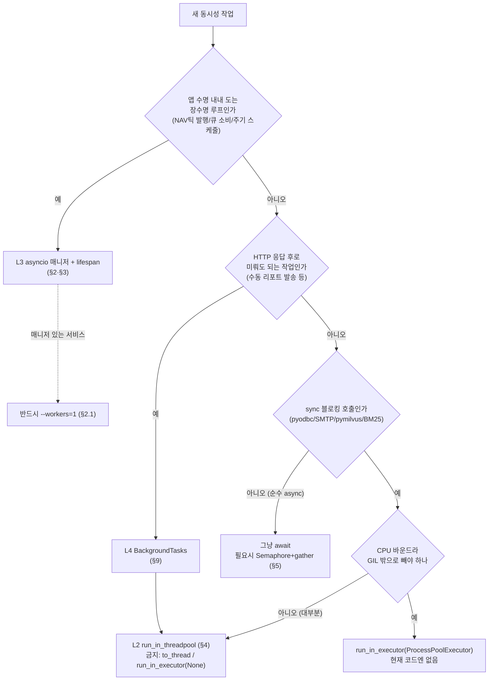

# 동시성·병렬성 기법 — 멀티프로세스 / 멀티스레드 / 비동기

> 이 repo 의 서비스(backend-service · devactivity-service · multi-agent-service · single-agent-service · file-service · MCP 서버군[market-data · disclosure · news · web · doc-search · portfolio])에서 실제로 쓰는 **동시성/병렬성 기법 전체**를 한 곳에 모은 기술 참조. 범위는 **전 백엔드 공통**(프론트는 §10). 어떤 기법을 **어디서·왜·어떻게** 쓰는지에 무게를 둔다. 모든 백엔드는 full-stack-template 골격을 복제하므로 패턴이 서비스 간에 반복된다 — 패턴 하나당 대표 예시 1개를 정본으로 링크하고, 같은 패턴이 반복되는 서비스는 경로만 나열한다.

## 0. 큰 그림 — 어느 계층을 고르나

새 비동기 작업을 만들 때 어느 도구를 집을지의 의사결정 흐름. 자세한 계층 정의는 §1, 각 기법은 해당 절로.



> raw OS 스레드(`threading.Thread`)와 `multiprocessing` 은 이 흐름의 선택지가 **아니다** — 현재 코드 전체에서 0건이다. 병렬성은 프로세스/컨테이너 복제(L1)로 얻고, 단일 프로세스 안에서는 asyncio 협력적 동시성으로 처리한다.

---

## 1. 동시성 4계층 모델

코드에 등장하는 모든 동시성은 아래 네 계층 중 하나다. 계층이 높을수록 자주 쓰이고, 낮을수록 특수 상황 전용이다.

| 계층 | 단위 | 메커니즘 | 어디에 | 빈도 |
|---|---|---|---|---|
| **L1 프로세스** | OS 프로세스 | uvicorn 워커, process-compose(dev) / docker-compose(stg+) | 운영/기동 레벨 (코드 아님) | 서비스당 보통 **1 워커** |
| **L2 OS 스레드** | 스레드풀 | `run_in_threadpool` 오프로드(정본 — AnyIO 공유 풀) | sync 블로킹 격리 (pyodbc·SMTP·pymilvus·BM25·이미지변환) | `run_in_threadpool` ~20 파일 |
| **L3 asyncio 태스크** | `asyncio.Task` (단일 이벤트 루프) | lifespan 백그라운드 매니저, `create_task`, `gather`, `Semaphore`, APScheduler | NAV 틱 발행·큐 소비·주기 메일 스케줄·sub-agent fan-out | 핵심 — 거의 모든 비동기 |
| **L4 응답 후 처리** | `BackgroundTasks` | FastAPI `background_tasks.add_task()` | 스케줄러 수동 실행(리포트 생성·메일 발송) | 1 파일 |

**핵심 원칙 세 가지** (전 서비스 `CLAUDE.md` anti-pattern 13 으로 강제):

1. **sync 블로킹은 `fastapi.concurrency.run_in_threadpool` 로만 오프로드한다.** `asyncio.to_thread` 와 `loop.run_in_executor(None, ...)` 는 금지. AnyIO 워커 풀과 분리된 별도 풀이라 스레드 예산이 이원화된다. `run_in_executor(None)`은 `ContextVar` 도 복사하지 않는다. CPU 바운드 GIL 탈출용 `run_in_executor(ProcessPoolExecutor)` 만 예외(현재 코드엔 없음). `run_in_threadpool` 은 `ContextVar` 를 복사하므로 스레드 안에서도 같은 인증 신원(`user_id`/`email`/`role`/`company_id`)을 확인한다. → [auth_context.py 주석](../../backend-service/app/core/auth_context.py)
2. **critical path 만 감싼다.** heavy CPU / N+1 루프 / polling 루프만 대상. 단발 5ms sync DB op 은 백그라운드 태스크에 있더라도 감싸지 않는다.
3. **백그라운드 매니저가 앱 안에서 도는 서비스는 단일 워커(`--workers=1`)로 운영한다.** 멀티워커면 매니저가 워커 수만큼 중복 기동된다 — NAV 틱이 중복 발행되고 같은 큐 메시지를 두 컨슈머가 중복 처리한다. → [backend-service/app/main.py:18](../../backend-service/app/main.py#L18)

---

## 2. 프로세스 레벨 — 워커와 기동

### 2.1 단일 워커 제약 (`--workers=1`)

NAV 틱 producer·메시지 큐 consumer·주기 스케줄러 같은 백그라운드 매니저는 **앱 프로세스 안에서** 도는 `asyncio.Task` 다(§3). 따라서 워커를 2개 이상 띄우면 같은 합성 NAV 스냅샷을 두 producer 가 중복 발행하고, 같은 pending 메시지를 두 consumer 가 중복 소비하며, 주간 리포트 메일이 워커 수만큼 중복 발송된다. 매니저가 있는 서비스(backend-service / devactivity-service / multi-agent-service)는 의도적으로 단일 프로세스로 운영된다.

```python
# backend-service/app/main.py:18
@asynccontextmanager
async def lifespan(app: FastAPI):
    # 백그라운드 매니저가 앱 안에서 실행 → 매니저 있는 서비스는 단일 프로세스(--workers=1)로 운영 (멀티워커 시 매니저 중복)
    backend_sql_client = app.container.backend_sql_client()
    await message_consumer_manager.start()
    await nav_producer_manager.start()
    yield
    await nav_producer_manager.stop()         # 역순 종료
    await message_consumer_manager.stop()
    backend_sql_client.dispose()
```

매니저가 **없는** 순수 REST/MCP 서비스(file-service, market-data·disclosure·news·web·doc-search·portfolio MCP)는 이 제약이 없어 수평 확장(컨테이너 N개)으로 처리량을 늘린다. 즉 병렬성은 "프로세스/컨테이너 복제"로 얻고, 단일 프로세스 안에서는 asyncio 협력적 동시성으로 처리한다.

### 2.2 process-compose (dev) vs docker-compose (staging+)

dev 멀티백엔드 일괄 기동은 `process-compose.yaml` 이 담당한다(각 backend `working_dir=<svc>/app`, file-service `:8100`). staging 이상은 docker-compose 로 컨테이너 격리. 두 환경 모두 서비스당 uvicorn 단일 워커가 기본이다.

```bash
process-compose up        # dev: 전 서비스를 한 머신에서 단일 워커로
                          # staging+: docker-compose (compose.staging.yaml + compose.prod.yaml)
```

`main.py` 의 `uvicorn.run(..., reload=True)` 는 dev/수동 기동용이며 `workers` 인자가 없다(기본 1). 운영 워커 수는 오케스트레이션 레이어가 정한다.

### 2.3 DB 커넥션 풀 — 프로세스당 격리

SQLAlchemy Engine 은 프로세스마다 자기 `QueuePool` 을 갖는다(스레드 안전, 내부 Lock). pyodbc 동기 드라이버이므로 `run_in_threadpool` 로 넘긴 스레드들이 이 풀에서 커넥션을 빌린다 — 풀 크기가 곧 스레드 동시성 상한이다. 멀티워커면 총 커넥션 = (풀 크기) × (워커 수)임을 기억해야 한다.

---

## 3. asyncio 백그라운드 매니저 — 핵심 패턴

장수명 백그라운드 작업(NAV 틱 producer, 메시지 큐 consumer, 주기 스케줄러)은 **매니저 클래스 + lifespan 오케스트레이션** 으로 통일돼 있다. 이 패턴이 코드 전체에서 가장 중요하다.

### 3.1 lifespan 오케스트레이션 — start 순방향 / stop 역방향

```python
# backend-service/app/main.py:18
@asynccontextmanager
async def lifespan(app: FastAPI):
    await message_consumer_manager.start()
    await nav_producer_manager.start()
    yield
    await nav_producer_manager.stop()         # 역순 종료
    await message_consumer_manager.stop()
```

소비자를 먼저 띄워 두고 producer 를 나중에, 종료는 역순(producer 멈추고 consumer 닫기). → 정본: [backend-service/app/main.py](../../backend-service/app/main.py#L18). devactivity-service 는 매니저가 APScheduler 하나뿐이라 `scheduler_manager.start()` / `await scheduler_manager.stop()` 한 쌍으로 단순화돼 있다([devactivity-service/app/main.py:15](../../devactivity-service/app/main.py#L15)).

### 3.2 매니저 템플릿 — `should_stop` + `create_task` + polling 루프 + graceful cancel

producer/consumer 매니저가 같은 골격이다. `start()` 가 백그라운드 루프를 `create_task` 로 띄우고, 루프는 `should_stop` 플래그가 설 때까지 동작→`sleep` 주기 대기를 반복한다. `stop()` 은 플래그를 세우고 태스크를 cancel 한 뒤 `CancelledError` 를 삼킨다.

```python
# backend-service/app/managers/nav/nav_producer_manager.py:39
async def start(self, message_queue_service=...) -> None:
    if self.task and not self.task.done():
        return                                     # 중복 기동 방지
    self.should_stop = False

    async def loop():
        while not self.should_stop:
            snapshot = self._next_snapshot()       # 합성 NAV/벤치마크 random-walk 틱
            await run_in_threadpool(               # sync 큐 publish 오프로드 (§4)
                message_queue_service.publish,
                {"topic": TOPIC, "payload": json.dumps(snapshot), "reg_id": "system"},
            )
            await asyncio.sleep(PRODUCE_INTERVAL)   # 10초 주기 발행
    self.task = asyncio.create_task(loop())
```

```python
# stop() — 공통 graceful shutdown
async def stop(self) -> None:
    self.should_stop = True
    if self.task and not self.task.done():
        self.task.cancel()
        try:
            await self.task
        except asyncio.CancelledError:
            pass
```

같은 골격이 메시지 큐 consumer 매니저에도 복제돼 있다 — consumer 는 `PRODUCE_INTERVAL` 대신 `POLL_INTERVAL=5` 초 주기로 `consume_pending(BATCH_SIZE)` 를 폴링한다([message_consumer_manager.py:22](../../backend-service/app/managers/message_queue/message_consumer_manager.py#L22)). `asyncio.sleep` 은 "다음 주기까지 협력적 양보" 역할이다.

> NAV producer ↔ 메시지 큐 consumer 는 **시세/체결 틱 수집 시뮬레이션**이다. producer 가 포트폴리오 NAV·벤치마크·일간수익률·MDD 를 합성 random-walk 로 생성해 `nav.snapshot` 토픽에 발행하고, consumer 가 pending 큐를 폴링해 처리한다. 실서비스에서는 이 자리에 외부 시세 벤더 스트림이 들어간다.

### 3.3 APScheduler — cron 잡 자가적재 + CRUD 동기화

devactivity-service 의 주기 작업(매주 월 09:00 KST 주간 포트폴리오 활동 요약 메일)은 raw 루프 대신 `AsyncIOScheduler`(이벤트 루프 위에서 도는 cron 스케줄러)로 처리한다. 기동 시 활성(`use_at='Y'`) 스케줄러를 DB 에서 읽어 cron 잡으로 자가적재하고, CRUD 변경 시 `sync()` 로 단일 잡만 갱신한다.

```python
# devactivity-service/app/managers/scheduler_manager.py:15
def start(self, scheduler_service=...) -> None:
    if not self.scheduler.running:
        self.scheduler.start()
    for sch in scheduler_service.select_active_schedulers():
        self.scheduler.add_job(
            scheduler_service.run,
            CronTrigger(day_of_week=sch["day_of_week"], hour=sch["hour"], minute=sch["minute"],
                        week=f"*/{sch['period_weeks']}" if sch["period_weeks"] > 1 else None),
            args=[sch["scheduler_id"]], id=sch["scheduler_id"], replace_existing=True,
        )
```

→ [scheduler_manager.py](../../devactivity-service/app/managers/scheduler_manager.py#L15). `stop()` 은 `self.scheduler.shutdown(wait=False)`. `AsyncIOScheduler` 는 같은 이벤트 루프에서 돌므로 별도 스레드/프로세스가 아니다 — 그래서 이 서비스도 `--workers=1` 이다.

### 3.4 MCP 클라이언트 lifecycle — 에이전트 기동 시 1회 연결

multi-agent-service 는 5개 금융 MCP 서버(market-data·disclosure·news·web·doc-search)를 `MultiServerMCPClient`(`streamable_http`)로 묶어 lifespan 에서 한 번 초기화한다. sub-agent 들이 이 단일 연결의 tool 을 공유한다.

```python
# multi-agent-service/app/main.py:23
await app.container.agent_service().initialize()    # MCP 연결 + tool 디스커버리 1회
```

→ [multi-agent-service/app/main.py](../../multi-agent-service/app/main.py#L23) · 연결 빌더는 [clients/mcp/mcp_client.py:42](../../multi-agent-service/app/clients/mcp/mcp_client.py#L42)(`build_mcp_connections` → `MultiServerMCPClient`). single-agent-service 는 web-mcp 하나만 같은 패턴으로 연결한다.

---

## 4. sync 블로킹 오프로드 — `run_in_threadpool` (정본)

가장 널리 쓰이는 L2 기법(~20 파일). pyodbc 동기 DB, SMTP 메일 발송, pymilvus 벡터 검색, Kiwi/BM25 sparse 인코딩, Pillow 이미지 변환, 파일 청크 read 같은 **블로킹 호출을 이벤트 루프 밖 스레드풀로** 던진다.

### 4.1 왜 `run_in_threadpool` 인가

- **`asyncio.to_thread`·`loop.run_in_executor(None, ...)` 금지** (anti-pattern 13): 둘 다 asyncio 기본 executor(AnyIO 와 분리된 별도 풀, 기본 `min(32, cpu+4)`)를 써서 스레드 예산이 이원화된다(run_in_executor(None)은 ContextVar 도 미복사). `fastapi.concurrency.run_in_threadpool` 은 Starlette/AnyIO 단일 풀(기본 40토큰)을 공유 → FastAPI 의 sync 엔드포인트·디펜던시와 스레드 예산이 한 곳에서 관리된다. 통일 기준은 "스레드냐 프로세스냐" — CPU 바운드를 GIL 밖으로 빼는 `run_in_executor(ProcessPoolExecutor)` 만 정당한 예외(현재 코드엔 없음).
- **`ContextVar` 복사**: `run_in_threadpool` 은 호출 시점 컨텍스트를 복사하므로 스레드 안의 sync 코드도 동일한 인증 신원을 본다. 멀티테넌트 감사 컬럼(`reg_id`/`mod_id`)·회사 격리(`company_id`)가 백그라운드 스레드에서도 유지된다.

### 4.2 무엇을 감싸나

| 블로킹 작업 | 대표 위치 | 비고 |
|---|---|---|
| pyodbc 큐 소비 배치 | [message_consumer_manager.py:35](../../backend-service/app/managers/message_queue/message_consumer_manager.py#L35) | `consume_pending(BATCH_SIZE)` 폴링 |
| pyodbc 큐 발행 | [nav_producer_manager.py:53](../../backend-service/app/managers/nav/nav_producer_manager.py#L53) | NAV 틱 publish |
| pyodbc 멀티턴 이력 조회 | [chat_history_repository.py:42](../../multi-agent-service/app/repositories/chat_history/chat_history_repository.py#L42) | `(email, gid)` read-only |
| SMTP 메일 발송 (SSL) | [mail_client.py:25](../../devactivity-service/app/clients/mail/mail_client.py#L25) | 주간 활동 요약 메일 |
| pymilvus 하이브리드 검색 | [vector_search_service.py:78](../../doc-search-mcp-service/app/services/vector_search/vector_search_service.py#L78) | dense+sparse 필드 검색 |
| Kiwi/BM25 sparse 인코딩 | [vector_search_service.py:76](../../doc-search-mcp-service/app/services/vector_search/vector_search_service.py#L76) | 쿼리 sparse 벡터화 |
| Pillow 이미지 변환(리사이즈/크롭) | [file-service file_service.py:200](../../file-service/app/services/file/file_service.py#L200) | 다운로드 시 변환 |
| 파일 청크 read | [sftp_file_repository.py:37](../../file-service/app/repositories/file/sftp_file_repository.py#L37) | sync file-like → 청크 업로드 |

### 4.3 무엇을 감싸지 **않나**

단발 sync DB op(예: 단일 SELECT 5ms)은 background task 안이라도 감싸지 않는다 — 스레드 전환 비용이 이득보다 크다. critical path(heavy CPU / N+1 / polling 루프)만 대상이다. SFTP 전송 자체는 `asyncssh` 로 완전 async 라 `run_in_threadpool` 이 아니다 — sync 인 것은 디스크 file-like 의 `read` 뿐이다.

---

## 5. 비동기 동시성 제한 — `asyncio.Semaphore` + `gather`

병렬 fan-out 이 필요하지만 무제한이면 외부 시스템(LLM·MCP 서버·SFTP)이 터지는 경우, `Semaphore(N)` 로 동시 실행 수를 묶고 `gather` 로 한꺼번에 await 한다. 세 가지 변형이 있다.

### 5.1 멀티에이전트 Map 단계 — `Semaphore(map_concurrency)` + `gather`

multi-agent-service 의 Plan-Execute 그래프는 4개 투자 리서치 도메인(종목·재무·리스크·시장)의 sub-answer 를 병렬 LLM 호출로 생성하되, 동시 LLM 호출 수를 `Semaphore` 로 제한한다. 각 도메인 답변은 `wait_for(timeout)` 로 감싸 느린 도메인이 전체를 막지 않게 한다.

```python
# multi-agent-service/app/graphs/plan_execute.py:1167
semaphore = asyncio.Semaphore(map_concurrency)
...
async def _map_domain_answer(domain, ..., semaphore):
    async with semaphore:
        ans = await asyncio.wait_for(
            llm_to_use.ainvoke(messages, config=...), timeout=map_timeout_s,
        )
        ...   # 타임아웃/예외는 도메인별 stub 으로 격리 (전체 답변 보존)
coros = [_map_domain_answer(domain, items, ..., semaphore) for domain, items in target_domains]
```

→ [plan_execute.py:1167](../../multi-agent-service/app/graphs/plan_execute.py#L1167). RES 파이프라인의 sub-agent 그룹 실행도 같은 fan-out 이다 — 그룹 내 sub-agent 들을 `gather` 로 동시 실행하고, 각 호출을 `AgentResult.exception` 으로 감싸 부분 실패를 허용한다([res_pipeline.py:271](../../multi-agent-service/app/graphs/res_pipeline.py#L271)).

### 5.2 동시 SSE 스트림 게이트 — 모듈 싱글턴 `StreamSemaphore`

multi-agent-service 는 동시 진행 중인 `/agent` SSE 스트림 수를 `StreamSemaphore` 로 제한한다(LLM 백엔드 폭주 방지). 첫 사용 시점의 이벤트 루프에 lazy 바인딩하는 싱글턴이며, `limit=0` 이면 비활성.

```python
# multi-agent-service/app/services/agent/rate_limit.py:42
class StreamSemaphore:
    def _ensure(self) -> asyncio.Semaphore | None:
        if self.limit <= 0:
            return None
        if self._sem is None:
            self._sem = asyncio.Semaphore(self.limit)   # 첫 사용 시 현재 이벤트루프에 바인딩
        return self._sem
```

→ [rate_limit.py:42](../../multi-agent-service/app/services/agent/rate_limit.py#L42). DI 싱글턴으로 주입([container.py:30](../../multi-agent-service/app/core/container.py#L30)), 라우터가 `async with stream_semaphore.acquire()` 로 게이팅.

### 5.3 멀티파일 업로드 — `Semaphore(4)` + `gather(return_exceptions=True)`

file-service 의 다중 파일 SFTP 업로드는 `Semaphore(4)` 로 동시 업로드를 4개로 묶고, `return_exceptions=True` 로 한 파일 실패가 전체를 죽이지 않게 한다.

```python
# file-service/app/services/file/file_service.py:90
semaphore = asyncio.Semaphore(4)

async def limited_upload(file, i):
    async with semaphore:
        return await self._upload_single(session, file, remote_path, ...)

results = await asyncio.gather(*[limited_upload(f, i) for i, f in enumerate(files)], return_exceptions=True)   # 부분 실패 허용
```

→ [file_service.py:90](../../file-service/app/services/file/file_service.py#L90). SFTP 전송 자체는 `asyncssh` 로 완전 async(`async with session.open(...)`), 한 세션으로 디렉토리 생성 + 병렬 업로드.

### 5.4 dense + sparse 병렬 인코딩 — `gather`

doc-search-mcp 의 하이브리드 검색은 dense 임베딩(async)과 sparse BM25 인코딩(sync → `run_in_threadpool`)을 `gather` 로 동시에 돌려 한 쿼리의 두 벡터를 병렬 생성한다. "async I/O + 스레드풀 오프로드"를 한 `gather` 로 합치는 교과서 예시.

```python
# doc-search-mcp-service/app/services/vector_search/vector_search_service.py:75
dense_vec, (doc_vec, meta_vec) = await asyncio.gather(
    self.embedding.embed_query(params.query),                 # async I/O
    run_in_threadpool(self.bm25.embed_text_query, params.query),   # sync 오프로드
)
```

→ [vector_search_service.py:75](../../doc-search-mcp-service/app/services/vector_search/vector_search_service.py#L75). 이미지 검색(`_image_search`)도 동일 구조.

---

## 6. 백그라운드 매니저 데이터 흐름 (틱 시뮬레이션)

backend-service 의 NAV producer/consumer 는 외부 스트림 없이 in-process 합성 시세 틱을 발행·소비해 메트릭 대시보드를 채운다. 실서비스에서는 producer 자리에 외부 시세 벤더 스트림이 들어가는 확장 지점이다.


> producer 가 한 틱마다 timestamp(`format_kst_seconds`)를 박아 발행하면 consumer 가 pending 배치를 폴링해 시계열로 적재한다. producer 주기(10초) > consumer 주기(5초)라 consumer 가 항상 큐를 비운 상태를 유지한다.

---

## 7. MCP 소비 동시성 — 에이전트가 도구를 부르는 경계

이 repo 에는 라이브 스트림 수집(WebSocket/Kafka) 루프가 없다. 대신 멀티에이전트가 **여러 MCP 서버의 tool 을 동시에 호출**하는 fan-out 이 동시성의 중심이다.

- **단일 공유 MCP 연결**: `MultiServerMCPClient` 를 lifespan 에서 1회 초기화(§3.4)하고 모든 sub-agent 가 공유. tool 디스커버리도 1회.
- **그룹 단위 병렬 실행**: Plan 이 sub-agent 호출을 그룹으로 나누면 RES 파이프라인이 그룹 내 호출을 `gather` 로 동시 실행(§5.1), 그룹 간에는 의존 컨텍스트(`prev_ctx`)를 넘기며 순차 진행.
- **타임아웃 이중화**: 각 sub-agent 호출에 inner `wait_for(timeout)`, 단계 전체에 outer `wait_for` — outer 가 먼저 발동하면 cancel 누수가 생기므로 마진을 둔다([res_pipeline.py:172](../../multi-agent-service/app/graphs/res_pipeline.py#L172)).
- **결과 격리**: sub-agent 예외는 `AgentResult.exception` 으로 감싸 stub 결과로 바꾼다 — 한 도구 실패가 전체 리서치를 죽이지 않는다.

MCP 서버 쪽(market-data·disclosure·news·web·doc-search·portfolio)은 매니저 없는 순수 REST/MCP 라 §2.1 의 단일워커 제약이 없고, 내부 블로킹(pymilvus·BM25)만 `run_in_threadpool` 로 오프로드한다(§4).

---

## 8. OS 스레드 / 멀티프로세스 — 현재 0건

asyncio 로 안 되는 작업(블로킹 하드웨어 제어 루프, 블로킹 동기 잡 큐)에 한해 raw OS 스레드를 쓰는 경우가 있으나, **이 repo 에는 그런 작업이 없다.** `threading.Thread`·`ThreadPoolExecutor`·`multiprocessing` 직접 사용은 코드 전체에서 0건이다.

- sync 블로킹은 전부 `run_in_threadpool`(AnyIO 공유 풀)로 처리(§4) — 별도 raw 스레드를 만들 이유가 없다.
- 병렬성이 더 필요하면 컨테이너 복제(L1)로 얻는다(§2.1).
- 정당한 사유(하드웨어 제어 등) 없이 raw `threading.Thread` / `multiprocessing` 를 도입하지 않는다(anti-pattern).

> 이 절은 "왜 없는가"를 못박는 자리다. 미래에 블로킹 동기 잡 큐(예: 무거운 리포트 PDF 렌더 배치)가 생기면 `ThreadPoolExecutor` + lifespan `shutdown(wait=True)` 패턴을 여기에 추가한다 — 지금은 speculative 라 넣지 않는다.

---

## 9. FastAPI BackgroundTasks — 응답 후 처리 (L4)

오래 걸리는 작업을 HTTP 응답 후로 미루는 표준 패턴. 현재 유일한 사용처는 devactivity-service 의 스케줄러 **수동 실행**이다: 즉시 "발송 시작" 응답을 주고, 백그라운드에서 멤버별 활동 요약 생성 + 메일 발송을 진행한다. add_task 콜백은 `async def` 이고, 내부 메일 발송만 `run_in_threadpool`(SMTP) 로 다시 던진다.

```python
# devactivity-service/app/routers/scheduler/scheduler_router.py:157
async def _run() -> None:
    try:
        async for _msg in activity_report_service.generate_for(members, since, until):
            pass
    except Exception as e:
        logger.warning(f"[스케줄러 {scheduler_id}] 수동 실행 실패: {e}")

background_tasks.add_task(_run)
return MessageOut(message="발송을 시작했습니다. 잠시 후 메일이 전송됩니다.")
```

→ [scheduler_router.py:157](../../devactivity-service/app/routers/scheduler/scheduler_router.py#L157).

**왜 미루나**: 멤버별 portfolio-mcp-service 활동 조회 + LLM 요약 + SMTP 발송은 수 초~수십 초가 걸린다. 응답을 막지 않고 "발송 시작"만 알린다. background 작업의 감사 컬럼은 요청 신원이 없으므로 `reg_id='system'`(예: NAV producer publish 의 `reg_id`).

---

## 10. 프론트엔드 비동기 (Next.js / React 19)

프론트엔드는 full-stack-template/frontend 골격을 따른다. 상태관리 `zustand`, HTTP `axios`, 그리드 `devextreme` 를 쓰고 **React Query/SWR·Web Worker 는 쓰지 않는다**(직접 `apiCall` + zustand).

### 10.1 `Promise.all` 병렬 — route handler

Next.js route handler 가 목록+카운트 같은 독립 쿼리를 병렬 실행.

```typescript
// frontend/app/api/common/system/adminuser/route.ts
const [list, total_count] = await Promise.all([
  prisma.user.findMany({ where, orderBy, take, skip }),
  prisma.user.count({ where }),
]);
```

### 10.2 WebSocket 훅 — 자동 재연결

실시간 대시보드(NAV/시세 틱)용 커스텀 훅. close 시 `setTimeout` 으로 재연결, 언마운트 시 정리. → [hooks/shared/useWebSocketService.ts](../../frontend/hooks/shared/useWebSocketService.ts)

### 10.3 SSE 스트리밍 — `ReadableStream`

장기 작업 진행률(에이전트 답변·LLM 토큰 스트리밍)을 `fetch` + `reader.read()` 청크 파싱으로 스트리밍, `AbortSignal` 로 취소. → [utils/common/api/sse.ts](../../frontend/utils/common/api/sse.ts)

### 10.4 `setInterval` 폴링

메트릭 대시보드(NAV/벤치마크 시계열)가 5초 간격으로 fetch(토글 on/off). → [components/features/Metric/](../../frontend/components/features/Metric/)

### 10.5 `AbortController` 취소 + `useRef` 토큰 race 방지

- 여러 파일 그룹을 `Promise.all` 로 병렬 로드하고 언마운트 시 `abortController.abort()` 로 inflight 취소. → [hooks/shared/useFileGroups.ts](../../frontend/hooks/shared/useFileGroups.ts)
- 빠른 의존성 변경 시 stale 응답 무시: fetch 마다 토큰 증가, 응답 시점 토큰이 최신이 아니면 버림. → [hooks/shared/useMasterGridData.ts](../../frontend/hooks/shared/useMasterGridData.ts)

### 10.6 zustand async 액션 / DevExtreme CustomStore lazy load

- 앱 초기 코드/네비 테이블을 async thunk 로 하이드레이션(`stores/shared/codeStore.ts`).
- 그리드는 `CustomStore.load` 가 스크롤 시 서버 페이지네이션을 lazy fetch(`paginate: true`).

---

## 11. 외부 라이브러리가 들고 오는 동시성 (asyncio 밖)

asyncio 는 "I/O 대기 동안 협력적으로 양보"하는 단일 스레드 동시성일 뿐이다. 실제 처리량은 **라이브러리가 자체적으로 들고 오는** 층에서 더 나온다 — ① 이벤트 루프 위에서 도는 async I/O 라이브러리, ② GIL 밖 네이티브 멀티스레드. 특히 ②는 `run_in_threadpool` 워커 스레드 **안에서** 다시 병렬화되는 **중첩 구조**라, "이벤트 루프 → 스레드풀 1워커 → (라이브러리가 내부 멀티스레드)" 로 읽어야 한다.

### 11.1 async I/O 라이브러리 (이벤트 루프 위)

전부 `await` 로 이벤트 루프에 통합되는 비동기 클라이언트다.

| 라이브러리 | 역할 | 대표 위치 | 비고 |
|---|---|---|---|
| `httpx.AsyncClient` | 서비스 간 HTTP 백본 | [file_service_client.py:34](../../backend-service/app/clients/file/file_service_client.py#L34) | FileServiceClient 의 모든 IO async. sync `httpx.Client` 는 비-이벤트루프 경로(로그 송출 등)에만 |
| `langchain_mcp_adapters` (`MultiServerMCPClient`) | MCP tool 디스커버리/호출 | [mcp_client.py:42](../../multi-agent-service/app/clients/mcp/mcp_client.py#L42) | `streamable_http` 트랜스포트, lifespan 1회 연결 |
| `asyncssh` | async SFTP | §5.3 | file-service 업로드/다운로드 |
| LLM async 클라이언트 (`ainvoke`) | LLM 추론 | §5.1 | multi/single-agent, `wait_for` 타임아웃 |
| `tenacity.AsyncRetrying` | async 재시도 backoff | [file_service_client.py](../../backend-service/app/clients/file/file_service_client.py) | `wait_exponential` + `stop_after_attempt`. sync 버전은 `utils/common/retry_utils.py` |

### 11.2 네이티브 멀티스레드 (GIL 밖, CPU)

C/C++/Rust 로 구현돼 GIL 을 풀 수 있는 라이브러리. 동기 블로킹이므로 항상 `run_in_threadpool` 로 이벤트 루프에서 떼어내 호출한다(§4).

- **`pymilvus` `MilvusClient`** — 벡터 DB(doc-search-mcp). dense+sparse 하이브리드 검색. 내부 커넥션 풀, sync 호출은 `run_in_threadpool`([vector_search_service.py:78](../../doc-search-mcp-service/app/services/vector_search/vector_search_service.py#L78)).
- **`kiwipiepy`(Kiwi)** — 한글 형태소 분석기(C++). BM25 sparse 인코딩의 명사 정규화에 사용. sync 라 호출측이 `run_in_threadpool`([bm25_client.py](../../doc-search-mcp-service/app/clients/bm25/bm25_client.py)).
- **`Pillow`** — file-service 이미지 변환(리사이즈/크롭). sync → `run_in_threadpool`([file_service.py:200](../../file-service/app/services/file/file_service.py#L200)).

### 11.3 외부 추론·검색 서비스 클라이언트 (동시성을 위임)

무거운 동시성을 **외부 서버**에 위임하고, 클라이언트는 호출만 한다. 폭주 방지 게이팅은 §5 `Semaphore` 로 한다.

- **LLM 게이트웨이** — 임베딩·리랭크·생성 모델 추론을 외부 서버에 위임. 동시 SSE 스트림은 `StreamSemaphore`(§5.2), 동시 도메인 LLM 호출은 `Semaphore(map_concurrency)`(§5.1)로 제한.
- **시세/공시/뉴스 벤더** — market-data·disclosure·news MCP 서버가 외부 API(또는 MOCK)를 감싼다. `USE_REAL_API=false` 면 in-memory 픽스처로 즉시 동작, 실API 토글 시 `httpx.AsyncClient` 로 호출.

### 11.4 재시도 backoff — `tenacity` (전 서비스 공통)

일시적 외부 오류(HTTP 연결·소켓·SMTP 끊김)는 `tenacity` 로 재시도한다. 영구 오류(인증 실패·수신 거부)는 retryable 판정에서 제외한다.

```python
# devactivity-service/app/clients/mail/mail_client.py:11
def _is_smtp_retryable(exc: BaseException) -> bool:
    """일시적 SMTP 오류(연결·소켓·서버 끊김)만 재시도. 인증 실패·수신 거부 등 영구 오류는 제외."""
    return isinstance(exc, (smtplib.SMTPConnectError, smtplib.SMTPServerDisconnected, OSError))
```

→ 공통 헬퍼 [retry_utils.py](../../backend-service/app/utils/common/retry_utils.py)(`wait_exponential` + `stop_after_attempt`, sync `retry` / async `AsyncRetrying`). 전 서비스에 복제돼 있다.

---

## 부록 A — 기법 × 서비스 매트릭스

| 기법 | backend-service | devactivity | multi-agent | single-agent | file-service | MCP 서버군 |
|---|:---:|:---:|:---:|:---:|:---:|:---:|
| lifespan asyncio 매니저 | ●(2개) | ●(scheduler) | ●(MCP init) | ●(MCP init) | | |
| `create_task` polling 루프 | ● | | | | | |
| APScheduler cron | | ● | | | | |
| `run_in_threadpool` 오프로드 | ● | ●(SMTP) | ●(이력) | | ● | ●(doc-search) |
| `Semaphore`+`gather` | | | ●(map/SSE) | | ●(업로드4) | |
| `gather` 병렬(dense+sparse) | | | ●(sub-agent) | | | ●(doc-search) |
| `MultiServerMCPClient` 소비 | | ●(활동요약) | ●(market-data·disclosure·news) | ●(web) | | |
| `BackgroundTasks` | | ●(수동발송) | | | | |
| `asyncssh` SFTP | | | | | ● | |
| `httpx.AsyncClient` | ●(file proxy) | ● | ● | ● | | ●(실API) |
| `pymilvus` / `kiwipiepy` 네이티브 | | | | | | ●(doc-search) |
| `Pillow` 이미지 변환 | | | | | ● | |
| `tenacity` 재시도 backoff | ● | ● | ● | ● | ● | ● |
| raw `threading.Thread` | — | — | — | — | — | — |
| 멀티프로세스(`multiprocessing`) | — | — | — | — | — | — |

(● = 사용 / 빈칸 = 미사용 / — = 코드 전체에서 없음)

> raw `threading.Thread`·`ThreadPoolExecutor`·`multiprocessing` 은 이 repo 전체에서 0건이다(§8). 모든 sync 블로킹은 `run_in_threadpool`, 병렬성은 컨테이너 복제로 얻는다.

## 부록 B — 규칙 요약 (do / don't)

### DO

- sync 블로킹은 `fastapi.concurrency.run_in_threadpool` 로만 오프로드한다. `ContextVar` 복사 → 신원 유지.
- 장수명 백그라운드 작업은 매니저 클래스 + lifespan `start`(순)/`stop`(역) + `should_stop` + `create_task` + 주기 `sleep` 로 구성한다. 주기 cron 은 `AsyncIOScheduler`.
- Cancel 후 `CancelledError` 는 삼킨다. `start()` 는 `task.done()` 으로 중복 기동을 막는다.
- fan-out 시 외부 시스템(LLM·MCP·SFTP) 한도는 `Semaphore(N)` + `gather` 로 제한한다. 부분 실패 허용 시 `return_exceptions=True`(또는 결과 stub 격리). 느린 항목 대비 `wait_for(timeout)`.
- 백그라운드 매니저가 있는 서비스(backend·devactivity·multi-agent)는 `--workers=1` 로 운영한다. 매니저 없는 REST/MCP 서비스는 컨테이너 복제로 확장한다.
- 응답을 막는 작업은 `BackgroundTasks` 로 미룬다. 감사 컬럼 `reg_id='system'`.
- 네이티브 멀티스레드 라이브러리(pymilvus·Kiwi·Pillow)는 `run_in_threadpool` 안에서 실행한다.

### DON'T

- `asyncio.to_thread` / `loop.run_in_executor(None, ...)`: 별도 풀로 스레드 예산 이원화. CPU 바운드만 `run_in_executor(ProcessPoolExecutor)` 예외(현재 코드엔 없음).
- 단발 5ms sync op 를 `run_in_threadpool` 로 감싼다: 스레드 전환 비용 초과. critical path 만 감싼다.
- 매니저 있는 서비스를 멀티워커로 띄운다: NAV 틱 중복 발행 / 큐 메시지 중복 소비 / 메일 중복 발송.
- 정당한 사유 없는 raw `threading.Thread` / `multiprocessing` 도입: 현재 0건 — 병렬성은 프로세스/컨테이너 복제(L1)로 얻는다.

---

관련 문서: [동시성-가이드.md](동시성-가이드.md) (새 코드 결정 규칙·템플릿) · [fastapi-백엔드개발.md](../2-개발가이드/fastapi-백엔드개발.md) (Python `async`/`await` · FastAPI 의존성·lifespan 개념)
