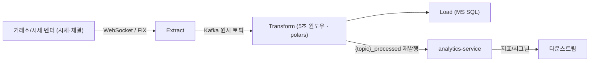
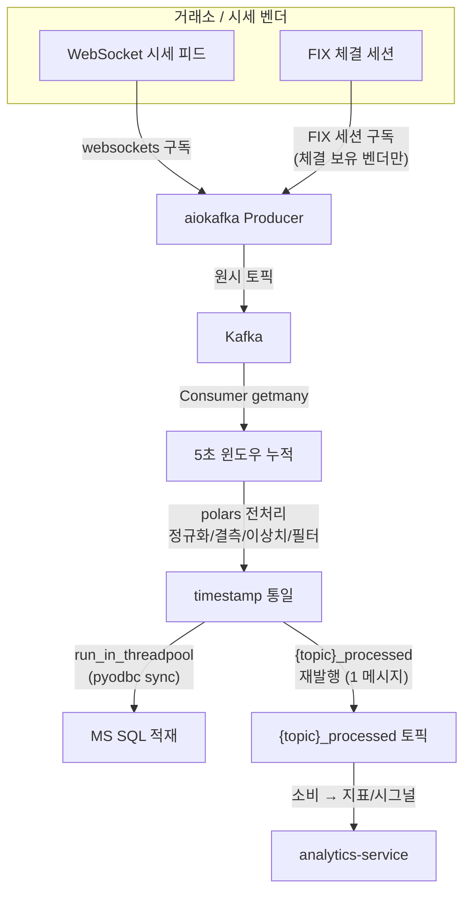
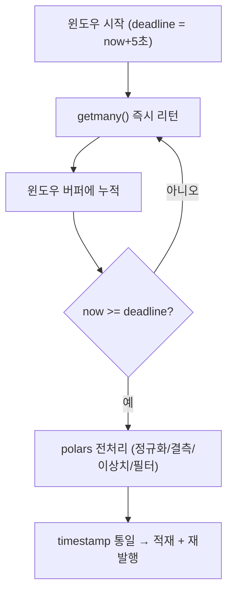

# ETL 파이프라인 — 시세·틱 데이터 수집·변환·적재

> 파생 서비스(시세 틱 수집을 갖춘 핀테크 플랫폼)의 `etl-service` 가 시세/체결 틱 데이터를 **수집(WebSocket·FIX) → Kafka → 5초 윈도우 polars 전처리 → MS SQL 적재 + 재발행 → analytics-service** 로 흘리는 흐름과 설계 근거. **틱 수집/분석 보유 서비스 전용**(base 템플릿엔 없음 — backend-service 의 quote/trade 틱 ingestion `MessageQueue` producer/consumer 가 같은 패턴의 인프로세스 축소판).

---

## 0. 전체 흐름

수집 → 윈도우 전처리 → (적재 ∥ 재발행) → 분석. 모두 한 `etl-service` 프로세스 안의 `asyncio` 매니저로 돈다. 단계별 라이브러리·근거는 §1~§5.

핵심 용어: **WebSocket/FIX** = 거래소·시세 벤더 실시간 데이터 수집 표준 프로토콜 · **Kafka** = 메시지 큐(버퍼) · **polars** = Rust 기반 고속 DataFrame · **윈도우** = 일정 시간(5초)치 틱을 묶은 한 덩어리(bar/봉 집계 단위) · **재발행** = 가공 결과를 다른 토픽(`{topic}_processed`)으로 다시 흘려보내기 · **인프로세스 매니저** = 별도 클러스터 없이 앱 프로세스 안에서 도는 `asyncio` 태스크.

전부 `etl-service` **앱 프로세스 안**의 `asyncio` 매니저로 돈다(별도 Spark/Prefect 클러스터 없음). 매니저 패턴이라 **`--workers=1`**.

---

## 1. Extract — 수집

| 프로토콜      | 라이브러리             | 비고                                                                                                                  |
| ------------- | ---------------------- | --------------------------------------------------------------------------------------------------------------------- |
| **WebSocket** | `websockets` (완전 async) | 연결+인증(API 키 `run_in_threadpool`) / 메시지 콜백 `on_message`(sync) → `_create_task` 로 async 스케줄 |
| **FIX**       | `quickfix-async`       | **체결 세션 보유 벤더만** (시세 전용 벤더는 FIX 없음)                                                                  |
| **Kafka**     | `aiokafka` Producer    | `acks="all"`, `linger_ms=10`+`max_batch_size` 자동 배칭. 토픽 멱등 생성                                               |

- 시세 라이브 연결은 **etl-service 단독 소유** — 다른 서비스(분석 워커 등)는 직접 안 붙고 HTTP 프록시로 구독 요청.
- 주기 폴링(REST 시세 조회) vs 트리거 구독(시세 푸시 콜백) — 코드는 [동시성 §6.3](../3-기법/동시성-출처인덱스.md).

---

## 2. Transform — 5초 윈도우 + timestamp 통일

`aiokafka.getmany` 는 도착 즉시 리턴하므로, **윈도우 만료(5초)까지 deadline 기반으로 반복 호출**해 한 윈도우치를 누적한 뒤 `polars` 로 한 번에 전처리(정규화/결측/이상치/필터)한다.

> **timestamp 통일이 핵심 계약**: 한 윈도우 안 모든 row 의 timestamp 를 첫 row 값으로 **통일**한다. 이래야 다운스트림 분석이 "같은 bar(봉) 의 시세·체결들" 을 하나로 매칭할 수 있다. 윈도우 단위로 통일하지 않으면 지표/시그널의 시계열 매칭이 깨진다.

---

## 3. Load — 적재 + 재발행

- 윈도우 결과를 **MS SQL 일괄 insert** (`run_in_threadpool` — pyodbc sync).
- 같은 결과를 **`{topic}_processed` 토픽으로 1 메시지 재발행** (이미 윈도우로 묶였으므로 다운스트림은 추가 누적 없이 즉시 소비).
- 대시보드용 broadcast consumer 는 `{topic}_processed` 를 `async for` 푸시로 받아 WebSocket 으로 라이브 시세/지표를 전송.

---

## 4. Downstream — analytics-service

- `{topic}_processed` 를 소비해 지표·시그널 산출. **모델/룰셋은 60초마다 최신 팩터 모델을 동기 로드**(`run_in_threadpool`)해 갱신, 첫 성공 로드 시에만 consumer 를 켠다(모델 없을 때 메시지 처리 방지).
- 내부 fan-out 은 `MessageBroadcaster`(in-process pub/sub) — 느린 구독자가 전체를 막지 않게 timeout+cancel.

---

## 5. 왜 인프로세스 매니저인가

별도 스트리밍 클러스터(Spark) 대신 FastAPI 앱 안의 `asyncio` 매니저를 쓰는 이유:

- 처리량이 **시세 bar(수초 단위)** 에 bounded — 대규모 분산 엔진이 필요 없다.
- lifespan `start`(producer→consumer 순)/`stop`(역순) 으로 수명을 앱과 묶어 운영이 단순.
- 단일 프로세스라 Kafka 토픽·시세 피드 **이중 소비/구독이 구조적으로 없다**(`--workers=1`).

---

## 부록 — 대안 스택 (교육/참고)

대규모·다양한 워크로드라면 전용 스택을 고려한다. 현재 etl-service 는 쓰지 않는다.

| 단계            | 현재 (etl-service)       | 대안                           |
| --------------- | ------------------------ | ------------------------------ |
| 수집(로그)      | —                        | Filebeat                       |
| 큐              | Kafka (KRaft)            | Kafka + ZooKeeper              |
| 변환            | `polars` (인프로세스)    | Apache Spark (Streaming/Batch) |
| 적재            | MS SQL                   | Clickhouse (Column OLAP)       |
| 스케줄/워크플로 | lifespan 매니저          | Prefect                        |
| 시각화          | 자체 대시보드(WebSocket) | Superset                       |

> WebSocket/FIX 세션 상태머신, Kafka Topic/Partition/Replication, Clickhouse MergeTree 같은 개념 배경이 필요하면 대안 스택 문서를 따로 본다 — 이 파이프라인 운영에는 §1~§5 로 충분하다.

---

관련 문서: [../3-기법/동시성-출처인덱스.md](../3-기법/동시성-출처인덱스.md) §5(Kafka)·§6(WebSocket/FIX) — 동시성 메커니즘(매니저 골격·`getmany` 누적·`run_in_threadpool`·`websockets` 콜백) 코드 인덱스.
