# RAG / LLM 서빙 아키텍처 — 임베딩 RAG · 다중 LLM · 에이전트 챗봇

> RAG 챗봇이 어떻게 동작하는지를 그림 중심으로 푼다 — 임베딩 인덱싱 → 하이브리드 검색 → 다중 LLM(라우팅·생성·리랭크) → 에이전트. 두 사례를 함께 본다: 대규모 **ai-chatbot(example-ai, 투자 리서치)** 과 **KMS docs-service**. 큰 그림은 §0~§2, ai-chatbot 깊이는 §3~§6, KMS 는 §7. ai-chatbot 은 별도의 프로젝트라 소스 링크는 없다.

---

## 0. RAG 가 뭐고 왜 쓰나

LLM 은 똑똑하지만 ① 최신 정보를 모르고 ② 우리 사내/도메인 지식을 모르며 ③ 모르면 그럴듯하게 지어낸다(환각). **RAG(Retrieval-Augmented Generation)** 는 답하기 전에 **관련 문서를 먼저 검색해서 근거로 붙여주는** 방식이다.

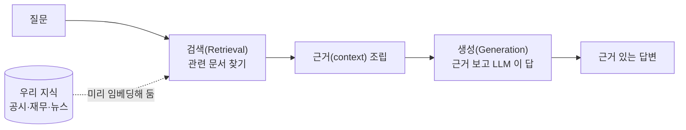

> 핵심은 "LLM 에게 시험 보기 전 **오픈북**을 쥐여주는 것". 그래서 답이 최신·정확해지고, 출처(공시·시세 근거)를 댈 수 있다. 투자 리서치에선 특히 **미근거 수치 환각**이 치명적이라 RAG 근거 부착이 컴플라이언스의 출발점이다.

핵심 용어: **임베딩** = 텍스트를 의미를 담은 숫자 벡터로 바꾸기. **벡터 DB** = 그 벡터를 저장하고 "비슷한 것"을 빨리 찾는 DB(Milvus). **청크(chunk)** = 긴 문서를 검색 단위로 쪼갠 조각.

---
## 1. 두 시스템 한눈에

같은 RAG 라도 규모가 다르다. 큰 그림을 잡는 데는 **대규모(ai-chatbot)** 를, 템플릿에 들어있는 **단순화판(KMS)** 을 같이 본다.

| 축 | ai-chatbot (example-ai) | KMS docs-service |
|---|---|---|
| 도메인 | 투자 리서치 Q&A | 금융 리서치 문서 Q&A |
| 검색 | **벡터 검색 마이크로서비스**(하이브리드) | docs-service 내 Milvus + BM25 |
| LLM | **여러 개**(생성·라우팅·임베딩·리랭크) | vLLM(생성·비전) + 임베딩 |
| 에이전트 | **LangGraph + 외부 툴 4종** | 없음(검색→생성 직선) |
| 문서 파싱 | MSSQL HTML/라벨 데이터 | Upstage Document Parse |
| 격리 | (단일 도메인) | 회사·프로젝트 단위 격리 |

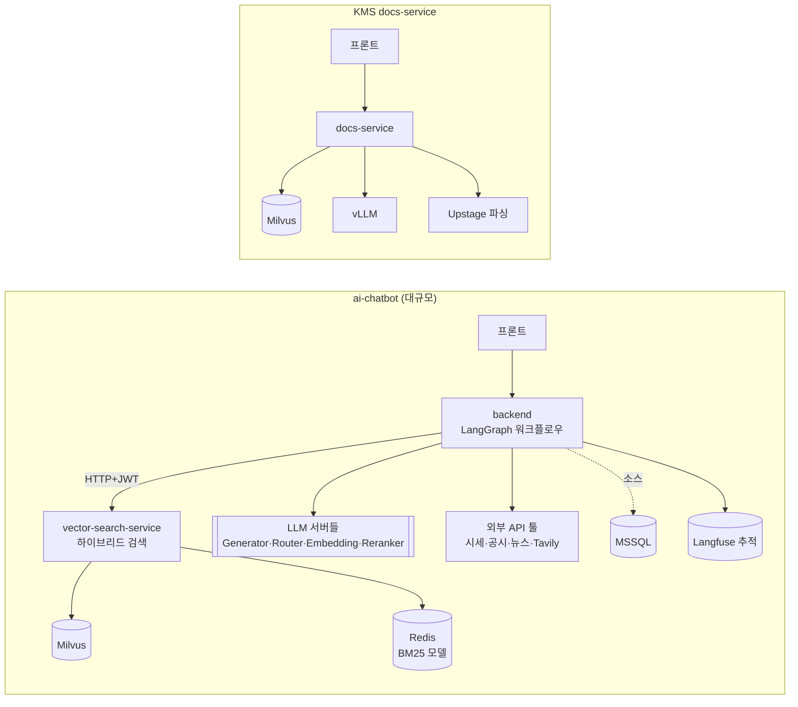

---
## 2. 전체 흐름 — 인덱싱 한 번, 질의 매번

RAG 는 두 단계다. **인덱싱**(문서를 미리 검색 가능하게 넣어두기)은 가끔, **질의**(질문에 답하기)는 매 요청.

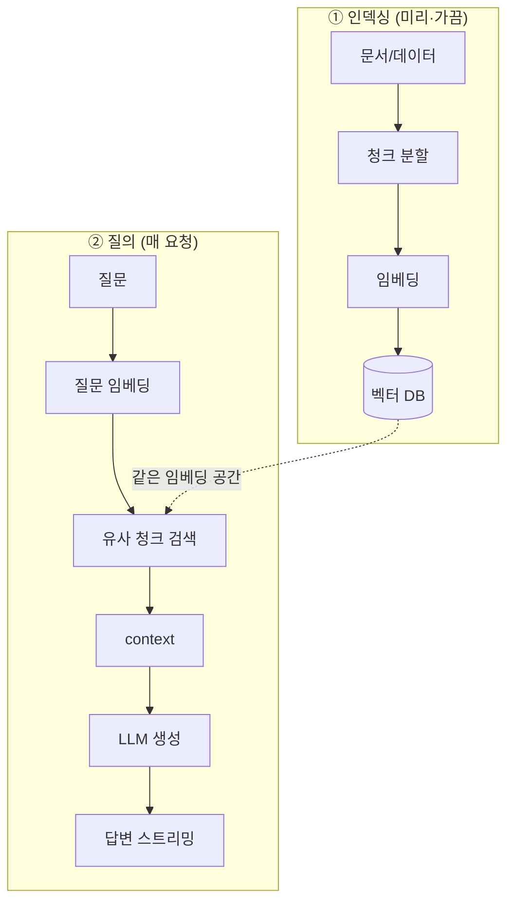

> 인덱싱과 질의는 **같은 임베딩 모델**을 써야 한다 — 그래야 질문 벡터와 문서 벡터가 같은 공간에서 비교된다.

---
## 3. 임베딩 인덱싱 파이프라인 (ai-chatbot)

문서를 그냥 통째로 넣으면 검색이 안 된다 — **쪼개고(청크) → 벡터로 바꿔(임베딩) → 벡터 DB 에 적재** 한다. ai-chatbot 은 원본이 MSSQL(HTML 리서치 리포트·라벨 QA·차트 캡션)에 있고, vector-search-service 가 이를 가져와 인덱싱한다.

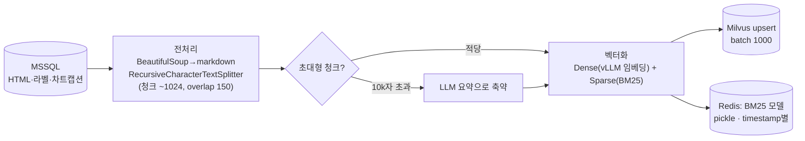

- **청킹**: 너무 크면 검색 정밀도↓, 너무 작으면 맥락↓ → ~1024자 + 150 overlap(경계 문맥 보존). 1만 자 넘는 덩어리는 LLM 으로 요약해 줄인다.
- **Dense 벡터**(의미)는 vLLM 임베딩(`BAAI/bge-m3`, 1024차원)으로, **Sparse 벡터**(단어 빈도, BM25)는 한국어 형태소(Kiwi, 금융 도메인 사전 `finance.dict`)로 명사·고유명사·숫자(종목명·티커·PER·재무비율 등)만 뽑아 만든다.
- 컬렉션은 소스·시점별(`{source}_{db}_{timestamp}`)로 나눠 **증분 인덱싱**이 서로를 안 건드리게 한다. 오래된 컬렉션은 unload/delete.

> Sparse 의 BM25 모델은 코퍼스 기준으로 학습되므로, **인덱싱 때 만든 모델을 검색 때도 똑같이 써야** 점수가 맞는다 → Redis 에 timestamp 별로 저장해 둔다.

---
## 4. 하이브리드 검색 — 의미 + 단어 둘 다

벡터(의미)만 쓰면 "정확한 용어/티커/숫자" 매칭을 놓치고, 단어(BM25)만 쓰면 "뜻은 같지만 다른 표현"을 놓친다. 그래서 **둘을 합친다(하이브리드)**.

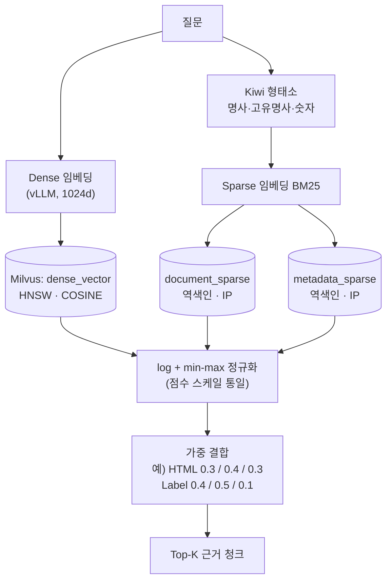

- 세 벡터를 각각 검색한 뒤 **점수를 정규화(log + min-max)** 해서 스케일을 맞추고, **소스별 가중치**로 합산해 재정렬한다(같은 문서가 여러 검색에 걸리면 점수 누적).
- 가중치는 데이터 성격에 맞춤 — 라벨(QA)은 단어 매칭이 중요해 doc_sparse 0.5, HTML 리서치 리포트는 의미·용어를 고루.

> ai-chatbot 은 vector-search-service 가 가중 결합까지 끝낸 결과를 돌려주고, **추가 LLM 리랭크는 backend** 가 `bge-reranker-v2-m3` 로 한 번 더 한다(§5). KMS 는 더 단순하게 Milvus + BM25(kiwi) 만 쓴다.

---
## 5. 다중 LLM — 한 모델로 다 하지 않는다

큰 RAG 챗봇은 **역할마다 다른 LLM** 을 붙인다. 비싸고 느린 고품질 모델로 모든 걸 하면 지연·비용이 폭발하기 때문이다.

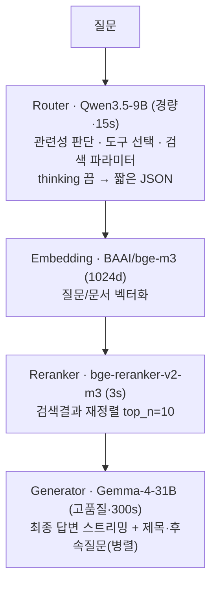

| LLM | 역할 | 특성(예시) |
|---|---|---|
| **Generator** | 최종 답변 생성·스트리밍, 제목/후속질문 | 고품질·느림(300s), `nvidia/Gemma-4-31B-IT-NVFP4` (vLLM, NVFP4 양자화) |
| **Router** | 도메인 관련성·도구 선택·파라미터 | 경량·빠름(15s), `Qwen/Qwen3.5-9B`, JSON 최적화·thinking off |
| **Embedding** | 인덱싱·검색 벡터화 | `BAAI/bge-m3`, 1024차원 (vLLM OpenAI 호환) |
| **Reranker** | 검색 결과 재정렬 | `BAAI/bge-reranker-v2-m3` |

> 모델명은 전부 **환경변수로 주입**되고 **자체 GPU 컨테이너로 직접 서빙**한다(§9). 위 값은 ai-chatbot compose 기준 개념 설명용 — 운영 모델/버전은 각 프로젝트 compose 를 확인. 제목·후속질문은 본답변과 `asyncio.create_task` 로 **병렬** 생성해 체감 지연을 줄인다.

---
## 6. 에이전트 워크플로우 (LangGraph)

ai-chatbot 의 핵심. 단순 "검색→생성"이 아니라, **LLM 이 어떤 도구를 쓸지 스스로 정하고**(에이전트), 실패하면 대체 경로로 빠진다(fallback). LangGraph 의 노드 그래프로 구현.

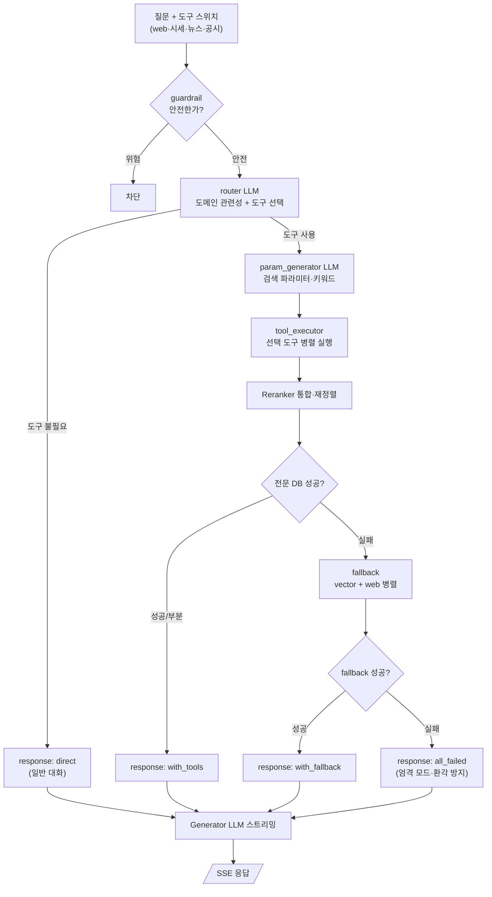

**tool_executor** 는 켜진 도구를 **병렬**로 실행한다:

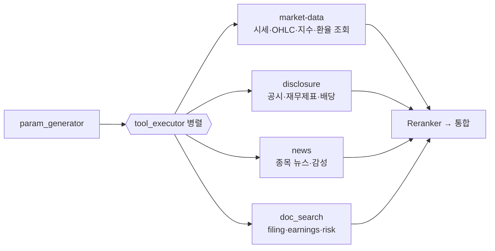

| 커스텀 LangChain 툴 | 무엇을 검색/연동 |
|---|---|
| **market-data** | 국내외 시세·OHLC·지수·환율 (티커/종목명) — 시세 벤더 API |
| **disclosure** | 공시·재무제표·배당·최대주주 (DART/EDGAR) |
| **news** | 종목·시장 뉴스·감성 분석 (뉴스 피드) |
| **Web(Tavily)** | 최신 매크로·시장 트렌드 웹 검색 (fallback 용) |

응답은 **SSE 스트리밍** — 진행 단계를 실시간으로 흘린다:

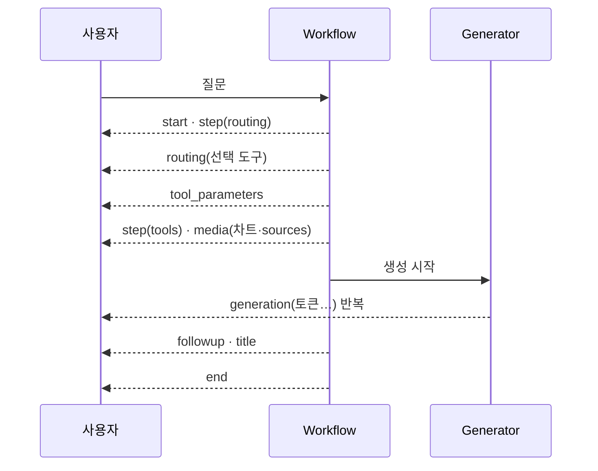

> **2단계 fallback** 이 신뢰도의 핵심 — 전문 DB(공시·시세)를 먼저 노리고, 다 실패하면 벡터+웹으로 빠지고, 그것도 없으면 **"모른다"를 강제(엄격 모드)** 해 환각을 막는다. 투자 리서치에선 근거 없는 수치를 지어내는 것보다 "근거 없음"을 명시하는 게 컴플라이언스상 옳다.

---
## 7. KMS docs-service RAG (단순화판)

우리 템플릿(knowledge-management) RAG 는 에이전트·외부툴 없이 **업로드 → 인덱싱 → 검색 → 생성** 직선이다. 대신 **회사·프로젝트 단위 격리**가 붙는다.

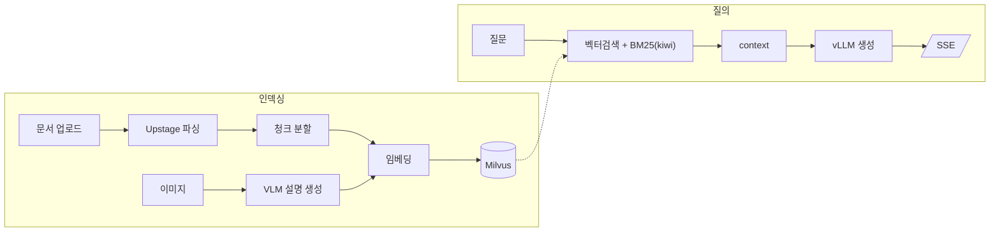

- 인덱싱(크롤→파싱→임베딩→적재)은 블로킹이라 전용 `ThreadPoolExecutor`(doc-sync)에 던진다. Upstage(Tier0 동시 2)는 모듈 싱글턴 `Semaphore(2)`, VLM 이미지 배치는 `Semaphore(3)` 로 폭주를 막는다. → [동시성 §4.2·§7.2·§10.4](../3-기법/동시성-출처인덱스.md).
- 컴포넌트 경계: **Milvus = repository**(`DocChunkMilvusRepository`, 데이터 store), **vLLM·Upstage = client**(compute/외부 API). 판별 규칙은 [FastAPI 백엔드 개발](../2-개발가이드/fastapi-백엔드개발.md) §6.
- 문서/채팅/세션 접근은 `PermissionService` 3-tier(회사·프로젝트·멤버십)로 격리 — [saas-멀티테넌트.md](saas-멀티테넌트.md) §12.

> 두 시스템 비교로 배우는 점: **에이전트·다중 LLM·하이브리드 마이크로서비스는 규모가 커질 때의 선택지**다. 작게 시작할 땐 KMS 처럼 단일 서비스 + 단순 검색으로 충분하고, 필요해지면 §3~§6 로 확장한다.

---
## 8. 관측·평가

RAG 는 "그럴듯하지만 틀린" 답이 나오기 쉬워 **추적과 평가**가 필수다 — 투자 리서치에선 틀린 수치 한 줄이 곧 컴플라이언스 사고다.

- **Langfuse** — 워크플로우 전체를 trace 로 추적(라우팅 결과·툴 시간·생성 토큰·실패 사유). 어디서 느리고 틀렸는지 본다.
- **정확도 테스트(accuracy)** — 도메인 객관식 정답셋(재무비율·공시 사실 확인 등)으로 LLM 단독 vs 워크플로우(툴 포함) 정답률을 누적 비교.
- **부하 테스트(stress)** — Locust 로 워크플로우/Generator/Router 의 동시 사용자·지연 한계 측정(멀티턴 시뮬레이션).

---
## 9. 배포 인프라 (ai-chatbot)

> ⚠️ 인프라는 빠르게 바뀐다. 아래는 ai-chatbot compose 기준 개념 설명이다 — 서버·모델·버전은 각 프로젝트 compose/배포를 확인. "이런 모양이다" 정도로 읽는다.

ai-chatbot 은 모델을 외부에 위임하지 않고 **GPU 서버 2대에 모델 서빙·검색 인프라를 직접 올린다** — 풀스택 템플릿의 "가벼운 외부 위임"과 인프라 철학이 다르다.

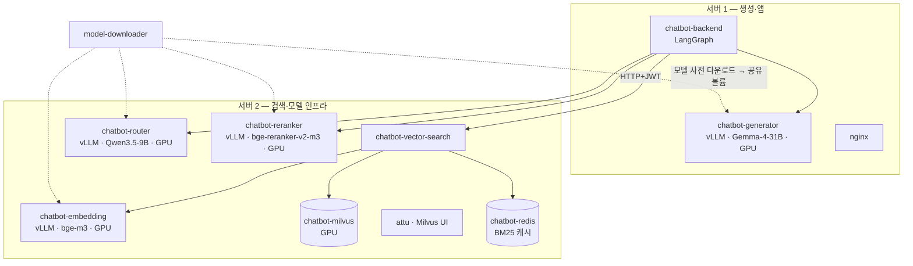

| 항목 | ai-chatbot (자체 호스팅·무거움) | 풀스택 템플릿 (외부 위임·가벼움) |
|---|---|---|
| 모델 서빙 | vLLM **GPU 컨테이너 4개**(생성·라우터·임베딩·리랭크) 직접 운영 | 외부 vLLM·Upstage 를 **client 로 호출만** |
| 배포 | **GPU 2서버 분산** (+ 서버별 nginx) | 단일 머신 process-compose(dev)/docker-compose(staging+) |
| 벡터 | Milvus(**GPU**) + **attu**(UI) + **Redis**(BM25 캐시) | Milvus 만 |
| 검색 | **별도 마이크로서비스**(vector-search) | docs-service 내부에서 Milvus 직접 |
| 원본 데이터 | **MSSQL**(rag-input), file-service 없음 | file-service(업로드/SFTP) 경유 |
| 관측 | **Langfuse + ELK + netdata** | 서비스 로거 |

> 트레이드오프: ai-chatbot 은 **통제·성능(자체 GPU 서빙)**, 템플릿은 **단순·저비용(외부 호출)**. 새 프로젝트는 템플릿에서 시작하고, 자체 모델 서빙·대규모가 필요해질 때 이 형태로 확장한다. (`1-개발환경/`·`5-인프라셋팅/` 의 서버·배포 runbook 도 작성 시점 기준이라 실제 구성과 다를 수 있음을 유의.)

---
## 부록 — 용어 / 스택

### 용어

- **임베딩(embedding)** — 텍스트를 의미가 담긴 숫자 벡터로. 비슷한 뜻이면 벡터도 가깝다.
- **Dense vs Sparse** — Dense=의미 기반(신경망 임베딩), Sparse=단어 빈도 기반(BM25). 하이브리드는 둘을 합침.
- **BM25** — 단어 빈도·희소성으로 문서 점수를 매기는 고전 검색 알고리즘.
- **청크(chunk)** — 검색 단위로 쪼갠 문서 조각. overlap=조각 경계 문맥 보존.
- **리랭커(reranker)** — 1차 검색 결과를 질문과의 관련성으로 다시 정렬하는 모델.
- **HNSW** — 벡터를 빠르게 근사 검색하는 그래프 인덱스(Milvus dense).
- **에이전트(agent)** — LLM 이 도구를 스스로 골라 쓰는 구조(LangGraph 노드 그래프).
- **fallback** — 주 경로 실패 시 대체 경로(여기선 벡터+웹).

**스택** — FastAPI · LangChain/LangGraph · Langfuse · vLLM/SGLang(OpenAI 호환) · Milvus · Redis(BM25 캐시) · Kiwi(형태소) · MSSQL · JWT. KMS 는 여기에 Upstage(파싱) + ThreadPoolExecutor doc-sync.

---

관련 문서: [FastAPI 백엔드 개발](../2-개발가이드/fastapi-백엔드개발.md) · [동시성/오프로드](../3-기법/동시성-출처인덱스.md) · [SaaS 테넌트 격리](saas-멀티테넌트.md) §12
