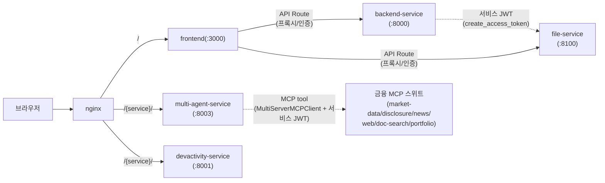
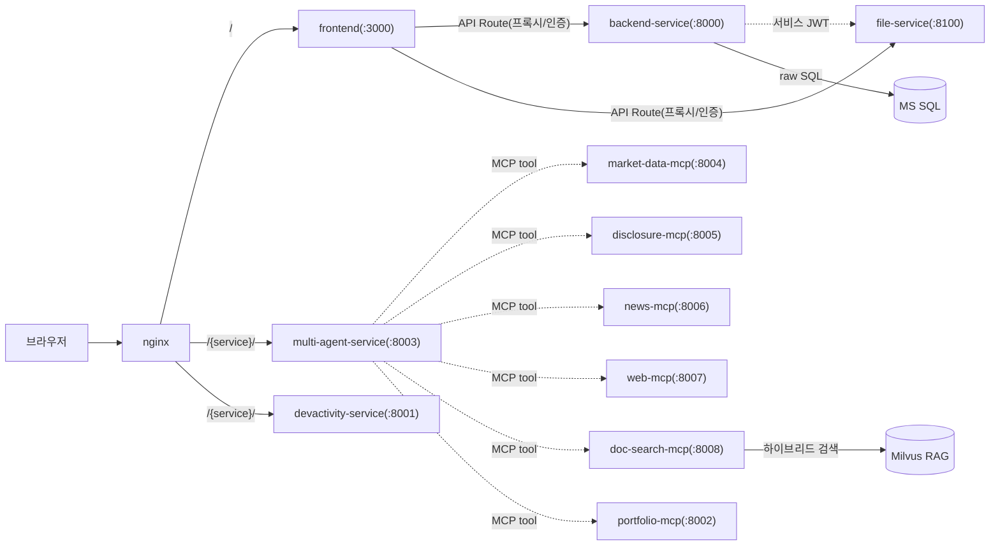
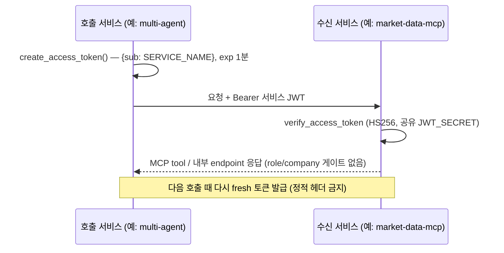

# 서비스 구성 — nginx 경량 MSA + 멀티 FastAPI

> AI 투자 리서치 플랫폼의 **경량 마이크로서비스 구성** — nginx 게이트웨이 뒤에 프론트(Next.js) + 비즈니스 백엔드 + 멀티 에이전트 + 금융 MCP 스위트를 두고, 서비스 간은 단기 서비스 JWT 로 호출한다. 완전한 MSA(Spring Cloud·k8s)를 왜 안 쓰는지의 결정 근거까지. (서비스 목록의 정본은 루트 [CLAUDE.md](../../CLAUDE.md))

---

## 0. 큰 그림

브라우저는 항상 **nginx 한 곳**으로만 들어온다. nginx 가 `/` 는 프론트로, `/{service}/` 는 해당 백엔드로 라우팅한다. 프론트(Next.js)는 인증·인가의 단일 관문이고, 백엔드 FastAPI 들은 독립 기능 단위로 쪼개져 서로를 **서비스 JWT** 로 호출한다. 금융 데이터·도구는 **MCP 서버 스위트**가 단독 소유하고, 에이전트가 `MultiServerMCPClient` 로 그 tool 을 오케스트레이션한다.

**핵심 용어 한 줄**:

- **MSA(마이크로서비스 아키텍처)** = 한 덩어리(모노리스) 대신 기능별 독립 서비스로 쪼갠 구성.
- **API Gateway** = 외부 요청을 받아 내부 서비스로 라우팅하는 단일 진입점 (여기선 nginx).
- **서비스 JWT** = 사용자가 아니라 _서비스끼리_ 신원을 증명하는 짧은 수명 토큰 (`{sub: SERVICE_NAME}`, exp 1분).
- **MCP(Model Context Protocol)** = LLM 에이전트가 외부 데이터·도구를 표준 tool 인터페이스로 호출하는 프로토콜. 금융 데이터는 MCP 서버가 단독 소유.
- **Service Discovery** = 서비스 주소를 동적으로 찾아주는 장치 (Eureka/Consul). 여기선 환경변수 URL 로 대체.
- **Service Mesh** = 디스커버리·로드밸런싱·트레이싱 등 MSA 운영 기능을 묶은 인프라 계층 (부록 참고).

---

## 1. 왜 경량인가 — 균형

Martin Fowler 는 "특별히 복잡한 시스템이 아니라면 마이크로서비스 도입을 고려하지 말 것" 을 강조한다. 시스템 복잡도가 낮으면 모노리틱이 생산성이 높고, 기술 스택이 다양해지는 복잡한 시스템에서만 MSA 가 이득이다.

이 플랫폼의 선택:

- **공통 기능(인증·인가)은 프론트(Next.js)에서** — 단일 관문.
- **독립 기능은 backend FastAPI 서비스로** 쪼갠다 (비즈니스 엔티티 / 멀티 에이전트 / 도메인별 MCP).
- 금융 데이터·도구는 **MCP 서버가 단독 소유**, 에이전트는 tool 로만 접근.
- 완전한 Service Mesh(Eureka/Config/Gateway/k8s) 대신 **nginx 하나 + 환경변수 URL** 로 최소 구성.

---

## 2. 서비스 토폴로지

AI 투자 리서치 플랫폼의 서비스 구성 (프론트 + 비즈니스 백엔드 + 에이전트 + 금융 MCP 스위트):

| 서비스 | 포트 | 역할 | 백그라운드 매니저 |
| --- | --- | --- | --- |
| `frontend` | 3000 | Next.js UI + 인증/인가 + API Route 프록시 | — |
| `backend-service` | 8000 | 비즈니스 API (관심종목·포트폴리오·보유종목·NAV 시계열) | 있음 (`--workers=1`) |
| `multi-agent-service` | 8003 | 투자 리서치 Plan-Execute 멀티 에이전트 (4 도메인 × 12 sub-agent) — 금융 MCP 스위트 소비 | 있음 (`--workers=1`) |
| `devactivity-service` | 8001 | 포트폴리오 활동 요약 스케줄러 + 활동 조회 챗(LangGraph). 자체 DB | 있음 (`--workers=1`) |
| `market-data-mcp-service` | 8004 | 시세·지수·환율 MCP (REST + `/mcp`) | — |
| `disclosure-mcp-service` | 8005 | DART/EDGAR 공시·재무 MCP | — |
| `news-mcp-service` | 8006 | 금융 뉴스·감성 MCP | — |
| `web-mcp-service` | 8007 | Tavily 웹검색 MCP | — |
| `doc-search-mcp-service` | 8008 | 사내 리서치 지식 Milvus 하이브리드 검색 MCP | — |
| `portfolio-mcp-service` | 8002 | 계좌/포트폴리오 데이터 전용 MCP (REST + `/mcp`) | — |
| `file-service` | 8100 | 파일 업로드/다운로드 + SFTP + 파일 메타 DB | — |
| `platform` | — | nginx (게이트웨이) · sftp 인프라 | — |

> **MCP 단방향 의존**: 에이전트(multi-agent / devactivity 챗 / single-agent)는 MCP 의 **소비자**다. MCP 서버는 DB·LLM 없는 데이터/도구 제공자이고, 서로를 호출하지 않는다 — 오케스트레이션은 항상 에이전트 쪽 `MultiServerMCPClient` 가 한다 (`enabled_mcps` 게이팅으로 요청별 tool 바인딩).

---

## 3. nginx = API Gateway

완전한 MSA Cloud(API Gateway + Discovery + Config + Bus + 로그/메트릭 중앙화 …)는 작은 프로젝트마다 갖추기엔 오버엔지니어링이다. **nginx 하나로** 라우팅 + 로드밸런싱(경량 API Gateway)을 처리한다 — 개념·`nginx.conf` 예시는 [../5-인프라셋팅/docker-compose.md](../5-인프라셋팅/docker-compose.md) "Nginx 최소 MSA".

- 라우팅: `/` → frontend, `/{service}/` → 해당 백엔드.
- 서비스 주소는 **환경변수 URL**(`{SERVICE}_SERVICE_URL`)로 주입 — Eureka 같은 동적 디스커버리 불필요(서비스 수가 고정·소수).

---

## 4. 서비스 간 인증 — 서비스 JWT

서비스 간 호출(예: `multi-agent → market-data-mcp`, `backend → file-service`)은 사용자 JWT 가 아니라 **서비스 토큰**으로 한다. 에이전트가 MCP tool 을 호출할 땐 `MultiServerMCPClient` 의 `ServiceJwtAuth` 가 매 요청에 서비스 토큰을 붙인다.

- `create_access_token()` → `{sub: SERVICE_NAME}`, **exp 1분**, HS256, **공유 `JWT_SECRET`**.
- 수신 서비스(MCP 서버 등)의 `verify_access_token` 이 검증 — 내부 전용 endpoint 는 토큰 유효성만 보고 role/company 게이트는 두지 않는다.
- 매 요청마다 fresh 토큰(짧은 exp) — 정적 헤더 금지. 실제 구현 예(MCP `auth_flow`)는 [fastmcp-서버개발.md](../2-개발가이드/fastmcp-서버개발.md) §6, 토큰 전략은 [인증토큰전략.md](인증토큰전략.md) §5.

> **왜 매번 새 토큰인가**: exp 가 1분이라 토큰을 정적 헤더로 박아두면 곧 만료돼 호출이 깨진다 — 호출 직전 `create_access_token()` 으로 새로 발급해야 한다. 짧은 수명은 토큰이 새어도 노출 창이 1분으로 닫힌다는 이점도 있다. **단일 소유 패턴**: 외부 자원은 한 서비스가 단독 소유하고 나머지는 그 서비스를 통해서만 접근한다 — 포트폴리오 데이터는 `portfolio-mcp-service`(REST/MCP), 시세·공시·뉴스·웹·리서치 지식은 각 도메인 MCP, 파일·SFTP 는 `file-service`(HTTP proxy). 타 서비스가 금융 데이터 소스나 SFTP 를 직접 부르지 않고 MCP tool / 클라이언트로만 접근한다.

---

## 5. 데이터·단일 소유

- 서비스마다 자기 DB: `backend-service` = `BACKEND_SQL_DB_*`(관심종목·포트폴리오·NAV), `multi-agent-service` = `MULTI_AGENT_SQL_DB_*`(공통 `ai_chat_history` read-only 멀티턴 주입), `devactivity-service` = `DEVACTIVITY_SQL_DB_*`(포트폴리오 활동), `file-service` = `FILE_SQL_DB_*`(파일 메타).
- **포트폴리오 데이터는 portfolio-mcp-service 전용** — 타 backend 는 직접 연결 금지, 에이전트=`MultiServerMCPClient` / 단발 위젯=`PortfolioMcpClient` 로만 접근.
- **파일 메타 DB 는 file-service 전용** — 타 backend 는 직접 연결 금지, `FileServiceClient`(HTTP proxy)로만 접근.
- **리서치 지식(RAG)은 doc-search-mcp 전용** — Milvus 하이브리드 검색 tool 로만 접근, 에이전트가 직접 Milvus 에 붙지 않는다.
- 공통 DB(시스템관리·인증)는 frontend Prisma 가 관리. 스키마 **push 방식**(마이그레이션 없음).

---

## 6. 기동 — process-compose (dev) / docker-compose (staging+)

- **dev**: `process-compose up` 으로 멀티 서비스를 한 머신에서 일괄 기동(각 backend `working_dir=<svc>/app`, file-service `:8100`). MCP 는 API 키 없이 MOCK 금융 데이터로 즉시 기동.
- **staging+**: docker-compose 로 컨테이너 격리(`compose.staging.yaml` + 환경별 prod compose).
- 매니저 있는 서비스(backend / multi-agent / devactivity)는 **단일 워커**, 매니저 없는 순수 REST·MCP 는 컨테이너 복제로 수평 확장 — [../3-기법/동시성-출처인덱스.md](../3-기법/동시성-출처인덱스.md) §1.

---

## 7. 완전한 MSA(Spring Cloud) 와의 차이

참고용 — 완전한 Service Mesh 가 필요해지면 채울 자리. 전부 "안 씀(오버엔지니어링)".

| 관심사 | 완전한 MSA (Spring Cloud) | 이 플랫폼 |
| --- | --- | --- |
| API Gateway | Spring Cloud Gateway | **nginx** |
| Service Discovery | Eureka / Consul | 환경변수 URL (고정 소수 서비스) |
| Config 중앙관리 | Config Server + Bus(RabbitMQ) | 서비스별 `.env` |
| 인증 | Gateway 토큰검증 + User Service 인가 | 프론트 인증 + 서비스 JWT |
| 도구/데이터 연동 | 서비스별 ad-hoc REST 클라이언트 | MCP 스위트 + `MultiServerMCPClient` |
| 로그/메트릭/트레이싱 | ELK · Atlas · Zipkin | 서비스 로거 (필요 시 도입) |
| 오케스트레이션 | k8s | process-compose / docker-compose |

> 완전한 MSA Cloud 가 k8s 관리까지 복잡한 이유가 바로 이 표의 모든 칸을 운영해야 하기 때문이다. 서비스 수가 적고 트래픽이 control-plane 수준이면 왼쪽은 비용만 크다.

---

## 부록 — Service Mesh 요건 (개념)

완전한 MSA 가 갖춰야 한다고 일반적으로 말하는 항목 — 도입 판단 체크리스트로만:

Configuration Management · Service Discovery · Load Balancing · API Gateway · Centralized Logging/Metrics · Distributed Tracing · Resilience & Fault Tolerance · Auto Scaling & Self Healing · Packaging/Deployment/Scheduling · Test Automation.

---

관련 문서: [인증토큰전략.md](인증토큰전략.md) · [fastmcp-서버개발.md](../2-개발가이드/fastmcp-서버개발.md) (금융 MCP 서버가 실제 예) · [saas-멀티테넌트.md](saas-멀티테넌트.md) · [../3-기법/동시성-출처인덱스.md](../3-기법/동시성-출처인덱스.md) §1 · [../5-인프라셋팅/docker-compose.md](../5-인프라셋팅/docker-compose.md)
