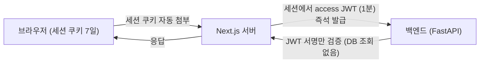
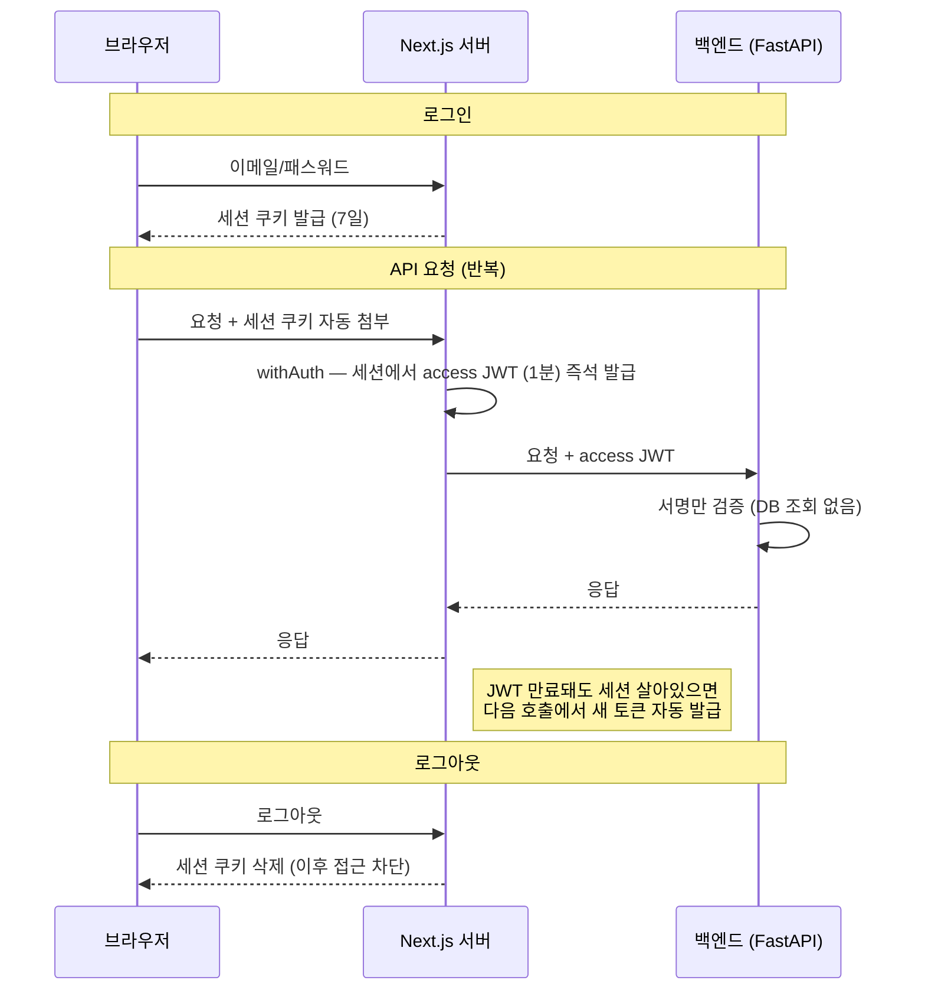

# 인증 토큰 전략 — 세션 쿠키 + 단기 JWT (Refresh Token 없음)

> Better Auth 기반 로그인이 **왜 갱신 토큰 없이** DB 조회 없는 단기 JWT 를 매 요청 즉석 발급하는 구조인지, 선택 근거·보안 속성·한계를 정리한다. 구현 디테일보다는 "왜 이 토큰 구조인가" 에 무게를 둔다. 토큰/세션 전략은 **전 서비스 공통** — frontend Better Auth 가 세션을 소유, 백엔드(여러 개)는 같은 `JWT_SECRET` 으로 단기 JWT 만 검증. 여기는 **토큰 수명·세션 쿠키·refresh 미사용** 한 축만 다룬다.



---
## 1. 한눈에 보기

- 브라우저는 백엔드에 **직접 요청하지 않는다.** Next.js 서버가 중간에서 세션 쿠키를 받아 백엔드 호출용 토큰을 만든다.
- 로그인 시 **세션 쿠키**(7일) 하나만 브라우저에 남는다. 백엔드 호출 때마다 거기서 **1분짜리 access token(JWT)** 을 즉석 발급한다.
- 백엔드는 DB 조회 없이 **JWT 서명만 검증**한다. 사용자가 늘어도 인증이 DB 부하가 되지 않는다.
- **Refresh Token 은 없다.** 세션 쿠키가 그 역할을 대신한다.

---
## 2. 왜 이 구조인가

### 2.1 DB 세션 대신 JWT

전통적 방식은 로그인 시 서버가 세션을 DB 에 저장하고 매 요청마다 DB 를 조회해 유효성을 확인한다 — 사용자가 많을수록 DB 에 부하가 집중된다. JWT 는 사용자 식별자·만료시간을 비밀키로 서명해 토큰 안에 직접 담으므로, 백엔드는 **DB 없이 서명 유효성만** 확인한다.

→ 정본: [security.py](../../backend-service/app/core/security.py). 검증 후 `set_auth_context(user_id, email, role, company_id)` 로 요청 신원을 ContextVar 에 박는다([security.py:30](../../backend-service/app/core/security.py#L30)) — 자세한 신원 흐름은 backend `CLAUDE.md` "신원·인증".

```python
# backend-service/app/core/security.py:30
async def verify_access_token(
    request: Request,
    token: str | None = Security(APIKeyHeader(name="Authorization", auto_error=False)),
) -> None:
    # 토큰 출처: Authorization 헤더(MCP tool 호출은 McpHeaderMiddleware 가 scope 주입) → query
    jwt_token = token or request.headers.get("Authorization") or request.query_params.get("token")
    payload = _decode_jwt_token(jwt_token)
    set_auth_context(
        user_id=payload["sub"],
        email=payload.get("email"),
        role=payload.get("role"),
        company_id=payload.get("company_id"),
    )
```

> JWT payload 에 **회사·권한이 같이 들어간다**(`{sub, email, role, company_id}`). 백엔드가 "이 요청자가 어느 회사·권한인지" 를 DB 재조회 없이 알아 회사 격리 쿼리가 즉시 가능 — 멀티테넌트의 전제. 발급은 frontend [auth.ts:205](../../frontend/lib/auth/auth.ts#L205) `definePayload`/`getSubject`.

### 2.2 갱신 토큰(Refresh Token) 미사용

갱신 토큰은 access token 만료 시 새 토큰을 받기 위한 수단으로, **브라우저가 백엔드에 직접 요청하는 구조**에서 주로 필요하다. 본 시스템은 브라우저가 백엔드에 직접 닿지 않고 Next.js 서버가 중간에서 처리한다 — 서버가 세션 쿠키에서 사용자 ID 를 꺼내 access token 을 즉시 만들 수 있으므로 **세션 쿠키가 갱신 토큰 역할을 대신**한다.

> 갱신 토큰 도입은 보안 이점 미미. 재사용 감지(RTR)는 ① 탈취 방지 아님. 재사용 시에만 사후 발견, ② 공격자가 먼저 쓰면 정상 사용자가 차단되고 공격자는 통과, ③ access token 만 탈취되면 감지 불가.

---
## 3. 세션 쿠키 보안

로그인 시 사용자 식별 정보를 비밀키로 서명·암호화해 세션 쿠키에 담아 브라우저에 저장한다. Better Auth 가 쿠키에 다음 속성을 자동 적용한다.

| 속성 | 효과 |
| --- | --- |
| **HttpOnly** | 페이지 스크립트가 쿠키에 접근 불가 — 악성 스크립트로 세션 탈취 차단 |
| **Secure** | HTTPS 연결에서만 전송 |
| **SameSite** | 외부 사이트발 요청에는 미전송 — CSRF 차단 |
| **서명 + 암호화** | 외부에서 읽거나 변조 불가. 세션 쿠키 캐시는 **JWE**(암호화) 전략 |

→ 정본: [auth.ts](../../frontend/lib/auth/auth.ts). 로그인·회원가입·비밀번호재설정에는 rate limit(`/sign-in/email` 60초 5회 등, [auth.ts:191](../../frontend/lib/auth/auth.ts#L191)), 비밀번호 재설정 시 `revokeSessionsOnPasswordReset` 로 기존 세션 일괄 무효화.

```typescript
// frontend/lib/auth/auth.ts:171
session: {
  modelName: "BaSession",
  expiresIn: 7 * 24 * 60 * 60, // 7일
  updateAge: 5 * 60, // 5분마다 갱신
  cookieCache: {
    enabled: true,
    maxAge: 5 * 60, // 5분
    strategy: "jwe",
  },
  additionalFields: {
    authorId: { type: "string", required: false },
    companyId: { type: "number", required: false },
  },
},
```

[auth.ts](../../frontend/lib/auth/auth.ts)

---
## 4. 인증 흐름

### 4.1 로그인

1. 이메일/패스워드 검증 → 세션 생성 훅이 **승인·활성·회사 활성** 게이트를 통과시키고 대표 권한·회사를 세션에 denormalize ([auth.ts:123](../../frontend/lib/auth/auth.ts#L123) — 상세는 [saas-멀티테넌트.md](saas-멀티테넌트.md) §3)
2. 사용자 정보를 서명·암호화해 세션 쿠키 발급 — 브라우저 저장, 로그아웃 안 해도 **7일 유지**
3. 이후 모든 요청에 브라우저가 세션 쿠키 자동 첨부

### 4.2 API 요청

1. 브라우저 → Next.js 서버 (세션 쿠키 자동 첨부)
2. `withAuth` 가 세션 검증 후 `session.accessToken` 을 백엔드 호출에 실음 ([withAuth.ts](../../frontend/lib/auth/withAuth.ts))
3. access token 은 세션에서 **즉석 발급된 1분짜리 JWT** (HS256 커스텀 서명, JWKS/DB 우회)
4. 백엔드가 서명 검증 후 응답

→ 정본: [auth-client.ts](../../frontend/lib/auth/auth-client.ts). 커스텀 sign: JWKS DB 접근 우회, HS256 직접 서명.

```typescript
// frontend/lib/auth/auth.ts:213
jwt({
  jwt: {
    definePayload: ({ user, session }) => ({
      role: (session as any).authorId ?? null,
      company_id: (session as any).companyId ?? null,
      email: user.email,
    }),
    getSubject: ({ user }) => user.id,
    expirationTime: JWT_EXPIRES_IN,
    sign: (payload) => {
      const { sub, role, company_id, email } = payload as Record<string, any>;
      return jsonwebtoken.sign({ sub, role, company_id, email }, JWT_SECRET, {
        algorithm: "HS256",
        expiresIn: JWT_EXPIRES_IN,
      });
    },
  },
  jwks: { remoteUrl: "none" /* 커스텀 sign 사용 시 필수 */ },
}),
```

[auth.ts](../../frontend/lib/auth/auth.ts)

> access token 이 1분으로 짧은 이유: 탈취돼도 창이 좁고, 세션 쿠키만 살아 있으면 다음 호출에서 새 토큰이 자동 발급되므로 만료가 사용자에게 보이지 않는다. 갱신은 세션 쿠키가 책임진다(§2.2).

### 4.3 로그아웃

로그아웃 요청 → 세션 쿠키 삭제 → 이후 모든 API 접근 차단.



---
## 5. 두 비밀키

| 키 | 쓰임 | 공유 범위 |
| --- | --- | --- |
| `BETTER_AUTH_SECRET` | 세션 쿠키 서명·암호화 (Better Auth 내부) | frontend 전용 |
| `JWT_SECRET` | access token HS256 서명/검증 | **frontend·전 백엔드 동일값 필수** |

> `JWT_SECRET` 이 frontend 와 백엔드(서비스가 여럿이면 전부)에서 **byte-identical** 이어야 access token 검증이 통과한다. 불일치 시 401. 서비스 간 내부 호출 토큰(`create_access_token`)도 같은 `JWT_SECRET` 으로 서명한다 — [fastmcp-서버개발.md](../2-개발가이드/fastmcp-서버개발.md) §6. 유출 시 즉시 교체해야 하며, `BETTER_AUTH_SECRET` 교체 시 **기존 발급 세션 전부 무효화**된다.

---
## 6. 한계

세션 쿠키 방식은 탈취 경로가 좁다(HttpOnly·Secure 로 스크립트·네트워크 둘 다 막힘). 다만 **한 번 탈취되면 서버에서 강제 만료시킬 수 없다** — DB 조회 없는 순수 JWT 구조의 본질적 한계다. 특정 사용자 핀포인트 무효화 대신, 권한·회사 변경 등 보안 이벤트에는 **세션 레코드 삭제**(다음 요청에서 인증이 깨져 재로그인 유도)로 대응한다 — 트리거 목록은 [saas-멀티테넌트.md](saas-멀티테넌트.md) §7. 전체 일괄 무효화는 `BETTER_AUTH_SECRET` 교체.

---
## 7. 대안 비교

| 항목 | Refresh Token 방식 | 현재 (세션쿠키 + 단기 JWT) | DB 세션 방식 |
| --- | --- | --- | --- |
| 세션 저장 | JWT (RT 만 DB) | 세션 레코드 + 쿠키 (access JWT 는 무상태) | DB (쿠키엔 세션 ID) |
| 탈취 경로 | 네트워크 · 악성 스크립트 · DB 유출 | 악성 스크립트(차단) · 네트워크(HTTPS) | 네트워크 · 악성 스크립트 · DB 유출 |
| 서버 즉시 무효화 | 다음 갱신 시점부터 | 세션 삭제로 (access JWT 1분 잔존) | 가능 |
| 강제 로그아웃 범위 | 특정 사용자 | 특정 사용자(세션 삭제) / 전체(`SECRET` 교체) | 특정 사용자 |
| 매 요청 DB 조회 | 없음 | 없음 (백엔드) | 있음 |
| access 수명 | 짧음 | **1분** | — |
| 세션 수명 | 7일 | 7일 | 7일 |
| 도입 난이도 | RT 저장 테이블 추가 | — | User/세션 테이블 구조 변경 |

---
## 부록 — 용어

- **access token** — 백엔드 호출용 단기 JWT(1분, HS256). 세션에서 즉석 발급, 무상태.
- **세션 쿠키** — 브라우저에 남는 장수명(7일) 자격증명. 서명·암호화. 갱신 토큰 역할 겸함.
- **definePayload / getSubject** — Better Auth jwt 플러그인이 세션→JWT payload 를 만드는 지점([auth.ts:205](../../frontend/lib/auth/auth.ts#L205)).
- **커스텀 sign** — 기본 JWKS(비대칭 ES256 + DB) 대신 HS256 대칭키로 직접 서명 — 백엔드가 같은 `JWT_SECRET` 으로 검증하게 하려는 선택.

---
관련 문서: [saas-멀티테넌트.md](saas-멀티테넌트.md) · [fastmcp-서버개발.md](../2-개발가이드/fastmcp-서버개발.md) §6
