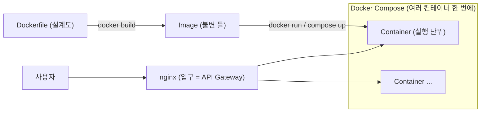
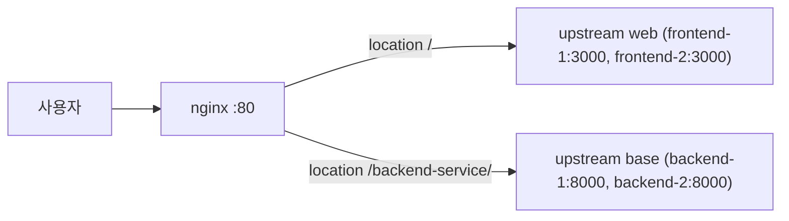
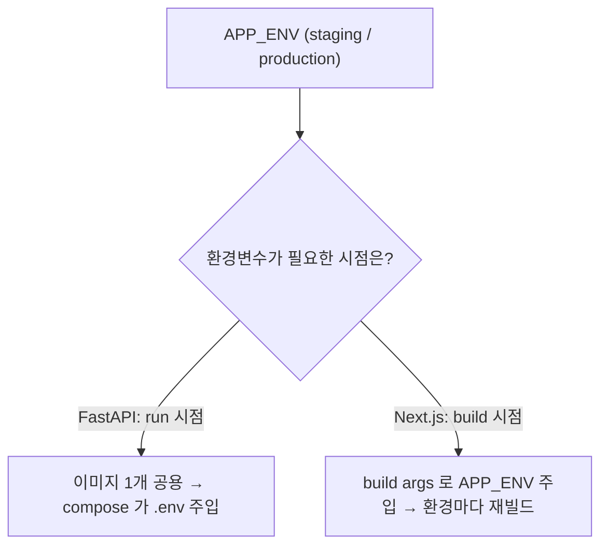

# 마이크로서비스 아키텍처를 위한 Docker & Docker Compose — MSA 개요, Nginx 경량 구성, Dockerfile, Docker Compose, 환경별 분리 전략

> Docker와 Docker Compose로 경량 MSA(여러 서비스를 따로 띄워 묶는 구조)를 어떻게 구성하는지 개념 중심으로 다룬다. 전 서비스 공통 개념 가이드이며, 코드/IP/모델명은 설명용 예시값이다.

---

## 0. 큰 그림

한 줄로: **Dockerfile(설계도)로 이미지(붕어빵 틀)를 굽고, 이미지로 컨테이너(붕어빵)를 띄우고, 여러 컨테이너를 Docker Compose 한 파일로 한꺼번에 굴리고, nginx 한 대로 그 앞에 세워 입구를 하나로 만든다.**

MSA(Micro Service Architecture, 마이크로서비스 아키텍처) = 큰 앱 하나가 아니라 작은 서비스 여럿을 따로 만들어 네트워크로 묶는 방식이다. Docker 는 그 "작은 서비스 하나"를 통째로 포장(컨테이너)하는 도구이고, Compose 는 그 컨테이너들을 한 번에 띄우는 도구다.



> Docker 를 처음 배울 때 가장 헷갈리는 건 "이미지 vs 컨테이너". 설계도(Dockerfile) → 틀(이미지) → 결과물(컨테이너) 비유를 먼저 잡아두면 뒤의 명령어가 전부 이 흐름의 어느 단계인지로 정리된다.

---

## 1. 개요 — MSA·Docker란

### 1.1 Micro Service Architecture란?

**무엇**: 하나의 거대한 애플리케이션(모노리틱) 대신, 기능별로 쪼갠 작은 서비스들을 독립 배포·운영하는 구조.

| 구분 | 모노리틱 아키텍처 | 마이크로서비스 아키텍처 |
|---|---|---|
| 배포 | 전체 애플리케이션을 하나의 단위로 배포 | 각 서비스를 독립적으로 배포 |
| 장애 격리 | 하나의 오류가 전체 시스템에 영향 | 장애가 해당 서비스에만 국한 |
| 기술 스택 | 단일 버전 기술 스택 사용 | 서비스별 다양한 버전 선택 가능 |
| 데이터 관리 | 단일 데이터베이스 사용 | 각 서비스가 독립적 데이터 관리 |
| 통신 | 내부 함수 호출 | API를 통한 네트워크 통신 |

### 1.2 MSA 적용 시 고려사항 (왜 항상 좋은 게 아닌가)

> Martin Fowler는 특별히 복잡한 시스템이 아니라면 마이크로서비스 도입을 고려하지 말 것을 강조한다. 시스템 복잡도가 높지 않을 때는 모노리틱이 생산성이 높고, 다양한 기술 스택이 필요한 복잡한 시스템에서는 마이크로서비스가 오히려 생산성이 높다.

복잡도를 줄이기 위해 **균형**이 중요하다.

- 공통 기능은 Frontend에서 구현 (인증, 인가 등)
- 독립 기능은 Backend에서 Micro Service로 구현

### 1.3 완전한 MSA Cloud 는 왜 무거운가 (Service Mesh)

**Service Mesh** = 서비스가 많아질 때 그 사이의 통신·관측·복구를 자동으로 관리해 주는 인프라 계층.

기본 인프라(API Gateway, Discovery, Config, RabbitMQ)뿐만 아니라 로그·메트릭 중앙집중화, 서비스 간 호출 추적, 자동 스케일링 등을 함께 관리해야 한다. 이것이 쿠버네티스(k8s) 관리가 어려운 주된 이유다.

### 1.4 Nginx를 이용한 최소한의 MSA 구성

**동기**: 위처럼 완전한 MSA Cloud를 적용하는 데는 많은 기술 스택이 필요하며, 작은 단위 프로젝트마다 이러한 인프라를 갖추는 것은 오버엔지니어링이다. **Nginx 하나만으로도** 간단한 수준의 API Gateway(요청을 받아 알맞은 서비스로 넘겨주는 입구)와 Load Balancing(부하를 여러 서버로 나눠주기)을 구현할 수 있다.

흐름부터 보면, nginx 가 입구에서 경로를 보고 프론트/백엔드로 나눠 보낸다:



이 흐름을 그대로 설정으로 옮긴 것이 아래 `nginx.conf` 다. `upstream` 이 "이 그룹으로 분산"을, `location` 이 "이 경로는 이 그룹으로"를 정의한다:

```nginx
# nginx.conf
worker_processes auto;

events {
    worker_connections 1024;
}

http {
    # ─── 1. 로드밸런싱 대상 정의 ───
    upstream web {
        server frontend-1:3000;
        server frontend-2:3000;
    }
    upstream base {
        server backend-1:8000;
        server backend-2:8000;
    }

    # ─── 2. API Gateway ───
    server {
        listen 80;
        server_name _;

        location / {                       # 프론트엔드(Next.js)
            proxy_pass http://web;
            proxy_set_header Host $host;
        }
        location /backend-service/ {       # 백엔드 API
            proxy_pass http://base;
            proxy_set_header Host $host;
        }
    }
}
```

구성: **UI·인증/인가 (Next.js & React) → Reverse Proxy (Nginx) → RestAPI (FastAPI, Flask, Spring Boot)**

### 1.5 MSA와 Docker의 관계 (왜 Docker 인가)

Docker는 마이크로서비스 구현을 위한 이상적인 도구다 — MSA 의 원칙과 Docker 컨테이너의 성질이 1:1 로 맞아떨어지기 때문이다.

| 원칙 | 마이크로서비스 | Docker 컨테이너 |
|---|---|---|
| 단일 책임 | 하나의 서비스 = 하나의 비즈니스 기능 | 하나의 컨테이너 = 하나의 서비스 |
| 독립성 | 독립적으로 개발/배포 | 격리된 컨테이너 환경 |
| 통신 | 서비스 간 API 통신 | 컨테이너 간 네트워크 통신 |
| 확장성 | 서비스별 독립적 스케일링 | 컨테이너별 독립적 스케일링 |
| 배포 | 개별 서비스 배포 | 개별 컨테이너 배포 |

### 1.6 Docker란?

**무엇**: 컨테이너 기반의 오픈소스 가상화 플랫폼으로, 애플리케이션을 컨테이너로 추상화하여 배포·관리를 단순화한다. 어떤 플랫폼에서든 동일하게 실행 가능하다 (로컬, AWS, Azure, Google Cloud 등). 한 줄 비유: "내 컴퓨터에선 되는데"를 없애는 도구 — 앱과 그 환경을 통째로 포장한다.

VMware 같은 전통 가상화와의 차이가 핵심이다. Docker 는 OS 를 통째로 띄우지 않고 호스트 OS 커널을 공유하므로 가볍고 빠르다:

| 구분 | VMware | Docker |
|---|---|---|
| 가상화 방식 | 하드웨어 가상화 | OS 수준 가상화 |
| 게스트 OS | 필요 | 불필요 |
| 시작 시간 | 느림 | 빠름 (1–2초) |
| 리소스 사용량 | 높음 | 낮음 |

---

## 2. 구성 — 이미지·네트워크·볼륨·컨테이너

### 2.1 Docker 생태계 및 도구 구성 요소

각각이 0절 큰 그림의 어느 단계를 담당하는지로 읽으면 된다:

- **레지스트리 (Registry)** — 이미지를 저장·배포하는 저장소. `docker push/pull`로 업로드·다운로드. Docker Hub(공개)가 Base Image 제공, Private Registry(비공개)에 Build된 Image 업로드
- **Dockerfile** — 이미지를 빌드하기 위한 명령어 스크립트(=설계도). `FROM`, `RUN`, `COPY`, `CMD` 등으로 구성
- **Docker Engine (런타임)** — 핵심 실행 엔진. Docker 데몬(dockerd, 백그라운드에서 도는 본체)과 Docker CLI로 구성. 컨테이너 생성·실행·관리 담당
- **Docker Compose** — 멀티 컨테이너 애플리케이션을 정의·실행하는 도구. YAML로 여러 서비스를 한 번에 관리. 단일 호스트 상의 경량 오케스트레이터(여러 컨테이너를 묶어 기동·관리하는 지휘자)

### 2.2 Docker 기본 구성 요소

- **이미지 (Image)** — 컨테이너 실행에 필요한 모든 파일과 공통 설정값 포함. 불변(Immutable, 한 번 만들면 안 바뀜). Base Image에 Dockerfile 기반으로 새로운 Image를 Build하여 사용
- **컨테이너 (Container)** — 이미지에 설정(네트워크, 볼륨, 환경변수 등)을 추가하여 실행한 상태. 설정을 바꿀 때마다 재생성되며 추가 작업 파일은 사라짐 (휘발성)
- **네트워크 (Network)** — 컨테이너는 기본적으로 호스트와 단절되어 있어, 통신하려면 같은 네트워크로 묶어야 함
- **볼륨 (Volume)** — 휘발성을 가지는 컨테이너에서 유지해야 하는 파일에 영속성 부여

### 2.3 Image — Build, Dockerfile

**무엇**: Dockerfile 은 위에서 아래로 한 줄씩 읽으며 이미지를 쌓는 설계도다. 아래는 Python 서비스용 예시다 — 베이스 이미지 선택 → 패키지 설치 → 의존성 설치 → 코드 복사 순서로 흐른다:

```dockerfile
# Base Image 지정
FROM python:3.10.15

# 필요한 소프트웨어 설치
RUN apt-get update && apt-get install -y \
    procps htop supervisor \
    && apt-get clean \
    && rm -rf /var/lib/apt/lists/*

# 작업 시작 위치
ENV APP_HOME=/usr/app
WORKDIR $APP_HOME

# Python 의존성 설치
ENV PATH="/root/.local/bin:${PATH}"
ENV POETRY_VIRTUALENVS_CREATE=false
RUN curl -sSL https://install.python-poetry.org | python3 -
COPY pyproject.toml poetry.lock .
RUN poetry install --no-root --without dev

# 애플리케이션 코드 및 설정파일 복사
COPY ./app .
COPY supervisord.conf /etc/supervisor/conf.d/supervisord.conf
```

> 예시 Dockerfile 은 poetry 를 쓰지만, 현재 풀스택 템플릿은 **uv** 로 의존성을 관리한다 — [../1-개발환경/uv-파이썬환경.md](../1-개발환경/uv-파이썬환경.md).

### 주요 명령어

| 명령어 | 역할 |
| --- | --- |
| `FROM` | 베이스 이미지 지정 |
| `WORKDIR` | 작업 디렉토리 설정 |
| `COPY` | 파일 복사 |
| `RUN` | 명령어 실행 |
| `ARG` | 빌드 인수 (빌드 시에만 사용) |
| `ENV` | 환경변수 설정 |
| `ENTRYPOINT` | 고정 실행 명령어 |
| `CMD` | 기본 실행 명령어 |

**레이어(Layer) 개념** — 레이어 = Dockerfile 한 줄이 만드는 "이미지 한 겹". 이 겹들이 캐시되기 때문에 빌드가 빨라진다.

- 각 명령어마다 하나의 레이어가 생기고, 레이어들이 스택 형태로 쌓여 최종 이미지를 구성한다.
- 이미지 재빌드 시 변하지 않은 레이어까지는 캐시된 레이어를 재사용 → 빠른 빌드, 디스크 절약.
- 자주 변하지 않는 레이어를 위에, 자주 변하는 레이어를 아래에 배치한다.
- 버전(Tag)을 명시해 사용하는 것이 좋다. `latest`는 계속 바뀌므로 안정 버전 중 라이선스 문제 없는 버전을 사용한다.

> 위 예시에서 의존성 파일(`pyproject.toml`)을 코드(`COPY ./app`)보다 먼저 복사·설치하는 이유다. 코드만 바뀌어도 의존성 레이어가 캐시되어 재설치를 건너뛴다. 순서를 뒤집으면 코드 한 줄 고칠 때마다 의존성을 통째로 다시 깐다.

### 2.4 최종 이미지

DockerHub의 Base Image만으로 컨테이너를 띄울 수도 있지만, 대부분 추가 설정 파일이 필요하므로 이를 포함한 새 이미지를 만든다. 클라우드 배포 시 이 최종 이미지를 올리는 방법은 셋 중 하나다:

1. 클라우드에서 직접 build
2. 최종 이미지를 save & copy & load
3. 최종 이미지를 private 공간에 push & pull (DockerHub, ACR 등 유료 Registry)

### 2.5 Network

- 컨테이너끼리 통신하려면 같은 네트워크로 묶어야 한다.
- 같은 네트워크에 연결된 컨테이너는 IP 주소 대신 **서비스 이름**으로 통신할 수 있다.
- 예) 서비스명 `chatbot-milvus`, 포트 19530, 네트워크 `chatbot-ai`일 때, 같은 네트워크의 다른 서비스는 `chatbot-milvus:19530` 경로로 접근 가능.

> 컨테이너 IP 는 재시작 때마다 바뀔 수 있다. 서비스 이름으로 부르면 Docker 내부 DNS 가 알아서 현재 IP 로 연결해 주므로 설정을 고치지 않아도 된다.

### 2.6 Volume

**무엇**: 컨테이너는 지우면 안의 파일이 사라진다(휘발성). 볼륨 = 그 파일을 컨테이너 바깥(호스트나 Docker 관리 영역)에 저장해 살려두는 장치. 두 종류가 있다:

| 종류 | 설명 |
| --- | --- |
| **Bind Mounts** | 호스트 파일을 컨테이너와 마운트. 사용자가 직접 관리하는 파일(개발 단계 프로젝트 소스 등), 권한에 민감하지 않은 파일 |
| **Volume (Named Volumes)** | Docker가 관리하는 볼륨. 컨테이너 삭제 후에도 유지되어야 하는 파일, 권한에 민감한 파일(mysql, Jenkins, gitlab 등) |

> 폴더를 볼륨으로 잡을 때 유의할 점 두 가지다.
>
> 1. 호스트 쪽에 미리 폴더를 만들어 두자. 폴더가 없으면 컨테이너 생성 시 디렉토리가 아닌 **파일**로 생성된다.
> 2. 폴더끼리 마운트하면 호스트 폴더가 컨테이너 폴더를 **덮어쓴다**. 호스트 폴더가 비어 있으면 컨테이너 안에 있던 파일이 모두 사라진다.

### 2.7 Container

**무엇**: 이미지에 런타임 설정을 추가하여 만든 실행 단위.

- 동일 이미지로 여러 컨테이너를 생성할 수 있고 각각 독립 실행된다.
- 이미지나 런타임 설정을 바꿀 때마다 재생성되며, 내부 변경 파일은 사라진다 (휘발성). 데이터 영속성이 필요하면 볼륨으로 호스트에 저장한다.
- 라이프사이클: **Created → Running → Stopped → Removed**


---

## 3. 활용 — 명령어·Compose

### 3.1 Docker 명령어

아래 명령들은 0절 큰 그림의 두 축(이미지 / 컨테이너)에 각각 대응한다. 외우기보다 "어느 단계를 다루는 명령인지"로 묶어서 기억한다:

```bash
# 이미지
docker images                  # 목록 확인
docker inspect <이미지명>       # 상세정보 확인
docker pull <이미지명>          # 다운로드
docker push <이미지명>          # 업로드 (레지스트리에)
docker rmi <이미지명>           # 삭제
docker build -t <이미지명> .    # Dockerfile로 빌드

# 컨테이너
docker ps                      # 실행 중인 목록
docker logs <컨테이너명>        # 로그 확인
docker inspect <컨테이너명>     # 상세정보 확인
docker stop / start / rm <컨테이너명>
docker run -d -p 8080:80 --name web nginx   # 생성 및 실행
docker exec -it <컨테이너명> /bin/sh         # 실행 중 컨테이너 접속

# 주요 옵션
-d                  # 백그라운드 실행
-p <호스트>:<컨테이너>  # 포트 매핑
--name <이름>        # 컨테이너 이름 지정
-v <호스트>:<컨테이너>  # 볼륨 마운트
-e <변수>=<값>        # 환경변수 설정

# 정리(prune)
docker container prune
docker image prune            # dangling 이미지만
docker image prune -a         # 사용하지 않는 모든 이미지
docker volume prune
docker network prune
docker system prune           # 기본 정리
docker system prune -a        # 모든 리소스
docker system prune --volumes # 볼륨까지 포함
```

**직접 명령어 실행의 문제점** — 오타·옵션 누락 위험, 복잡한 옵션 기억의 어려움, 재현성 부족, 협업 시 공유 어려움.

**해결 방안** — 명령어의 개념·용도만 숙지하고 직접 실행은 최소화한다. 실행은 VSCode Containers 확장을 활용하고, 모든 설정은 Docker Compose 파일에 코드로 관리한다.

> 위 옵션들을 매번 손으로 치면 사람마다 다른 명령을 쓰게 되어 재현이 안 된다. 다음 절의 Compose 는 이 모든 옵션을 파일 하나에 박아 "버전 관리되는 실행 정의"로 만든다.

### 3.2 Docker Compose

**무엇**: 위 `docker run` 옵션들을 YAML 파일 하나에 적어두고, `compose up` 한 번으로 yml 내 서비스들을 동시에 띄우는 도구. 명령어로 실행하는 것보다 훨씬 직관적이고 재현 가능하다.

아래는 한 서비스에 들어가는 거의 모든 키를 모은 예시다. 각 키가 3.1 의 어떤 옵션/개념에 대응하는지 주석으로 표시했다:

```yaml
services:                              # 서비스 정의
  chatbot-backend:                     # 서비스명 (고유 식별자)
    container_name: chatbot-backend    # 실제 컨테이너명
    build:                             # 이미지 빌드 설정
      context: ./backend               # Dockerfile 경로
      args:                            # 빌드 시 전달 인수
        OPENAI_GENERATOR_MODEL_NAME: google/gemma-3-27b-it
    image: chatbot-backend:latest      # 사용할 이미지명
    networks:
      - chatbot-ai
    ports:
      - "8000:8000"
    environment:                       # 환경 변수
      SERVICE_LOGGING_LEVEL: INFO
      TZ: Asia/Seoul
    volumes:                           # 볼륨 마운트
      - ./backend/data:/app/data       # Bind Mounts
      - chatbot_models:/app/models     # Docker Volume
    deploy:                            # 리소스 할당 (GPU, CPU 등)
      resources:
        reservations:
          devices:
            - driver: nvidia
              capabilities: [gpu]
    healthcheck:                       # 헬스체크
        test: ["CMD", "curl", "-f", "http://localhost:8000/health"]
        interval: 30s
        timeout: 10s
        retries: 3
        start_period: 40s
    depends_on:                        # 서비스 의존성 (순차 실행)
      chatbot-embedding:
        condition: service_healthy
    entrypoint: ["python"]             # 실행 명령어
    command: ["main.py", "--debug"]    # 실행 인자
    restart: always                    # 재시작 정책
networks:                              # 네트워크 정의
  chatbot-ai:
    name: chatbot-ai
volumes:                               # 볼륨 정의
  chatbot-redis:
    name: chatbot-redis
```

> `depends_on` + `condition: service_healthy` 는 단순히 "먼저 시작"이 아니라 "의존 대상이 healthcheck 를 통과(정상)할 때까지 기다렸다 시작"이다. 임베딩 서버가 뜨기도 전에 백엔드가 붙어 깨지는 사고를 막는다.

**환경별 분리 전략** — 같은 코드라도 dev/staging/production 마다 환경변수가 달라야 한다. FastAPI 와 Next.js 는 환경변수가 필요한 시점이 달라 분리 방식도 다르다:

- **FastAPI** — run(실행) 단계에서 환경변수가 필요하므로 staging(테스트)/production(운영)별로 다른 compose 파일을 만들고, `APP_ENV` 환경변수에 따라 다른 `.env` 파일을 가져오도록 구성한다.
- **Next.js (React)** — build(빌드) 단계에서 환경변수가 필요하므로, Dockerfile에 `APP_ENV` 인수를 주입하고 그에 따라 다른 명령어가 실행되도록 docker-compose의 command를 다르게 설정한다.



> FastAPI 는 실행할 때 환경변수를 읽으므로 빌드된 이미지 하나를 여러 환경에 쓸 수 있다. Next.js 는 빌드 시점에 환경변수가 코드에 박히므로 환경마다 다시 빌드해야 한다 — 그래서 build `args` 로 주입한다.

---

## 4. 적용 예시

실제로는 이 문서의 모든 조각(이미지·네트워크·볼륨·Compose·nginx)이 합쳐져 아래처럼 여러 컨테이너 묶음이 된다. 각 구성 요소는 Dockerfile + docker-compose 조합으로 구성하며, 구체적인 설정은 원본 PPT의 화면 캡처를 참고할 것.

| 분류 | 구성 요소 |
| --- | --- |
| **DB** | Milvus, Redis (Vector DB) |
| **Model Serving** | SGLang (Generator), vLLM (Embedding) |
| **Service** | Backend (FastAPI), Frontend (Next.js & React), Nginx |
| **Monitoring** | Langfuse, ELK Stack, Netdata |

---

## 5. 흔한 실수

신입이 Docker 를 처음 쓸 때 자주 빠지는 함정들이다 (대부분 위 본문의 콜아웃과 연결된다):

- **이미지와 컨테이너를 혼동** — 이미지는 불변 틀, 컨테이너는 실행 인스턴스. 코드를 고쳤는데 반영이 안 되면 이미지를 다시 `build` 했는지 확인한다.
- **컨테이너 안에 데이터를 쌓고 `rm`** — 컨테이너는 휘발성이라 지우면 안의 파일이 사라진다. 살려야 할 데이터는 반드시 볼륨(2.6)으로 호스트에 둔다.
- **Dockerfile 레이어 순서 무시** — 코드를 의존성보다 먼저 복사하면 캐시가 깨져 매 빌드마다 의존성을 다시 깐다(2.3 콜아웃).
- **컨테이너끼리 `localhost` 로 통신 시도** — 각 컨테이너의 `localhost` 는 자기 자신이다. 같은 네트워크로 묶고 **서비스 이름**으로 부른다(2.5).
- **볼륨 폴더를 호스트에 안 만들고 마운트** — Tip 1 대로 폴더가 파일로 잘못 생성된다. 빈 호스트 폴더로 덮어 컨테이너 쪽을 비워버리는 Tip 2 사고도 주의.
- **`latest` 태그 의존** — 언제 바뀔지 모른다. 안정 버전 태그를 명시한다(2.3).
- **Next.js 를 새 환경에서 재빌드 안 함** — 빌드 시점에 환경변수가 박히므로, 환경이 바뀌면 다시 빌드해야 반영된다(3.2 콜아웃).

---

## 6. 요약·체크리스트

큰 그림 한 번 더: **Dockerfile → 이미지 → 컨테이너**, 여러 컨테이너는 **Compose** 로 묶고 **nginx** 로 입구를 하나로. MSA 는 "작은 서비스 여럿", Docker 는 그걸 포장하는 도구.

개념 점검 (스스로 답해 보기):

- [ ] 이미지와 컨테이너의 차이를 한 줄로 설명할 수 있다.
- [ ] Dockerfile 에서 의존성을 코드보다 먼저 복사하는 이유를 안다.
- [ ] 컨테이너끼리 통신하려면 무엇이 필요한지(같은 네트워크 + 서비스 이름) 안다.
- [ ] 데이터를 살리려면 볼륨이 필요한 이유(휘발성)를 안다.
- [ ] Compose 의 `depends_on` + `service_healthy` 가 무엇을 보장하는지 안다.
- [ ] FastAPI 와 Next.js 의 환경변수 주입 시점 차이를 설명할 수 있다.

다음 단계:

- 서버/WSL 에 실제 설치 → [../5-인프라셋팅/ubuntu-서버셋팅.md](../5-인프라셋팅/ubuntu-서버셋팅.md) · [../5-인프라셋팅/wsl2-docker개발환경.md](../5-인프라셋팅/wsl2-docker개발환경.md)
- 풀스택의 실제 nginx 멀티서비스 구성 → [../architecture/msa-architecture.md](../4-아키텍처/경량msa.md)
- 의존성 관리(uv) → [../1-개발환경/uv-파이썬환경.md](../1-개발환경/uv-파이썬환경.md)

---

