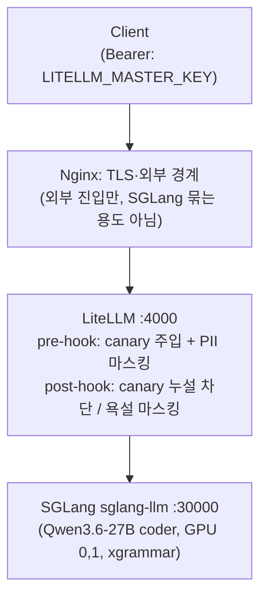
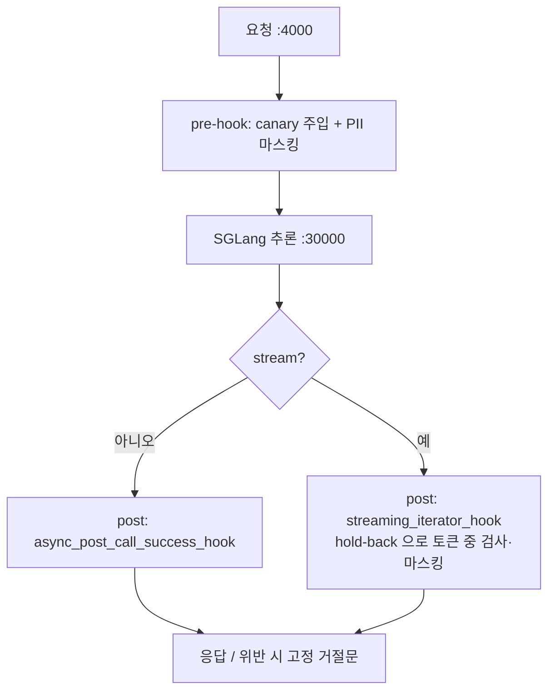

# LLM 서빙 — SGLang + LiteLLM 게이트웨이 (Qwen3 · 단일 진입점 · 가드레일)

> 로컬 GPU 서버에 Qwen3 모델을 **SGLang** 으로 서빙하고, **LiteLLM 게이트웨이**(:4000)로 단일 진입점 + 가드레일을 묶는 스택의 셋업 runbook. LLM 을 자체 서빙하는 구성 전용(`platform/litellm`) — 외부 LLM 을 client 로만 부르는 서비스엔 해당 없음. 모델·버전·GPU 배치는 개념 설명이므로 compose 파일을 기준으로 확인.

---

## 0. 토폴로지

용어 — **SGLang**: LLM 추론 서버(OpenAI 호환 + xgrammar 제약 디코딩). **LiteLLM**: 여러 모델을 단일 OpenAI 호환 포트로 모으는 게이트웨이(+ 가드레일 hook). **served-model-name**: SGLang 이 노출하는 모델 이름(LiteLLM 이 보내는 `model` 값과 일치해야 함). **가드레일**: 게이트웨이 입출력 필터([가드레일 문서](../3-기법/llm-가드레일.md)).

여러 서버·여러 모델을 **단일 접근 포트로 모으는 것이 LiteLLM 의 기본 역할.** SGLang 을 Nginx 로 따로 묶을 필요 없이 LiteLLM 이 각 SGLang 을 `api_base` 로 직접 가리킨다.



> 현재 구성은 SGLang 백엔드가 `sglang-llm` **하나뿐**이다(`Qwen3.6-27B` 는 멀티모달이라 이미지 입력도 이 모델이 받는다). 모델을 늘리면 `model_list` 에 항목을 추가하고 해당 SGLang 을 `api_base` 로 가리키면 된다.

- 클라이언트는 `:4000` 하나만 알고, 요청의 `model` 필드로 모델 선택 → LiteLLM 이 `model_name` 기준 라우팅.
- 우리 서비스(devactivity 등)는 `LLM_BASE_URL=http://<host>:4000/v1` 로 게이트웨이만 본다 — 챗(스트리밍)·주간리포트(비스트리밍) 모두 여길 지나므로 가드레일이 한곳에서 통일된다.
- **SGLang 을 Nginx upstream 으로 미리 묶지 말 것** — 모델 구분/fallback 이 깨진다. 외부 경계가 필요하면 LiteLLM 앞에만 Nginx 를 두고 LLM 경로는 `proxy_buffering off;` + `proxy_read_timeout 300s;`(SSE 끊김 방지).

> repo 의 게이트웨이 compose: [`platform/litellm/compose.yaml`](../../platform/litellm/compose.yaml) — **litellm 서비스만**(참고용). sglang 은 GPU 서버에서 따로 돌리므로 이 파일엔 없다. 자체 호스팅하려면 아래 §2 의 sglang 서비스를 같은 compose 에 추가한다.

---

## 1. 디렉터리 · `.env`

```text
platform/litellm/
├─ compose.yaml            (litellm 게이트웨이 — 참고용; sglang 은 별도 호스팅)
├─ config.yaml             (model_list + guardrails)
├─ custom_guardrail.py     (canary/PII/욕설 가드)
└─ Dockerfile              (litellm 버전 핀 + korcen 설치)
```

```dotenv
# served-model-name = LiteLLM이 보내는 model 값 = SGLang --served-model-name (셋 일치 필수)
LLM_MODEL_NAME=Qwen/Qwen3.6-27B-FP8
HF_TOKEN=<HUGGINGFACE_TOKEN>          # 게이트형 모델/빠른 다운로드용
LITELLM_MASTER_KEY=<LITELLM_MASTER_KEY>   # 클라이언트 Bearer. 길고 랜덤하게
PROMPT_CANARY=                        # (선택) 누설 탐지 마커. 미설정 시 기동마다 랜덤 생성. 고정하려면 추측불가 값으로
GUARDRAIL_REFUSAL=                    # (선택) canary 누설 차단 시 거부 문구. 미설정 시 도메인 중립 기본값
```

> 시크릿(마스터키·HF 토큰)은 `.docs` 정책상 평문 금지 — 값은 properties/비밀번호 매니저 참조. `PROMPT_CANARY` 는 미설정 시 **프로세스마다 랜덤 생성**된다 — 고정 핀하려면 추측 불가능한 값으로(노출된 상수는 우회·강제거부에 악용될 수 있다).

✅ **검증**: `.env` 의 `LLM_MODEL_NAME` 이 §2 SGLang `--served-model-name` 과 §3 config 의 `model: openai/<X>` 와 **글자까지 동일**한지 확인(어긋나면 404).

---

## 2. SGLang (docker-compose)

단일 호스트: coder=GPU 0,1(`tp-size=2`). 모델 다운로더가 최초 1회 받고 종료하면 SGLang 이 healthy 후 기동.

```yaml
# 자체 호스팅 예시 — sglang 서비스 (litellm 과 한 compose 에 둠). repo 의 compose.yaml 은 litellm 만 (발췌)
x-sglang-common: &sglang-common
  image: lmsysorg/sglang:v0.5.12.post1-cu130
  ipc: host
  ulimits: { memlock: -1, stack: 67108864 }
  restart: always
  entrypoint: ["sglang", "serve"]   # 이미지에 없으면 ["python3","-m","sglang.launch_server"] (플래그 동일)

services:
  sglang-llm:                       # Qwen3.6-27B coder
    <<: *sglang-common
    deploy: { resources: { reservations: { devices: [{ driver: nvidia, capabilities: [gpu], device_ids: ['0','1'] }] }}}
    healthcheck: { test: ["CMD","curl","-f","http://localhost:30000/health"], start_period: 300s, retries: 5 }
    depends_on: { model-downloader: { condition: service_completed_successfully }}
    command:
      - --model-path=${MODEL_DIR}/${LLM_MODEL_NAME}
      - --served-model-name=${LLM_MODEL_NAME}   # ⇄ config.yaml model: openai/<이것>
      - --tp-size=2
      - --tool-call-parser=qwen3_coder
      - --reasoning-parser=qwen3
      - --grammar-backend=xgrammar             # constrained decoding (§5)
      - --context-length=262144
      - --host=0.0.0.0
      - --port=30000
```

> 모델을 더 서빙하려면 같은 패턴으로 서비스를 추가한다(다른 `device_ids`·`--tp-size`·`--served-model-name` + `config.yaml` 의 `model_list` 항목). 현재는 `sglang-llm` 하나만 둔다.

✅ **검증**: `docker compose up -d model-downloader` → 종료 확인 → `docker compose up -d sglang-llm` → `docker compose ps` 가 `healthy`. `curl http://localhost:30000/health` 가 200.

---

## 3. LiteLLM 게이트웨이 (config · guardrail · 버전 핀)

### 3.1 `config.yaml` — 모델 라우팅 + 가드레일 배선

```yaml
# platform/litellm/config.yaml
model_list:
  - model_name: Qwen3.6-27B
    litellm_params:
      model: openai/Qwen/Qwen3.6-27B-FP8        # openai/ 뒤 = SGLang served-model-name
      api_base: http://sglang-llm:30000/v1       # 컨테이너 DNS
      api_key: "dummy"

guardrails:
  - guardrail_name: "canary-inject"   # pre  — system 맨 앞에 canary 주입(누설 탐지 전제)
    litellm_params: { guardrail: custom_guardrail.CanaryInjectGuard, mode: "pre_call", default_on: true }
  - guardrail_name: "pii-mask"        # pre  — 입력 고민감 PII 마스킹(전화·이메일·사업자·우편 통과)
    litellm_params: { guardrail: custom_guardrail.PiiMaskGuard, mode: "pre_call", default_on: true }
  - guardrail_name: "safety"          # post — canary 누설 차단 / 욕설 마스킹 (스트리밍/비스트리밍 자동분기)
    litellm_params: { guardrail: custom_guardrail.SafetyGuard, mode: "post_call", default_on: true }

litellm_settings: { drop_params: true, request_timeout: 600 }
general_settings: { master_key: os.environ/LITELLM_MASTER_KEY }
```

→ 정본: [`config.yaml`](../../platform/litellm/config.yaml). 가드 3종이 무엇을·왜 하는지는 [가드레일 §7](../3-기법/llm-가드레일.md).

### 3.2 `custom_guardrail.py` — 가드 구현

`CanaryInjectGuard`(pre) + `PiiMaskGuard`(pre) + `SafetyGuard`(post). `SafetyGuard` 는 비스트리밍은 `async_post_call_success_hook`, **스트리밍은 `async_post_call_streaming_iterator_hook`(hold-back 으로 토큰 흐름 중 검사 — canary 누설은 거부문구로 차단, 욕설은 마스킹)** — LiteLLM 이 stream 여부로 자동 분기. 구현·검증은 [가드레일 §7](../3-기법/llm-가드레일.md), 정본 [`custom_guardrail.py`](../../platform/litellm/custom_guardrail.py).



### 3.3 `Dockerfile` — 버전 핀 + 가드 의존성

`korcen` 은 기본 LiteLLM 이미지에 없다. 욕설 마스킹을 켜려면 설치 필요(없으면 조용히 skip — 욕설 원문 그대로 통과, 서비스는 안 죽음). 영어 욕설(korcen `level='english'/'all'`)이 필요하면 `better-profanity` 도 추가(없으면 한국어 `level='general'` 만).

> **의존성 라이선스**: `korcen` = MIT(선택 추가하는 `better-profanity` 도 MIT). 라이선스 회색지대 의존성 없음 — 상세는 [가드레일 §9](../3-기법/llm-가드레일.md).

```dockerfile
# platform/litellm/Dockerfile
FROM litellm/litellm:v1.87.1
ADD https://bootstrap.pypa.io/get-pip.py /tmp/get-pip.py
RUN python /tmp/get-pip.py && python -m pip install --no-cache-dir korcen
```

> **버전 핀 이유**: `litellm/litellm:v1.87.1`(Docker Hub) — 스트리밍 가드 훅(`async_post_call_streaming_iterator_hook`) 수정 PR 이후 정식 릴리스(후보판 아님)로 핀. `main-stable`(움직이는 태그)·`-rc`(후보판) 대신 재현 가능한 정식 버전을 박는다. 게이트웨이 가드는 **무상태**라 `--num_workers 2` 여도 안전(§7 워커 함정 참고).

✅ **검증**: `docker compose up -d --build litellm` → `docker compose logs litellm` 에 guardrail 로드 + `Application startup complete`. `import korcen` 실패 로그 없는지(있으면 욕설 마스킹 skip 중). better-profanity 미설치 시 korcen 이 "English filtering will be skipped" 한 줄 경고 — 무해.

---

## 4. 실행 · 검증

```bash
docker compose up -d model-downloader   # 모델 먼저 (최초 1회, 종료까지 대기)
docker compose up -d                      # sglang-llm, litellm
docker compose ps                         # 전부 healthy
```

```bash
# 텍스트 호출
curl http://localhost:4000/v1/chat/completions \
  -H "Authorization: Bearer $LITELLM_MASTER_KEY" -H "Content-Type: application/json" \
  -d '{"model":"Qwen3.6-27B","messages":[{"role":"user","content":"안녕"}]}'
```

✅ **검증**:

- 위 curl 이 한국어 응답 → 모델 라우팅 동작.
- 입력에 `주민 900101-1234567` 을 넣어 호출 → 모델에 가기 전 `[주민번호]` 로 마스킹(로그/응답 맥락 확인). 전화번호는 통과.
- ⚠️ **스트리밍 가드 스모크**: `"stream":true` 로 호출하고, system 에 canary 가 박힌 상태에서 모델이 프롬프트/canary 를 흘리도록 유도 → 고정 거절문으로 잘리는지 확인. 앱에 폴백 가드가 없으므로(게이트웨이 단독) 버전/설정 변경 시 이 스모크를 재실행.

---

## 5. constrained decoding (분류·플래그 작업)

xgrammar 가 켜져 있으니(§2) 클라이언트에서 바로 강제할 수 있다. 기법·언제 쓰는지는 [llm-프롬프트엔지니어링.md §8](../3-기법/llm-프롬프트엔지니어링.md).

```python
client.chat.completions.create(
    model="Qwen3.6-27B", messages=[...], temperature=0.2,
    extra_body={"regex": r"(yes|no)"},   # SGLang: {"json_schema":{...}} / {"choice":[...]} / {"ebnf":...}
)                                          # vLLM 은 guided_regex/guided_choice (신버전 structured_outputs)
```

> 한 요청에 제약 파라미터는 **하나만**. xgrammar 는 Rust-style regex.

---

## 6. 멀티서버 변형

SGLang 을 LiteLLM 과 다른 물리 서버에 둘 경우(GPU 증설·모델 추가로 한 호스트에 안 들어갈 때):

- 서버 B 에서 SGLang 만 기동(포트 노출), 서버 A 에 `litellm`.
- `config.yaml` 의 해당 `api_base` 를 컨테이너 DNS 대신 서버 B 주소로: `api_base: http://server-b:30000/v1`.
- LiteLLM 호스트 → 서버 B 의 SGLang 포트가 방화벽/Docker network 로 닿는지 확인. SGLang 은 외부 비노출, LiteLLM 만 진입점.
- **같은 모델을 여러 서버에 복제**하면 `model_name` 을 동일하게 줘 Router 가 자동 LB/fallback. **서로 다른 모델**이면 이름을 달리해 라우팅.

✅ **검증**: 서버 A 에서 `curl http://server-b:30000/health` 200 (방화벽 통과). LiteLLM 로그에 라우팅 에러 없음.

---

## 7. 반드시 확인할 함정

| 함정 | 증상 | 대응 |
| --- | --- | --- |
| **served-model-name 불일치** | 404 / 모델 못 찾음 | `config.yaml model: openai/<X>` ⇄ SGLang `--served-model-name=<X>` ⇄ `.env` 셋 일치 |
| **`sglang serve` CLI 없음** | command/서브커맨드 에러 | entrypoint 를 `["python3","-m","sglang.launch_server"]` 로 (플래그 동일) |
| **게이트웨이 워커 수** | — | 가드는 무상태라 `--num_workers 2` OK. ⚠️ **단, MCP 서버(portfolio-mcp-service 등 MCP 스위트)는 다르다** — streamable-http 세션이 워커별 in-memory 라 `--workers=1` 필수. 둘을 혼동 말 것 |
| **외부 Nginx SSE 끊김** | 스트리밍 중단 | LLM 경로 `proxy_buffering off;` + `proxy_read_timeout 300s;` |
| **가드 의존성 누락** | 욕설 마스킹 안 됨(조용) | Dockerfile 에 `korcen` 설치(§3.3), 로그에 import 실패 확인 |

✅ **검증**: `docker compose ps` 전부 healthy. (자체 호스팅 시 litellm 의 `depends_on` 으로 sglang healthy 후 기동.)

---

## 8. 더 강한 방어로 확장

지금은 정규식/키워드 1차 필터. OEM 실전에서 정밀이 필요하면 분류 모델/라이브러리를 게이트웨이에 얹는다 — 후보·라이선스는 [llm-가드레일.md §9](../3-기법/llm-가드레일.md). 요지:

- **유해성/인젝션 LLM 가드**: 작은 GPU 슬롯에 **Qwen3Guard-0.6B**(Apache 2.0)를 SGLang 으로 하나 더 띄워 LiteLLM 모델로 등록 → guardrail 에서 호출(기존 Qwen 스택 정합).
- **종합 스캐너**: **LLM Guard**(MIT, CPU 가능) — 인젝션·PII·toxicity·secrets, LiteLLM 통합.
- **PII 정밀**: 정규식 → **Presidio**(주민/카드/계좌만 엔티티, `PHONE_NUMBER` 제외).

✅ **검증**: 추가한 가드가 config.yaml 에 등록되고 `docker compose logs litellm` 에 guardrail 로드 로그가 보인다.

---

관련 문서: [Docker & Compose](../5-인프라셋팅/docker-compose.md) · [llm-가드레일.md](../3-기법/llm-가드레일.md) · [llm-프롬프트엔지니어링.md](../3-기법/llm-프롬프트엔지니어링.md)
