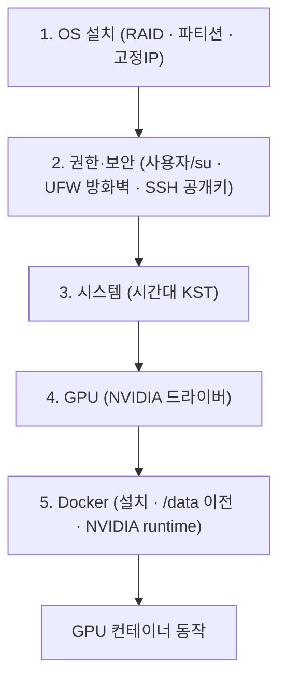
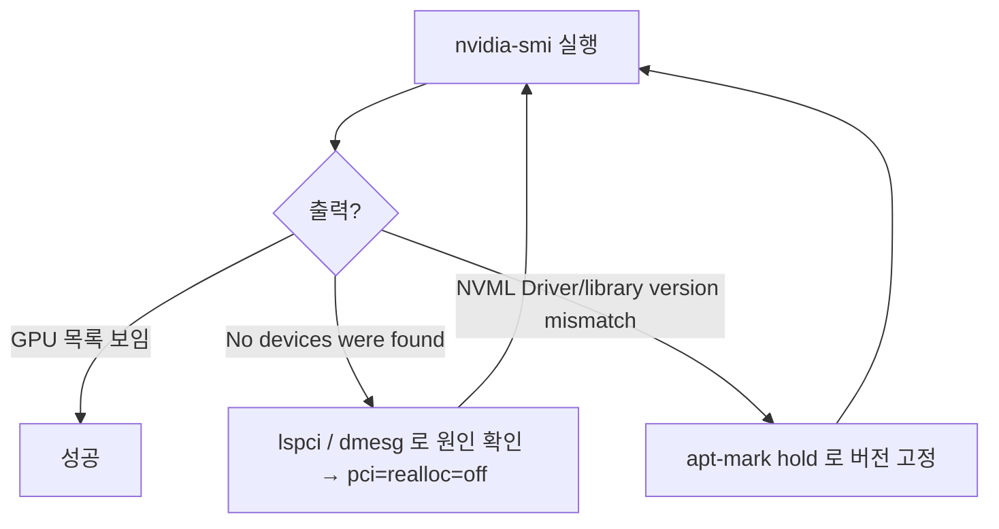
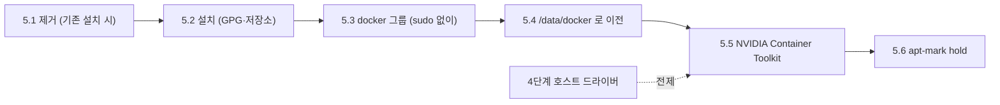

# Ubuntu 서버 초기 환경 셋팅 — OS · 보안 · GPU · Docker

> 사내 온프레미스 GPU 서버를 Ubuntu LTS Server 로 처음 세팅하는 절차임. **24.04 가 기본 흐름**이며, 22.04 와 다른 지점은 `> **22.04**:` 인라인 콜아웃으로 표기해. 온프레미스 GPU 서버 한정 — 클라우드 인스턴스는 대상이 아님. IP(`192.0.2.x`)·계정(`deploy-user`)·서버명은 **사내 예시값**이니 실제 환경에 맞게 치환해.

---

## 0. 큰 그림

빈 서버를 받아 **디스크를 묶고(RAID) → OS 를 깔고 → 네트워크·보안을 잠그고 → GPU 를 인식시키고 → Docker 에서 GPU 를 쓰게** 만드는 한 줄 흐름이다. 뒤 단계는 앞 단계가 끝나야 의미가 있으니 **순서대로** 따라가. 각 단계 끝에 `✅ 검증` 명령이 있는 데, 다음 단계로 넘어가기 전에 성공 여부를 눈으로 확인해.



> 왜 이 순서인가: 네트워크(고정IP)가 먼저 잡혀야 SSH 로 원격 작업이 가능하고, 보안(방화벽·키)이 먼저 잠겨야 외부 노출 위험 없이 나머지를 진행함. GPU 드라이버가 먼저 호스트에 인식돼야 Docker 의 GPU 연동(5단계 NVIDIA runtime)이 동작함.

---

## 1. OS 설치

서버에 OS 를 올리고, 디스크 구성·네트워크까지 잡는 첫 단계임.

### 1.1 RAID 설정

RAID(Redundant Array of Independent Disks) = 여러 디스크를 묶어 하나처럼 쓰면서 **속도나 안정성(디스크 고장 대비)을 얻는 구성**입니다. 서버 디스크 개수와 "고장 몇 개까지 버틸지"에 따라 아래에서 고릅니다.

| RAID | 조건 | 손실 | 특징 |
|------|------|------|------|
| RAID 0 | - | 손실 없음 | 하나로 합침 |
| RAID 1 | 2개 이상 | 디스크 50% | 미러링, 홀수는 비효율 |
| RAID 5 | 3개 이상 | 디스크 1개 | 1패리티 |
| RAID 6 | 3개 이상 | 디스크 2개 | 2패리티 |
| RAID 10 | 4개 이상 | 디스크 50% | 2패리티, 짝수개 |

> "손실" = 전체 용량 중 패리티/미러로 쓰여 데이터에 못 쓰는 비율이다. RAID 0 은 안정성 없이 용량을 다쓰고, RAID 1/10 은 절반을 미러에 내주는 대신 디스크가 죽어도 버팁니다.

### 1.2 OS 설치

Ubuntu 24.04 LTS Server 를 설치. 설치 중 고정IP 는 잡지 않음.

> **22.04**: 안정성을 고려해 24.04 대신 22.04 LTS Server 를 설치해.

파티션(디스크를 용도별로 나눈 구획) 설정 — `/data` 는 나중에 Docker 데이터를 옮겨 둘 큰 공간입니다(5단계에서 사용):

| 마운트 | 크기 | 파일시스템 |
|--------|------|------------|
| `/` | 500G | xfs |
| `/boot` | 1G | xfs |
| `/boot/efi` | 500MB | fat32 |
| `/data` | 나머지 | xfs |
| SWAP | 4G | - |

> 고정IP 를 설치 중에 잡지 않는 이유: 설치 마법사가 잡은 네트워크 설정과 다음 단계의 netplan 수동 설정이 충돌하지 않도록, OS 설치 후 1.3 에서 직접 잡아.

### 1.3 고정IP 설정

netplan = Ubuntu 의 네트워크 설정 도구이다(`/etc/netplan/*.yaml` 파일로 IP·게이트웨이·DNS 를 선언). 서버는 IP 가 바뀌면 안 되므로 **고정IP** 로 고정한다.

```bash
sudo su
rm /etc/netplan/*.yaml  # 기존 설정 삭제
ip addr  # 랜카드 이름 확인 (ex: ens17f0)
nano /etc/netplan/00-installer-config.yaml
```

```yaml
network:
  ethernets:
    ens17f0:
      addresses:
        - 192.0.2.xx/16
      routes:
        - to: default
          via: 192.0.2.62
      nameservers:
        addresses: [8.8.8.8, 1.1.1.1]
      dhcp4: no
```

> ⚠️ Ubuntu Server 에는 cloud-init 이 기본 포함됨. cloud-init 은 클라우드 환경(AWS, GCP 등)에서 부팅 시 자동으로 네트워크를 설정해주는 도구인데, 온프레미스/물리 서버에서는 불필요하게 netplan 설정을 덮어써서 고정IP 가 초기화될 수 있음. 우분투 업그레이드 후 SSH 접근이 안 되는 원인이 되기도 하므로 반드시 비활성화해.

```bash
cloud-init status  # 활성화 확인
```

> **22.04**: cloud-init 비활성화 파일명이 `subiquity-disable-cloudinit-networking.cfg` 입니다.

```bash
nano /etc/cloud/cloud.cfg.d/99-disable-network-config.cfg
```

> **22.04**: `nano /etc/cloud/cloud.cfg.d/subiquity-disable-cloudinit-networking.cfg`

```yaml
network: {config: disabled}
```

```bash
netplan try    # 설정 테스트 (120초 내 문제 시 자동 롤백)
netplan apply  # 영구 적용
sudo reboot
```

> `netplan try` 를 먼저 쓰는 이유: 잘못된 설정으로 네트워크가 끊겨도 120초 후 자동 롤백돼 원격에서 서버를 잃지 않음. 확인 후 `netplan apply` 로 영구 적용한다. > **22.04**: `netplan try` 대신 `netplan apply` 로 바로 적용해도 됨.

✅ **검증**: 재부팅 후 IP 적용 확인

```bash
ip addr show ens17f0 | grep inet
# → inet 192.0.2.xx/16 이 보이면 성공
ping -c 2 8.8.8.8
# → 응답이 오면 외부 통신 정상
```

---

## 2. 권한 설정

서버를 외부에 노출하기 전에 **누가·어떻게 들어올 수 있는지**를 잠그는 단계임. 사용자 권한(su) → 방화벽(UFW) → SSH 키 인증 순서로 좁혀 갑니다.

### 2.1 su 제한과 root 비활성화

su(switch user) = 다른 사용자(보통 root)로 전환하는 명령이다. 아무나 su 로 root 가 되지 못하도록 **wheel 그룹**(su 를 쓸 수 있는 관리자만 모은 그룹)에 속한 사용자만 허용한다.

```bash
sudo su
chmod 4755 /usr/bin/su  # 사용자 su 사용 제한
```

`/etc/pam.d/su` 파일의 해당 부분 주석 해제:

```text
#auth    required    pam_wheel.so
```

관리자 계정을 wheel 그룹에 추가:

```bash
groupadd wheel
gpasswd -a deploy-user wheel
gpasswd -a root wheel
```

`/etc/group` 에서 확인:

```text
wheel:x:1001:root,[관리자계정]
```

su 소유자를 wheel 그룹으로 변경:

```bash
chgrp wheel /usr/bin/su
```

Root 계정 비활성화 — root 로 직접 로그인하는 경로를 막아 공격 표면을 줄임:

```bash
sudo passwd -l root
sudo sed -i 's/^PermitRootLogin yes/PermitRootLogin no/' /etc/ssh/sshd_config
sudo systemctl restart ssh
```

서버명 변경 / 비밀번호 변경:

```bash
sudo hostnamectl set-hostname 새로운서버명
passwd
```

✅ **검증**: wheel 그룹 외 사용자가 su 를 사용할 수 없는지 확인

```bash
cat /etc/group | grep wheel
# → wheel:x:1001:root,deploy-user 가 보이면 성공
# wheel 그룹이 아닌 사용자로 su 시도 시 "Permission denied" 나오면 성공
```

### 2.2 UFW 설치

UFW(Uncomplicated Firewall) = Ubuntu 의 간단한 방화벽 프론트엔드입니다. 기본 정책을 "들어오는 건 다 막고, 나가는 건 다 허용"으로 두고, 필요한 포트만 사내 대역에서 열어 줍니다.

```bash
sudo apt update
sudo apt install ufw
sudo ufw default deny incoming
sudo ufw default allow outgoing
sudo sed -i 's/IPV6=yes/IPV6=no/' /etc/default/ufw
sudo ufw enable
```

방화벽 규칙 추가 — `from 203.0.113.0/24` 처럼 **사내 대역에서만** 열어 외부 노출을 막아:

```bash
sudo ufw allow from 203.0.113.0/24 to any port 22 proto tcp      # SSH 필수
sudo ufw allow from 203.0.113.0/24 to any port 3389 proto tcp    # 원격데스크톱
sudo ufw allow from 192.0.2.13 to any port 29919 proto tcp   # EPP 관리
sudo ufw allow from 203.0.113.0/24 to any port 5672 proto tcp    # RabbitMQ
sudo ufw reload
sudo ufw status verbose
```

Rule 삭제:

```bash
sudo ufw status numbered
sudo ufw delete 2
sudo ufw status verbose
```

로그 확인:

```bash
sudo tail -f /var/log/ufw.log
```

✅ **검증**: 방화벽 상태 확인

```bash
sudo ufw status verbose
# → Status: active, Default: deny (incoming), allow (outgoing) 확인
# → 등록한 규칙 목록이 보이면 성공
```

### 2.3 SSH 공개키 인증

공개키 인증 = 비밀번호 대신 **키 쌍(개인키=로컬 보관, 공개키=서버 등록)** 으로 로그인하는 방식임. SSH 접근 시마다 비밀번호를 물어 불편하므로 공개키 인증으로 비밀번호 없이 로컬PC 에서 접근함.

로컬 PC 에서:

```cmd
ssh-keygen -t ed25519 -C "your-comment"
```

> **22.04**: `ssh-keygen -t rsa -b 4096` (rsa 예시)

`C:\Users\xxxx\.ssh\` 폴더에 `id_ed25519`(개인키, 로컬), `id_ed25519.pub`(공개키, 서버 등록) 가 생성됨. `id_ed25519.pub` 내용을 서버의 `/home/deploy-user/.ssh/authorized_keys` 에 한 줄로 추가하세요.

> **22.04**: `id_rsa`(개인키), `id_rsa.pub`(공개키) 가 생성됨.

SSH config 파일에 IdentityFile 추가:

```text
Host *
    IdentityFile C:\Users\acme\.ssh\id_ed25519
    StrictHostKeyChecking no
    UserKnownHostsFile=/dev/null

Host 192.0.2.32/SSH
    HostName 192.0.2.32
    User acme
    Port 22
```

> **22.04**: `IdentityFile C:\Users\acme\.ssh\id_rsa`

> **주의**: 공개키 인증이 안 되고 패스워드를 물어보면 실패한 것임. `authorized_keys` 권한이 과하게 허용되면 공개키 인증이 안 됨.

```bash
sudo chown acme:acme /home/acme
sudo chmod 755 /home/acme
sudo chmod 700 /home/acme/.ssh
sudo chmod 600 /home/acme/.ssh/authorized_keys
```

> **22.04**: `sudo chmod 700 -R /home/acme`

공개키 인증이 정상 동작하면 패스워드 인증을 비활성화해(브루트포스 방지):

```bash
sudo sed -i 's/^#PasswordAuthentication yes/PasswordAuthentication no/' /etc/ssh/sshd_config
sudo sed -i 's/^PasswordAuthentication yes/PasswordAuthentication no/' /etc/ssh/sshd_config
sudo systemctl restart ssh
```

> ⚠️ 패스워드 인증을 끄기 전에 반드시 공개키로 접속이 되는지 먼저 확인해. 아니면 서버 접근이 불가능해짐.

✅ **검증**: 로컬 PC 에서 비밀번호 없이 접속 확인

```cmd
ssh acme@192.0.2.32
# → 비밀번호 물어보지 않고 바로 접속되면 성공
ssh acme@192.0.2.32 -o PubkeyAuthentication=no
# → Permission denied (publickey) 나오면 패스워드 인증이 정상 차단된 것
```

---

## 3. 시스템 환경 설정

### 3.1 시간 설정

서버 로그·스케줄러가 한국 시간 기준이 되도록 시간대(timezone)를 KST 로 맞춤.

```bash
sudo timedatectl set-timezone Asia/Seoul
timedatectl
```

로그 시간 수정 — rsyslog(시스템 로그 데몬)가 로컬 시간대 형식으로 기록하도록 설정:

```bash
sudo sh -c 'echo "" >> /etc/rsyslog.conf'
sudo sh -c 'echo "# Local timezone rsyslog configuration" >> /etc/rsyslog.conf'
sudo sh -c 'echo "\$ActionFileDefaultTemplate RSYSLOG_TraditionalFileFormat" >> /etc/rsyslog.conf'
sudo systemctl restart rsyslog
sudo tail /var/log/syslog
```

✅ **검증**: 시간대 확인

```bash
timedatectl   # → Time zone: Asia/Seoul (KST, +0900)
date          # → 현재 한국 시간 출력
```

---

## 4. GPU 설정

호스트가 GPU 를 인식하도록 NVIDIA 드라이버를 설치함. 이게 되어야 5단계에서 Docker 컨테이너가 GPU 를 쓸 수 있음. 기존 드라이버가 있으면 깨끗이 제거 → 설치 → (필요 시) 업그레이드 방지 순서임.



### 4.1 Nvidia 드라이버 제거 (기존 설치 시)

`apt-mark hold` = 해당 패키지를 자동 업그레이드에서 **고정(제외)** 하는 표시임. 제거하려면 먼저 hold 를 풀어야(`unhold`) 함.

```bash
sudo apt-mark unhold nvidia-driver-*
sudo apt-mark unhold libnvidia-*
sudo apt-mark showhold

# NVIDIA 드라이버 완전 제거
sudo apt remove --purge '^nvidia-.*'
sudo apt remove --purge '^libnvidia-.*'

# Xorg 완전 제거
sudo apt purge xserver-xorg* x11-common
sudo apt purge libx11-* libxext-* libxrender-*

# GNOME 데스크톱 완전 제거
sudo apt purge ubuntu-desktop gnome-desktop3-data gnome-shell
sudo apt purge gnome-*
sudo apt purge gnome-remote-desktop

# 디스플레이 매니저 완전 제거
sudo apt purge gdm3 lightdm

# 정리 작업
sudo apt autoremove
sudo apt autoclean
sudo apt update
```

### 4.2 Nvidia 그래픽 드라이버 설치

```bash
sudo apt update
sudo apt upgrade
```

> **22.04**: 최신 드라이버를 받기 위해 `graphics-drivers/ppa` 저장소 추가 필요.
>
> ```bash
> sudo add-apt-repository ppa:graphics-drivers/ppa
> sudo apt update
> ```

```bash
ubuntu-drivers devices
sudo apt install nvidia-driver-580-server
sudo apt autoremove
sudo apt autoclean
sudo reboot
```

> 24.04 는 기본 apt 저장소에 최신 NVIDIA 드라이버가 포함되어 있어 PPA 추가가 불필요함.

✅ **검증**: 재부팅 후 GPU 인식 확인. `nvidia-smi` = 드라이버가 GPU 를 잘 잡았는지 보여주는 NVIDIA 진단 명령이다.

```bash
nvidia-smi
# → GPU 목록과 드라이버 버전이 보이면 성공
# → "No devices were found" 가 뜨면 아래 트러블슈팅 참고
```

설치가 의존성 문제로 안 된다면 hold 를 풀어. 그래도 안 되면 의존 라이브러리부터 순차적으로 설치해.

`nvidia-smi` 에서 `No devices were found` 가 뜨면(드라이버는 깔렸으나 GPU 를 못 잡은 상태) 아래를 확인해:

```bash
lspci | grep -i nvidia   # 물리적으로 GPU 가 연결되어있는지 확인
dmesg | grep -i nvidia   # PCI I/O region 오류 확인
```

PCI 리소스 할당 문제 시 — 부팅 시 PCI 주소를 재할당하는 커널 옵션을 끕니다:

```bash
sudo nano /etc/default/grub
# GRUB_CMDLINE_LINUX_DEFAULT="pci=realloc=off"
sudo update-grub
sudo reboot
```

### 4.3 Nvidia 라이브러리 업그레이드 방지

`nvidia-smi` 에서 `Failed to initialize NVML: Driver/library version mismatch` 발생 시 — 드라이버와 라이브러리 버전이 자동 업그레이드로 어긋난 경우임. 버전을 hold 로 고정하세요:

```bash
sudo apt-mark hold nvidia-driver-580-server
sudo apt-mark hold libnvidia-*
```

---

## 5. Docker 설정

컨테이너 런타임(Docker)를 설치하고, 데이터를 큰 디스크(`/data`)로 옮기고, 컨테이너 안에서 GPU 를 쓰도록 NVIDIA runtime 을 붙임. 기존 Docker 가 있으면 제거 → 설치 → 사용자 권한 → 경로 이전 → NVIDIA → hold 순서이다.



### 5.1 Docker 제거 (기존 설치 시)

```bash
sudo apt remove --purge docker-ce docker-ce-cli containerd.io docker-buildx-plugin docker-compose-plugin
sudo apt autoremove
sudo apt autoclean
sudo apt update
```

### 5.2 Docker 설치

공식 저장소를 GPG 키(패키지 서명 검증용 키)로 신뢰 등록한 뒤 설치:

```bash
sudo su
apt update
apt install apt-transport-https ca-certificates curl gnupg-agent software-properties-common -y
apt -y install lsb-release

# GPG 키 추가
mkdir -p /etc/apt/keyrings
curl -fsSL https://download.docker.com/linux/ubuntu/gpg | gpg --dearmor -o /etc/apt/keyrings/docker.gpg

# apt 저장소 추가
echo "deb [arch=amd64 signed-by=/etc/apt/keyrings/docker.gpg] https://download.docker.com/linux/ubuntu $(lsb_release -cs) stable" | tee /etc/apt/sources.list.d/docker.list > /dev/null

# Docker 설치
apt update
apt install -y docker-ce docker-ce-cli containerd.io docker-buildx-plugin docker-compose-plugin

# docker-compose 심볼릭링크 (VSCode용)
sudo ln -s /usr/libexec/docker/cli-plugins/docker-compose /usr/local/bin/docker-compose

# 확인
systemctl status docker
docker run hello-world
```

> **22.04**: `$(lsb_release -cs)` 가 자동으로 `jammy`(22.04 코드네임)를 채웁니다.

### 5.3 Docker 사용자 설정

`docker` 그룹에 사용자를 넣어 `sudo` 없이 docker 명령을 쓸 수 있도록 함:

```bash
sudo usermod -aG docker $USER
cat /etc/group | grep docker
sudo reboot
```

✅ **검증**: 재부팅 후 sudo 없이 Docker 사용 가능 확인

```bash
docker run hello-world   # → "Hello from Docker!"
docker --version         # → Docker version 출력
```

### 5.4 Docker 설치경로 변경

Docker 데이터는 기본 `/var/lib/docker`(루트 `/` 파티션)에 쌓여 디스크를 금세 채우므로, 1단계에서 크게 잡아둔 `/data` 로 옮김.

```bash
sudo su
systemctl stop docker
mv /var/lib/docker /data/docker
```

사용자로 전환 후:

```bash
sudo find /data -maxdepth 1 ! -path /data/docker -exec chown -R $USER:$USER {} \;
sudo chown -R root:root /data/docker
sudo chmod 700 /data/docker
systemctl start docker
```

`daemon.json`(Docker 데몬 설정 파일) 설정 — 데이터 경로(`data-root`)와 NVIDIA runtime, cgroup 드라이버를 설정:

```bash
sudo nano /etc/docker/daemon.json
```

```json
{
    "data-root": "/data/docker",
    "runtimes": {
        "nvidia": {
            "args": [],
            "path": "nvidia-container-runtime"
        }
    },
    "exec-opts": ["native.cgroupdriver=systemd"]
}
```

> **22.04**: cgroupdriver 가 `cgroupfs` 입니다. `daemon.json` 은 이렇게 씁니다:
>
> ```json
> {
>     "data-root": "/data/docker",
>     "exec-opts": ["native.cgroupdriver=cgroupfs"]
> }
> ```
>
> NVIDIA runtime 은 5.5 단계 `nvidia-ctk` 실행 후 자동 추가됨.

```bash
sudo systemctl restart docker
systemctl status docker
```

✅ **검증**: Docker 데이터 경로 변경 확인

```bash
docker info | grep "Docker Root Dir"
# → Docker Root Dir: /data/docker
```

### 5.5 Nvidia Docker 설치

NVIDIA Container Toolkit = 컨테이너 안에서 호스트의 GPU 를 쓰게 해줌. 4단계의 호스트 드라이버 위에 이걸 얹어야 `docker run --gpus all` 이 동작함.

```bash
# GPG 키 등록
curl -fsSL https://nvidia.github.io/libnvidia-container/gpgkey | sudo gpg --dearmor -o /usr/share/keyrings/nvidia-container-toolkit-keyring.gpg

# 저장소 추가
curl -s -L https://nvidia.github.io/libnvidia-container/stable/deb/nvidia-container-toolkit.list | sed 's#deb https://#deb [signed-by=/usr/share/keyrings/nvidia-container-toolkit-keyring.gpg] https://#g' | sudo tee /etc/apt/sources.list.d/nvidia-container-toolkit.list

# 설치
sudo apt update && sudo apt install -y nvidia-container-toolkit

# Docker runtime 설정 및 재시작
sudo nvidia-ctk runtime configure --runtime=docker && sudo systemctl restart docker

# 확인
sudo docker run --rm --gpus all nvidia/cuda:13.0.1-base-ubuntu24.04 nvidia-smi
```

> **22.04**: `nvidia-ctk` 실행 후 `daemon.json` 에 nvidia runtime 이 자동 추가됨. 최종 확인:
>
> ```bash
> cat /etc/docker/daemon.json
> ```
>
> ```json
> {
>     "data-root": "/data/docker",
>     "exec-opts": ["native.cgroupdriver=cgroupfs"],
>     "runtimes": {
>         "nvidia": {
>             "args": [],
>             "path": "nvidia-container-runtime"
>         }
>     }
> }
> ```

✅ **검증**: 컨테이너 내에서 GPU 인식 확인

```bash
docker info | grep -i nvidia
# → Runtimes: nvidia
# → 위 docker run 의 nvidia-smi 출력에 GPU 목록이 보이면 성공
```

`nvidia-smi` 가 안 되면 버전 명시해서 설치하세요:

```bash
apt install docker-ce=5:27.0.3-1~ubuntu.24.04~noble docker-ce-cli=5:27.0.3-1~ubuntu.24.04~noble containerd.io docker-buildx-plugin docker-compose-plugin=2.29.7 -y
```

> **22.04**: `apt install docker-ce=5:27.0.3-1~ubuntu.22.04~jammy docker-ce-cli=5:27.0.3-1~ubuntu.22.04~jammy containerd.io docker-buildx-plugin docker-compose-plugin=2.29.7 -y`

`docker info | grep -i nvidia` 에서 bridge-nf-call 경고 발생 시 — 브리지 네트워크 트래픽이 iptables 를 거치도록 커널 모듈(`br_netfilter`)을 로드해:

```bash
sudo nano /etc/sysctl.conf  # 맨 하단에 추가
net.bridge.bridge-nf-call-iptables = 1
net.bridge.bridge-nf-call-ip6tables = 1

sudo modprobe br_netfilter
lsmod | grep br_netfilter
sudo sysctl -p
echo 'br_netfilter' | sudo tee /etc/modules-load.d/br_netfilter.conf
sudo systemctl restart docker
```

### 5.6 Docker 라이브러리 업그레이드 방지

```bash
sudo apt-mark hold docker-ce docker-ce-cli containerd.io docker-buildx-plugin docker-compose-plugin
```

> ⚠️ `apt-mark hold` 로 고정해도 unattended-upgrades 가 활성화되어 있으면 자동 업데이트로 풀릴 수 있음. 확인 및 비활성화:
>
> ```bash
> sudo systemctl status unattended-upgrades
> sudo systemctl disable unattended-upgrades
> sudo systemctl stop unattended-upgrades
> ```

---

## 6. 요약·체크리스트

순서대로 따라왔다면 빈 서버 → GPU 컨테이너 실행까지 완성된다. 각 단계의 ✅ 검증이 통과하는지 다시 확인해.

- [ ] **1. OS** — RAID 구성 / 파티션(`/`, `/boot`, `/data` …) / 고정IP(`netplan try` → `apply`) + cloud-init 비활성화 → `ip addr` · `ping 8.8.8.8`
- [ ] **2. 권한** — wheel 그룹 su 제한 · root 로그인 차단 / UFW 사내대역만 허용 / SSH 공개키 인증 후 패스워드 인증 OFF → `ufw status verbose` · 키 접속
- [ ] **3. 시간** — 시간대 Asia/Seoul · rsyslog 로컬시간 → `timedatectl`
- [ ] **4. GPU** — NVIDIA 드라이버 설치(24.04 는 PPA 불필요, 22.04 는 `graphics-drivers/ppa` 필요) → `nvidia-smi` 에 GPU 목록 / 안 잡히면 `pci=realloc=off`, mismatch 면 `apt-mark hold`
- [ ] **5. Docker** — 설치 / docker 그룹 / `/data/docker` 로 이전 / NVIDIA Container Toolkit → `docker run --gpus all` 에서 GPU 인식
- [ ] **6. 안정화** — NVIDIA·Docker 패키지 `apt-mark hold` + unattended-upgrades 비활성화

### 흔한 실수

- **패스워드 인증을 먼저 끄고 키 접속 확인을 나중에** → 키가 잘못되면 서버에 못 들어감. 반드시 키 접속 성공을 확인한 뒤 꺼(2.3 ⚠️).
- **cloud-init 미비활성화** → 업그레이드/재부팅 후 고정IP 가 초기화돼 SSH 가 끊깁니다(1.3 ⚠️).
- **`netplan apply` 를 바로 실행** → 잘못된 설정이면 원격 연결이 끊긴 채 롤백도 안 됨. `netplan try` 로 먼저 테스트해(120초 자동 롤백).
- **GPU 드라이버 없이 NVIDIA Docker 부터 설치** → 컨테이너에서 GPU 인식 실패. 4단계(호스트 드라이버) → 5단계(Container Toolkit) 순서를 지켜.
- **`apt-mark hold` 만 믿기** → unattended-upgrades 가 켜져 있으면 자동 업그레이드로 버전이 풀려 mismatch 가 재발함(5.6 ⚠️).
- **22.04 에서 cgroupdriver 생략** → `daemon.json` 에 `native.cgroupdriver=cgroupfs` 를 꼭 설정해. 없으면 Docker 가 안 뜨거나 컨테이너 자원 제한이 꼬임.

---

관련 문서: [wsl2-docker개발환경.md](wsl2-docker개발환경.md)(WSL2 개발 환경)
