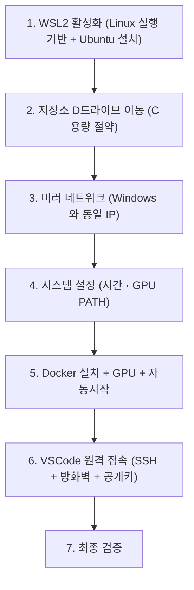
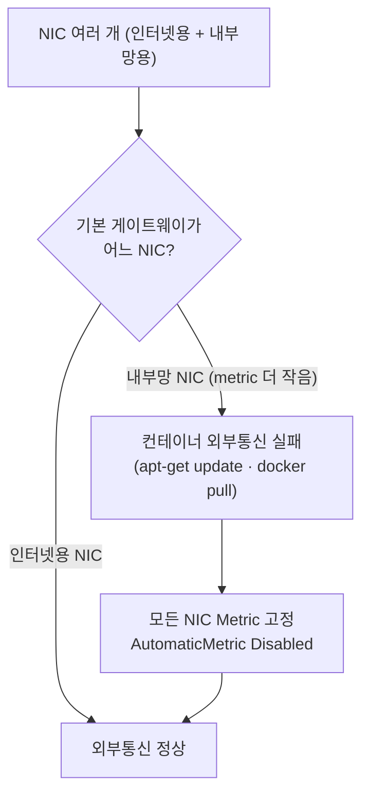

# WSL2 + Docker 개발 환경 — Windows 11, Ubuntu 24.04, 미러 네트워크

> Windows 11 에 WSL2 + Ubuntu 24.04 + Docker(+ GPU) 를 미러 네트워크 모드로 세팅하는 절차 — 저장소 D드라이브 이동, `networkingMode=mirrored`, 다중 NIC 라우팅, VSCode 원격 접속, Windows 부팅 시 자동 시작까지. 미러 네트워크는 **Windows 11 22H2+ 전용**(Windows Server 미지원), 계정(`deploy-user`)·IP 는 사내 예시값이니 실제 값으로 치환해.

---

## 0. 큰 그림

목표는 **Windows PC 한 대를 컨테이너 개발 서버로 바꾸는 것**이다. Windows 안에 가벼운 Linux(WSL2)를 띄우고, 그 안에서 Docker 로 서비스를 실행하며, 네트워크를 Windows 와 한 몸으로 묶어(미러 모드) 외부 PC 의 VSCode 가 SSH 로 들어오게 만듭니다.

전체 흐름은 아래 순서다 — **아래로 내려갈수록 위 단계가 끝나 있어야 한다**.



각 단계는 끝에 `✅ 검증`이 붙어 있다 — **반드시 통과한 뒤 다음으로 넘어간다.** 한 단계가 어긋난 채 진행하면 뒤에서 원인을 찾기 어렵다.

---

## 1. 용어

처음 보는 단어가 많을 수 있다. 핵심만 한 줄씩 풀어둔다 (필요할 때 돌아와 참고).

| 용어 | 한 줄 풀이 |
|------|-----------|
| **WSL2** | Windows Subsystem for Linux 2 — Windows 안에서 진짜 Linux 커널을 돌리는 기능. "Windows 위에 얹은 Linux 박스" |
| **미러 네트워크** | WSL 이 Windows 와 **같은 IP**를 쓰게 하는 모드. 포트포워딩 없이 `localhost` 로 바로 통한다 |
| **NIC** | Network Interface Card — 랜카드(유선/무선 네트워크 어댑터). PC 에 여러 개일 수 있다(인터넷용 + 내부망용) |
| **Metric** | 같은 목적지로 가는 경로가 둘 이상일 때 Windows 가 고르는 **우선순위 점수**. 작을수록 먼저 선택 |
| **Docker** | 애플리케이션을 "컨테이너"라는 격리된 상자에 담아 실행하는 도구 |
| **systemd** | Linux 의 서비스 관리자 — Docker·SSH 같은 백그라운드 프로그램을 자동 시작/관리 |
| **SSH** | Secure Shell — 네트워크 너머의 컴퓨터에 안전하게 원격 접속하는 프로토콜 |
| **vhdx** | WSL2 가 자기 파일시스템을 통째로 담아두는 가상 디스크 파일 |

---

## 2. 필요 조건

| 항목 | 요구 사항 | 비고 |
|------|----------|------|
| OS | **Windows 11 22H2 이상** | 미러 네트워크는 22H2부터 지원 |
| BIOS | 가상화 기능 활성화 (VT-x / AMD-V) | BIOS에서 Virtualization 항목 Enable |
| GPU | NVIDIA GPU + 최신 Windows 드라이버 | GPU 없으면 NVIDIA 관련 단계 생략 |
| 디스크 | D드라이브 여유 공간 200GB 이상 | WSL2 가상 디스크 저장용 (Docker 이미지/컨테이너 포함) |

> **Windows Server 2025는 WSL2는 지원하지만 미러 네트워크(`networkingMode=mirrored`)는 지원하지 않음.**
>
> 미러 네트워크는 Windows 11 전용 기능이며, Windows Server 지원 계획은 없음.

**Windows 버전 확인 방법**: `Win + R` → `winver` → Enter

---

## 3. WSL2 활성화

Windows 에 Linux 실행 기능을 켜고, Ubuntu 를 설치한 뒤, 그 가상 디스크를 D드라이브로 옮김. 이후 모든 작업의 토대가 된다.

### 3.1 기능 활성화

> WSL2는 Windows 안에서 Linux를 실행할 수 있게 해줌.

1. 작업표시줄 검색에서 **PowerShell** 검색
2. **관리자로 실행** 클릭
3. 아래 명령어를 한 줄씩 복사 → PowerShell에 붙여넣기 → Enter:

```powershell
dism.exe /online /enable-feature /featurename:Microsoft-Windows-Subsystem-Linux /all /norestart
```

```powershell
dism.exe /online /enable-feature /featurename:VirtualMachinePlatform /all /norestart
```

4. **Windows 재부팅**

5. 재부팅 후 다시 PowerShell을 **관리자로 실행**하고 아래 명령어 실행:

```powershell
wsl --update
```

```powershell
wsl --set-default-version 2
```

### 3.2 NVIDIA 드라이버 설치 (Windows)

> WSL2에서 GPU를 쓰려면 **Windows 쪽에만** 드라이버를 설치함. WSL 내부에는 별도 설치하지 않음.

1. NVIDIA 공식 사이트에서 본인 GPU에 맞는 최신 드라이버 다운로드 및 설치
2. PowerShell에서 설치 확인:

```powershell
nvidia-smi
```

GPU 이름, 드라이버 버전, CUDA 버전이 표시되면 정상이다.

### 3.3 Ubuntu 설치

PowerShell에서:

```powershell
wsl --install -d Ubuntu
```

설치가 끝나면 **새 창**으로 Ubuntu 터미널이 자동으로 열림. 사용자 설정을 요구:

```text
Enter new UNIX username: deploy-user
New password: ********
Retype new password: ********
```

- **사용자명**: 영문 소문자로 원하는 이름 입력 (예: `deploy-user`)
- **비밀번호**: 입력할 때 화면에 `****` 등 아무것도 표시되지 않는 게 정상이다. 그냥 입력하고 Enter
- 이 비밀번호는 `sudo` (관리자 권한 실행) 명령 시 사용됨

비밀번호를 나중에 변경하고 싶다면:

```bash
passwd
```

### 3.4 WSL2 저장소 D드라이브로 이동

> WSL2의 가상 디스크(vhdx)는 기본적으로 C드라이브에 저장됨.
> C드라이브 용량을 아끼기 위해 D드라이브로 옮김.

아래는 "Ubuntu 를 통째로 내보내기(export) → 등록 해제(unregister) → D드라이브 위치로 다시 들이기(import)" 흐름입니다.


**1단계**: Ubuntu 터미널에서 나가기

```bash
exit
```

> `exit` 입력하면 Ubuntu 창이 닫히고 PowerShell로 돌아온다. PowerShell이 이미 닫혀있다면 다시 열어.

**2단계**: PowerShell에서 아래 명령어를 **한 줄씩** 실행:

```powershell
wsl --shutdown
```

```powershell
mkdir D:\WSL\Ubuntu
```

```powershell
wsl --export Ubuntu D:\WSL\Ubuntu\ubuntu.tar
```

```powershell
wsl --unregister Ubuntu
```

```powershell
wsl --import Ubuntu D:\WSL\Ubuntu D:\WSL\Ubuntu\ubuntu.tar
```

```powershell
del D:\WSL\Ubuntu\ubuntu.tar
```

**3단계**: Ubuntu에 다시 진입

```powershell
wsl -d Ubuntu
```

**4단계**: 기본 사용자, systemd, 호스트명 설정

아래 내용을 **통째로 복사**해서 붙여넣고 Enter:

```bash
sudo tee /etc/wsl.conf > /dev/null <<'EOF'
[boot]
systemd=true

[user]
default=deploy-user

[network]
hostname=wsl
EOF
```

**5단계**: 설정 적용

```bash
exit
```

PowerShell에서:

```powershell
wsl --shutdown
```

```powershell
wsl -d Ubuntu
```

✅ **검증**: 프롬프트가 `deploy-user@wsl:~$` 로 보이면 성공이다.

> `D:\WSL\Ubuntu\ext4.vhdx` 파일이 WSL2의 전체 파일시스템이다. 이 파일만 있으면 됨.

---

## 4. 미러 네트워크 설정

WSL 이 Windows 와 같은 IP 를 쓰게 만들고(`.wslconfig`), NIC 가 여러 개인 PC 에서 인터넷이 끊기지 않도록 라우팅 우선순위를 고정해.

### 4.1 .wslconfig 설정

> 미러 네트워크 모드는 WSL이 Windows와 **동일한 IP**를 사용하게 함. 별도 포트포워딩 없이 `localhost`로 바로 접근 가능.

**1단계**: Ubuntu에서 나가기

```bash
exit
```

**2단계**: PowerShell에서 메모장으로 설정 파일 열기

```powershell
notepad $env:USERPROFILE\.wslconfig
```

> "파일을 찾을 수 없습니다. 새로 만드시겠습니까?" 라고 물으면 **예** 클릭

**3단계**: 아래 내용을 메모장에 붙여넣고 `Ctrl + S`로 저장 후 메모장 닫기:

```ini
[wsl2]
swap=0
networkingMode=mirrored
vmIdleTimeout=-1

[experimental]
autoMemoryReclaim=gradual
hostAddressLoopback=true
```

> `autoMemoryReclaim=gradual` 이 있으면 WSL이 메모리를 필요할 때 쓰고 안 쓰면 자동 반환함.
> 메모리/CPU를 제한하고 싶다면 `[wsl2]` 아래에 `memory=8GB`, `processors=4` 등을 추가해.

**4단계**: 적용

```powershell
wsl --shutdown
```

```powershell
wsl -d Ubuntu
```

✅ **검증**: Ubuntu에서 미러 네트워크 확인

```bash
ip addr show eth0
```

Windows 호스트와 동일한 IP가 보이면 성공이다.

### 4.2 다중 NIC 환경: 네트워크 우선순위 설정

> NIC 가 하나뿐인 PC 라면 이 단계는 건너뛰어도 됨. **인터넷용 + 내부망용처럼 NIC 가 둘 이상일 때만** 필요.

> Windows에 NIC가 여러 개(예: 인터넷용 + 내부망용)인 PC에서는 미러 모드 WSL2가 호스트의 NIC를 그대로 `eth0`, `eth1`로 받음. 이때 기본 라우팅이 내부망 NIC 쪽으로 잡히면 컨테이너에서 외부 인터넷이 안 되는 문제가 발생함.
>
> **증상**: `apt-get update`, 컨테이너 빌드, `docker pull` 등에서 외부 통신 실패
> **원인**: WSL2가 metric이 더 작은 NIC(=내부망)를 기본 게이트웨이로 선택
> **해결**: Windows에서 모든 NIC 의 Metric 을 영구 설정하면 WSL2의 라우팅 우선순위도 함께 정렬됨
>
> ⚠️ **중요**: `AutomaticMetric` 옵션이 `Enabled` 인 NIC 는 윈도우가 NIC reconnect, sleep/resume, 드라이버 갱신 등 이벤트 발생 시 자동으로 metric 을 재계산해서 수동 설정값을 덮씀. 인터넷용 NIC 하나만 고정하면 나머지 NIC 의 자동 metric 이 그보다 낮아질 이론적 가능성이 있으므로 (예: 20Gbps+ NIC), **모든 NIC 를 `Disabled` 로 박는 것을 권장.**
>
> 예시 환경 (이 가이드 기준): `이더넷 = 192.168.0.101`(인터넷), `이더넷 2 = 10.10.1.101`(내부망)



**1단계**: PowerShell을 **관리자 권한**으로 열기

> 시작 메뉴에서 PowerShell 검색 → 우클릭 → "관리자 권한으로 실행"

**2단계**: 현재 NIC 정보 확인

```powershell
Get-NetIPConfiguration | Format-List InterfaceAlias,IPv4Address,IPv4DefaultGateway
```

> 출력된 결과에서 어느 NIC가 인터넷용이고 어느 NIC가 내부망용인지 확인해.
> 그리고 연결된 모든 NIC 의 이름을 메모해 둬 (3단계에서 전부 처리해야 함).

**3단계**: 모든 NIC 의 Metric 을 명시적으로 고정
> 인터넷용 NIC 는 낮은 값 (10), 나머지 NIC 는 높은 값 (100) 으로 설정.

```powershell
Set-NetIPInterface -InterfaceAlias "이더넷"   -AutomaticMetric Disabled -InterfaceMetric 10
Set-NetIPInterface -InterfaceAlias "이더넷 2" -AutomaticMetric Disabled -InterfaceMetric 100
```

> `"이더넷"`, `"이더넷 2"` 부분은 2단계에서 확인한 **정확한 NIC 이름**으로 바꿔서 입력 (따옴표 포함).
> NIC 가 더 있으면 모두 `-AutomaticMetric Disabled` 와 함께 metric 값을 줘서 고정해.
> `AutomaticMetric Disabled` 가 핵심 — 이게 들어가야 NIC reconnect / sleep / 드라이버 갱신 이벤트 후에도 수동값이 유지됨.

✅ **검증 1**: Windows 측 적용 확인

```powershell
Get-NetIPInterface -AddressFamily IPv4 | Where-Object ConnectionState -eq Connected | Format-Table InterfaceAlias, InterfaceMetric, AutomaticMetric
```

> 연결된 모든 NIC 의 `AutomaticMetric` 이 `Disabled`, `InterfaceMetric` 이 설정한 값으로 나오면 OK.
> 하나라도 `Enabled` 가 남아있으면 그 NIC 에 대해 3단계 명령을 다시 실행해.

**4단계**: WSL 재시작으로 라우팅 반영

PowerShell **관리자 권한**으로:

```powershell
wsl --shutdown
```

```powershell
wsl -d Ubuntu
```

✅ **검증 2**: WSL 안에서 기본 라우팅 확인

```bash
ip route | grep default
```

> `default via 192.168.0.1 dev eth0` 쪽 metric이 작고, `default via 10.10.1.1 dev eth1` 쪽 metric이 크면 반영 완료.
> 만약 두 라우팅의 metric이 같다면 PowerShell(관리자)에서 `wsl --shutdown` 후 다시 진입해.

✅ **검증 3**: 컨테이너 외부 통신 테스트

```bash
docker run --rm debian:bookworm-slim sh -c "apt-get update" 2>&1 | tail -3
```

> `Fetched ... kB` 메시지가 나오면 영구 적용 완료. PC를 재부팅해도 동일 증상이 재발하지 않음.

---

## 5. 시스템 환경 설정

WSL 시간을 한국으로 맞추고, SSH 접속 시에도 `nvidia-smi` 가 잡히도록 PATH 를 잡아.

### 5.1 시간 설정

> WSL2는 Windows 절전/복귀 시 시간이 틀어질 수 있으므로 타임존을 설정해.

WSL Ubuntu 터미널에서:

```bash
sudo timedatectl set-timezone Asia/Seoul
```

> `sudo`를 처음 실행하면 비밀번호를 물어봄. **WSL2 활성화 → 03. Ubuntu 설치** 단계에서 설정한 비밀번호를 입력해. 마찬가지로 화면에 아무것도 표시되지 않는 게 정상입니다.

✅ **검증**:

```bash
date
```

현재 한국 시간이 출력되면 성공이다.

### 5.2 nvidia-smi PATH 설정

> WSL2의 `nvidia-smi`는 `/usr/lib/wsl/lib/`에 있지만, SSH로 접속하면 PATH에 잡히지 않아 `Command not found`가 발생함. Linux용 드라이버를 `apt install`로 설치하면 안 됨.

```bash
echo 'export PATH=$PATH:/usr/lib/wsl/lib' >> ~/.bashrc
source ~/.bashrc
```

✅ **검증**:

```bash
nvidia-smi
```

GPU 목록이 나오면 성공이다.

---

## 6. Docker 설정

Docker 를 설치하고, 컨테이너 안에서 GPU 를 쓰게 하고, 버전이 멋대로 올라가지 않게 고정한 뒤, WSL 시작 시 자동으로 뜨도록 만든다.

### 6.1 Docker 설치

> Docker는 애플리케이션을 컨테이너로 실행하는 도구이다.

WSL Ubuntu 터미널에서 아래 명령어를 **블록 단위로** 복사 → 붙여넣기 → Enter

**패키지 목록 업데이트:**

```bash
sudo apt update
```

**설치된 패키지 업그레이드:**

```bash
sudo apt upgrade -y
```

> 시간이 좀 걸릴 수 있음.

**필수 패키지 설치:**

```bash
sudo apt install -y ca-certificates curl gnupg
```

**Docker 공식 GPG 키 추가:**

```bash
sudo install -m 0755 -d /etc/apt/keyrings
curl -fsSL https://download.docker.com/linux/ubuntu/gpg | sudo gpg --dearmor -o /etc/apt/keyrings/docker.gpg
sudo chmod a+r /etc/apt/keyrings/docker.gpg
```

**Docker 저장소 추가:**

```bash
echo \
  "deb [arch=$(dpkg --print-architecture) signed-by=/etc/apt/keyrings/docker.gpg] https://download.docker.com/linux/ubuntu \
  noble stable" | \
  sudo tee /etc/apt/sources.list.d/docker.list > /dev/null
```

**Docker 설치:**

```bash
sudo apt update
sudo apt install -y docker-ce docker-ce-cli containerd.io docker-buildx-plugin docker-compose-plugin
```

**docker-compose 심볼릭링크** (VSCode에서 `docker-compose` 명령어 사용 시 필요):

```bash
sudo ln -s /usr/libexec/docker/cli-plugins/docker-compose /usr/local/bin/docker-compose
```

**현재 사용자를 docker 그룹에 추가** (sudo 없이 docker 사용하기 위함):

```bash
sudo usermod -aG docker $USER
```

**그룹 변경을 적용하기 위해 WSL 재시작:**

```bash
exit
```

PowerShell에서:

```powershell
wsl --shutdown
```

```powershell
wsl -d Ubuntu
```

✅ **검증**: sudo 없이 Docker 사용 가능 확인

```bash
docker --version
```

```bash
docker compose version
```

```bash
docker-compose version
```

```bash
docker run --rm hello-world
```

`Hello from Docker!` 메시지가 보이면 성공이다.

### 6.2 NVIDIA Container Toolkit (Docker에서 GPU 사용)

> Docker 컨테이너 안에서 GPU를 쓰려면 NVIDIA Container Toolkit이 필요함.

WSL Ubuntu 터미널에서:

**GPG 키 추가:**

```bash
curl -fsSL https://nvidia.github.io/libnvidia-container/gpgkey | sudo gpg --dearmor -o /usr/share/keyrings/nvidia-container-toolkit-keyring.gpg
```

**저장소 추가:**

```bash
curl -s -L https://nvidia.github.io/libnvidia-container/stable/deb/nvidia-container-toolkit.list | \
  sed 's#deb https://#deb [signed-by=/usr/share/keyrings/nvidia-container-toolkit-keyring.gpg] https://#g' | \
  sudo tee /etc/apt/sources.list.d/nvidia-container-toolkit.list
```

**설치 및 설정:**

```bash
sudo apt update
sudo apt install -y nvidia-container-toolkit
sudo nvidia-ctk runtime configure --runtime=docker
sudo systemctl restart docker
```

✅ **검증**: Docker 컨테이너 안에서 GPU 확인

```bash
docker run --rm --gpus all nvidia/cuda:12.6.0-base-ubuntu24.04 nvidia-smi
```

> 처음 실행 시 이미지 다운로드에 시간이 걸림. 컨테이너 안에서도 GPU 목록이 보이면 성공이다.

### 6.3 Docker/NVIDIA 라이브러리 업그레이드 방지

> `apt upgrade` 시 Docker/NVIDIA 버전이 자동으로 올라가면 호환성 문제가 발생할 수 있음. 현재 버전을 고정해.

WSL Ubuntu 터미널에서:

```bash
sudo apt-mark hold docker-ce docker-ce-cli containerd.io docker-buildx-plugin docker-compose-plugin
```

unattended-upgrades (자동 업데이트) 가 활성화되어 있으면 hold를 무시하고 업데이트될 수 있으므로 비활성화:

```bash
sudo systemctl disable unattended-upgrades
sudo systemctl stop unattended-upgrades
```

### 6.4 Docker 자동시작

> WSL이 시작될 때 Docker가 자동으로 실행되도록 설정해.

WSL Ubuntu 터미널에서:

```bash
sudo systemctl enable docker
sudo systemctl start docker
```

### 6.5 작업 폴더 생성

> docker-compose.yml 등 프로젝트 파일을 관리할 폴더를 만듦.

WSL Ubuntu 터미널에서:

```bash
sudo mkdir -p /srv/app
sudo chown -R deploy-user:deploy-user /data
```

> VSCode에서 SSH 접속 후 `/srv/app/` 폴더를 열어서 프로젝트별로 작업함.

### 6.6 Windows 부팅 시 WSL 자동 시작

> Windows를 재부팅하면 WSL은 자동으로 시작되지 않음. 시작 프로그램에 바로가기를 두면 로그인 시 WSL이 백그라운드로 시작되고, Docker도 자동으로 올라옴.
>
> 본체 스크립트는 `D:\WSL\wsl-start.vbs`에 두고, Windows 시작 폴더에는 바로가기만 등록함. WSL 관련 파일을 D 드라이브에 일관되게 모아두기 위함입니다.

PowerShell **관리자 권한**으로 아래 블록을 한 번만 실행:

```powershell
# 본체 VBS 생성 (D:\WSL\wsl-start.vbs)
$vbsPath = "D:\WSL\wsl-start.vbs"
@'
Set ws = CreateObject("Wscript.Shell")
ws.Run "wsl.exe -d Ubuntu", 0
'@ | Out-File -FilePath $vbsPath -Encoding ASCII

# Startup 폴더에 바로가기 생성
$startup = "$env:APPDATA\Microsoft\Windows\Start Menu\Programs\Startup"
$shortcut = (New-Object -ComObject WScript.Shell).CreateShortcut("$startup\wsl-start.lnk")
$shortcut.TargetPath = $vbsPath
$shortcut.Save()
```

✅ **검증**: 즉시 실행 테스트

```powershell
& "$env:APPDATA\Microsoft\Windows\Start Menu\Programs\Startup\wsl-start.lnk"
Start-Sleep -Seconds 5
wsl --list --running
```

`Ubuntu` 가 출력되면 성공. 다음 Windows 로그인부터 자동 실행됨.

---

## 7. VSCode 원격 접속

WSL 안에 SSH 서버를 띄우고(접속 받는 쪽), Windows 방화벽에서 포트를 열고, 로컬 PC 에서 공개키로 비밀번호 없이 들어와 VSCode 로 작업함.

접속 경로를 한눈에 보면 아래와 같다.


### 7.1 SSH 서버 설정 (WSL Ubuntu)

> 외부에서 VSCode로 접속하려면 WSL 안에 SSH 서버가 필요함.

WSL Ubuntu 터미널에서:

**SSH 서버 설치:**

```bash
sudo apt install -y openssh-server
```

**SSH 설정 변경:**

```bash
sudo sed -i 's/^#Port 22/Port 22/' /etc/ssh/sshd_config
sudo sed -i 's/^#ListenAddress 0.0.0.0/ListenAddress 0.0.0.0/' /etc/ssh/sshd_config
sudo sed -i 's/^#PasswordAuthentication yes/PasswordAuthentication yes/' /etc/ssh/sshd_config
```

> `Port`는 Windows의 SSH와 충돌할 수 있음. 충돌 시 `Port 22` 대신 `Port 2222` 등 다른 포트로 변경해.

**SSH 서비스 시작 및 자동시작 등록:**

```bash
sudo systemctl enable ssh
sudo systemctl start ssh
```

✅ **검증**:

```bash
sudo systemctl status ssh
# → active (running) 이 보이면 성공
```

### 7.2 Windows 방화벽에서 포트 허용

> WSL의 미러 네트워크 모드에서는 Windows IP로 직접 접근하므로, Windows 방화벽에서 해당 포트를 열어야 함.
> 서비스별로 규칙을 따로 만들면 나중에 관리하기 편함.

PowerShell **관리자 권한**으로:

**SSH (22번):**

```powershell
New-NetFirewallRule -DisplayName "WSL SSH" -Direction Inbound -LocalPort 22 -Protocol TCP -Action Allow
```

**웹 서비스 (Nginx 80번):**

```powershell
New-NetFirewallRule -DisplayName "WSL Nginx" -Direction Inbound -LocalPort 80 -Protocol TCP -Action Allow
```

> 필요한 서비스마다 `-DisplayName`과 `-LocalPort`를 바꿔서 실행하면 됨.
> 규칙 삭제: `Remove-NetFirewallRule -DisplayName "규칙이름"`
> 규칙 확인: `Get-NetFirewallRule -DisplayName "WSL*"`

### 7.3 SSH 공개키 인증 설정 (로컬 PC)

> 매번 비밀번호 입력하지 않고 접속하기 위해 공개키 인증을 설정함.

> 공개키 인증 = 한 쌍의 키(개인키·공개키) 중 **공개키를 서버에 미리 등록**해 두고, 접속 시 내 개인키와 짝이 맞는지로 신원을 확인하는 방식. 비밀번호보다 안전하고 매번 입력할 필요가 없다.

**1단계**: 로컬 PC의 PowerShell에서 키 생성:

```powershell
ssh-keygen -t rsa -b 4096
```

> 질문이 나오면 전부 Enter (기본값 사용)
> `C:\Users\본인계정\.ssh\` 폴더에 `id_rsa` (개인키), `id_rsa.pub` (공개키) 생성됨

**2단계**: 공개키를 서버에 등록

로컬 PC의 PowerShell에서 `id_rsa.pub` 파일의 내용을 출력:

```powershell
Get-Content $env:USERPROFILE\.ssh\id_rsa.pub
```

출력된 `ssh-rsa AAAA...` 텍스트를 전체 복사.

서버 WSL Ubuntu 터미널에서:

```bash
mkdir -p ~/.ssh
nano ~/.ssh/authorized_keys
```

> 복사한 공개키를 한 줄로 붙여넣고 `Ctrl + O` → Enter → `Ctrl + X`로 저장

권한 설정:

```bash
chmod 700 ~/.ssh
chmod 600 ~/.ssh/authorized_keys
```

**3단계**: 로컬 PC의 SSH config 설정

로컬 PC의 PowerShell에서 메모장으로 config 파일 열기:

```powershell
notepad $env:USERPROFILE\.ssh\config
```

> "파일을 찾을 수 없습니다. 새로 만드시겠습니까?" 라고 물으면 **예** 클릭

아래 내용을 붙여넣고 `Ctrl + S`로 저장:

```text
Host wsl-server
    HostName 서버IP
    User deploy-user
    Port 22
    IdentityFile ~/.ssh/id_rsa
```

> `서버IP`는 실제 서버 IP로 변경해. (예: `192.0.2.32`)

**4단계**: 접속 테스트

```powershell
ssh wsl-server
```

비밀번호 없이 바로 접속되면 성공이다.

### 7.4 VSCode 확장 설치 및 접속

**로컬 PC의 VSCode에서 아래 확장을 설치:**

> VSCode 좌측 확장(Extensions) 탭 (`Ctrl + Shift + X`) 에서 검색하여 설치

1. **Remote - SSH** — SSH로 원격 서버 접속
2. **Container Tools** — Docker 컨테이너/이미지 관리, 로그 확인, 컨테이너 접속

**SSH 원격 접속:**

1. VSCode에서 `Ctrl + Shift + P` → `Remote-SSH: Connect to Host` 선택
2. `wsl-server` 선택
3. 접속되면 좌측 하단에 `SSH: wsl-server` 표시됨
4. `파일 열기`로 `/srv/app/` 폴더를 열어서 작업

> SSH 접속 후 VSCode가 서버 측에 자동으로 확장을 설치함. Container Tools도 서버 측에 설치되어야 Docker 컨테이너를 관리할 수 있음. 좌측 확장 탭에서 `SSH: wsl-server에 설치` 버튼이 보이면 클릭해.

---

## 8. 최종 검증

WSL Ubuntu 터미널에서 아래 명령어를 하나씩 실행:

```bash
# Ubuntu 버전 확인
lsb_release -a

# 호스트명 확인
hostname
# → wsl 이 나오면 성공

# 시간 확인
date
# → 현재 한국 시간이 나오면 성공

# CPU 확인
nproc
# → 호스트 CPU 코어 수와 동일하면 성공
lscpu | grep "Model name"
# → 호스트 CPU 모델명이 나오면 성공

# 메모리 확인
free -h
# → 호스트 전체 메모리가 보이면 성공 (autoMemoryReclaim으로 동적 관리됨)

# GPU 확인
nvidia-smi
# → GPU 목록이 나오면 성공

# 미러 네트워크 확인
ip addr show eth0
# → Windows와 동일한 IP가 나오면 성공

# Docker / Compose 확인
docker --version
docker compose version
docker-compose version
# → docker-compose 버전이 나오면 심볼릭링크 정상

# Docker + GPU 테스트
docker run --rm --gpus all nvidia/cuda:12.6.0-base-ubuntu24.04 nvidia-smi
# → 컨테이너 안에서 GPU가 보이면 Docker + GPU 모두 정상

# 포트 접근 테스트
docker run --rm -d -p 80:80 nginx
# → Windows 브라우저에서 http://localhost 접근
# → nginx 페이지가 보이면 성공
```

---

## 9. 흔한 실수

| 함정 | 무슨 일이 나나 | 바로잡기 |
|------|---------------|---------|
| WSL 내부에 Linux용 NVIDIA 드라이버를 `apt install` | GPU 가 꼬여 `nvidia-smi` 실패 | 드라이버는 **Windows 쪽에만** 설치. WSL 은 PATH 만 잡아(`/usr/lib/wsl/lib`) |
| SSH 접속 후 `nvidia-smi: command not found` | PATH 에 `/usr/lib/wsl/lib` 가 없음 | `~/.bashrc` 에 PATH 추가 (시스템 설정 02) |
| 다중 NIC 에서 인터넷용 NIC 의 metric 만 고정 | sleep/드라이버 갱신 후 내부망 NIC 가 우선돼 컨테이너 외부통신 끊김 | **모든 NIC** 를 `-AutomaticMetric Disabled` 로 고정 (미러 네트워크 02) |
| `docker run` 에 `sudo` 가 계속 필요 | docker 그룹 추가 후 WSL 을 재시작 안 함 | `wsl --shutdown` 후 다시 진입해야 그룹 변경이 반영됨 |
| `apt upgrade` 후 Docker/GPU 가 깨짐 | 버전이 멋대로 올라가 호환성 문제가 발생함 | `apt-mark hold` + unattended-upgrades 비활성화 (Docker 설정 03) |
| `Port 22` 가 안 열림 | Windows 자체 SSH 와 포트 충돌 | `Port 2222` 등으로 변경 (VSCode 원격 01) |
| 방화벽 규칙을 안 만듦 | 외부 PC 에서 SSH/웹 접속 불가 | 쓰는 포트마다 `New-NetFirewallRule` 추가 (VSCode 원격 02) |

> ⚠️ `wsl --unregister` 는 해당 배포판을 **삭제**함. D드라이브 이동(04) 에서는 바로 앞에 `wsl --export` 로 백업한 뒤 실행하므로 안전하지만, 백업 없이 단독 실행하면 안의 데이터가 사라짐.

---

## 10. 요약 체크리스트

전부 ✅ 면 환경 구축 완료다.

- [ ] **WSL2 활성화** — `wsl --set-default-version 2` 완료, 프롬프트가 `deploy-user@wsl:~$`
- [ ] **D드라이브 이동** — `D:\WSL\Ubuntu\ext4.vhdx` 존재
- [ ] **미러 네트워크** — `ip addr show eth0` 가 Windows 와 동일 IP
- [ ] **다중 NIC** (해당 시) — 모든 NIC `AutomaticMetric Disabled`, 컨테이너에서 `apt-get update` 성공
- [ ] **시간/GPU PATH** — `date` 한국시간, `nvidia-smi` GPU 목록
- [ ] **Docker** — `docker run --rm hello-world` 성공, `sudo` 없이 동작
- [ ] **Docker + GPU** — `docker run --rm --gpus all ...` 컨테이너 안 GPU 확인
- [ ] **버전 고정** — `apt-mark hold` + unattended-upgrades 비활성화
- [ ] **자동시작** — `systemctl enable docker`, Windows Startup 바로가기 등록
- [ ] **VSCode 원격** — `ssh wsl-server` 비밀번호 없이 접속, `/srv/app/` 열림

다음 단계: 작업 폴더 `/srv/app/` 에서 서비스를 띄움. 멀티서비스 dev 기동은 루트 [`CLAUDE.md`](../../CLAUDE.md) 의 "명령어" 절(`process-compose up`) 을 참고해. 베어메탈 서버 세팅은 [ubuntu-서버셋팅.md](ubuntu-서버셋팅.md) 를 참고해.

---

관련 문서: [ubuntu-서버셋팅.md](ubuntu-서버셋팅.md)(베어메탈 GPU 서버) · [uv-파이썬환경.md](../1-개발환경/uv-파이썬환경.md)(Python 환경)
