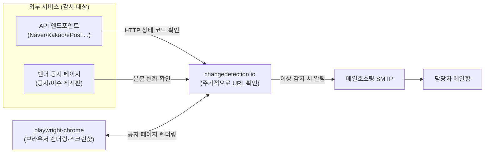
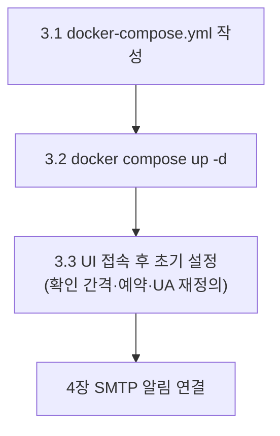
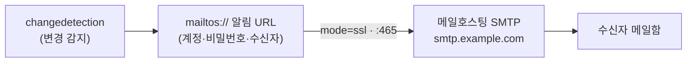
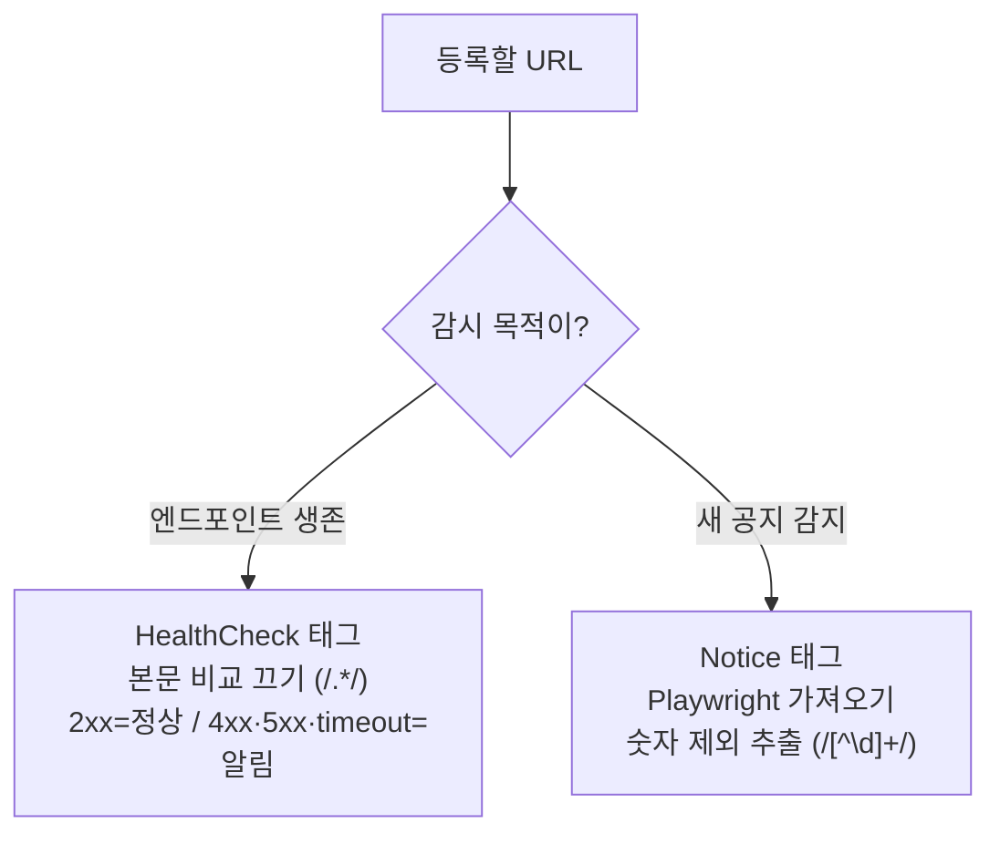

# 외부 서비스 의존성 · 모니터링 (Legacy-Portal / legacy-system) — 카탈로그 · changedetection.io · SMTP 알림

> 외부 API/SDK 의존성 카탈로그와 changedetection.io 기반 자동 모니터링 가이드. 호출 경로 변경, 응답 변화, 종료 공지를 사전 감지해 SMTP 로 알린다. 대상은 **레거시 JSP 시스템(Legacy-Portal / legacy-system·smart-mfg)** — full-stack-template SaaS 와는 별개. 키/비밀번호는 `<PLACEHOLDER>` 로 표기. 실제 값은 각 프로젝트 properties 파일 또는 비밀번호 매니저 참조 (IP·계정은 사내 값).

---

## 0. 큰 그림

레거시 시스템은 주소검색, 검색, 본인인증, SMS 같은 **외부 서비스**에 의존한다. 외부 서비스가 호출 경로를 바꾸거나 점검·종료 공지를 올리거나 응답이 깨지면 우리 시스템도 같이 죽는다. 이 문서는 **자동 감지 후 메일 알림** 파이프라인을 세운다.



용어부터 풀고 간다 (처음 보는 단어):

- **changedetection.io** — 지정한 URL 을 주기적으로 열어 "지난번과 달라졌나" 를 비교하고, 달라지면 알림을 쏘는 오픈소스 웹 변경 감지 도구. 이 문서의 주인공.
- **watch(모니터링)** — changedetection.io 에서 감시 대상 URL 하나의 단위. 이 문서에서 "모니터링" 은 UI 의 watch 를 말한다.
- **Playwright** — 실제 브라우저(Chromium)를 자동 조작하는 도구. JS 페이지를 렌더링하고 **스크린샷**까지 찍는다.
- **SMTP** — 메일 발송 프로토콜. 이상 감지 시 알림 메일을 보내는 통로(여기선 메일호스팅).
- **태그(HealthCheck / Notice)** — watch 를 그룹으로 묶는 라벨. 그룹 단위로 비교 정책을 다르게 건다 (§5).

구축은 두 가지로 나뉜다 — **API 는 "살아있나"(HealthCheck)**, **공지 페이지는 "새 글 올라왔나"(Notice)**. 비교 방식이 정반대라 §5 에서 따로 설정한다.

---

## 1. 개요

### 1.1 목적

- 외부 API/SDK 의 호출 경로 변경, 응답 변화, 종료 공지를 사전에 감지한다
- 의존하는 외부 서비스의 정책/시스템 점검 공지를 자동으로 수신한다
- 이슈 발생 시 SMTP 이메일로 자동 알림한다
- 외부 API 호출 경로/프로토콜 변경 시 영향받는 코드 위치를 파악한다

### 1.2 모니터링 범위
§2 의존성 목록 중 HTTP 기반 항목이다.

- API 엔드포인트 헬스체크 — 응답 정상 여부를 확인한다
- 벤더 공지 페이지 — 신규 게시글을 감지한다

### 1.3 모니터링 대상 외 (별도 처리 필요)

HTTP 로 찔러볼 수 없는 의존성은 changedetection.io 로 못 본다. 아래는 별도 수단이 필요하다:

- **AnySign** (클라이언트 PC 모듈) — 외부 모니터링 불가
- **xecure** (서버 내장 Java 라이브러리) — 외부 모니터링 불가
- **CoolSMS** (TCP 소켓 프로토콜) — Blackbox Exporter 등 별도 도구 필요

---

## 2. 외부 서비스 의존성 목록

이 절은 **카탈로그**. 시스템이 무엇에 의존하는지 한 곳에 모았다. 모니터링 등록 전 여기서 호출 경로, 인증 키, 공지 페이지를 찾는다. 각 항목의 **공지 페이지**는 §5.5 Notice 대상이고, **호출 경로**는 §5.4 HealthCheck 대상이다.

> 인증 키·serviceKey 는 `<PLACEHOLDER>` — 실제 값은 각 프로젝트 properties 파일 참조.

### 2.1 주소검색

#### Kakao Postcode (JS SDK)

- **호출 방식**: CDN (JS SDK) — 브라우저에서 직접 로드
- **호출 경로**: `https://t1.kakaocdn.net/mapjsapi/bundle/postcode/prod/postcode.v2.js`
- **인증 키**: 없음
- **사용 위치**: JSP 27개 (legacy-system-ptlweb2 9, legacy-system-directory4 9, legacy-system-directory-mobile 5, legacy-system-ptlweb-mobile 3, legacy-system-info 1) — 하드코딩
- **공지 페이지**:
  - 주요 공지 (1차 채널): https://github.com/daumPostcode/QnA/issues?q=state%3Aopen%20label%3A%22notice%22
  - 일반 공지: https://devtalk.kakao.com/c/notice

#### 우체국 ePost 신도로명 주소검색 (REST/XML)

- **호출 방식**: 서버 REST 호출 (Java → HTTP GET → XML 파싱)
- **호출 경로**: `http://openapi.epost.go.kr/postal/retrieveNewAdressAreaCdService/retrieveNewAdressAreaCdService/getNewAddressListAreaCd`
- **인증 키**: `Globals.openapi.zip.roadNewCd.serviceKey` = `<EPOST_SERVICE_KEY>` (URL 인코딩됨)
- **사용 위치**: legacy-system-info, legacy-system-inv2026 properties + `PopupZipRoadController#popupZipRoadNew` (`/cmm/popup/popupZipRoadNewCd.do`) → 37개 JSP가 popup 호출
- **공지 페이지**: https://www.data.go.kr/bbs/ntc/selectNoticeListView.do?pageIndex=1&originId=&atchFileId=&nttApiYn=Y&searchCondition2=2&searchKeyword1=%EB%8F%84%EB%A1%9C%EB%AA%85
- **참고**: 정상 동작 중이나 Kakao Postcode 전환 검토 가능 (전환 시 모니터링 대상 1개 감소)

### 2.2 검색 API

#### Naver 통합검색

- **호출 방식**: 서버 REST 호출 (Java → HTTP GET, 헤더 인증)
- **호출 경로**: `https://openapi.naver.com/v1/search/`
- **인증 키** (HTTP 헤더): `X-Naver-Client-Id: <NAVER_CLIENT_ID>` / `X-Naver-Client-Secret: <NAVER_CLIENT_SECRET>`
- **사용 위치**: legacy-system-directory-mobile, legacy-system-directory4 properties
- **공지 페이지**: https://developers.naver.com/notice

#### Kakao 검색

- **호출 방식**: 서버 REST 호출 (Java → HTTP GET, 헤더 인증)
- **호출 경로**: `https://dapi.kakao.com/v2/search/`
- **인증 키** (HTTP 헤더 `Authorization`): `KakaoAK <KAKAO_REST_KEY>`
- **사용 위치**: legacy-system-directory-mobile, legacy-system-directory4 properties
- **공지 페이지**: https://devtalk.kakao.com/c/notice

### 2.3 본인인증 / 외부 연동

#### OK-CERT (KCB) 본인인증

- **호출 방식**: 클라이언트 팝업 (form submit 으로 외부 페이지 이동)
- **호출 경로**: `Globals.hscert.popup_url` = `https://safe.ok-name.co.kr/CommonSvl`
- **인증 정보**:
  - `Globals.hscert.cp_cd` = `<OKCERT_CP_CD>` (CP 코드)
  - `Globals.hscert.target` = `PROD`
  - `Globals.hscert.license_dir` = `C:\prod\okcert3\license\` (라이선스 파일 디렉토리)
  - `Globals.hscert.site_name` = `example.or.kr` / `Globals.hscert.site_url` = `example.or.kr`
- **사용 위치**: legacy-system-ptlweb2, legacy-system-info, legacy-system-ptlweb-mobile properties
- **공지 페이지**: https://www.ok-name.co.kr/CommonSvl?tc=kcb.acs.non.mn.cmd.BizCusBoardCmd (오케이네임 기업고객 공지사항)

#### KITA FTA Q&A

- **호출 방식**: 서버 REST 호출 (Java → HTTP)
- **호출 경로**: 개발 `http://devokfta.kita.net:8802/api/` / 운영 `http://okfta.kita.net:8802/api/`
- **인증 키** (`Globals.api.kita.ftaQna.serviceKey`): 개발 `<KITA_SERVICE_KEY_DEV>` / 운영 `<KITA_SERVICE_KEY_PROD>`
- **사용 위치**: legacy-system-ptlweb-mobile, legacy-system-ptlweb2 properties
- **공지 페이지**: X

#### AnySign (HanCom Secure 클라이언트 PKI 모듈)

- **호출 방식**: 로컬 호스팅 JS + 클라이언트 PC Native 모듈
- **호출 경로**: `/AnySign/anySign4PCInterface.js` (서버 로컬 호스팅)
- **인증 방식**: Active X / Native 모듈 (클라이언트 PC 설치 필요)
- **사용 위치**: legacy-system-info (login.jsp, kma1511.jsp), legacy-system-inv2026 (login.jsp), legacy-system-inv2025 (login.jsp)
- **공지 페이지**: X
- **참고**: 클라이언트 측 서명/인증 모듈. 브라우저 정책(NPAPI 폐기 등) 변경 시 영향

#### xecure (Softforum/Inca Internet 서버 PKI)

- **호출 방식**: 서버측 Java 라이브러리 (패키지 import)
- **Java 패키지**: `xecure.crypto.VidVerifier`, `xecure.servlet.XecureConfig`
- **인증 방식**: 서버 측 인증서 식별 검증 (VID Verifier) — AnySign 과 페어로 동작
- **활성화 플래그**: `Globals.isUseXecureWEB=N`(로컬/개발) / `Globals.isUseXecureWEB=Y`(**운영 활성화**)
- **사용 위치**: legacy-system-info (login.jsp, kma1511.jsp), legacy-system-inv2026 (login.jsp), legacy-system-inv2025 (login.jsp)
- **공지 페이지**: X
- **참고**: AnySign(클라이언트) ↔ xecure(서버) PKI 페어. 라이선스 갱신, JDK 호환성, 인증기관 정책 변경 시 영향

#### CoolSMS (SMS 발송 게이트웨이)

- **호출 방식**: TCP 소켓 (커스텀 프로토콜) — Java 가 직접 소켓 연결
- **호출 경로** (Java 코드 하드코딩, 3개 호스트 로드밸런싱): `alpha.coolsms.co.kr:80`, `bravo.coolsms.co.kr:80`, `delta.coolsms.co.kr:80`
- **프로토콜**: TBSP/1.0 (CoolSMS 자체 TCP 프로토콜)
- **인증 정보**: userid + password (코드/환경변수 기반, properties 에 없음)
- **사용 위치**: `cmm/sms/SMS.java` (legacy-system-template, legacy-system-ptlweb-mobile, legacy-system-directory-mobile), `NotifyServiceImpl.java` 가 SMS.java 호출
- **공지 페이지**: X

### 2.4 SNS 공유

#### Kakao SDK v2.7.4 (CDN)

- **호출 방식**: CDN (JS SDK) — 브라우저 직접 로드, SDK 가 내부적으로 Kakao 백엔드 호출 (kapi/kauth/sharer)
- **호출 경로**: `https://t1.kakaocdn.net/kakao_js_sdk/2.7.4/kakao.min.js`
- **인증 키** (JavaScript 키 — `Kakao.init()` 시 사용):
  - legacy-system-ptlweb-mobile: `daumkakao.api.key.javascript` = `<KAKAO_JS_KEY_PTLWEB>`
  - legacy-system-directory-mobile: `daumkakao.api.key.javascript` = `<KAKAO_JS_KEY_DIRECTORY>`
- **메시지 템플릿 ID** (Kakao Developers 콘솔 사전 등록): ptlweb-mobile `78881` / directory-mobile `78791`
- **사용 위치**: 모바일 JSP 12개
- **공지 페이지**: https://devtalk.kakao.com/c/notice

#### X 공유

- **호출 방식**: 클라이언트 리다이렉트 (`window.open`)
- **호출 경로**: `https://x.com/intent/post?text={title}&url={url}`
- **인증 키**: 없음
- **사용 위치**: 모바일 JSP 12개
- **공지 페이지**: X

#### Facebook sharer

- **호출 방식**: 클라이언트 리다이렉트 (`window.open`)
- **호출 경로**: `https://www.facebook.com/sharer/sharer.php?u={url}`
- **인증 키**: 없음
- **사용 위치**: 모바일 JSP 12개
- **공지 페이지**: X

### 2.5 분석 / 추적

#### Google Tag Manager (gtag)

- **호출 방식**: CDN (JS SDK, async) — 브라우저 비동기 로드, 이벤트마다 google-analytics.com 으로 전송
- **호출 경로**: `https://www.googletagmanager.com/gtag/js?id={trackingId}`
- **추적 ID** (프로젝트별, 클라이언트 노출 값):
  - legacy-system-info: `G-XXXXXXXXXX`(개발), `G-XXXXXXXXXX`(운영)
  - legacy-system-inv2026: `G-XXXXXXXXXX`(개발), `G-XXXXXXXXXX`(운영)
  - legacy-system-directory4 / legacy-system-directory-mobile: `G-XXXXXXXXXX`(개발), `G-XXXXXXXXXX`(운영)
  - legacy-system-ptlweb2 / legacy-system-ptlweb-mobile: `G-XXXXXXXXXX`(개발), `G-XXXXXXXXXX`(운영)
- **사용 위치**: JSP 11개 (frameTop/login/dirTop)
- **공지 페이지**: X

### 2.6 위젯 / 임베드

#### Google Maps embed

- **호출 방식**: iframe 임베드
- **호출 경로**: `https://www.google.com/maps/embed?pb={encodedLocation}`
- **인증 키**: 없음
- **사용 위치**: mob9412.jsp, fmf1310.jsp
- **공지 페이지**: X

#### Smile CDN 동영상 스트림 (Wowza)

- **호출 방식**: HLS 스트리밍 (브라우저 video.js 가 m3u8 재생)
- **호출 경로**: `https://vod.example.com:443/legacy-portal/_definst_/`
- **프로토콜**: HLS (`.m3u8` playlist)
- **인증 키**: 없음 (URL 기반)
- **사용 위치**: fmv1011.jsp (line 243)
- **공지 페이지**: X
- **참고**: Legacy-Portal VOD 영상의 실제 스트림 서버. 도메인/경로/포트 변경 시 영상 재생 불가

### 2.7 자체 / 외부 인프라

#### KPI 시스템 (스마트제조 지원시스템)

- **호출 방식**: 서버 REST 호출 (Java → HTTP)
- **호출 경로**: 개발 `http://www.kpi.example.com:8080/kpiLv1/kpiLv1InsertTst` (Lv2/Lv3 동일 패턴) / 운영 `http://www.kpi.example.com:8080/kpiLv1/kpiLv1Insert`
- **인증 키**: `Globals.kpi.kpiCertKey` = `<KPI_CERT_KEY>`
- **사용 위치**: smart-mfg (smart-mfg 프로젝트) properties
- **공지 페이지**: https://www.kpi.example.com/bbs/list/1/4

---

## 3. changedetection.io 설치

컨테이너 두 개를 올린다 — **changedetection**(감시 엔진)과 **playwright-chrome**(JS 렌더링·스크린샷용). 둘은 함께 동작한다 (§5.3 Notice 스크린샷에 필요).



### 3.1 docker-compose.yml

```yaml
services:
  playwright-chrome:
    image: dgtlmoon/sockpuppetbrowser:latest
    container_name: playwright-chrome
    hostname: playwright-chrome
    cap_add:
      - SYS_ADMIN
    environment:
      - SCREEN_WIDTH=1920
      - SCREEN_HEIGHT=1024
      - SCREEN_DEPTH=16
      - MAX_CONCURRENT_CHROME_PROCESSES=10
    restart: always

  changedetection:
    image: dgtlmoon/changedetection.io:latest
    container_name: changedetection
    hostname: changedetection
    volumes:
      - changedetection_datastore:/datastore
    ports:
      - 9999:5000
    environment:
      - BASE_URL=http://192.0.2.22:9999
      - TZ=Asia/Seoul
      - PLAYWRIGHT_DRIVER_URL=ws://playwright-chrome:3000
      - PUID=1000
      - PGID=1000
    depends_on:
      - playwright-chrome
    restart: always

volumes:
  changedetection_datastore:
    name: changedetection_datastore
```

### 3.2 실행

```bash
docker compose up -d
docker compose logs -f changedetection   # 로그 확인
# 접속: http://192.0.2.22:9999
```

✅ **검증**: `docker compose ps` 에 `changedetection` · `playwright-chrome` 가 `Up` 상태. 브라우저로 `http://192.0.2.22:9999` 접속 시 changedetection.io 메인 화면이 뜬다.

### 3.3 초기 설정

1. 브라우저로 `http://192.0.2.22:9999` 접속
2. 우측 상단 **설정** 클릭
3. **일반** 탭:
   - **확인 간격**: 기본 재확인 간격 — `일=1` (하루 1회)
   - **시간 예약 사용** 체크 → **예약 실행 시간대**: 상단 **평일 낮** 버튼 (월~금 09:00 / 8h, 토·일 비활성) / **기준 시간대** `Asia/Seoul`
   - 비밀번호 설정 권장 (UI 보호)
4. **가져오기** 탭:
   - **기본 사용자 에이전트 재정의 → 일반 텍스트 요청**: `Mozilla/5.0 (Windows NT 10.0; Win64; x64) AppleWebKit/537.36 (KHTML, like Gecko) Chrome/120.0.0.0 Safari/537.36` (봇 차단 회피)
5. **알림** 탭: 4장의 SMTP 설정 적용

> **사용자 에이전트(User-Agent) = 요청 보낸 클라이언트가 "나는 어떤 브라우저다" 라고 밝히는 문자열.** 기본값은 봇처럼 보여 일부 사이트가 막는다 — 일반 크롬으로 위장해 차단을 피한다.

✅ **검증**: 설정 저장 후 메인 화면 상단에 예약 시간대(`Asia/Seoul`)와 확인 간격이 반영돼 보인다.

---

## 4. SMTP 알림 설정 (메일호스팅)

이상이 감지돼도 알림이 안 가면 무의미하다. changedetection 이 변경을 발견했을 때 메일을 보내도록 **메일호스팅 SMTP** 를 연결한다. 흐름: `changedetection → mailtos:// URL → 메일호스팅 SMTP → 수신자 메일함`.



### 4.1 메일호스팅 계정 정보

```text
Host: smtp.example.com
Port: 465 (SSL/TLS)
User: <SMTP_USER>            # 예: devuser@example.com
Password: <SMTP_PASSWORD>
```

### 4.2 changedetection.io 에서 설정

**설정 → 알림** 탭의 **알림 URL 목록** 입력란에:

```url
mailtos://<SMTP_USER_URLENCODED>:<SMTP_PASSWORD>@smtp.example.com:465?mode=ssl&from=<SMTP_USER>&to=<RECIPIENT>
```

> ⚠️ `mode=ssl` 은 반드시 명시 — 누락 시 STARTTLS 로 잘못 연결되어 timeout. 비밀번호/사용자에 특수문자·`@` 가 있으면 URL 인코딩(`@` → `%40`) 필요. 다수 수신자는 `to=a@b.com,c@d.com` 처럼 콤마 구분.

### 4.3 알림 메시지 템플릿

**설정 → 알림** 페이지에서 편집.

**알림 형식**: `HTML Color` 선택

**알림 제목**:

```jinja
[API Watchdog][{{watch_tag}}] {{watch_title}}
```

**알림 본문** (HTML, 테이블 기반):

```html
<div style="font-family:Arial,sans-serif;border:1px solid #e1e4e8;border-radius:6px;overflow:hidden;"><div style="background:#2c3e50;color:#fff;padding:16px 20px;"><strong style="font-size:18px;">🔔 {{watch_title}}</strong></div><div style="background:#f6f8fa;padding:12px 20px;border-bottom:1px solid #e1e4e8;font-size:14px;"><div style="padding:3px 0;"><span style="color:#586069;display:inline-block;width:80px;">🕐 시각</span>{{change_datetime}}</div><div style="padding:3px 0;"><span style="color:#586069;display:inline-block;width:80px;">🌐 URL</span><a href="{{watch_url}}" style="color:#0366d6;text-decoration:none;">{{watch_url}}</a></div><div style="padding:3px 0;"><span style="color:#586069;display:inline-block;width:80px;">🏷️ 태그</span>{{watch_tag}}</div></div><div style="text-align:center;padding:20px;"><a href="{{base_url}}/diff/{{watch_uuid}}#screenshot" style="display:inline-block;background:#0366d6;color:#fff;padding:12px 32px;text-decoration:none;border-radius:6px;font-size:14px;font-weight:600;">전체 비교 보기 →</a></div></div>
```

> 사용 가능한 토큰은 UI 의 **토큰/자리표시자 보기** 버튼으로 확인. 본문 끝의 `{{base_url}}/diff/{{watch_uuid}}#screenshot` 링크가 변경 시점 스크린샷을 보여주는데, 이게 동작하려면 watch 가 Playwright 로 가져와져야 한다 (§5.3).

### 4.4 알림 테스트

1. **설정 → 알림** 상단의 **테스트 알림 보내기** 클릭
2. 메일함 확인
3. 미수신 시: **알림 디버그 로그** 확인 → 메일호스팅 SMTP 인증 정책(외부 IP 차단 등) 확인 → 비밀번호 재확인(특수문자 URL 인코딩) → 컨테이너 로그 `docker logs changedetection`

✅ **검증**: **테스트 알림 보내기** 후 수신자 메일함에 `[API Watchdog]` 제목의 테스트 메일이 도착한다. 도착하면 알림 경로 전체가 살아있는 것.

---

## 5. 모니터링 등록 가이드

§2 카탈로그의 URL 들을 watch 로 등록한다. 핵심은 **두 정책**. 정반대 방향이라 절대 섞으면 안 된다.

| 태그 | 목적 | 비교 대상 | 가져오기 방식 |
|---|---|:---:|---|
| `HealthCheck` | API 생존 확인 | 본문 무시, **HTTP 상태 코드만** | 기본(텍스트/HTTP) |
| `Notice` | 신규 공지 감지 | **본문 변화**(숫자 제외) | Playwright(스크린샷) |



메인 화면 URL 입력란에 URL 붙여넣고 **+ Watch / + 모니터링 추가**.

### 5.1 공통 권장 설정

각 모니터링은 **URL** 과 **태그** 만 입력한다. 나머지는 전역 설정을 따른다.

- **태그**: 그룹 단위 관리용 (`HealthCheck` 또는 `Notice`)
- **확인 간격**: 전역 설정을 따른다 (개별 조정은 모니터링 편집)
- **알림**: 전역 알림 URL 을 사용한다

> 정책(필터)을 watch 마다 거는 대신 **그룹(태그) 단위로 한 번** 걸어 모든 멤버에 적용한다 (§5.2·§5.3 의 그룹 편집). 새 watch 는 태그만 붙이면 정책을 자동 상속한다.

### 5.2 HealthCheck 정책 (HTTP 2xx 기반)

`HealthCheck` 태그는 응답 본문 변화는 무시하고, HTTP 상태 코드만으로 정상 여부를 판단한다.

- 2xx → 정상으로 판단하고 알림을 보내지 않는다
- 4xx/5xx, timeout, connection refused → 알림을 발송한다

> **왜 본문을 무시하나**: 검색 API 의 `total`, `lastBuildDate`, `items` 등 본문 값은 호출마다 자연스럽게 바뀐다. 본문 변화에 알림을 걸면 "내용이 달라졌다" 알림이 끝없이 쏟아진다. "엔드포인트가 살아있는가" 만 확인하면 충분하다.

#### 그룹(태그) 단위 설정

전역 설정으로 `Notice` 태그까지 본문 비교가 꺼져 공지 감지가 무력화된다. **`HealthCheck` 태그에만 한정 적용한다**.

**경로**: 상단 **그룹** → `HealthCheck` 행 **편집** → **필터 및 트리거** 탭 → **텍스트 필터링 → 포함된 줄 무시(Ignore Text)** 입력란에 한 줄:

```regex
/.*/
```

저장. "모든 줄 무시" 정규식으로 본문 비교 대상이 0 이 된다. JSON, JS, HTML, XML, 텍스트 모두 무관하게 작동한다.

> **CSS/XPath 필터(`.never-matches` 같은 더미 셀렉터)로 처리하면 안 된다.** Naver/Kakao 검색(JSON), GTM(JS), Smile CDN(m3u8) 등 비-HTML 응답에서 "Warning, no filters were found" 에러로 watch 가 에러 상태에 빠진다.

4xx/5xx, 연결 실패, timeout 은 본문 비교와 무관한 별도 에러 경로이므로 그대로 알림이 간다. **HealthCheck 에는 키워드 트리거를 걸지 않는다**(본문을 안 보므로). 본문 기반 감지가 필요하면 `Notice` 태그로 분리한다.

✅ **검증**: `HealthCheck` 그룹 편집 화면에서 **포함된 줄 무시** 에 `/.*/` 가 저장돼 있다. 멤버 watch 를 수동 재확인했을 때 "변경 없음"(2xx) 이면 알림이 안 오고, 일부러 잘못된 URL 을 넣으면 에러 알림이 온다.

### 5.3 Notice 정책 (조회수 노이즈 제거)

`Notice` 태그는 **공지 신규 게시 감지**가 목적이다. 대부분 게시판이 `조회수 : 73` 같은 카운터를 포함하고, 열 때마다 숫자가 바뀌어 false-positive 가 쏟아진다.

> **false-positive(거짓 양성) = 새 공지가 없는데 "변경됐다" 고 잘못 울리는 알림.** 조회수가 1 올라간 것뿐인데 새 글로 오인하는 경우가 대표적이다.

해결: **숫자만 비교 대상에서 제외하고 나머지(한글, 영문, 특수문자, 공백) 유지**.

#### 가져오기 방식: Playwright 일괄 적용

`Notice` 태그는 **모두 Playwright(`ws://playwright-chrome:3000`)** 로 가져온다. 이유는 **스크린샷** — 일반 텍스트/HTTP 방식은 스크린샷을 만들지 않는다. 알림 메일의 "전체 비교 보기" 링크에서 변경 시점 모습을 보기 어렵다. Playwright 로 통일하면 변경 직전/직후 캡처 비교 가능해진다.

**경로**: 모니터링 편집 → **가져오기** 탭 → **가져오기 방식** `Playwright Chromium/Javascript via 'ws://playwright-chrome:3000'` → 저장.

#### 텍스트 추출 필터 (그룹 단위)

**경로**: 상단 **그룹** → `Notice` 행 **편집** → **필터 및 트리거** 탭 → **텍스트 필터링 → 텍스트 추출(Extract Text)** 입력란에 한 줄:

```regex
/[^\d]+/
```

저장. `[^\d]+` = "숫자 아닌 문자 1개 이상" → 조회수·등록일 등 숫자는 비교 대상에서 빠지고, 한글/영문/공백/구두점은 유지되어 신규 공지 제목(한글)은 정상 감지.

> ⚠️ "포함된 줄 무시" 에 `/\d+/` 를 넣지 말 것 — 공지 줄엔 번호/날짜/조회수 숫자가 있어 줄 전체가 무시되며 신규 공지를 못 잡는다.

✅ **검증**: `Notice` 그룹에 추출 필터 `/[^\d]+/` 가 저장되고, 멤버 watch 의 가져오기 방식이 Playwright 로 설정돼 있다. watch 를 한 번 받아오면 diff 화면에 스크린샷 탭이 생긴다.

### 5.4 API 헬스체크 그룹

> 헤더/URL 의 키는 §2 의 `<PLACEHOLDER>` 실제 값으로 치환해 등록. 본문 변화 무시, HTTP 2xx 여부만 확인 (5.2 정책).

```text
# Kakao Postcode JS  — 태그: HealthCheck
https://t1.kakaocdn.net/mapjsapi/bundle/postcode/prod/postcode.v2.js

# Kakao SDK JS  — 태그: HealthCheck
https://t1.kakaocdn.net/kakao_js_sdk/2.7.4/kakao.min.js

# ePost 신도로명 주소검색  — 태그: HealthCheck  (srchwrd=세종로 17, URL 인코딩)
http://openapi.epost.go.kr/postal/retrieveNewAdressAreaCdService/retrieveNewAdressAreaCdService/getNewAddressListAreaCd?ServiceKey=<EPOST_SERVICE_KEY>&searchSe=road&srchwrd=%EC%84%B8%EC%A2%85%EB%A1%9C%2017

# KPI 시스템 헬스체크  — 태그: HealthCheck
http://www.kpi.example.com:8080/

# OK-CERT (KCB) 헬스체크  — 태그: HealthCheck
https://safe.ok-name.co.kr/CommonSvl?tc=kcb.acs.non.mn.cmd.LandMainCmd

# Google Tag Manager  — 태그: HealthCheck  (개발 GA ID, 운영 보고서 영향 없음)
https://www.googletagmanager.com/gtag/js?id=G-XXXXXXXXXX

# Smile CDN m3u8  — 태그: HealthCheck
https://vod.example.com:443/legacy-portal/_definst_/
```

**Naver 통합검색** — 태그 `HealthCheck`, URL `https://openapi.naver.com/v1/search/blog.json?query=test`. 모니터링 편집 → **가져오기** 탭 → **Request headers**:

```text
X-Naver-Client-Id: <NAVER_CLIENT_ID>
X-Naver-Client-Secret: <NAVER_CLIENT_SECRET>
```

**Kakao 검색** — 태그 `HealthCheck`, URL `https://dapi.kakao.com/v2/search/web?query=test`. **Request headers**:

```text
Authorization: KakaoAK <KAKAO_REST_KEY>
```

✅ **검증**: 각 watch 가 등록 직후 첫 확인에서 에러 없이 받아와진다(상태 2xx). 헤더가 빠진 Naver/Kakao 는 4xx 가 떠 알림이 오므로, 첫 등록 시 헤더부터 채운다.

### 5.5 공지 페이지 그룹

> 5.5 항목은 모두 **Playwright** 가져오기 방식 (5.3 정책). 태그: `Notice`.

```text
# Kakao Developers 공지 (Postcode/SDK/검색 공통)
https://devtalk.kakao.com/c/notice

# Kakao Postcode 주요 공지 (GitHub Issues)
https://github.com/daumPostcode/QnA/issues?q=state%3Aopen%20label%3A%22notice%22

# Naver Developers 공지
https://developers.naver.com/notice

# 공공데이터포털 API 공지 (ePost)
https://www.data.go.kr/bbs/ntc/selectNoticeListView.do?pageIndex=1&originId=&atchFileId=&nttApiYn=Y&searchCondition2=2&searchKeyword1=%EB%8F%84%EB%A1%9C%EB%AA%85

# KCB OK-CERT 공지
https://www.ok-name.co.kr/CommonSvl?tc=kcb.acs.non.mn.cmd.BizCusBoardCmd

# KPI 시스템 공지
https://www.kpi.example.com/bbs/list/1/4
```

✅ **검증**: 각 공지 watch 가 Playwright 로 받아와지고 첫 스냅샷이 잡힌다. 이후 공지 게시판에 새 글이 올라오면(숫자 외 텍스트 변화) 알림 메일이 온다.

---

## 6. 흔한 실수

초보자가 자주 빠지는 함정 — 위 본문 `⚠️` 콜아웃을 한 곳에 모았다.

| 실수 | 무슨 일이 나나 | 올바른 방법 |
|---|---|---|
| `mode=ssl` 누락 | STARTTLS 로 잘못 연결돼 메일 timeout | 알림 URL 에 `?mode=ssl` 명시 (§4.2) |
| 비밀번호·계정의 `@`/특수문자 미인코딩 | 인증 실패로 메일 미발송 | URL 인코딩 (`@` → `%40`) (§4.2) |
| HealthCheck 에 CSS/XPath 더미 셀렉터 사용 | 비-HTML(JSON/JS/m3u8) 응답에서 "no filters were found" 에러 → watch 가 에러 상태 | 그룹 **포함된 줄 무시** 에 `/.*/` (§5.2) |
| HealthCheck 에 키워드 트리거 추가 | 본문을 안 보므로 무의미 | 본문 기반 감지가 필요하면 `Notice` 로 분리 (§5.2) |
| Notice "포함된 줄 무시" 에 `/\d+/` | 공지 줄에 번호·날짜·조회수 숫자가 있어 줄 전체가 무시 → 신규 공지 누락 | **텍스트 추출** 에 `/[^\d]+/` (§5.3) |
| Notice 를 텍스트/HTTP 로 가져오기 | 스크린샷이 안 생겨 알림 메일의 "스크린샷" 링크가 빈다 | 가져오기 방식을 Playwright 로 (§5.3) |
| 기본 사용자 에이전트 사용 | 일부 사이트가 봇으로 보고 차단 | 크롬 UA 로 재정의 (§3.3) |

---

## 7. 요약·체크리스트

`HealthCheck`(API 생존) 와 `Notice`(공지 신규)는 비교 방향이 정반대다. `HealthCheck` 는 본문을 무시하고 상태 코드만 확인한다. `Notice` 는 본문을 보되 숫자만 뺀다. 그룹 단위 필터로 한 번에 걸고, 알림은 메일호스팅 SMTP 로 통일한다.

구축 체크리스트:

- [ ] §3 두 컨테이너(`changedetection` + `playwright-chrome`) `Up`, `:9999` 접속 OK
- [ ] §3.3 확인 간격·예약 시간대(`Asia/Seoul`)·사용자 에이전트 재정의 적용
- [ ] §4 SMTP 알림 URL 에 `mode=ssl` 포함, 특수문자 URL 인코딩, **테스트 알림** 수신 확인
- [ ] §5.2 `HealthCheck` 그룹 **포함된 줄 무시** = `/.*/` (CSS/XPath 셀렉터 아님)
- [ ] §5.3 `Notice` 그룹 **텍스트 추출** = `/[^\d]+/`, 가져오기 방식 = Playwright
- [ ] §5.4 API 헬스체크 watch 등록 + Naver/Kakao 헤더 입력 + `<PLACEHOLDER>` 실제 값 치환
- [ ] §5.5 공지 페이지 watch 등록 (모두 `Notice`/Playwright)

---
관련 문서: [Claude Code 토큰 절감 — Serena + rtk](토큰절감-rtk-serena.md) · [.docs 작성 규칙](../CLAUDE.md)
