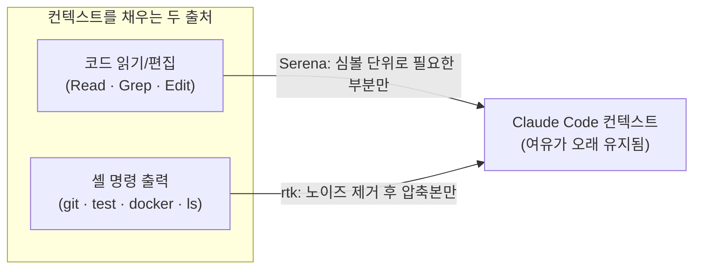
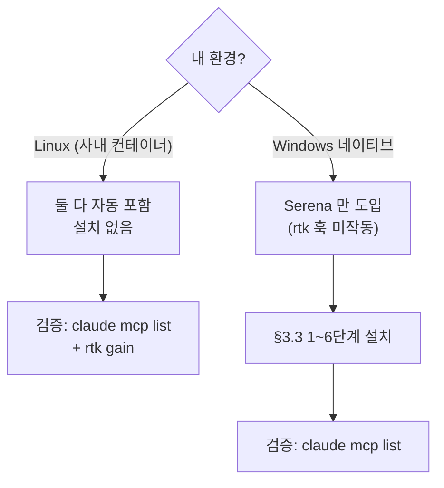
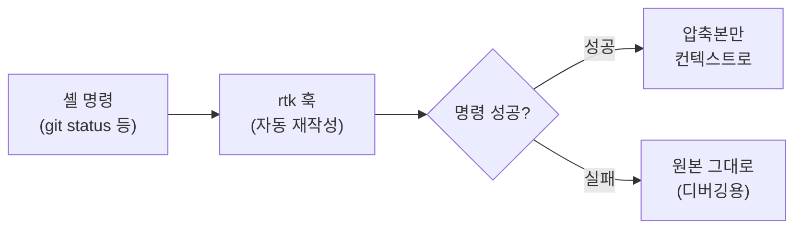

# Claude Code 토큰 절감 — Serena + rtk

> Claude Code 컨텍스트를 아끼는 두 도구 — **Serena**(LSP 기반 심볼 단위 코드 읽기/편집)와 **rtk**(셸 출력 압축). 절감 영역이 겹치지 않아 효과는 누적된다. 둘 다 무료·MIT·로컬 실행. 전 서비스 공통 개발 도구.

---

## 0. 한눈에 보기

Claude Code 는 작업 중 코드와 셸 출력을 **컨텍스트**(모델의 일회 입력 창)에 계속 쌓는다. 차면 강제로 비우거나(컴팩션) 재시작해야 한다. **Serena 와 rtk 는 서로 다른 출처의 군더더기를 컨텍스트에 들어가기 전에 걸러낸다.** 그 결과 컨텍스트가 더 오래 유지된다.



| 도구 | 어떤 토큰을 줄이나 | 우리 팀 환경에서 |
|---|---|---|
| **Serena** | 코드 읽기/편집 (Read, Grep, Edit) | Linux + Windows 모두 정상 동작 |
| **rtk** | 셸 명령 출력 (git, test, docker, ls 등) | Linux 도입 / Windows 미도입 (자동 훅 미작동) |

### 도입 권장 순서

- **Linux (사내 컨테이너)**: 둘 다 컨테이너에 자동 포함됨. SSH 진입 후 `claude mcp list` 로 연결 확인만 하면 된다.
- **Windows 네이티브**: Serena 만 도입한다.



> 모델별 메모: Serena 는 Sonnet 4.5/4.6, Haiku, Opus 4.6 에서 정상 작동. Opus 4.7 만 내장 도구 편향이 강해 Serena 호출이 잘 안 된다. VSCode "Recommended" 는 Sonnet 위주지만 작업에 따라 Opus 로 라우팅된다. 라우팅이 Opus 4.7 로 갈 때만 부분 영향. Opus 4.7 을 직접 선택해 본격 작업할 땐 시스템 프롬프트 카운터바이어스가 필요.

---

## 1. 왜 도입하는가

### 1.1 무엇을 해결하나 — 컨텍스트 낭비 두 종류

Claude Code 는 두 종류의 컨텍스트 낭비를 안고 간다.

- **셸 명령 출력 노이즈** — `git status`, `cargo test`, `docker ps` 출력 중 약 70% 는 진행 표시줄, 통과 로그, ANSI 컬러 등 모델에 무관한 텍스트. 그대로 컨텍스트에 들어가 매 메시지 토큰 부담이 커진다.
- **파일 단위 코드 읽기** — 기본 Read 는 파일 단위다. 1,000 줄 파일에서 함수 하나만 필요해도 전체가 컨텍스트에 올라간다.

> 용어 — **컨텍스트(context)**: 모델이 한 응답에서 참고하는 텍스트 창. 코드·대화·셸 출력이 모두 쌓이며, 차면 컴팩션(요약)이나 재시작이 강제된다. **컴팩션**: 컨텍스트가 한계에 가까워질 때 이전 대화를 요약해 공간 비움 — 잦으면 맥락이 끊긴다.

### 1.2 각 도구가 한 영역씩 맡는다

- **rtk** 가 셸 출력을 컨텍스트에 들어가기 *직전*에 걸러 평균 60–90% 압축. 예: `cargo test` 4,800 → 11, `git diff` 21,500 → 1,259, `ls -la` 3,200 → 640 토큰.
- **Serena** 가 LSP 심볼 도구(`find_symbol`, `find_referencing_symbols`, `replace_symbol_body` 등)로 *필요한 부분만* 가져온다. 크로스파일 리팩토링처럼 8~12단계가 필요한 작업도 atomic 호출 하나로 처리된다.

> 용어 — **LSP(Language Server Protocol)**: 에디터가 언어 서버에 "이 심볼의 정의/참조 위치"를 묻는 표준 프로토콜. Serena 는 파일 전체 대신 **심볼(함수·클래스 단위)** 만 정확히 가져온다. **atomic 호출**: 여러 단계를 한 번에 처리.

### 1.3 체감 효과

- **세션이 더 오래 간다** — 컨텍스트가 덜 차서 강제 컴팩션·재시작 빈도가 줄어든다.
- **한 메시지에 더 많이 처리된다** — 컨텍스트 여유만큼 한 응답에서 더 깊은 작업까지 처리된다.
- **리팩토링이 안정적이다** — 텍스트 검색·치환보다 LSP 심볼 단위가 훨씬 덜 깨진다.

### 1.4 도입 부담

- 둘 다 무료, MIT, 로컬 실행. 외부 서버로 코드/데이터 전송 없음.
- Linux 컨테이너는 자동 셋업. 검증 한 번이면 끝.
- 효과 없으면 깨끗이 제거 가능 (`claude mcp remove serena` / `rtk init -g --uninstall`).

---

## 2. 두 도구가 나누는 역할

큰 그림은 §0 의 한 줄로 충분하다. 코드 쪽은 Serena, 셸 쪽은 rtk 가 맡는다. 아래 §3·§4 는 각 도구를 **개념(무엇·왜) → 설치(어떻게, 환경별 검증) → 사용** 순서로 풀어 쓴다. 본인의 환경에 맞는 설치 절만 따르면 된다.

---

## 3. Serena (시맨틱 코드 도구)

### 3.1 무엇·왜

Serena 는 Claude Code 가 코드를 **파일 통째**가 아닌 **심볼 단위**로 읽고 고치는 MCP 도구다. 1,000 줄 파일에서 함수 하나만 필요하면 그 함수만 컨텍스트에 올라간다. "이 컴포넌트 쓰는 곳 전부 바꾸기" 같은 크로스파일 작업도 LSP 가 정확히 짚어줘 텍스트 검색보다 덜 깨진다.

### 3.2 Linux 설치

**컨테이너 이미지에 자동 포함된다.** SSH 진입 후 검증만 하면 된다:

```bash
claude            # 첫 실행 시 Anthropic 로그인
claude mcp list   # serena: ... ✓ Connected
```

✅ **검증**: `claude mcp list` 출력에 `serena: ... ✓ Connected` 가 보이면 끝이다. 안 보이면 §5 의 "Serena 가 안 잡힐 때" 를 본다.

### 3.3 Windows 설치

> PowerShell 에서 실행 (관리자 권한 불필요, Long Path 활성화만 관리자 PowerShell).
> Node.js LTS 없으면 먼저 `winget install OpenJS.NodeJS.LTS` 후 새 PowerShell 창.

각 단계를 순서대로 실행하고, 마지막 검증까지 통과시킨다. (`uv` 설치 후엔 새 PowerShell 창을 열어야 PATH 가 반영된다.)

```powershell
# 1. Claude Code
npm install -g @anthropic-ai/claude-code

# 2. uv (설치 후 새 PowerShell 창)
powershell -ExecutionPolicy ByPass -c "irm https://astral.sh/uv/install.ps1 | iex"

# 3. Serena (Python 3.13 자동 다운로드, 1~2분)
uv tool install -p 3.13 serena-agent@latest --prerelease=allow

# 4. Serena 초기화 (default serena_config.yml 생성)
serena init

# 5. 데이터 위치를 프로젝트 밖으로 + 웹 대시보드 자동 오픈 끄기
$path = "$env:USERPROFILE\.serena\serena_config.yml"
$loc = 'project_serena_folder_location: "' + ($env:USERPROFILE -replace '\\','/') + '/.serena/projects/$projectFolderName/.serena"'
(Get-Content $path) | Where-Object { $_ -notmatch '^(project_serena_folder_location|web_dashboard_open_on_launch):' } | Set-Content $path -Encoding utf8
Add-Content -Path $path -Value $loc -Encoding utf8
Add-Content -Path $path -Value "web_dashboard_open_on_launch: false" -Encoding utf8

# 6. Claude Code MCP 등록 + 검증 (PowerShell의 -- 처리 우회 위해 cmd /c)
cmd /c "claude mcp add --scope user serena -- serena start-mcp-server --context claude-code --project-from-cwd"
claude mcp list   # serena: ... ✓ Connected
```

✅ **검증**: 마지막 `claude mcp list` 에 `serena: ... ✓ Connected` 가 뜨면 완료.

### 3.4 사용법

명시하지 않아도 Claude 가 알아서 호출한다. 평소처럼 자연어로 부탁하면 내부에서 아래 심볼 도구로 매핑된다.

- "이 컴포넌트를 사용하는 곳을 모두 찾아줘" → `find_referencing_symbols`
- "UserAuth 클래스를 보여줘" → `find_symbol`
- "이 파일의 주요 심볼만 알려줘" → `get_symbols_overview`
- "이 함수의 본문을 새 로직으로 교체해줘" → `replace_symbol_body`

---

## 4. rtk (셸 출력 압축)

### 4.1 무엇·왜

Claude Code 가 셸 명령을 실행할 때마다 출력이 통째로 컨텍스트에 들어간다. 그중 약 70% 는 무관한 노이즈다. rtk 는 출력이 **컨텍스트에 들어가기 직전**에 가로채 의미 있는 부분만 남긴다.



> 명령이 **실패하면 압축하지 않은 원본이 자동으로 표시**된다. 디버깅 때 정보 누락을 걱정할 필요 없다.

### 4.2 압축 효과 예시

| 명령 | 원본 (토큰) | 압축 후 (토큰) | 절감률 | 어떻게 |
|---|---|---|---|---|
| `cargo test` | 4,800 | 11 | ~99% | 통과 테스트 상세 로그 전부 제거, "262 passed" 결과만 |
| `pytest -v` | ~10,000 | ~50 | ~99% | 통과 테스트 1줄 요약, 실패 테스트만 상세 유지 |
| `npm install` | ~6,000 | ~150 | ~97% | progress bar / spinner 제거, "added N packages" 결과만 |
| `git diff` | 21,500 | 1,259 | ~94% | 의미 있는 hunk만 추출, 주변 컨텍스트 라인 압축 |
| `docker ps` | ~2,500 | ~400 | ~84% | 컬럼 정렬 + 컨테이너 상태 정보 우선 |
| `ls -la` | 3,200 | 640 | ~80% | 소유자/그룹/타임스탬프 정렬, 디렉토리 트리 요약 |
| `git log --oneline -50` | ~1,800 | ~600 | ~67% | 커밋 메시지 핵심만 보존 |

### 4.3 체감 효과

- **빌드/테스트가 잦은 워크플로우**에서 누적 효과가 크다. Bash 를 5~10번 호출할 때, 매 호출이 평균 70~90% 압축되면 세션 후반부 컨텍스트 여유가 크게 달라진다.
- **로그 추적이 깔끔해진다.** 큰 로그를 출력한 후 에러 원인을 찾을 때, 노이즈 없는 압축본이 핵심 정보를 쉽게 보여준다.
- **반복 상태 확인**(`git status`, `git log`, `ls`)도 한 세션에서 수십 번 하면 누적 토큰이 커진다.
- **`rtk gain`** 으로 본인 절감량 확인 가능 (명령별 절감 토큰 표시).

### 4.4 Linux 설치

**컨테이너 이미지에 자동 포함된다.** 검증만 하면 된다:

```bash
rtk --version  # 0.38.x 이상이면 정상
rtk gain       # 토큰 절감 통계
```

✅ **검증**: `rtk --version` 이 `0.38.x 이상`을 출력하면 정상. `rtk gain` 이 통계 화면을 띄우면 훅이 작동 중이다.

이후 평소처럼 `git status` 같은 명령을 그대로 쓰면 된다 (훅이 자동 재작성).

---

## 5. 흔한 실수

초보자가 자주 빠지는 함정이다.

- **Windows 에서 rtk 를 찾는다** — rtk 는 자동 훅이 Windows 네이티브에서 미작동이라 **미도입**이다(§0 표). Windows 에선 Serena 만 쓴다.
- **`uv` 설치 직후 같은 창에서 다음 명령 실행** — PATH 가 안 잡혀 `serena` 명령을 못 찾는다. §3.3 주석대로 **새 PowerShell 창**을 열고 이어간다.
- **PowerShell 에서 `claude mcp add` 를 `cmd /c` 없이 실행** — PowerShell 이 `--` 를 잘못 처리해 등록이 깨진다. §3.3 6단계의 `cmd /c "..."` 래핑을 그대로 쓴다.
- **Opus 4.7 로 본격 작업하며 Serena 가 안 불린다고 의심** — 버그가 아니라 내장 도구 편향이다(§0 메모). 이때만 시스템 프롬프트 카운터바이어스가 필요하다. 다른 모델(Sonnet 4.5/4.6, Haiku, Opus 4.6)에선 정상.
- **명령 실패 출력이 압축돼 정보가 빠졌다고 걱정** — rtk 는 **실패 시 원본을 그대로** 보여준다(§4.1). 압축은 성공 출력에만 적용된다.
- **Serena 가 `claude mcp list` 에 안 잡힘** — Linux 는 컨테이너 재진입/`claude` 재실행 후 다시 확인, Windows 는 §3.3 6단계 등록이 통과했는지 본다.

---

## 6. 요약·체크리스트

- **두 도구, 두 영역** — Serena = 코드 읽기/편집(심볼 단위), rtk = 셸 출력(압축). 겹치지 않아 효과 누적.
- **무료·MIT·로컬** — 외부로 코드/데이터 전송 없음. 효과 없으면 `claude mcp remove serena` / `rtk init -g --uninstall` 로 제거.

### 도입 체크리스트

Linux (사내 컨테이너):

- [ ] `claude mcp list` → `serena: ... ✓ Connected`
- [ ] `rtk --version` → `0.38.x 이상`
- [ ] `rtk gain` → 통계 화면 표시

Windows 네이티브 (Serena 만):

- [ ] §3.3 1~6단계 실행 (uv 설치 후 새 창 / `cmd /c` 래핑 주의)
- [ ] `claude mcp list` → `serena: ... ✓ Connected`

운영:

- [ ] 평소처럼 자연어/명령을 그대로 사용 — 둘 다 자동 호출/재작성
- [ ] 가끔 `rtk gain` 으로 절감량 확인
- [ ] Opus 4.7 직접 선택 시에만 Serena 카운터바이어스 고려

---
관련 문서: [외부 서비스 모니터링](외부서비스모니터링.md) · [.docs 작성 규칙](../CLAUDE.md)
