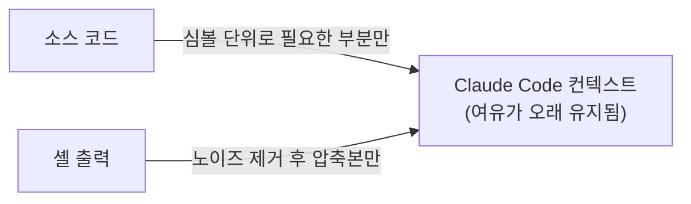

# Claude Code 토큰 절감 — 컨텍스트 절약 개발 도구

> Claude Code 컨텍스트를 아끼는 두 갈래 도구를 정리한다 — **심볼 단위 코드 도구**(LSP 기반으로 파일 통째가 아닌 함수·클래스 단위만 읽기/편집)와 **셸 출력 압축기**(셸 명령 출력을 컨텍스트에 들어가기 직전에 압축). 절감 영역이 겹치지 않아 효과는 누적된다. 전 서비스 공통으로 적용 가능한 개발 편의 도구이며, 구체 도구 선택은 팀·환경에 맡긴다.

---

## 0. 큰 그림

Claude Code 는 작업 중 코드와 셸 출력을 **컨텍스트**(모델의 일회 입력 창)에 계속 쌓는다. 차면 강제로 비우거나(컴팩션) 재시작해야 한다. 아래 두 갈래 도구는 서로 다른 출처의 군더더기를 **컨텍스트에 들어가기 전에** 걸러 컨텍스트가 더 오래 유지되게 한다.

| 갈래 | 무엇을 줄이나 | 방식 |
| --- | --- | --- |
| 심볼 단위 코드 도구 | 코드 읽기/편집 입력 | LSP 심볼 그래프 기반 MCP 서버 (`find_symbol` 류 도구) |
| 셸 출력 압축기 | 셸 명령 출력 입력 | 명령 출력을 가로채 의미 있는 부분만 남기는 훅 |

---

## 1. 심볼 단위 코드 도구 (LSP 기반)

파일을 **통째**가 아닌 **심볼 단위**(함수·클래스)로 읽고 고치는 접근이다. 1,000 줄 파일에서 함수 하나만 필요하면 그 함수만 컨텍스트에 올라간다.

- **개념** — LSP(Language Server Protocol)는 에디터가 언어 서버에 "이 심볼의 정의/참조 위치"를 묻는 표준 프로토콜이다. 이를 MCP 도구로 노출하면 모델이 파일 전체 대신 심볼만 정확히 가져온다.
- **왜** — "이 컴포넌트 쓰는 곳 전부 바꾸기" 같은 크로스파일 작업도 참조 그래프로 정확히 짚어줘 텍스트 검색보다 덜 깨지고, 8~12단계가 필요한 리팩토링도 호출 몇 번으로 처리된다.
- **도입** — LSP 를 MCP 로 붙여주는 오픈소스 서버를 `claude mcp add` 로 등록하면 된다. 등록 후 `claude mcp list` 에 해당 서버가 `✓ Connected` 로 보이면 정상.

> 모델별로 내장 도구 편향이 강해 심볼 도구 호출이 잘 안 되는 경우가 있다. 그럴 땐 시스템 프롬프트로 심볼 도구 우선 사용을 명시하는 카운터바이어스가 도움이 된다.

---

## 2. 셸 출력 압축기

Claude Code 가 셸 명령을 실행할 때마다 출력이 통째로 컨텍스트에 들어간다. 그중 상당 부분은 무관한 노이즈다. 압축기는 출력이 **컨텍스트에 들어가기 직전**에 가로채 의미 있는 부분만 남긴다.

- **개념** — `PreToolUse(Bash)` 훅이 명령 출력을 받아 요약·필터링한 뒤 모델에게 넘긴다. `git diff`·테스트 러너·`ls` 처럼 장황한 출력에서 효과가 크다.
- **왜** — 성공 출력의 노이즈만 걸러 60~90% 절감이 가능하다. 실패 시에는 원본을 그대로 보여줘 디버깅 정보가 빠지지 않게 하는 구현이 안전하다.
- **주의** — 이런 훅은 셸 환경에 의존하므로 OS·셸별 동작 차이를 도입 전에 확인한다. Windows 네이티브처럼 훅이 안 붙는 환경은 심볼 도구만 쓰는 식으로 갈래를 나눠 적용한다.

---

## 3. 도입 체크리스트

- [ ] 심볼 단위 코드 도구(LSP MCP)를 등록하고 `claude mcp list` 에서 연결 확인
- [ ] 셸 출력 압축 훅을 `settings.json` 에 연결하고 장황한 명령에서 압축 동작 확인
- [ ] 두 도구 모두 **로컬 실행 + 외부 전송 없음**인지 확인 (코드·데이터가 외부로 나가면 안 됨)
- [ ] 효과가 없으면 깨끗이 제거 가능한지(MCP 제거 / 훅 해제) 확인

> **두 도구, 두 영역** — 코드 읽기/편집은 심볼 도구, 셸 출력은 압축 훅이 맡는다. 겹치지 않아 효과가 누적된다. 구체 제품 선택·설치 절차는 각 도구의 공식 문서를 따른다.

---
관련 문서: [바이브코딩 + 하네스 엔지니어링](하네스엔지니어링.md) · [FastMCP 서버 개발](../2-개발가이드/fastmcp-서버개발.md) · [.docs 작성 규칙](../CLAUDE.md)
