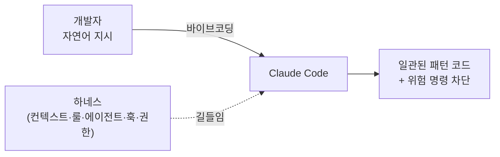
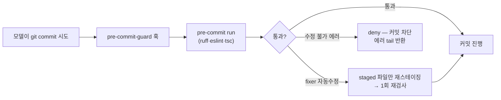
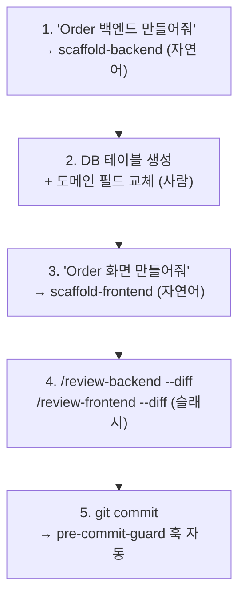

# 바이브코딩 + 하네스 엔지니어링 — 이 repo 의 Claude Code 작업 환경 설계

> 자연어로 기능을 위임하는 **바이브코딩**을, 모델이 매번 같은 패턴으로 안전하게 짜도록 받쳐주는 **하네스 엔지니어링**(컨텍스트·룰 SoT·서브에이전트·훅·권한) 5개 레이어를 정리한다. 이 repo 에 실제로 들어간 설정이 대상이며, 파생 서비스 전부 동일한 골격을 공유한다 — 새 서비스에 그대로 이식한다.

---

## 0. 큰 그림 — 바이브코딩과 하네스 엔지니어링

**바이브코딩(vibe coding)** = "Watchlist 백엔드 만들어줘" 처럼 자연어로 의도만 주고 코드 작성을 모델에 위임하는 방식. 빠르지만, 받쳐주는 게 없으면 모델은 **매 세션 조금씩 다르게** 짠다 — 레이어를 건너뛰고, 우리 재사용 훅 대신 새로 만들고, `prisma migrate` 같은 금지 명령을 거리낌 없이 실행한다.

**하네스 엔지니어링(harness engineering)** = 그 위임이 **일관되고 안전하게** 떨어지도록 Claude Code 라는 도구(harness) 자체를 설계하는 일. 코드를 직접 짜는 대신, **모델이 코드를 짜는 환경**을 짠다.



> 한 줄로: **바이브코딩은 운전, 하네스 엔지니어링은 차선·가드레일·내비를 까는 일.** 차선이 있어야 빠르게 달려도 안전하다.

---

## 1. 왜 — 모델을 길들이는 5개 레이어

모델 하나에 "우리 컨벤션대로 잘 짜줘" 라고 부탁하는 것으로는 부족하다. 지시는 잊히고, 좋은 의도도 매번 다르게 구현된다. 그래서 **강제력이 다른 5개 레이어**로 겹겹이 받친다 — 위로 갈수록 부드러운 안내, 아래로 갈수록 단단한 차단.

| 레이어 | 무엇 | 위치 | 강제력 |
|---|---|---|---|
| 1. 컨텍스트 | 매 세션 읽는 상시 지침 | `CLAUDE.md` 계층 · [`.docs/CLAUDE.md`](../CLAUDE.md) | 안내 (읽고 따름) |
| 2. 룰 SoT | 코드 패턴·위반 룰의 단일 진실 | [`.claude/docs/`](../../.claude/docs/) 4개 문서 | 참조 (에이전트가 실행) |
| 3. 서브에이전트 | 생성/검토 전용 작업자 | [`.claude/agents/`](../../.claude/agents/) 4개 | 절차 (전용 흐름) |
| 4. 훅 + 권한 | 커밋 게이트 · 위험명령 차단 | [`settings.json`](../../.claude/settings.json) · [`hooks/`](../../.claude/hooks/) | **차단 (deny)** |
| 5. MCP·도구 | 컨텍스트 절약·외부 지식 | [`.mcp.json`](../../.mcp.json) · LSP 심볼 도구 · 셸 출력 압축 | 보조 |

핵심 설계 원칙은 **"모델은 룰을 다시 쓰지 않고 실행만 한다"** — 룰은 레이어 2 에 한 번만 적고(SoT), 에이전트(레이어 3)는 그걸 참조해 돌린다. 룰이 바뀌면 문서 한 곳만 고치면 전 에이전트가 따라온다.

---

## 2. 레이어 1 — 컨텍스트 (CLAUDE.md 계층)

`CLAUDE.md` 는 Claude Code 가 **매 세션 자동으로 읽는** 상시 지침이다. 사람이 신규 합류자에게 "우리는 이렇게 짜" 라고 한 번 말해두는 것과 같다. 계층으로 나눠 각자 자기 범위만 책임진다.

| 파일 | 범위 | 담는 것 |
|---|---|---|
| `~/.claude/CLAUDE.md` | 개인 전역 | 개인 개발 도구 (repo 무관) |
| [`CLAUDE.md`](../../CLAUDE.md) (루트) | repo 전체 | 서비스 지도 · 데이터흐름 · 네이밍 · 인증 · 명령어 · 주석 규칙 |
| [`frontend/CLAUDE.md`](../../frontend/CLAUDE.md) | 프론트 | Container 구조 · 재사용 훅/컴포넌트 · 데이터흐름 |
| `{backend}/CLAUDE.md` | 각 백엔드 | 레이어(Router→Service→Repository) · DI 패턴 |
| [`.docs/CLAUDE.md`](../CLAUDE.md) | 이 문서폴더 | 기술문서 작성 규칙 |

루트 `CLAUDE.md` 가 가장 중요하다 — 어떤 데이터흐름(Backend 프록시 vs Prisma 직접)을 쓰는지, 라우트는 kebab-case 인지, 커밋 주석은 어떻게 쓰는지 같은 **"이 repo 에서만 통하는 약속"** 을 박아둔다. 모델이 일반적 베스트프랙티스가 아니라 **우리 약속**을 따르게 만드는 첫 레이어다.

> **self-improving 문서**: [`.docs/CLAUDE.md`](../CLAUDE.md) 는 끝에 "이 가이드를 스스로 갱신한다" 절을 둬, 문서를 쓸 때마다 반복 구조를 규칙으로 승격하고 죽은 규칙을 지운다. 컨텍스트가 고정 규칙이 아니라 **작업하며 자라는** 살아있는 문서가 되게 하는 패턴. 새 룰을 예방적으로 넣지 않고 실제 문서에서 귀납한다.

---

## 3. 레이어 2 — 룰의 단일 진실 (`.claude/docs/`)

코드 패턴과 "하지 말 것"을 **사람용 산문**이 아니라 **에이전트가 기계적으로 실행할 수 있는 형태**로 박아둔 곳. 4개 문서가 두 쌍이다.

| 문서 | 역할 | 누가 쓰나 |
|---|---|---|
| [`design-patterns-backend.md`](../../.claude/docs/design-patterns-backend.md) / [`-frontend.md`](../../.claude/docs/design-patterns-frontend.md) | 신규 CRUD 코드 패턴 (1:1 / 1:N) — placeholder 박힌 템플릿 | **scaffold** 에이전트 |
| [`anti-patterns-backend.md`](../../.claude/docs/anti-patterns-backend.md) / [`-frontend.md`](../../.claude/docs/anti-patterns-frontend.md) | 룰별 위반 정의 | **review** 에이전트 |

### anti-patterns 의 4섹션 구조

검토를 신뢰 가능하게 하려면, 룰이 "느낌"이 아니라 **재현 가능한 절차**여야 한다. 그래서 모든 룰을 4섹션으로 통일했다.

```markdown
### N. 룰 이름
  예시        ❌ before / ✅ after  — 무엇이 위반인지 눈으로
  룰          한 문장 statement      — 판정 기준
  Detection   grep 명령              — recall (후보를 빠짐없이 긁음)
  예외        허용되는 케이스        — precision (오탐 거름)
```

이 구조 덕에 review 에이전트는 **2-phase** 로 돈다 — Phase A: Detection 의 grep 으로 후보를 전부 긁어 **누락 없음(recall)** 보장 → Phase B: 후보마다 `Read` 로 컨텍스트 확인하고 **예외 절을 반드시 인용**해 오탐을 거름(**precision**). 예: 백엔드 룰 6 "페이지네이션 누락" 은 `ROW_NUMBER` 없는 `select_*_list` 를 grep 한 뒤, "작은 고정 리스트" 예외에 해당하는지 사람처럼 판정한다.

> **왜 grep + Read 두 번인가**: grep 만 쓰면 false positive 가 쏟아지고, Read(LLM 판단)만 쓰면 파일을 빠뜨린다. grep 으로 빠짐없이 모으고 → LLM 으로 정밀 판정하면 둘의 약점이 상쇄된다. 그리고 **예외 인용을 의무화**해, 모델이 "그냥 위반 같아요" 로 얼버무리지 못하게 묶었다.

---

## 4. 레이어 3 — 서브에이전트 (scaffold / review)

[`.claude/agents/`](../../.claude/agents/) 에는 **전용 작업자** 4개가 있다. 메인 세션과 별도 컨텍스트에서, 정해진 절차만 수행한다.

| 에이전트 | 하는 일 | 호출 방식 |
|---|---|---|
| [`scaffold-backend`](../../.claude/agents/scaffold-backend.md) | 백엔드 CRUD 껍데기 생성 (router/service/repository/schema + DI + main.py include) | **자연어** ("Order 백엔드 만들어줘" — 거래 주문) |
| [`scaffold-frontend`](../../.claude/agents/scaffold-frontend.md) | 프론트 CRUD 껍데기 생성 (services/components/page/api route + Zod) | **자연어** ("Order 화면 만들어줘") |
| [`review-backend`](../../.claude/agents/review-backend.md) | 백엔드 anti-pattern 검출 | **슬래시 전용** (`/review-backend`) |
| [`review-frontend`](../../.claude/agents/review-frontend.md) | 프론트 anti-pattern 검출 | **슬래시 전용** (`/review-frontend`) |

### 의도적 분리 — scaffold 는 자연어, review 는 슬래시

이 비대칭은 실수가 아니라 설계다.

- **scaffold = 자연어**: 새 기능 만들기는 작업 흐름에 자연스럽게 섞인다. "Watchlist 백엔드 만들어줘" 라고 하면 메인 모델이 알아서 위임하는 게 편하다.
- **review = 슬래시 전용** (`disable-model-invocation: true`): 검토는 **내가 원할 때만** 돌아야 한다. 코드를 짜다 말고 모델이 멋대로 전체 검토를 시작하면 컨텍스트만 태운다. 그래서 자연어 호출을 막고 `/review-backend` 를 직접 칠 때만 뜨게 했다.

> **에이전트는 룰을 다시 쓰지 않는다**: scaffold 는 design-patterns 의 템플릿을, review 는 anti-patterns 의 4섹션을 **그대로 실행**할 뿐이다. 룰 정의를 에이전트 프롬프트에 복붙하면 두 곳이 어긋난다 — 정의는 레이어 2 에 한 번만. 별도 컨텍스트라 메인 세션 토큰도 안 먹는다.

scaffold 가 절대 안 하는 것도 프롬프트에 박혀 있다 — frontend 를 건드리지 않음(backend scaffold), DB 마이그레이션 안 함, 기존 파일 덮어쓰기 안 함, 테이블명/필드 묻지 않고 default 사용. 생성 직후 `pre-commit run --files` 로 lint 까지 통과시킨다.

---

## 5. 레이어 4 — 훅 + 권한 (단단한 안전망)

앞 레이어들이 "이렇게 해줘" 라면, 이건 **"이건 못 한다"** 다. 모델이 아무리 하려 해도 차단된다.

### 커밋 게이트 — pre-commit-guard 훅

[`settings.json`](../../.claude/settings.json) 이 `PreToolUse(Bash)` 훅을 등록하고, `if: "Bash(git commit*)"` 조건으로 **git commit 직전에만** [`pre-commit-guard.sh`](../../.claude/hooks/pre-commit-guard.sh) 를 끼워넣는다.



핵심은 **fixer 자동수정 흡수** — ruff/eslint 가 파일을 고치면 보통 커밋이 깨지는데, 훅이 기존 staged 파일만 재스테이징해 한 번에 통과시킨다. 모델이 "lint 실패 → 다시 add → 다시 commit" 을 헤매지 않는다. [`.pre-commit-config.yaml`](../../.pre-commit-config.yaml) 이 ruff-check(--fix)·ruff-format·eslint·tsc·no-commit-to-branch 를 묶는다.

### 위험 명령 차단 — permissions deny

[`settings.json`](../../.claude/settings.json) 은 `defaultMode: "auto"`(대부분 자동 진행)지만, **되돌리기 어려운 명령은 deny 리스트로 원천 차단**한다.

| 차단 부류 | 예 | 왜 |
|---|---|---|
| 운영 배포 | `npm run prod:*` · `npm run staging:*` | 로컬에서 운영 건드리기 방지 |
| 마이그레이션 | `prisma migrate*` · `alembic *` | 이 repo 는 **push 방식, 마이그레이션 없음** |
| 스키마 push | `prisma db push` · `dev:prisma:push` | DB 스키마 변경은 사람이 |
| 파괴적 git | `git push --force` · `git reset --hard` · `rm -rf .git` | 이력 손실 방지 |
| DB 삭제 | `dropdb*` | 명백 |

> **왜 auto + deny 조합**: 매 명령마다 확인을 받으면 바이브코딩의 속도가 죽는다. 그래서 기본은 자동으로 흐르게 두되(`auto`), **위험한 소수만 명시적으로 막는다.** "넓게 허용 + 좁게 차단" 이 속도와 안전의 균형점이다.

---

## 6. 레이어 5 — MCP + 토큰 절감 도구

모델의 **입력**(컨텍스트)을 아끼고 외부 지식을 끌어오는 보조 레이어.

- **context7** ([`.mcp.json`](../../.mcp.json)) — 라이브러리/프레임워크 최신 문서를 실시간으로 가져오는 MCP. 학습 컷오프 이후 바뀐 API 를 추측하지 않게 한다.
- **심볼 단위 코드 도구** — 파일 통째 대신 **심볼 단위**로 코드를 읽고 고치는 LSP MCP. 컨텍스트 절약.
- **셸 출력 압축** — 셸 출력을 컨텍스트에 들어가기 직전 압축 (평균 60~90%). 개인 전역 도구라 `~/.claude/CLAUDE.md` 에 등록.
- **portfolio-mcp-service** (:8002) — 이 repo 자체가 제공하는 MCP 서버. 계좌/보유종목/거래내역 데이터 접근을 MCP tool 로만 단일 소유.

이 두 컨텍스트 절약 도구의 개념·도입·환경별 차이는 별도 문서가 정본이다 → [Claude Code 토큰 절감](토큰절감-개발도구.md). MCP 서버를 만드는 쪽은 [FastMCP 서버 개발](../2-개발가이드/fastmcp-서버개발.md).

---

## 7. 바이브코딩 워크플로우 — 신규 엔티티 end-to-end

5개 레이어가 실제로 어떻게 맞물리는지, **"Order 엔티티(주문) 추가"** 를 처음부터 끝까지 따라가 본다. 신규 비즈니스 엔티티의 default 흐름은 **Backend 프록시**(`Client → services → app/api/external → Backend → raw SQL → MS SQL`)다.



1. **scaffold-backend** — "Order 백엔드 만들어줘". 에이전트가 1:1 / 1:N 을 묻고(원본 메시지에 없으면), router/service/repository/schema + DI 등록 + `main.py` include 를 design-patterns 템플릿대로 생성, lint 통과까지. **라우트 prefix(kebab-case)가 여기서 정해지고 프론트가 byte-identical 복제하므로 정확히 정한다.**
2. **DB + 도메인 필드** — scaffold 는 DB 를 건드리지 않는다(레이어 4 차단). 사람이 테이블을 만들고, default 필드(`name` 등)를 실제 도메인 필드로 교체한다 (Pydantic schema + repository SQL 양쪽 sync).
3. **scaffold-frontend** — "Order 화면 만들어줘". 백엔드 prefix 를 그대로 받아 proxy route + Container/View/Form + Zod schema 생성.
4. **검토** — `/review-backend --diff` · `/review-frontend --diff` 로 변경분만 anti-pattern 검사. 라우트 prefix 가 backend↔frontend 일치하는지(룰 13)도 여기서 잡힌다.
5. **커밋** — `git commit`. pre-commit-guard 훅이 ruff/eslint/tsc 를 선실행하고 fixer 수정을 흡수해 한 번에 통과시킨다.

> 각 단계가 레이어 하나씩 쓴다 — scaffold(L3)는 design-patterns(L2)를, review(L3)는 anti-patterns(L2)를, 커밋은 훅(L4)을 탄다. **개발자는 자연어 3번 + 슬래시 2번 + DB 작업 1번**만 한다.

---

## 8. 새 서비스·새 룰로 확장하기

이 하네스는 파생 서비스에 **그대로 이식**하도록 설계됐다.

- **새 서비스에 이식**: `.claude/` 폴더(agents·docs·hooks·skills·settings.json)와 `CLAUDE.md` 계층, `.pre-commit-config.yaml`, `.mcp.json` 을 복사. backend 디스커버리는 `app/main.py` 가 있는 폴더를 자동 탐지하므로(`ls -d */app/main.py`), 폴더명이 달라도(`api/`·`server/`·도메인별) 동작한다.
- **새 룰 추가**: [`anti-patterns-*.md`](../../.claude/docs/) 에 `### N. 룰` 을 4섹션(예시/룰/Detection/예외)으로 추가하면 review 에이전트가 자동으로 집어 돈다 — 에이전트 프롬프트는 안 건드린다. review 출력의 룰별 결과 표 행만 맞춰준다.
- **새 코드 패턴**: [`design-patterns-*.md`](../../.claude/docs/) 에 섹션 추가 → scaffold 가 따라 생성.
- **새 위험 명령 차단**: [`settings.json`](../../.claude/settings.json) `deny` 에 `Bash(...)` 패턴 추가.

> 원칙은 항상 같다 — **룰·패턴은 문서(L2)에, 절차는 에이전트(L3)에, 차단은 settings(L4)에.** 에이전트 프롬프트에 룰을 복붙하기 시작하면 SoT 가 깨진다.

---

## 9. 흔한 실수

- **review 가 자동으로 안 돈다고 당황** — 의도된 동작이다(§4). review 는 `/review-backend` 슬래시로만 뜬다. "검토해줘" 자연어로는 안 불린다.
- **scaffold 에 테이블명·필드를 길게 설명** — 묻지 않고 default(`name` + 감사 컬럼)로 만든 뒤, 생성 후 사람이 도메인 필드로 교체하는 흐름이다(§7-2). 미리 다 말해도 무시될 수 있다.
- **scaffold 후 DB 가 자동 생성된 줄 안다** — 안 만든다(L4 차단). 테이블 생성·필드 교체는 사람 몫.
- **라우트 prefix 를 프론트에서 멋대로 바꿈** — backend `APIRouter(prefix=...)` 가 SoT 다. 바꾸면 frontend proxy 와 lockstep 으로 같이 고쳐야 하고, review 룰 13 이 불일치를 잡는다.
- **에이전트 프롬프트에 룰을 추가** — 룰은 `.claude/docs/` 에만(§8). 에이전트에 박으면 두 곳이 어긋난다.
- **커밋이 lint 로 깨질까 봐 손으로 pre-commit 먼저 돌림** — 불필요하다. 훅이 commit 직전 자동 실행 + fixer 흡수한다(§5).

---

## 10. 요약·체크리스트

- **바이브코딩**(자연어 위임)을 **하네스 엔지니어링**(환경 설계)이 받친다. 5개 레이어: 컨텍스트 → 룰 SoT → 서브에이전트 → 훅·권한 → MCP·도구.
- **모델은 룰을 실행만, 정의는 한 곳(L2)에.** scaffold=자연어 / review=슬래시 (의도적 분리). auto + 좁은 deny 로 속도·안전 균형.

새 기능 추가 루프:

- [ ] "X 백엔드 만들어줘" → scaffold-backend (prefix 정확히)
- [ ] DB 테이블 생성 + 도메인 필드 교체 (사람)
- [ ] "X 화면 만들어줘" → scaffold-frontend
- [ ] `/review-backend --diff` · `/review-frontend --diff`
- [ ] `git commit` (훅이 lint 자동 처리)

하네스를 새 서비스에 이식할 때:

- [ ] `.claude/` · `CLAUDE.md` 계층 · `.pre-commit-config.yaml` · `.mcp.json` 복사
- [ ] 룰 변경은 `.claude/docs/` 4섹션, 차단은 `settings.json` deny — 에이전트 프롬프트는 그대로

---
관련 문서: [Claude Code 토큰 절감](토큰절감-개발도구.md) · [FastMCP 서버 개발](../2-개발가이드/fastmcp-서버개발.md) · [.docs 작성 규칙](../CLAUDE.md) · 룰 SoT [`.claude/docs/`](../../.claude/docs/)
