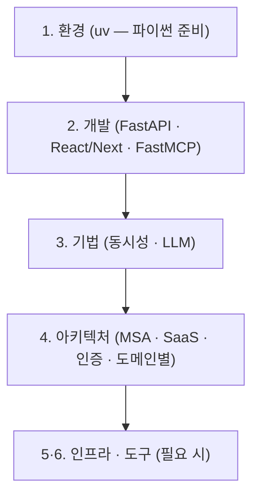

# 기술 문서 — full-stack-template 기준 전 서비스 참조

> `full-stack-template` 과 여기서 파생된 서비스(fintech-ai-platform · ai-chatbot · knowledge-management · smart-factory)가 공유하는 **팀 기술 문서 집약소**. 코드를 읽기 전에 "왜 이렇게 짰는지"(설계·기법), 신규 합류자가 먼저 보는 "어떻게 개발하나"(입문), 서버·CI·도구 설정(환경/운영)을 한곳에 모은다.
>
> 작업 중 손이 가는 **코드 패턴/룰의 SoT** 는 repo 의 [`.claude/docs/`](../.claude/docs/) (스캐폴드·anti-pattern, review 에이전트 기준), 서비스별 레이어 설명은 각 폴더의 `CLAUDE.md`. 여기 `.docs/` 는 그 둘과 겹치지 않는 **개념·흐름·입문·환경/운영** 전용이며, 이 폴더만 독립적으로(Git web / Obsidian vault) 읽힌다.

---

## 0. 큰 그림

**폴더 이름의 번호가 곧 읽는 순서다.** 신규 합류자는 환경 → 개발 → 기법 → 아키텍처(`1`→`4`) 로 좁혀 읽고, 인프라·도구(`5`·`6`)는 필요할 때 펼친다.

> 용어 풀이 — 각 약어는 해당 문서가 다시 풀어 설명한다.
>
> - MSA(마이크로서비스 아키텍처) = 한 시스템을 작은 서비스 여러 개로 쪼갠 구성
> - SaaS(서비스형 소프트웨어) = 한 시스템을 여러 회사가 격리된 채 함께 쓰는 형태
> - RAG(검색 증강 생성) = 문서를 검색해 LLM 답변에 붙이는 기법
> - MCP(모델 컨텍스트 프로토콜) = LLM 에이전트가 외부 도구(시세·공시·뉴스)를 호출하는 표준

1. **환경** — [uv](1-개발환경/uv-파이썬환경.md) 로 파이썬·패키지 준비 (코딩 전 한 번)
2. **개발** — [FastAPI 백엔드](2-개발가이드/fastapi-백엔드개발.md) → [React/Next.js 프론트](2-개발가이드/react-nextjs-프론트개발.md) (MCP 서버는 [FastMCP 개발](2-개발가이드/fastmcp-서버개발.md))
3. **기법** — [동시성 가이드](3-기법/동시성-가이드.md) → [동시성 인덱스](3-기법/동시성-출처인덱스.md) → [동시성 레퍼런스](3-기법/동시성-레퍼런스.md) · LLM([프롬프트 엔지니어링](3-기법/llm-프롬프트엔지니어링.md) · [가드레일·방어](3-기법/llm-가드레일.md))
4. **아키텍처** — [서비스 구성(MSA)](4-아키텍처/경량msa.md) → [SaaS 멀티테넌트](4-아키텍처/saas-멀티테넌트.md) → [인증 토큰](4-아키텍처/인증토큰전략.md) → 도메인별([틱 수집 파이프라인](4-아키텍처/etl-파이프라인.md) / [RAG·LLM](4-아키텍처/rag-llm서빙.md))
5. **인프라 셋팅** — 필요 시 [5-인프라셋팅/](5-인프라셋팅/): GPU 서버([Ubuntu](5-인프라셋팅/ubuntu-서버셋팅.md)) · 개발 PC([WSL2](5-인프라셋팅/wsl2-docker개발환경.md)) · [LLM 서빙](5-인프라셋팅/llm서빙-sglang-litellm.md) · [Docker & Compose](5-인프라셋팅/docker-compose.md)
6. **도구** — 필요 시 [6-도구/](6-도구/): [하네스엔지니어링](6-도구/하네스엔지니어링.md) · [토큰절감](6-도구/토큰절감-개발도구.md) · [외부서비스모니터링](6-도구/외부서비스모니터링.md)

---

## 1. 폴더 구조

번호 = 읽는 순서.

| 폴더            | 무엇이 들어가나                                                              |
| --------------- | ---------------------------------------------------------------------------- |
| `1-개발환경/`   | 개발 시작 전 파이썬·패키지 준비 (uv)                                         |
| `2-개발가이드/` | 개발 **입문 가이드** (백엔드/프론트/MCP) — 깊은 룰은 `.claude/docs/` 로 링크 |
| `3-기법/`       | 코딩 기법 (동시성 · LLM 프롬프트/가드레일 · 출처 인덱스)                     |
| `4-아키텍처/`   | 시스템 설계·흐름 (MSA·SaaS·인증·틱 수집·RAG)                                 |
| `5-인프라셋팅/` | GPU 서버·개발 PC·LLM 서빙·Docker (중량급 runbook — 필요할 때 펼침)           |
| `6-도구/`       | 개발·운영 도구 (컨텍스트 절약 도구, 외부서비스 모니터링)                     |

---

## 2. 문서

### 환경 — `1-개발환경/`

| 문서                                             | 무엇을 다루나                                              |
| ------------------------------------------------ | ---------------------------------------------------------- |
| [개인 개발 컨테이너](1-개발환경/개발컨테이너.md) | CUDA·ODBC·Node·Python 올인원 Docker 컨테이너 + SSH 키 설정 |
| [uv](1-개발환경/uv-파이썬환경.md)                | Python 패키지·버전 관리 (개발 시작 전 준비물)              |

### 입문 — `2-개발가이드/`

| 문서                                                                     | 무엇을 다루나                                                                                                                                                        |
| ------------------------------------------------------------------------ | -------------------------------------------------------------------------------------------------------------------------------------------------------------------- |
| [FastAPI 백엔드 개발](2-개발가이드/fastapi-백엔드개발.md)               | 레이어(Router→Service→Repository)·DI·인증·예외·동시성 입문 (uv/3.12)                                                                                                 |
| [FastMCP 서버 개발](2-개발가이드/fastmcp-서버개발.md)                   | from_fastapi 로 REST→MCP tool 전 과정 — 결정·RPC 설계·추가 레시피·큐레이션 규칙·2단 인증·소비(에이전트/단발/SSE)·멀티서버·multi-agent 바인딩·테스트 (self-contained) |
| [React/Next.js 프론트 개발](2-개발가이드/react-nextjs-프론트개발.md)    | Container·재사용 훅/컴포넌트·데이터흐름·인증 입문 (Next 16/Better Auth)                                                                                              |
| [멀티에이전트 도메인 추가](guides/multi-agent-development.md)            | 새 투자 리서치 도메인·sub-agent 추가 절차 (도메인 모듈·registry·mcp_tools lockstep)                                                                                  |
| [멀티에이전트 판단 Flow & 시연](guides/multi-agent-trace-walkthrough.md) | 그래프 노드별 판단 흐름(보안검사→clarify→plan→실행→재계획→답변)·라우팅 분기 + 시연 대본·공개 trace 링크 (multi-agent 한정)                                           |

### 기법 — `3-기법/`

| 문서                                                        | 무엇을 다루나                                                                                       | 범위                                            |
| ----------------------------------------------------------- | --------------------------------------------------------------------------------------------------- | ----------------------------------------------- |
| [동시성 표준 가이드](3-기법/동시성-가이드.md)               | 새 코드 결정 규칙·코드 템플릿·DO/DON'T·체크리스트                                                   | 전 서비스 공통                                  |
| [동시성 실제 적용 인덱스](3-기법/동시성-출처인덱스.md)      | 4계층 모델 — 6 서비스 어디에·왜·어떻게 (출처 앵커·매트릭스)                                         | 전 서비스 공통                                  |
| [동시성 레퍼런스](3-기법/동시성-레퍼런스.md)                | Python 3.12 + FastAPI 도구의 PEP/공식문서 근거                                                      | 외부 지식                                       |
| [LLM 프롬프트 엔지니어링](3-기법/llm-프롬프트엔지니어링.md) | 프롬프트 작성 요령(구조·순서·예시·언어·길이)·날짜 코드주입·디코딩 제약·Qwen 한자/thinking           | LLM 쓰는 서비스 공통                            |
| [LLM 가드레일 + 방어](3-기법/llm-가드레일.md)               | 민감정보 마스킹·인젝션/추출(4층)·콘텐츠 모더레이션·PII·게이트웨이 SafetyGuard·코드 강제 vs 프롬프트 | LLM 챗 보유(devactivity·KMS) + platform/litellm |

### 아키텍처 — `4-아키텍처/`

| 문서                                                  | 무엇을 다루나                                                                                                     | 범위                                    |
| ----------------------------------------------------- | ----------------------------------------------------------------------------------------------------------------- | --------------------------------------- |
| [서비스 구성 (경량 MSA)](4-아키텍처/경량msa.md)       | nginx 게이트웨이 + 멀티 FastAPI + 서비스 JWT 토폴로지                                                             | 전 서비스 공통                          |
| [SaaS 멀티테넌트 설계](4-아키텍처/saas-멀티테넌트.md) | 회사 격리 — 가입·로그인·권한·메뉴·방어 레이어. §12 는 KMS 도메인 격리                                             | AUTH 공통 / 문서·채팅 도메인은 KMS 전용 |
| [인증 토큰 전략](4-아키텍처/인증토큰전략.md)          | 세션 쿠키 + 단기 JWT(1분), refresh 미사용 — 결정 근거                                                             | 전 서비스 공통                          |
| [ETL 파이프라인](4-아키텍처/etl-파이프라인.md)        | WebSocket/FIX → Kafka → 5초 윈도우 polars → MS SQL + 재발행                                                       | 틱 수집/분석 보유 서비스                |
| [RAG / LLM 서빙](4-아키텍처/rag-llm서빙.md)           | 임베딩 인덱싱·하이브리드 검색·다중 LLM·에이전트(LangGraph) — 대규모 ai-chatbot + KMS docs-service, flowchart 중심 | RAG 공통 + KMS                          |

### 인프라 셋팅 — `5-인프라셋팅/`

GPU 서버·개발 PC·LLM 서빙 셋업. 중량급 runbook — 필요할 때 펼침.

| 문서                                                                  | 무엇을 다루나                                                                     |
| --------------------------------------------------------------------- | --------------------------------------------------------------------------------- |
| [Ubuntu 서버 셋팅](5-인프라셋팅/ubuntu-서버셋팅.md)                   | RAID·고정IP·방화벽·SSH·NVIDIA·Docker (24.04 기본, 22.04 차이 인라인 콜아웃)       |
| [WSL2 + Docker 개발 환경](5-인프라셋팅/wsl2-docker개발환경.md)        | Windows 11 미러 네트워크 + Docker(+GPU) + VSCode 원격 (개발 PC 셋업)              |
| [LLM 서빙 (SGLang + LiteLLM)](5-인프라셋팅/llm서빙-sglang-litellm.md) | Qwen3 멀티모델 서빙 + 게이트웨이 단일진입(:4000) + 가드레일 배선 (자체 호스팅 시) |
| [Docker & Docker Compose](5-인프라셋팅/docker-compose.md)             | Docker 개념 + Nginx 경량 MSA + Compose                                            |

### 도구 — `6-도구/`

| 문서                                                                  | 무엇을 다루나                                                                                    |
| --------------------------------------------------------------------- | ------------------------------------------------------------------------------------------------ |
| [바이브코딩 + 하네스 엔지니어링](6-도구/하네스엔지니어링.md)          | Claude Code 작업 환경 5개 레이어 (컨텍스트·룰 SoT·서브에이전트·훅·권한) + 신규 엔티티 워크플로우 |
| [Claude Code 토큰 절감](6-도구/토큰절감-개발도구.md)                  | 셸 출력 압축 + 심볼 단위 코드 도구                                                               |
| [외부 서비스 의존성·모니터링](6-도구/외부서비스모니터링.md)           | 외부 API 카탈로그 + changedetection.io (시세·공시·뉴스 외부 API 변경 감지)                                           |
