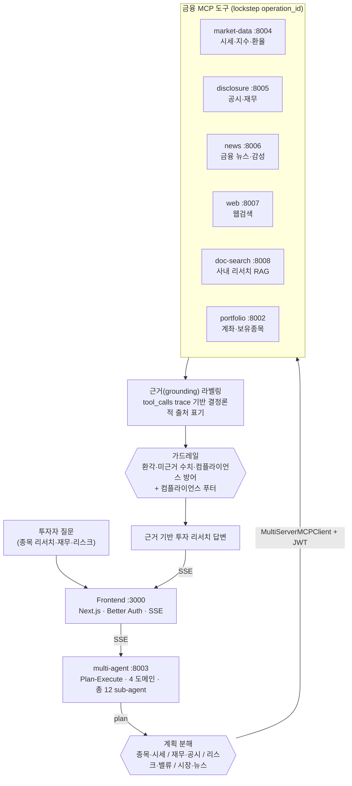

# fintech-ai-platform — 멀티에이전트가 금융 MCP 도구를 오케스트레이션해 근거 기반 투자 리서치를 만드는 풀스택 SaaS

> 투자자의 질문 한 줄을 **Plan-Execute 멀티에이전트**가 분해하고, 시세·공시·뉴스·웹·사내 리서치 RAG 를 **자체 MCP 서버 스위트**로 오케스트레이션해 **공시 근거가 붙은 투자 리서치**를 생성하는 모습을 보여주는 핀테크 포트폴리오. 가드레일이 환각·미근거 수치·컴플라이언스를 방어한다. 경량 MSA(12 서비스 + 1 템플릿) + 6 MCP 서버 + 멀티에이전트 1식 + Next.js 프론트, 멀티테넌트 SaaS 구조.
>
> 모든 MCP 서버는 기본 **MOCK 금융 데이터**를 반환해 **API 키 없이 즉시 기동**(실데이터는 `USE_REAL_API` env 토글). 등장 발행사/티커는 공개 상장사 샘플·합성값이며 식별자는 샌드박스 값(`acme`/`example.com`)이다. ⓘ 정보 제공 목적이며 투자 조언이 아닙니다.

## 한눈에



## 서비스

| 서비스 | 포트 | 역할 | 보여주는 패턴 |
| --- | --- | --- | --- |
| `frontend` | 3000 | 투자 리서치 UI · API proxy · 멀티테넌트 인증 | Next 16 · React 19 · Better Auth(JWT) · DevExtreme · ECharts · Prisma |
| `backend-service` | 8000 | 관심종목 CRUD · 포트폴리오→보유종목 마스터-디테일 · NAV 시계열 · 시세/체결 틱 MQ | FastAPI 레이어드(Router→Service→Repo) · DI · raw SQL · producer/consumer 큐 |
| `multi-agent-service` | 8003 | 투자 리서치 Plan-Execute 멀티에이전트(종목·시세/재무·공시/리스크·밸류/시장·뉴스) | StateGraph 4 도메인 · 총 12 sub-agent · 멀티 MCP 오케스트레이션 · grounding 라벨 · 가드레일 |
| `devactivity-service` | 8001 | 포트폴리오 활동 요약 메일 스케줄러 · 활동 조회 챗 | MS SQL 전용 DB(`DEVACTIVITY_SQL_DB_*`) · asyncio 스케줄러 · LangGraph ReAct + MCP tool · SSE |
| `single-agent-service` | 8010 | 단일 MCP 소비 에이전트 교본 | 프리빌트 ReAct → multi-agent 졸업 경로 |
| `portfolio-mcp-service` | 8002 | 계좌/포트폴리오 데이터 단일 소유 MCP 서버 | FastMCP `from_fastapi`(REST→MCP tool 동시 노출) · 서비스 토큰 인증 |
| `market-data-mcp-service` | 8004 | 시세·지수·환율 5 tool | MOCK→MCP 큐레이션(env 토글로 실데이터) |
| `disclosure-mcp-service` | 8005 | DART/EDGAR 공시·재무 6 tool | 〃 |
| `news-mcp-service` | 8006 | 금융 뉴스·감성 5 tool | 〃 |
| `web-mcp-service` | 8007 | Tavily 웹검색 1 tool | 〃 |
| `doc-search-mcp-service` | 8008 | 사내 투자 리서치 지식 28 tool(14분야×topic/image) | Milvus + BM25 + Kiwi 하이브리드 RAG |
| `file-service` | 8100 | 파일 업로드/다운로드 · 파일 메타 DB | asyncssh SFTP · 전용 서비스 + HTTP 클라이언트 격리 |
| `template-mcp-service` | 8009 | 신규 MCP 서비스 개발 템플릿(echo tool) | 외부 의존 0 · 복사 후 바로 기동 |

> 모든 MCP 서버는 동일 패턴: `from_fastapi` 가 REST 라우터를 `/mcp` tool 로 노출. 타 서비스는 외부 시스템(계좌·DART/EDGAR·시세/뉴스 벤더 API)을 **직접 호출하지 않고 MCP tool 로만** 접근하며, sub-agent ↔ tool 은 라우터 `operation_id` 와 **lockstep** 으로 결합한다.

## 기술 스택

- **Backend** — FastAPI · SQLAlchemy(raw SQL, push 스키마/무 마이그레이션) · dependency-injector · Pydantic Settings · uv / Python 3.12
- **AI / Agent** — LangChain 1.x · LangGraph(StateGraph Plan-Execute + 프리빌트 ReAct) · langchain-mcp-adapters · FastMCP 3.x · MCP · LiteLLM 게이트웨이(+ custom guardrail)
- **RAG / 검색** — Milvus(`pymilvus`) + Redis · BM25 · Kiwi 형태소 분석 하이브리드 검색
- **Frontend** — Next.js 16 · React 19 · TypeScript · Better Auth(멀티테넌트 JWT) · Prisma(MS SQL adapter) · DevExtreme · ECharts · Zustand · Zod · react-markdown/KaTeX
- **Infra** — MS SQL Server · Nginx · atmoz SFTP · VictoriaLogs · process-compose(dev) / Docker Compose(staging·prod)

## 빠른 실행

```bash
# 1) 프론트 env 준비 (JWT_SECRET 은 frontend·backend 동일값 필수 — CHANGE_ME 교체)
cp frontend/.env.example frontend/.env

# 2) dev — 멀티서비스 일괄 기동. MCP 는 MOCK 금융 데이터로 키 없이 바로 뜬다
process-compose up

# 3) 프론트 스키마 → DB push
cd frontend && npm run dev:prisma:push

# 전체 lint/format (Backend ruff + Frontend ESLint/Prettier 일괄)
pre-commit run --all
```

```bash
# staging+ — Docker Compose (이미지 빌드 후)
docker compose -f compose.staging.yaml up    # prod 는 compose.prod.yaml
```

> `template-mcp-service`(8009) · `single-agent-service`(8010) 은 단독 기동 전용이라 process-compose 미등록.

## 킬러 데모 — 종목 리서치 흐름

프론트 챗에 **"A 종목 최근 실적과 리스크 요약해줘"** 한 줄을 던지면:

1. **clarify 게이트키퍼** — 금융/투자 질문인지 판별(비금융이면 정중히 반려).
2. **plan** — Plan-Execute 그래프가 `재무·공시`(실적) + `리스크·밸류`(리스크) 도메인으로 분해.
3. **execute** — `financials_sub` 가 `disclosure_financials`·`disclosure_company` 로 공시 재무를, `risk_sub` 가 `market_ohlc`·`doc_search_topic_risk` 로 가격 변동성·리스크 노트를 MCP 로 병렬 수집(`enabled_mcps`/`switch` 로 도구 게이팅).
4. **grounding** — `tool_calls` trace 기반으로 출처(공시 URL·시세 벤더·사내 리서치)를 **결정론적으로 정직 라벨링**.
5. **가드레일 + reduce** — 미근거 수치는 차단, 모든 답변 끝에 `ⓘ 정보 제공 목적이며 투자 조언이 아닙니다` 컴플라이언스 푸터를 붙여 SSE 스트리밍.

판단 과정 전체 트레이스는 [`.docs/guides/multi-agent-trace-walkthrough.md`](.docs/guides/multi-agent-trace-walkthrough.md).

## 디렉토리

```
fintech-ai-platform/
├── frontend/                  # Next.js 16 UI · API proxy · Better Auth · Prisma
├── backend-service/           # 업무 API (관심종목·포트폴리오·NAV·틱 MQ)
├── file-service/              # SFTP 파일 서비스 + 파일메타 DB
├── devactivity-service/       # 포트폴리오 활동 요약 스케줄러 + 활동 조회 챗 (MS SQL 전용 DB)
├── multi-agent-service/       # Plan-Execute 멀티에이전트 (MCP 소비자)
├── single-agent-service/      # ReAct 에이전트 교본
├── portfolio-mcp-service/     # 계좌/포트폴리오 MCP 서버
├── market-data/disclosure/news/web-mcp-service/   # 도메인 MCP 서버 (시세·공시·뉴스·웹)
├── doc-search-mcp-service/    # 사내 투자 리서치 RAG MCP 서버 (Milvus + BM25 + Kiwi)
├── template-mcp-service/      # 신규 MCP 서비스 개발 템플릿
├── platform/                  # nginx · sftp · litellm(게이트웨이) · victorialogs
├── process-compose.yaml       # dev 멀티서비스 기동
├── compose.staging.yaml / compose.prod.yaml   # staging·prod Docker Compose
└── .docs/ · .claude/          # 기술 문서 · 코드 패턴/리뷰 에이전트
```

## 더 보기

- [`CLAUDE.md`](CLAUDE.md) — 전체 구성·데이터 흐름·인증·네이밍 규칙
- [`.docs/`](.docs/) — 환경 → 개발 → 기법 → 아키텍처: [경량 MSA](.docs/4-아키텍처/경량msa.md) · [SaaS 멀티테넌트](.docs/4-아키텍처/saas-멀티테넌트.md) · [RAG·LLM 서빙](.docs/4-아키텍처/rag-llm서빙.md) · [FastMCP 개발](.docs/2-개발가이드/fastmcp-서버개발.md) · [멀티에이전트 판단 Flow](.docs/guides/multi-agent-trace-walkthrough.md)
- [`.claude/docs/`](.claude/docs/) — 스캐폴드/anti-pattern 패턴(리뷰 에이전트 SoT) · [`.claude/agents/`](.claude/agents/) — `review-*`/`scaffold-*` 자동화 에이전트
- 서비스별 상세는 각 폴더의 `CLAUDE.md`
