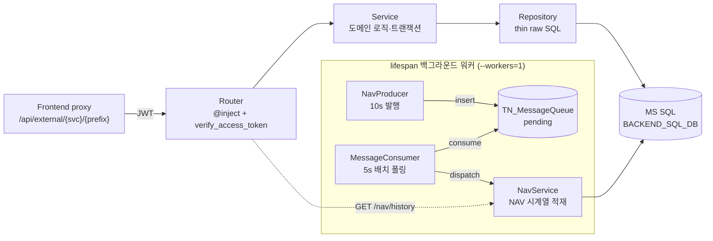

# backend-service — 멀티테넌트 비즈니스 API 서버 (FastAPI, :8000)

> 핀테크 투자 리서치 플랫폼의 기본 비즈니스 API. 데모 CRUD(watchlist 관심종목) · 마스터-디테일(portfolio/holding 포트폴리오·보유종목) · DB 기반 메시지 큐 producer/consumer + 포트폴리오 NAV 시계열 대시보드를 통해 **레이어드 아키텍처 + DI + raw SQL + 백그라운드 워커** 패턴을 시연한다. 신규 엔티티를 붙이는 스캐폴드 템플릿이기도 하다.

## 핵심 (이 서비스가 보여주는 것)

- **명시적 4-레이어 + DI**: `Router → Service → Repository → SQLAlchemy text()`. `dependency-injector` 컨테이너가 `config → db/client → repository → service` 순으로 조립하고, Router/Manager 는 `@inject` + `Depends(Provide[Container.xxx_service])` 로만 의존성을 받는다. 직접 인스턴스화·DI 우회는 금지.
- **ORM 없는 raw SQL**: ORM 쿼리 대신 Core `text()` + `.mappings()` 만 사용. DevExtreme 그리드의 `skip`/`take`/`filter`(JSON)/`sort`(JSON) 를 `ROW_NUMBER()` 페이지네이션과 파라미터 바인딩 WHERE 절로 변환 (`devextreme_utils`).
- **DB 기반 메시지 큐 (producer/consumer)**: 외부 브로커 없이 `TN_MessageQueue` 테이블을 큐로 사용. producer 매니저가 합성 시세/체결 틱(포트폴리오 NAV 시계열)을 주기 발행 → consumer 매니저가 배치 폴링 소비 → topic 별 dispatch → 시계열 테이블 적재 → `/nav/history` 대시보드 조회. `pending → done/failed` 상태 전이와 retry 카운트로 워커 라이프사이클을 시연.
- **앱 내장 백그라운드 워커**: `lifespan` 에서 asyncio 매니저(producer/consumer)를 기동·정리. sync DB I/O 는 `run_in_threadpool` 로 오프로드. 매니저가 있으므로 **단일 프로세스(`--workers=1`)** 운영.
- **멀티테넌트 신원 전파**: JWT(HS256)를 `verify_access_token` 이 검증 후 `ContextVar`(`auth_context`)에 신원(user_id/email/role/company_id)을 박고, Service/Repository 는 인자 없이 getter 로 읽는다. 감사 컬럼(`reg_id`/`mod_id`)은 항상 요청자 email, 백그라운드는 `system`.
- **HTTP-free 도메인 + 일괄 예외 매핑**: Service/Repository 는 `HTTPException` 을 직접 raise 하지 않고 도메인 예외(`NotFoundError`/`ConflictError` 등)만 던진다. `exception_handler` 가 도메인/표준/드라이버 예외를 HTTP status 로 일괄 매핑하며, 민감 메시지는 한글 휴리스틱으로 마스킹.

## 기술 스택

- **런타임**: Python 3.12, [`uv`](https://docs.astral.sh/uv/) 의존성 관리
- **웹**: FastAPI · Uvicorn · Pydantic (Settings v2)
- **DI**: `dependency-injector` (`DeclarativeContainer`)
- **DB**: MS SQL Server + SQLAlchemy Core `text()` (raw SQL) · pyodbc / pymssql, 스키마는 push 방식(`alembic` init)
- **인증**: PyJWT (HS256), `ContextVar` 기반 신원 전파
- **연동**: `httpx` (file-service HTTP proxy) · `tenacity` (재시도)
- **품질**: ruff (line-length 120), pre-commit 일괄

## 아키텍처 / 동작



- **요청 경로**: 프론트엔드 proxy → JWT 검증 → Router(조합/검증) → Service(로직/트랜잭션/도메인 예외) → Repository(`text()` + `.mappings()`) → MS SQL. Router 의 `APIRouter(prefix=...)` 가 kebab-case REST 리소스이며 프론트 proxy route 의 SoT (byte-identical, 변경 시 lockstep).
- **마스터-디테일**: `portfolio`(master)와 `portfolio/{id}/holding`(detail)를 한 Router/Service 에서 중첩 리소스로 제공해 1:N 스캐폴드를 시연.
- **메시지 큐 흐름**: producer 가 `nav.snapshot` 합성 스냅샷을 큐에 발행 → consumer 가 `TOP(N)` pending 을 배치 조회 → `_dispatch` 가 topic 별 핸들러로 라우팅 → 성공 `done` / 실패 `failed`+retry 마킹. 신규 topic 은 `_dispatch` 분기만 추가.
- **신원 경계**: 요청 밖(기동/백그라운드) 호출 시 신원 getter 는 모두 `None` → 권한 계층 **fail-closed**. 서비스 간 호출은 `create_access_token`(sub=SERVICE_NAME, 단명 exp) 사용.
- **파일 처리**: SFTP/파일 메타 DB 직접 접근 금지. `FileServiceClient`(async `httpx`, HTTP proxy)로만 file-service(:8100) 접근.

## 실행

```bash
uv sync                                   # 의존성 설치
cp app/.env.example app/.env.development  # 값 채우기 (CHANGE_ME 교체)

cd app && uv run uvicorn main:app --reload --port 8000   # cwd=app 필수 (config/import 기준)
# Swagger: http://localhost:8000/docs
```

필요한 `.env` 키 (`app/.env.example`):

- `BACKEND_SQL_DB_*` — 비즈니스 DB 접속 (HOST/PORT/NAME/USER/PASSWORD, ODBC Driver 18)
- `JWT_SECRET` — **frontend·backend 동일값 필수** (HS256 검증)
- `FILE_SERVICE_URL` (`http://localhost:8100`) · `SFTP_BASE_PATH`
- `USE_REAL_API` (기본 `false`) — 외부 시장/공시 API 토글. NAV producer 가 합성 random-walk 틱을 발행하므로 **API 키 없이도** 큐·대시보드 흐름이 즉시 동작.

> `development` 환경에서는 토큰이 없거나 무효해도 `admin`/`dev_user` 로 폴백해 로컬 개발이 가능하다.

## 구조

```
app/
├─ main.py                # FastAPI 앱 + lifespan(매니저 기동) + 라우터 등록
├─ core/
│  ├─ container.py        # DI 컨테이너 (config→db/client→repo→service→wiring)
│  ├─ security.py         # verify_access_token / create_access_token (JWT HS256)
│  ├─ auth_context.py     # ContextVar 신원 전파 (user_id/email/role/company_id)
│  ├─ exception_handler.py# 도메인/표준/드라이버 예외 → HTTP status 일괄 매핑
│  ├─ exceptions.py       # 도메인 예외 (NotFoundError/ConflictError ...)
│  ├─ database.py         # get_backend_sql_client (Engine 팩토리)
│  └─ middlewares.py / logger.py / config.py
├─ routers/               # portfolio(마스터-디테일) · watchlist · nav
├─ services/              # 도메인 로직·트랜잭션 (portfolio/watchlist/nav/message_queue)
├─ repositories/          # thin raw SQL wrapper (store 접근 계층)
├─ managers/              # asyncio 백그라운드 워커 (nav producer / mq consumer)
├─ schemas/               # Pydantic In/Out 모델 ({items, total_count} list wrapper)
├─ clients/file/          # FileServiceClient (async httpx HTTP proxy)
├─ utils/common/          # devextreme/database/retry/time 교차 헬퍼
└─ models/schema.py       # 테이블 정의 (push 방식, 런타임 ORM 미사용)
alembic/                  # 스키마 init/push (마이그레이션 없음)
```
