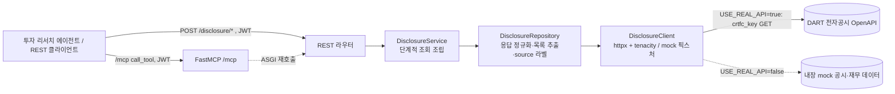

# disclosure-mcp-service — 기업 전자공시·재무제표 조회 MCP 서버 (:8005)

> 기업 전자공시(DART 형식)의 발행사·재무제표·공시목록·공시상세·배당·최대주주를 **6개 MCP tool** 로 노출하는 FastAPI 서버. 한 앱이 REST(`/disclosure/*`)와 MCP(`/mcp`)를 동시에 서빙하며, 투자 리서치 에이전트가 이 tool 들을 호출해 **공시 근거 기반 재무 데이터**를 조회한다. DB·LLM 없음 (외부 API 게이트웨이). **API 키 없이 내장 mock 데이터로 단독 기동**하고, `USE_REAL_API=true` 일 때만 실 DART OpenAPI 를 호출한다.

## 핵심 (이 서비스가 보여주는 것)

- **FastMCP `from_fastapi` 패턴** — 기존 REST 레이어(라우터 → service → repository → 외부 API/mock)를 그대로 두고, `from_fastapi` 가 라우트를 MCP tool 로 변환. tool 실행은 ASGI 로 같은 앱의 라우트를 다시 호출. REST 와 MCP 가 **단일 SoT 라우터** 에서 파생되어 중복이 없다.
- **`operation_id` = tool 이름 SoT** — 라우터의 `operation_id`/docstring/Pydantic In·Out 스키마가 그대로 MCP tool 의 이름·설명·입출력 스키마가 된다. 소비자(multi-agent-service)는 이 이름으로 lockstep 바인딩.
- **mock 기본 · 실API 토글** — `USE_REAL_API=false`(기본)면 API 키 없이 내장 in-memory 공시/재무 샘플로 동작해 누구나 즉시 기동·검증할 수 있다. `true` 로 켜고 `DISCLOSURE_API_KEY`(DART crtfc_key)가 있을 때만 실 OpenAPI 를 호출하며, 없으면 mock 으로 자동 폴백. 모든 응답에 `source`(mock/real)를 정직하게 라벨링한다.
- **결정론적 단계적 조회(staged search)** — "0건이면 조건 완화 재시도" 라는 LLM 프롬프트 지시를 코드로 보장. service 가 `(요청 조건 → 한정 푼 완화 조회)` 시도 목록을 만들어 1회 tool 호출로 폴백까지 끝내, 에이전트가 같은 tool 을 반복 호출하지 않게 한다.
- **few-shot 메타데이터를 서버가 소유** — `openapi_extra=few_shot([{질문, 호출}])` 로 라우터에 선언 → `attach_tool_meta` 훅이 tool `_meta.few_shot_examples` 로 부착. 소비 에이전트는 수집만 해 시스템 프롬프트에 주입. 기동 시 부착 개수를 로그해 "조용한 누락" 가시화.
- **계층 분리 + DI** — Router(인증·검증) → Service(완화 조회 조립) → Repository(응답 정규화·목록 추출) → Client(httpx 연결·재시도 / mock 픽스처)로 책임 분리. `dependency-injector` Container 가 `config` 단일 settings 경계로 배선.
- **MCP=JWTVerifier / REST=Depends 이중 인증** — frontend·backend 와 **동일 JWT_SECRET(HS256)**. 비-dev 에서 빈 시크릿이면 기동 차단(fail-fast).
- **컴플라이언스** — 모든 수치는 공시(disclosure) 근거여야 하며, 정보 제공 목적이지 투자 조언이 아니다 (instructions·docstring 에 명시).

## 기술 스택

`Python 3.12` · `FastAPI` · `FastMCP 3.x` (`from_fastapi`, Streamable HTTP) · `httpx`(async) · `tenacity`(재시도) · `dependency-injector` · `pydantic-settings` · `PyJWT`(HS256) · `uv` · `ruff`

## 아키텍처 / 동작



- **단일 앱, 두 표면** — `main.py` 가 `FastAPI` 앱에 REST 라우터를 붙인 뒤 `FastMCP.from_fastapi(route_maps=[RouteMap(mcp_type=TOOL)])` 로 모든 라우트를 MCP tool 로 고정(GET 도 tool 이어야 `call_tool` 동작). `mcp_app` 을 `/` 에 mount 하되 REST·`/openapi.json` 이 먼저 매칭. lifespan 은 MCP 세션 매니저 task group 컨텍스트 안에서 서비스를 돌리고 종료 시 `disclosure_client.aclose()`.
- **6 tool** — `disclosure_company`(발행사 검색) · `disclosure_financials`(재무제표) · `disclosure_list`(공시 목록) · `disclosure_detail`(공시 상세) · `disclosure_dividend`(배당) · `disclosure_major_shareholder`(최대주주). docstring 에 도구 간 라우팅 가이드(예: 발행사 모호하면 disclosure_company 선행)와 0건 시 완화 지침을 명시.
- **발행사 식별 정규화** — 회사명·종목코드(6자리)·고유번호(corp_code) 중 무엇이 와도 corp_code 로 정규화. 재무는 보고서 종류(연간 11011·반기 11012·분기 11013/11014)와 연결(CFS)/별도(OFS)를 구분하고, 출력은 `{data, total_count, source}` 일관.
- **transport 견고성** — `DisclosureClient` 가 502·503·504·네트워크 오류를 tenacity 로 재시도, 연결 풀 재사용. mock 경로는 외부 의존 0이라 키 없이 즉시 동작. 응답 정규화(목록 추출·집계)는 Repository 책임.

## 실행

```bash
uv sync
cd app && APP_ENV=development uv run uvicorn main:app --reload   # http://0.0.0.0:8005 (REST: /disclosure/*, MCP: /mcp)
```

`.env.development` 키 (`app/.env.example` 참고) — **기본값으로 API 키 없이 mock 동작**:

```ini
USE_REAL_API=false                              # 기본 false → 내장 mock 공시·재무 데이터로 단독 동작
DISCLOSURE_API_BASE_URL=https://opendart.fss.or.kr/api
DISCLOSURE_API_KEY=CHANGE_ME                    # USE_REAL_API=true 일 때만 필요 (DART crtfc_key, 없으면 mock 폴백)
JWT_SECRET="CHANGE_ME"                          # frontend·backend 와 동일값 필수 (비-dev 빈 값이면 기동 차단)
```

> mock 데이터는 잘 알려진 공개 상장사 몇 곳(공개 시장 엔티티 — 비밀 아님)의 손익·재무상태·현금흐름·공시목록·배당·최대주주 샘플 근사치다. 실시간 정합성을 보장하지 않으며 데모/리서치 파이프라인 검증용이다. 실데이터는 `USE_REAL_API=true` + DART crtfc_key 로 전환한다.

## 구조

```
app/
├── main.py                       # FastAPI + FastMCP.from_fastapi 조립, lifespan, /mcp mount
├── routers/disclosure/           # MCP tool SoT — operation_id·docstring·few_shot 선언, JWT 인증
├── services/disclosure/          # 도메인 로직 — staged_search 로 (요청→완화) 시도 조립
├── repositories/disclosure/      # 클라이언트 응답 정규화, 목록 추출·source 라벨
├── clients/disclosure/
│   ├── disclosure_client.py      # httpx async GET + tenacity 재시도 (crtfc_key) / mock 폴백
│   └── mock_fixtures.py          # 내장 공개 상장사 공시·재무 샘플 (키 없이 단독 동작)
├── schemas/disclosure/           # Pydantic In/Out = MCP tool 입출력 스키마
├── utils/common/
│   ├── staged_search.py          # 결정론적 0건 폴백 조회
│   ├── few_shot.py               # few-shot 선언/부착 훅 (tool _meta 노출)
│   └── retry_utils.py            # HTTP 재시도 분류 헬퍼
└── core/                         # config(settings 경계)·container(DI)·security(JWT)·exception_handler
```
