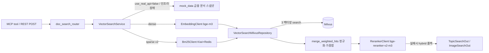

# doc-search-mcp-service — 금융 문서 지식 Hybrid 벡터 검색 MCP 서버

> FastAPI 한 앱이 REST 라우터로 동작하면서, FastMCP `from_fastapi` 로 **같은 라우트를 MCP tool 28개로 동시 노출**한다 (`:8008`). Milvus dense + BM25 sparse(2종) **3 벡터장 가중합 → reranker** 하이브리드 검색을 14개 금융 분야 × {텍스트, 이미지} 컬렉션에 대해 제공하는, 투자 리서치 에이전트용 금융 문서(공시·리포트·약관) 검색 백엔드. **API 키·인프라 없이 단독 기동** — `USE_REAL_API=false`(기본)면 in-memory MOCK 금융 문서 스냅샷으로 응답한다.

## 핵심 (이 서비스가 보여주는 것)

- **REST 와 MCP 의 단일 소스화** — `FastMCP.from_fastapi(route_maps=[RouteMap(mcp_type=MCPType.TOOL)])` 로 FastAPI 라우트를 그대로 MCP tool 로 변환. `operation_id`=tool 이름, docstring=설명, Pydantic In/Out=입출력 스키마가 SoT 라서 라우터 한 곳만 고치면 REST·MCP·소비 에이전트가 lockstep 으로 따라온다.
- **3-way 하이브리드 검색 파이프라인** — dense(bge-m3) + 본문 BM25 sparse + 메타데이터 BM25 sparse 를 각각 Milvus 벡터장에서 검색하고, `log + min-max` 정규화 후 `0.4 / 0.5 / 0.1` 가중합으로 병합·중복제거한 뒤 cross-encoder reranker(bge-reranker-v2-m3)로 최종 재정렬.
- **Mock 폴백 (무인프라 단독 동작)** — `USE_REAL_API=false`(기본)면 Milvus/Redis/임베딩/리랭커 없이 분야별 MOCK 금융 문서 청크·이미지 캡션을 반환한다. `true` 라도 인프라 연결이 실패하면 같은 MOCK 으로 폴백해 28개 tool 이 항상 비어있지 않은 결과를 낸다. (MOCK 발행사는 공개시장 well-known 종목 샘플, 수치는 예시)
- **Fail-soft 검색** — reranker HTTP 오류/timeout 시 hybrid 점수로 폴백하고 `rerank=null` 로 정직하게 라벨링(검색 자체는 항상 살림). Milvus/Redis 도 lazy 연결이라 미접속 상태로 기동되고 첫 요청에서야 연결한다.
- **결정론적 단계적 완화 검색(staged search)** — "결과 없으면 키워드/필터 줄여 재시도"라는 LLM 프롬프트 지시를 코드로 보장. 1차(전체 조건) 0건이면 `source` 필터를 해제한 완화 쿼리를 자동 재시도 → 에이전트가 같은 tool 을 반복 호출할 필요가 없다.
- **인덱싱-쿼리 vocabulary 정합** — Redis 에 적재된 BM25 모델(pickle, timestamp 버전)을 unpickle 하고, 인덱싱 측과 동일한 Kiwi 금융 용어 사용자 사전 + 명사 POS 정규화로 쿼리를 인코딩해 sparse vocabulary 불일치를 방지.
- **MCP tool few-shot + 운용 지침** — 라우터 데코레이터의 few-shot 예시를 `mcp_component_fn` 훅으로 tool `_meta` 에 부착하고, 서버 `instructions` 로 점수 해석·환각 방지·근거 인용·컴플라이언스(정보 제공 목적, 투자 조언 아님) 지침을 함께 노출. 소비 에이전트는 수집만 한다.

## 기술 스택

- **런타임**: Python 3.12, `uv`, FastAPI, uvicorn, Pydantic v2
- **MCP**: FastMCP 3.x (`from_fastapi`, Streamable HTTP `/mcp`, `JWTVerifier` HS256)
- **검색/벡터**: Milvus(pymilvus, dense HNSW/COSINE + sparse SPARSE_INVERTED_INDEX/IP), `milvus-model` BM25, Kiwi(kiwipiepy) 형태소 분석
- **모델 호출**: OpenAI 호환 embedding/reranker 엔드포인트(`httpx.AsyncClient` + tenacity 재시도)
- **저장소**: Redis (BM25 sparse 모델 캐시)
- **DI / 패턴**: dependency-injector, Router → Service → Repository 레이어, 도메인 예외 핸들러

## 아키텍처 / 동작

레이어는 다른 backend 서비스와 동일하게 **Router(@inject) → Service → Repository → store**. Repository 가 SQL 대신 Milvus 벡터 store 를 감싼다 (`MilvusClient` 주입). 외부 compute(embedding·reranker)와 BM25/Redis 는 `clients/` 에 두고 Service 에 DI 주입한다.



핵심 흐름 (`topic_search`, use_real_api=true): dense·sparse 인코딩을 `asyncio.gather` 로 병렬 실행 → Repository 가 Milvus 3 벡터장을 각 `PER_FIELD_LIMIT=30` 으로 검색 → `merge_weighted_hits` 정규화·가중합·중복제거 → 상위 `RERANK_POOL=30` 후보를 reranker `top_k` 로 재정렬. sync I/O(pymilvus·BM25)는 `run_in_threadpool` 로 오프로드한다.

**Tool / operation_id (28개)** — 14 분야 × {topic 텍스트, image 이미지}. tool `operation_id` 에서 `doc_search_` 를 떼면 Milvus 컬렉션명이 된다 (`topic_filing`, `image_valuation` …).

- `doc_search_topic_<t>` — 텍스트 본문/Q&A 청크 검색
- `doc_search_image_<t>` — 이미지 캡션(file_url·summary/detailed caption) 검색
- 분야 `t` ∈ `filing`(공시) · `earnings`(실적) · `risk`(리스크) · `valuation`(밸류에이션) · `macro`(매크로) · `sector`(섹터) · `fixed_income`(채권) · `fx`(외환) · `commodity`(원자재) · `esg`(ESG) · `compliance`(컴플라이언스) · `product_terms`(상품약관) · `faq`(FAQ) · `glossary`(용어집)

인증은 MCP 면 `JWTVerifier`, REST 면(`/doc-search/*`) `verify_access_token` 으로 공유 `JWT_SECRET`(HS256). 컬렉션 생성·적재는 별도 인덱싱 파이프라인 소유이고 이 서비스는 **검색 전용**이다.

## 실행

```bash
uv sync
cd app && APP_ENV=development uv run uvicorn main:app --reload   # http://0.0.0.0:8008  (MCP: /mcp, OpenAPI: /openapi.json)
```

`USE_REAL_API=false`(기본)면 `.env` 없이도 MOCK 금융 문서로 바로 동작한다. 실 인프라를 붙이려면 `app/.env.example` → `.env.development` 복사 후 `USE_REAL_API=true` 와 `MILVUS_DB_*`(벡터DB) · `REDIS_DB_*`(BM25 모델) · `OPENAI_EMBEDDING_*`/`OPENAI_RERANKER_*`(bge-m3 / bge-reranker-v2-m3) · `JWT_SECRET`(MCP·REST 공통, frontend·타 backend 와 동일값) 을 채운다 (모든 비밀값은 `CHANGE_ME` placeholder).

## 구조

```
app/
├─ main.py                          # FastAPI + from_fastapi(MCP), lifespan, instructions
├─ routers/vector_search/           # 28 tool 라우트 (operation_id=SoT, docstring=설명, few_shot)
├─ services/vector_search/          # hybrid 검색 오케스트레이션 (병렬 인코딩·병합·rerank·폴백·MOCK)
├─ repositories/vector_search/      # Milvus 3 벡터장 검색 (벡터 store wrapper)
├─ schemas/vector_search/           # Topic/Image In·Out Pydantic 모델 = tool 입출력 스키마
├─ clients/
│  ├─ embedding/ · reranker/        # OpenAI 호환 모델 호출 (AsyncClient + tenacity 재시도)
│  ├─ bm25/                         # Redis BM25 모델 unpickle + Kiwi 명사 정규화 (finance 사전)
│  └─ milvus/ · redis/             # 외부타입 연결 팩토리 (lazy / fail-soft)
├─ utils/
│  ├─ vector_search/score_utils.py  # log+min-max 정규화, 가중합 병합, file_url 정제 (순수함수)
│  ├─ vector_search/mock_data.py    # 무인프라 MOCK 금융 문서 스냅샷 (분야별 청크·이미지 캡션)
│  └─ common/{staged_search,few_shot,retry_utils}.py
└─ core/                            # container(DI) · config · security · 예외 핸들러 · 미들웨어
```
