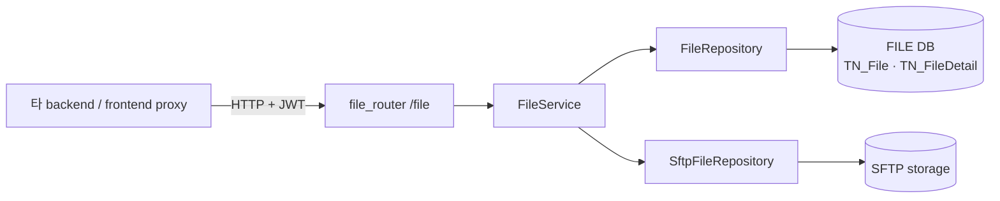

# file-service — SFTP 기반 파일 업로드/다운로드 전용 마이크로서비스

> 풀스택 템플릿의 파일 도메인을 단일 소유하는 FastAPI 서비스 (`:8100`). 파일 바이트는 SFTP 스토리지에, 메타데이터는 전용 DB(`FILE_SQL_DB_*`)에 분리 저장하고, 다른 backend 는 SFTP/DB 를 직접 만지지 않고 HTTP `FileServiceClient` 로만 이 서비스를 호출한다.

## 핵심 (이 서비스가 보여주는 것)

- **파일 도메인 단일 소유 (MSA 경계)** — 파일 스토리지(SFTP)와 메타 DB 접근을 한 서비스에 가두고, 타 backend 는 `clients/file/file_service_client.py` HTTP proxy 로만 진입. SFTP 자격증명·연결 로직이 한 곳에만 존재.
- **스트리밍 I/O 로 메모리 상수화** — 업로드는 동기 file-like 를 4MB 청크로 SFTP 에 흘려보내고, 다운로드는 `AsyncGenerator` → `StreamingResponse` 로 응답. 대용량 파일도 전체를 메모리에 올리지 않음.
- **세션 단위 SFTP 배치 + 병렬 업로드** — `open_session()` 한 연결로 디렉토리 생성 + 다건 파일 처리. `asyncio.Semaphore(4)` 로 동시 업로드 4개 제한, 실패 시 원격 파일 롤백(best-effort).
- **2단 메타 모델 + 감사 컬럼** — `TN_File`(첨부묶음) 1:N `TN_FileDetail`(개별 파일, `file_sn` 순번). raw SQL `ROW_NUMBER()` 페이지네이션, `reg_id`/`mod_id` 는 JWT 신원(`get_email()`)에서 자동 기록.
- **방어적 처리** — 위험 확장자 차단(`.exe/.sh/.js`...), 이미지 미리보기 크롭·리사이즈(Pillow, CPU 작업은 `run_in_threadpool` 오프로드), 한글 파일명 RFC 5987 인코딩, 클라이언트 disconnect/cancel 감지.

## 기술 스택

- **Framework**: FastAPI 0.136, Uvicorn, Python 3.12
- **DI**: dependency-injector (`DeclarativeContainer`)
- **Storage**: asyncssh (SFTP), Pillow (이미지 변환)
- **DB**: MS SQL Server + SQLAlchemy Core `text()` (raw SQL, ORM 런타임 쿼리 미사용), pyodbc
- **Auth**: PyJWT (HS256), ContextVar 기반 신원 전파
- **기타**: tenacity (재시도), Alembic(스키마 push), uv (의존성)

## 아키텍처 / 동작

레이어: **Router → Service → Repository → (SFTP store / SQL)**. Repository 는 자기 store 접근 계층 — SQL 메타(`FileRepository`)와 SFTP 파일(`SftpFileRepository`)을 각각 감싸고, 둘 다 Service 에 DI 주입된다.



- **업로드 흐름**: 확장자 검증 → `atch_file_id` 발급/재사용 → `TN_File` upsert → SFTP `ensure_directory`(KST 날짜별 `YYYYMMDD/HH/MM`) → 병렬 청크 업로드(저장명 UUID) → 건별 `TN_FileDetail` INSERT.
- **신원**: `verify_access_token` 이 JWT(HS256) 검증 후 `set_auth_context()` 로 ContextVar 에 박고, Service 는 인자 없이 `get_email()` 로 감사 컬럼을 채움. dev 환경은 토큰 없으면 `dev_user`/admin 로 fail-open, 그 외는 fail-closed.
- **에러 매핑**: Service/Repository 는 도메인 예외(`NotFoundError`/`BadRequestError`/`ForbiddenError`/`ServiceUnavailableError`)만 raise → `core/exception_handler.py` 가 HTTP status 로 일괄 변환 (HTTP-free 레이어 유지).
- **회복력**: SFTP 연결은 일시적 오류(연결 끊김/타임아웃/네트워크)만 분류해 tenacity 재시도, 인증 실패 등 영구 오류는 즉시 전파.

주요 엔드포인트 (`/file` prefix): 목록(`GET /`, DevExtreme skip/take/filter/sort) · 업로드(`POST /`) · 묶음/단건 조회 · 다운로드(`GET .../download`, 스트리밍) · 이미지 미리보기(`GET .../preview?size&x1..y2`) · 삭제(SFTP+DB).

## 실행

```bash
uv sync
cp app/.env.example app/.env.development   # 값 채우기 (CHANGE_ME)
cd app && APP_ENV=development uv run uvicorn main:app --reload  # :8100, root_path=/file-service
```

필요한 `.env` 키: `FILE_SQL_DB_*`(전용 메타 DB), `SFTP_HOST/PORT/USERNAME/PASSWORD/SFTP_BASE_PATH`, `JWT_SECRET`(frontend·backend 동일값 필수). 스키마는 마이그레이션 없이 push 방식(`alembic/`).

## 구조

```
app/
  main.py                          # FastAPI 앱 + lifespan(DB 연결 정리) + Container 와이어링
  core/                            # config · container(DI) · security(JWT) · auth_context · exception_handler · database
  routers/file/file_router.py      # /file REST 엔드포인트 (인증·DevExtreme 파라미터·StreamingResponse)
  services/file/file_service.py    # 업로드/다운로드/삭제/이미지 도메인 로직 + 병렬·롤백
  repositories/file/               # file_repository(raw SQL 메타) · sftp_file_repository(SFTP store 세션)
  clients/file/sftp_client.py      # asyncssh 연결 (재시도·암호화 옵션)
  models/schema.py                 # TN_File 1:N TN_FileDetail (스키마 정의, push 용)
  utils/common/file_utils.py       # 메타 생성·위험 확장자·ImageTransformer(Pillow)
alembic/                           # 스키마 push 스크립트
```
