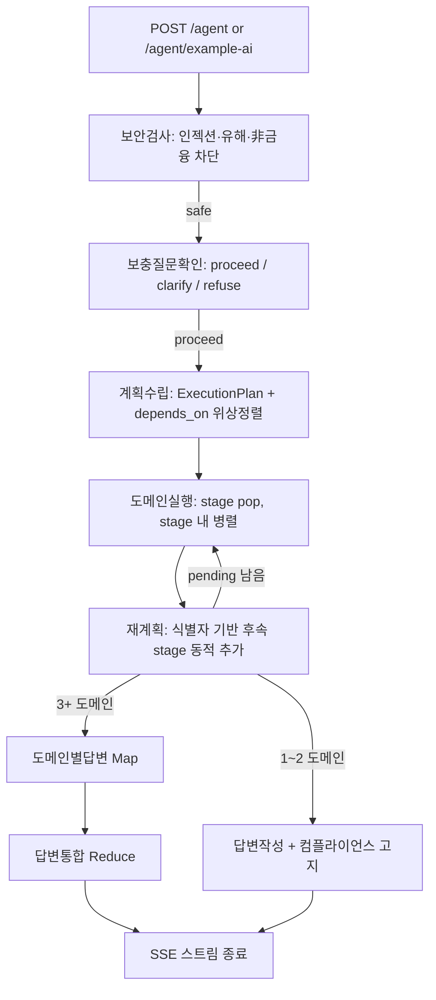

# multi-agent-service — 투자 리서치 Plan-Execute 멀티 에이전트 (:8003)

> 5개 금융 MCP 서버(시세·공시·뉴스·웹검색·사내 벡터검색)의 tool 을 `MultiServerMCPClient` 로 모아, **4 도메인 × 12 sub-agent** 계층 그래프가 오케스트레이션하는 MCP **소비자** 서비스. 투자자 질문 → 공시·시세 근거 기반 리서치 답변을 SSE 로 스트리밍. 순수 FastAPI(MCP 서버 아님), LangGraph `StateGraph` 기반.

## 핵심 (이 서비스가 보여주는 것)

- **Plan-then-Execute 멀티 에이전트** — ReAct Supervisor 와 달리 LLM 은 "계획"(`ExecutionPlan`)만 세우고 **실행은 코드가 결정론적으로** 한다. `depends_on_agents` 기반 위상 정렬(Kahn 변형)로 독립 task 는 같은 stage 에 병합·병렬, 진짜 의존성만 순차 분리. LLM 이 "언제 멈출지"를 쥐지 못하게 하는 설계.
- **동적 재계획(replan) + Hierarchical Map-Reduce** — 실행과 분리된 별도 replan 노드가 직전 결과의 식별자(티커·종목코드·공시번호)를 보고 후속 stage 를 동적 추가(3중 상한: `done` 플래그 · `max_replan` · 중복 (agent,task) 차단). 활성 도메인이 임계치 이상이면 도메인별 sub-answer 병렬 생성 후 통합(Map-Reduce), 미만이면 단일 답변.
- **결정론적 grounding 라벨** — LLM 프롬프트로 "근거 있냐"를 묻지 않고, `tool_calls` trace 에서 실제 MCP 데이터 도구(시세·공시·뉴스)가 `ok` + 비어있지 않은 payload 를 냈는지로 `sourced`/`no_evidence` 를 코드로 판정. 근거 없으면 "일반 지식으로 답한다"를 사용자에게 정직하게 고지.
- **컴플라이언스·할루시네이션 방어 다층화** — sub-agent 공통 보안·진실성 footer(검증 가능한 수치는 자료에 있는 것만 인용), fabrication 빈발 sub-agent 에 **Writer 권한 분리**(판단/도구선택=강한 LLM, 인자생성=약한 LLM, 답변은 tool evidence 기반). 모든 답변 말미에 "ⓘ 정보 제공 목적이며 투자 조언이 아닙니다" 고지를 부착하고, 운영정보(API키·IP·쿼터) redaction.
- **프롬프트 인젝션 가드레일** — 그래프 첫 노드가 보안 분류(injection/harmful) + 금융·투자 질문 게이트키핑. **현재 질문만 검사**(히스토리 격리)해 "아까 허락했잖아" 식 멀티턴 사회공학 우회를 차단. fail-open(가용성 우선).
- **운영 견고성** — sub-agent 타임아웃 + 지수 백오프 재시도, 도메인 단위 fail-soft(stub 으로 흡수), MCP tool 0개여도 기동, 요청별 MCP 게이팅(switch off = 해당 tool 미바인딩), in-memory rate limit + 동시 스트림 세마포어, 멀티턴 히스토리 read-only 주입.

## 기술 스택

- **Framework**: FastAPI, uvicorn (`--workers=1`), Python 3.12, `uv`
- **Agent / Orchestration**: LangGraph `StateGraph`, LangChain, `langchain-mcp-adapters` (`MultiServerMCPClient`, streamable-http)
- **LLM**: OpenAI 호환 vLLM 2계층 — Router(소형: ReAct·plan·가드레일) / Generator(대형: 답변·Reduce·Writer), `ChatOpenAI`
- **DI**: `dependency-injector` (Container 가 유일한 settings 경계)
- **DB**: MS SQL Server (`ai_chat_history` 멀티턴 히스토리 **read-only**), SQLAlchemy `text()` raw SQL
- **Auth**: JWT(HS256) — 사용자 토큰 검증 + 서비스 간 토큰 발급(`ServiceJwtAuth` 가 매 MCP 요청마다 fresh 토큰 주입, exp 1분)
- **관측(선택)**: LangSmith / langfuse 토글

## 아키텍처 / 동작



- **2계층 에이전트**: 4 도메인 에이전트(instrument·financials·risk·market)가 12개 sub-agent 를 **tool 로 보유**하고, 각 sub-agent 는 ReAct + 자기 MCP tool 묶음으로 동작.
- **도메인 → sub-agent → MCP tool(lockstep)**: `SubAgentSpec.mcp_tools` 이름이 각 MCP 라우터의 **operation_id 와 정확히 일치**해야 바인딩됨 — 미존재 도구는 기동 시 경고 후 제외(서버 확장 시 자동 바인딩). 정적 검증: `scripts/verify_mcp_lockstep.py` (pre-commit `mcp-lockstep` + CI `lockstep` job) — devactivity-service 의 `call_mcp_tool` 리터럴 tool 이름도 같은 기준으로 대조.
  - **instrument (종목·시세)**: `quote_sub`→[`market_quote`,`market_ohlc`,`market_search`,`doc_search_topic_glossary`] · `holdings_sub`→[`portfolio_list_holdings`,`portfolio_list_accounts`,`market_quote`]
  - **financials (재무·공시)**: `financials_sub`→[`disclosure_financials`,`disclosure_company`,`doc_search_topic_earnings`] · `filings_sub`→[`disclosure_list`,`disclosure_detail`,`doc_search_topic_filing`] · `dividend_sub`→[`disclosure_dividend`,`disclosure_major_shareholder`]
  - **risk (리스크·밸류)**: `risk_sub`→[`disclosure_financials`,`market_ohlc`,`doc_search_topic_risk`] · `valuation_sub`→[`disclosure_financials`,`market_index`,`doc_search_topic_valuation`] · `credit_sub`→[`disclosure_financials`,`doc_search_topic_fixed_income`,`doc_search_topic_compliance`]
  - **market (시장·뉴스·매크로)**: `news_sub`→[`news_search`,`news_company`,`news_detail`] · `macro_sub`→[`market_index`,`market_fx`,`doc_search_topic_macro`,`web_search`] · `sentiment_sub`→[`news_sentiment`,`news_search`,`web_search`] · `sector_sub`→[`doc_search_topic_sector`,`news_company`,`market_index`]
- **요청별 그래프 빌드**: `enabled_mcps`(또는 `switch1-5`)로 그 요청에 쓸 MCP tool 만 바인딩한 그래프를 매 요청 새로 구성(`_build_graph`, LLM·IO 없음). MCP tool 수집·domain registry 캐싱은 기동 lifespan 1회. 모든 MCP 서버는 **키 없이 mock 금융 데이터로 즉시 기동**.
- **진행 스트리밍**: sub-agent 내부 ReAct 의 tool 호출 start/end/fail 을 `_ToolTraceCallback` 이 `stream_writer` 로 push → 서비스가 SSE step 이벤트(plan/execute/tool_call/map_answer/answer)로 변환해 실시간 진행 chip 표시.
- **두 엔드포인트**: `POST /agent`(네이티브 SSE, `data:` 프레이밍 + `[DONE]`) / `POST /agent/example-ai`(ai-chatbot 프론트 호환 newline-delimited JSON, 토큰 스트리밍 + title·follow-up 생성).
- **멀티턴**: 공통 DB `ai_chat_history` 를 `(email, gid)` 로 read-only 조회해 주입(write·소유는 frontend Prisma, checkpointer 없음).

## 실행

```bash
uv sync
cd app && cp .env.example .env.development   # 키 채우기 (CHANGE_ME)
cd app && uv run uvicorn main:app --reload    # http://localhost:8003
```

필수 `.env` 키 (`app/.env.example`):

- `MCP_SERVERS` — market-data(:8004)·disclosure(:8005)·news(:8006)·web(:8007)·doc-search(:8008) (비우면 tool 0개로 기동, MCP 서버는 키 없이 mock 데이터 동작)
- `ROUTER_LLM_*` / `GENERATOR_LLM_*` — OpenAI 호환 vLLM 2계층 (base_url·api_key·model)
- `JWT_SECRET` — frontend·backend·MCP 서버 전체 동일값 (비-dev 빈 값 fail-fast)
- `MULTI_AGENT_SQL_DB_*` — 멀티턴 히스토리 read-only
- `MULTI_AGENT_DOMAINS` — 활성 도메인 (`instrument`,`financials`,`risk`,`market`)
- `LANGSMITH_API_KEY` / `LANGFUSE_*` — 관측(선택)

## 구조

```
app/
├── main.py                       # FastAPI 진입, lifespan 1회 그래프 초기화
├── routers/agent/                # POST /agent · /agent/example-ai (SSE, rate limit·세마포어)
├── services/agent/               # AgentService(stream_query) + guardrail · rate_limit · response_cache
├── graphs/                       # plan_execute(StateGraph 엔진) · pipeline_subagent · map-reduce · 프롬프트
├── agents/                       # domains/{instrument,financials,risk,market} 스펙 · registry · builders
├── clients/mcp/                  # MultiServerMCPClient(tool 수집·캐싱) + ServiceJwtAuth
├── clients/llm/                  # router/planner/generator/evaluator LLM 팩토리
├── repositories/chat_history/    # ai_chat_history read-only (raw SQL)
├── utils/agent/                  # grounding · mcp_classify(게이팅) · events · trace_metadata
└── core/                         # container(DI) · config · security(JWT) · exception_handler · auth_context
```
