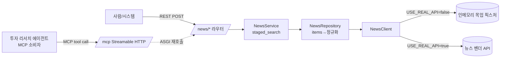

# news-mcp-service — 금융 뉴스·센티먼트·공시연계 뉴스 검색 MCP 서버

> 하나의 FastAPI 앱이 REST 라우터를 그대로 MCP tool 로 노출하는 도메인 MCP 서버 (`:8006`). 금융 뉴스(헤드라인·종목 뉴스·기사 상세·센티먼트·공시연계)를 감싸 **5개 tool** 을 LLM 투자 리서치 에이전트에게 제공한다 (DB·LLM 없음, 순수 검색 프록시). **기본은 인메모리 목업 데이터라 API 키 없이 즉시 동작**하고, `USE_REAL_API=true` 로 뉴스 벤더 실데이터로 전환한다.

## 핵심 (이 서비스가 보여주는 것)

- **REST = MCP 듀얼 서빙**: `FastMCP.from_fastapi(route_maps=[RouteMap(mcp_type=MCPType.TOOL)])` 로 기존 라우터를 `/mcp`(Streamable HTTP) tool 로 변환. REST 레이어·DI·예외핸들러를 그대로 두고, tool 실행은 ASGI 로 같은 앱 라우트를 다시 호출 — **단일 코드베이스에서 사람용 REST 와 에이전트용 MCP 를 동시 서빙**.
- **operation_id = tool 이름 SoT (lockstep)**: 라우터의 `operation_id`(`news_search`/`news_company`/`news_detail`/`news_sentiment`/`news_disclosure`)·docstring·Pydantic In·Out 이 각각 tool 이름·설명·입출력 스키마가 된다. 소비자(multi-agent-service)는 이 이름으로 tool 을 바인딩 — 경로 한 곳이 계약의 단일 출처.
- **목업 우선, 무키 기동**: 발행사/티커는 모두 공개 상장사(공개 시장 엔티티) 샘플이고 수치(주가 영향·센티먼트·공시 항목)는 데모용 합성값이다. 키 없이 바로 떠서 에이전트·프론트 통합을 막힘 없이 검증하고, `USE_REAL_API=true` + 벤더 키로 실데이터 경로(`NewsClient._get`)로 전환한다.
- **결정론적 단계적 검색 (`staged_search`)**: 검색 API 는 필터가 많을수록 0건이 되기 쉽다. Service 가 `(전체 조건 → 핵심 키워드만 남긴 완화 조건)` 시도 목록을 만들고, 첫 비-0건을 반환. "필터 줄여 재시도" 라는 프롬프트 지시를 코드로 보장 → **에이전트가 같은 tool 을 반복 호출하지 않아도 1회 호출로 폴백 완료**.
- **few-shot 메타데이터 주입 파이프라인**: 라우터 데코레이터 `openapi_extra=few_shot([{질문, 호출}])` 선언 → OpenAPI 확장(`x-fewshot`) → `attach_tool_meta` 훅이 `tool.meta.few_shot_examples` 로 부착. 서버가 예시를 소유하고 소비자는 수집만. 기동 시 부착 tool 개수를 로그해 **"조용한 누락"을 가시화**.
- **MCP 토큰 인증**: tool 호출은 `JWTVerifier`(HS256), REST(`/news/*`)는 라우터 `Depends(verify_access_token)`. 서비스 간 호출은 `create_access_token`(sub=SERVICE_NAME) 단발 토큰.
- **레이어 분리 + 견고한 외부 API 처리**: Router → Service → Repository → Client(목업 픽스처 / 뉴스 벤더 API). 실데이터 경로는 502/503/504·네트워크 오류 tenacity 재시도, 연결 풀 재사용 + lifespan 정리.
- **공시연계 근거 + 컴플라이언스**: `news_disclosure` 는 공시 원문과 연결된(disclosure_id) 기사만 추려 정량 주장의 1차 근거를 제공한다. 센티먼트는 톤 지표일 뿐 투자 판단의 단일 근거가 아니며, 수치는 기사·공시 범위로만 인용한다.

## 기술 스택

- **Python 3.12** / `uv` 의존성 관리
- **FastAPI** + **FastMCP 3.x** (`from_fastapi`, Streamable HTTP transport)
- **dependency-injector** (DI 컨테이너), **Pydantic / pydantic-settings** (스키마·설정)
- **httpx** (AsyncClient — 실데이터 경로), **tenacity** (재시도), **PyJWT** (HS256)

## 아키텍처 / 동작



- **단일 앱, 이중 진입점**: `app.mount("/", mcp_app)` 전에 REST(`/news/*`)·`/openapi.json` 이 먼저 등록돼 우선 매칭되고, 나머지는 `mcp_app` 로. `lifespan` 이 MCP 세션매니저 task group 안에서 서비스를 돌리고 종료 시 `news_client` 를 정리.
- **레이어 책임**: `Router`(인증·DI·few-shot 선언) → `Service`(단계적 검색 조립) → `Repository`(`items` 추출·`total_count` 정규화, news = 외부 검색 store) → `Client`(목업 픽스처 또는 벤더 GET + 재시도).
- **5개 tool**: 뉴스 전반 검색(`news_search`) · 종목 뉴스(`news_company`) · 기사 상세(`news_detail`) · 종목 센티먼트 집계(`news_sentiment`) · 공시연계 뉴스(`news_disclosure`). 종목 특정 여부·공시연계 여부를 docstring 이 명확히 구분해 에이전트의 tool 오선택을 방지. 페이지네이션 `num_of_rows` 최대 30.

## 실행

```bash
uv sync
cd app && uv run uvicorn main:app --reload   # :8006, /mcp + /news/* + /openapi.json — 무키 목업으로 즉시 기동
```

`app/.env.example` 의 키:

| 키 | 설명 |
|---|---|
| `USE_REAL_API` | 실데이터 토글. 기본 `false` = 인메모리 목업(키 불필요). `true` = 뉴스 벤더 API |
| `NEWS_API_BASE_URL` | 뉴스 벤더 베이스 URL (`USE_REAL_API=true` 시에만 사용) |
| `NEWS_API_KEY` | 뉴스 벤더 API 키 (`USE_REAL_API=true` 시에만 사용) — `CHANGE_ME` |
| `JWT_SECRET` | MCP/REST 인증 HS256 키 (frontend·타 서비스와 동일값) — `CHANGE_ME` |

## 구조

```
app/
├── main.py                 # FastAPI + FastMCP from_fastapi, lifespan, /mcp 마운트
├── core/
│   ├── container.py        # DI: config → news_client → repository → service
│   ├── security.py         # verify_access_token / JWTVerifier / 서비스 토큰
│   ├── auth_context.py     # ContextVar 멀티테넌트 신원
│   └── exception_handler.py# 도메인/표준 예외 → HTTP status 매핑
├── routers/news/           # /news/* 라우터 (operation_id = tool 이름 SoT, few-shot 선언)
├── services/news/          # NewsService — 단계적 검색(staged_search) 조립
├── repositories/news/      # NewsRepository — 뉴스 응답 items 파싱·정규화
├── clients/news/           # NewsClient(목업/벤더 transport) + news_fixtures(인메모리 샘플)
├── schemas/news/           # Pydantic In/Out (= MCP tool 입출력 스키마)
└── utils/common/           # staged_search · few_shot · retry_utils · time_utils
```

> ⓘ 정보 제공 목적이며 투자 조언이 아닙니다. 목업·실데이터의 수치(주가 영향·실적·센티먼트)는 기사·공시 근거 범위로만 인용하세요.
