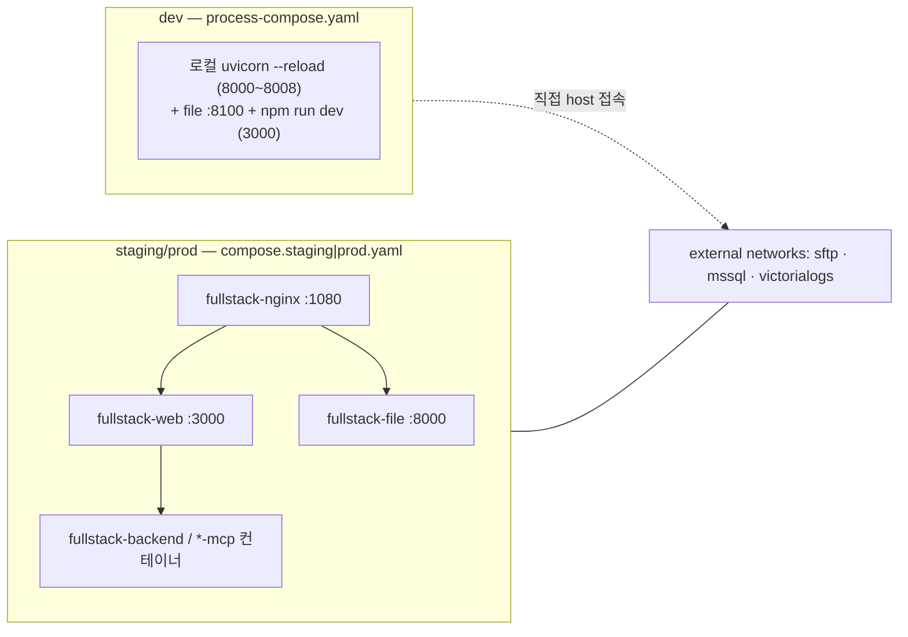

# platform/ — 인프라 구성

애플리케이션 서비스(`backend-service`, `*-mcp-service`, `multi-agent-service`, `frontend` 등)를 둘러싼 **인프라 사이드카** 모음. 각 하위 폴더는 Dockerfile/compose/config 로 독립 기동 가능한 단일 관심사를 담는다. 도메인 중립 — 투자 리서치 비즈니스 로직은 앱 서비스에만 있고, 여기는 라우팅·LLM 게이트웨이·로그·파일 저장만 담당한다.

| 폴더 | 정체 | 핵심 | 배선 |
| --- | --- | --- | --- |
| `nginx/` | 엣지 리버스 프록시 (`nginx:stable`) | `/` → `web:3000`, `/file-service/` → `file:8000` 라우팅. 파일 경로만 `client_max_body_size 2g` + 900s timeout + `proxy_request_buffering off` (공시 PDF·리서치 첨부 등 대용량 업로드 스트리밍). 공통 프록시 헤더·WebSocket 업그레이드 맵은 `config/conf.d/*.conf` 분리 | 루트 `compose.staging.yaml`/`compose.prod.yaml` 의 `fullstack-nginx` (`1080:80`) 가 빌드. `web`/`file` healthy 후 기동 |
| `litellm/` | 자체 호스팅 LLM 게이트웨이 (LiteLLM `v1.87.1` + SGLang) | OpenAI 호환 단일 엔드포인트(`:4000`)로 LLM(`Qwen3.6-27B`, 멀티모달) 단일 모델 라우팅. 멀티에이전트·single-agent 의 유일한 LLM 소스. 3단 가드레일(`custom_guardrail.py`): canary 주입(pre) → 고민감 PII 마스킹(pre, 주민·카드·계좌 — 전화·이메일·사업자·우편은 통과) → 출력 안전성(post, 시스템 프롬프트 누설 차단 + `korcen` 욕설 마스킹, 스트리밍 hold-back). `model-downloader` 가 HF 모델 선다운로드 → `sglang-llm` (2-GPU TP, FP8 KV cache) → `litellm` 순서 의존 | 자체 `compose.yaml` 로 **독립 기동**(GPU 노드). 루트 compose 와 분리 — 앱 서비스는 `OPENAI_API_KEY`/`base_url` 로 `:4000` 만 바라봄 |
| `victorialogs/` | 중앙 로그 저장소 (`victoria-logs:v1.50.0`) | 전 서비스 구조화 로그 수집(`:9428`). `victorialogs` named network + volume 로 영속 | 자체 `compose.yaml` 로 **선기동**(`external` 네트워크 제공). 루트 compose 의 모든 앱 서비스가 `VICTORIALOGS_URL=http://victorialogs:9428` 로 push |
| `sftp/` | 파일 저장 백엔드 (`atmoz/sftp:debian`) | `file-service` 의 SFTP 업로드/다운로드 타깃(`2022:22`). 개발용 자격증명 `admin:admin`(`CHANGE_ME` 교체 대상) | 자체 `compose.yaml` 로 **선기동**(`sftp` external 네트워크). `file-service` 만 접근, 타 서비스는 `FileServiceClient` HTTP proxy 경유 |

## dev vs staging+ 배선

- **dev**: 루트 [`process-compose.yaml`](../process-compose.yaml) 가 각 서비스를 `working_dir=<svc>/app` 에서 `uvicorn --reload` 로 띄움(nginx 없이 직접 포트 노출 — backend 8000 / 포트폴리오·MCP 8002~8008 / multi-agent 8003 / file-service 8100). 인프라(`sftp`/`victorialogs`/MS SQL)는 platform 하위 compose 를 개별 기동해 공유. 모든 MCP 는 기본 MOCK 금융 데이터라 API 키 없이 즉시 기동.
- **staging+**: 루트 [`compose.staging.yaml`](../compose.staging.yaml) / [`compose.prod.yaml`](../compose.prod.yaml) 가 전 서비스를 컨테이너로 빌드, `fullstack-nginx` 만 외부 노출(`1080`). `sftp`·`mssql`·`victorialogs` 는 `external: true` 네트워크라 platform compose 가 **먼저** 떠 있어야 한다. staging 은 `APP_ENV=staging`/`INFO`, prod 는 `production`/`WARNING`.
- `litellm/` 는 두 경로 어디에도 묶이지 않은 **별도 GPU 스택** — `compose.yaml` 단독 기동 후 OpenAI 호환 `:4000` 으로 소비.

> 보안: 모든 시크릿은 `CHANGE_ME` 플레이스홀더(`litellm/.env.example`). 배포 시 `.env`/시크릿 매니저로 교체. 가드레일은 LLM 게이트웨이 계층 방어(누설·욕설·PII)일 뿐, 환각·미근거 수치·투자 조언 컴플라이언스 방어는 `multi-agent-service` 의 도메인 가드레일이 담당한다.
