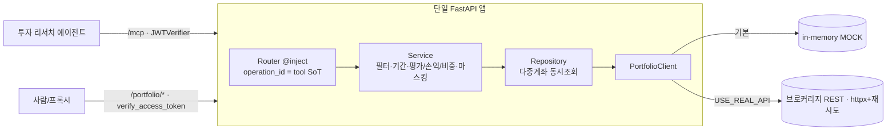

# portfolio-mcp-service — 브로커리지 계좌·보유·거래·주문·활동 조회 MCP 서버 (:8002)

> 하나의 FastAPI 앱이 REST 라우터를 그대로 서빙하면서, FastMCP `from_fastapi` 로 같은 라우트를 `/mcp` MCP tool 로 노출한다. 투자 리서치 에이전트가 호출하는 5개의 read-only 도구로 브로커리지 계좌·보유종목·거래·주문·계좌활동을 제공한다. **기본은 공개 상장사 기반 in-memory MOCK 데이터라 API 키 없이 즉시 동작**하고, env 토글로 실 브로커리지 REST API 에 붙는다.

## 핵심 (이 서비스가 보여주는 것)

- **REST = MCP 단일 정의 (`from_fastapi`)**: 같은 라우터를 사람·프록시는 `/portfolio/*` REST 로, 에이전트는 `/mcp` Streamable HTTP 로 소비한다. 라우트 `operation_id` 가 MCP tool 이름의 **SoT** — multi-agent-service 의 sub-agent `mcp_tools` 가 이 이름으로 lockstep 바인딩한다(예: `holdings_sub`→`portfolio_list_holdings`).
- **MOCK-first standalone**: 데이터 소스는 기본적으로 공개 상장사(삼성전자·SK하이닉스·Apple·Microsoft·ETF·국고채) 기반 샘플 포트폴리오다 — 공개 시장 엔티티라 비밀 정보가 아니다. `USE_REAL_API=true` + 브로커리지 키일 때만 외부 REST 를 호출(env 토글). Service/util 은 모드를 모르고 repository 가 흡수한다.
- **에이전트 친화적 tool 설계**: docstring=tool description, Pydantic In/Out=입출력 스키마. 계좌 식별·날짜(KST)·도구 선택·수치 근거·0건 처리 운용지침을 서버 `instructions` 로 자기소개 → 소비자가 시스템 프롬프트에 주입. 모든 답변에 컴플라이언스 면책(`ⓘ 정보 제공 목적이며 투자 조언이 아닙니다`) 부착.
- **결정론적 수치, no-hallucination**: 평가금액·평가손익·계좌내 비중·NAV·net_amount 를 보유·체결·시세 데이터에서 코드로 계산해 돌려준다 — LLM 추정 금지. 수치 주장은 도구가 준 값으로만 뒷받침.
- **source-side 식별자 마스킹**: 계좌번호 등 식별자를 노출 전 정규식으로 부분 마스킹(`[계좌번호 일부 가려짐]`) → LLM·리포트·로그로 원본이 새지 않게 데이터 소스 단에서 차단.
- **단일 소유 + read-only 견고성**: 브로커리지 접근은 이 서비스만 한다(타 서비스는 MCP tool 로만). 다중 계좌는 `asyncio.Semaphore` 로 동시 조회(개별 실패 skip), REAL 모드 502/503/504·네트워크 오류는 tenacity 재시도, 활동 미존재는 `found=false` 로 graceful 반환.

## 기술 스택

- **Python 3.12** · **FastAPI** · **FastMCP** (`from_fastapi`, Streamable HTTP)
- **httpx** (async, 연결 풀 재사용) + **tenacity** (재시도) — REAL 모드 브로커리지 REST
- **dependency-injector** (DI) · **Pydantic / pydantic-settings** (tool I/O 스키마·설정)
- **PyJWT** (HS256) — MCP `JWTVerifier` + REST `verify_access_token` · 의존성 `uv` · lint `ruff`

## 아키텍처 / 동작



- 동일 앱에 `portfolio_router` 를 붙이고 `FastMCP.from_fastapi(route_maps=[RouteMap(mcp_type=TOOL)])` 로 GET 라우트까지 전부 tool 로 고정해 `/mcp` 에 mount. REST(`/portfolio/*`)·`/openapi.json` 이 먼저 매칭되고 나머지는 MCP transport 로.
- lifespan 이 `mcp_app.lifespan`(StreamableHTTP 세션매니저 task group) 안에서 서비스를 돌리고 종료 시 `portfolio_client.aclose()`.
- 거래·주문·활동은 KST 기준 `since`/`until` 정규화(미지정=최근 30일), 최대 250건(`truncated` 플래그). free-text(detail) 는 `redact_secrets()` 통과.

### 제공 도구 (operation_id = MCP tool 이름)

| tool | 메서드·경로 | 용도 |
|---|---|---|
| `portfolio_list_accounts` | `GET /portfolio/accounts` | 전체 계좌 카탈로그 (account_no 마스킹·유형·기준통화·NAV·예수금) |
| `portfolio_list_holdings` | `POST /portfolio/holdings` | 보유종목 (수량·평균단가·현재가·평가금액·평가손익·계좌내 비중) |
| `portfolio_search_transactions` | `POST /portfolio/search-transactions` | 거래 검색 (매매·입출금·배당·수수료, 기간·종목·유형, net_amount) |
| `portfolio_search_orders` | `POST /portfolio/search-orders` | 주문 검색 (status·side·종목·기간, 최대 250건) |
| `portfolio_get_account_activity` | `POST /portfolio/account-activity` | 특정 계좌 활동 통합 (체결·주문·입출금·배당, found 구분) |

## 실행

```bash
uv sync
cd app && APP_ENV=development uv run uvicorn main:app --reload   # :8002  (REST /portfolio/*, MCP /mcp)
```

API 키 없이 바로 동작한다(기본 MOCK). 실 브로커리지 API 는 `app/.env.example` → `.env.development` 복사 후 설정:

| 키 | 설명 |
|---|---|
| `USE_REAL_API` | `true` 면 외부 브로커리지 REST 호출, `false`(기본)면 in-memory MOCK |
| `BROKERAGE_API_BASE_URL` / `BROKERAGE_API_TOKEN` | 브로커리지 REST 베이스·read 토큰 (REAL 모드 전용) |
| `JWT_SECRET` | HS256 시크릿 — frontend·타 서비스와 동일값 (`CHANGE_ME`) |

## 구조

```
app/
├─ main.py                                  # FastAPI + from_fastapi(MCP) 조립, lifespan, instructions
├─ core/                                    # config·container(DI)·security(JWT)·exception_handler·middlewares·logger
├─ routers/portfolio/portfolio_router.py    # @inject 라우터 — operation_id/docstring = MCP tool SoT
├─ services/portfolio/portfolio_service.py  # 도메인 로직 (필터·기간·평가/손익/비중 계산, LLM 없는 순수 데이터)
├─ repositories/portfolio/                  # 브로커리지 데이터 접근 (MOCK·REAL 흡수, 다중 계좌 동시조회)
├─ clients/portfolio/portfolio_client.py    # 데이터 소스 연결 (in-memory MOCK 픽스처 / async httpx + 재시도)
├─ schemas/portfolio/portfolio_schema.py    # Pydantic In/Out = MCP tool 입출력 스키마
└─ utils/
   ├─ portfolio/portfolio_utils.py          # since/until 정규화·보유/거래/주문/활동 라인 변환 (순수함수)
   ├─ redaction/redactor.py                 # 계좌번호 마스킹 (source-side)
   └─ common/                               # retry_utils·time_utils
```
