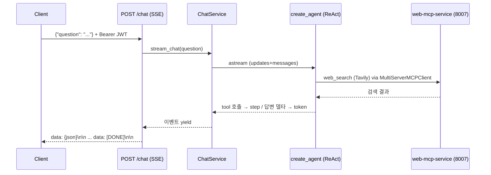

# single-agent-service — MCP 웹검색 도구를 소비하는 단일 ReAct 에이전트 챗 (신규 에이전트 서비스 교본)

투자자 질문을 받아 **web-mcp-service 의 Tavily 웹검색 tool** 을 호출하고, 검색 근거에 기반한 답변을 SSE 로 토큰 스트리밍하는 단일 에이전트 서비스. LangGraph `create_agent`(프리빌트 ReAct) 한 개로 한 도메인을 처리하는 **MCP 소비 에이전트의 최소 정본**이며, 도구가 많아지면 `multi-agent-service` 의 Plan-Execute 로 졸업하는 경로까지 코드·README 가 안내한다.

## 핵심 (보여주는 패턴·기술)

- **LangGraph ReAct 에이전트** — `create_agent(model, tools, system_prompt)` 로 LLM 이 tool 을 고르고 결과를 다시 추론하는 ReAct 루프. tool 이 적은 단일 서버에서는 `bind_tools` 가 도구 선택을 구조적으로 보장해 ReAct 가 적합 (tool 많은 다중 서버는 writer 파이프라인으로 졸업)
- **MCP 소비자 아키텍처** — `MultiServerMCPClient` 로 원격 MCP 서버의 tool 을 기동 시 1회 수집(`initialize()` in lifespan), 요청 핫패스에서 재빌드 없음. tool 의 `_meta` few-shot 예시를 모아 SYSTEM 프롬프트에 주입
- **서비스 간 JWT 인증** — `ServiceJwtAuth` 가 매 MCP 요청마다 fresh 서비스 토큰을 발급, 사용자 JWT 는 `verify_access_token` 로 검증. `JWT_SECRET` 은 frontend·backend·MCP 서버와 byte-identical
- **금융 가드레일** — SYSTEM 프롬프트에 "검색 결과에만 근거, 출처 확인된 수치만 인용, 모르면 모른다" 정직성 규칙을 박고, 모든 답변 끝에 `ⓘ 정보 제공 목적이며 투자 조언이 아닙니다` 컴플라이언스 문구 부착
- **Fail-soft** — MCP 서버가 안 떠 있으면 tool 0개로 기동(LLM 지식만으로 답, 스트림은 안 깨짐)
- **네이티브 SSE 스트리밍** — `step`(tool 호출 시작) · `token`(답변 델타) · `error` + `[DONE]`. 스트림 시작 후 예외는 라우터가 마스킹

## 기술 스택

- **Python 3.12 · FastAPI** — 순수 REST + SSE (MCP 소비자라 서버화 안 함)
- **LangGraph / LangChain** — `create_agent` ReAct, `langchain-mcp-adapters` `MultiServerMCPClient`
- **LLM** — OpenAI 호환 `/chat/completions` (vLLM/litellm, 스트리밍 tool-calling)
- **dependency-injector** — Container 기반 DI 와이어링 (Singleton 에이전트)
- **인증** — JWT HS256 (사용자 검증 + 서비스 토큰 발급)

## 아키텍처·동작



소비하는 MCP 서버 — **web-mcp-service (8007)** · operation_id `web_search` (Tavily 웹검색). web-mcp 는 키 없이도 mock 데이터로 즉시 동작하므로 별도 API 키 없이 전 경로를 실행할 수 있다. (MCP 미기동 시 tool 0개 fail-soft)

**SSE 계약** — `POST /chat` · body `{"question":"..."}` · `Authorization: Bearer <JWT>`. 프레이밍 `data: {json}\n\n`, 종료 `data: [DONE]\n\n`. 이벤트 `type`: `step`(`{"tool":"web_search","message":"web_search 호출 중"}`) · `token`(답변 토큰 델타) · `error`(마스킹된 사용자 메시지).

## 실행

```bash
# 소비할 MCP 서버 먼저 기동 (web tool 노출 — mock 데이터라 키 불필요)
cd web-mcp-service/app && uv run uvicorn main:app --host 0.0.0.0 --port 8007 &

# 에이전트 서비스 기동 (포트 8010, process-compose/compose 미등록 — 단독 기동 전용)
cd single-agent-service && uv sync
cd app && APP_ENV=development uv run uvicorn main:app --reload --host 0.0.0.0 --port 8010

# 사용자 JWT 발급 (JWT_SECRET 은 .env.* 와 동일값)
TOKEN=$(uv run python -c "import jwt,time; print(jwt.encode({'sub':'verify','email':'check@local','exp':int(time.time())+300}, '<JWT_SECRET>', algorithm='HS256'))")

# /chat SSE 실호출 — step(web_search) + token 답변 스트림
curl -N -X POST localhost:8010/chat \
  -H "Authorization: Bearer $TOKEN" -H "Content-Type: application/json" \
  -d '{"question":"최근 미국 기준금리 동향과 시장 영향을 알려줘"}'
```

설정은 `app/.env.example` 참고 — `MCP_SERVERS`(소비할 MCP 서버) · `ROUTER_LLM_*`(LLM 엔드포인트) · `JWT_SECRET`.

## 구조

```
single-agent-service/app/
├── main.py                       # FastAPI + lifespan(에이전트 1회 초기화), 포트 8010
├── core/
│   ├── config.py                 # Settings 경계 — MCP_SERVERS·ROUTER_LLM_*, 비-dev JWT fail-fast
│   ├── middlewares.py            # CORS + 처리시간
│   ├── container.py              # dependency-injector 와이어링
│   └── security.py               # verify_access_token (JWT HS256, 공통 템플릿)
├── clients/
│   ├── mcp/mcp_auth.py           # ServiceJwtAuth — 매 요청 fresh 서비스 JWT
│   ├── mcp/mcp_client.py         # MultiServerMCPClient 빌더 + tool 캐시 + few-shot 수집
│   └── llm/llm_client.py         # ChatOpenAI(스트리밍 tool-calling) 빌더
├── agents/chat_agent.py          # ★ create_agent(llm, tools, system_prompt) — 단일 ReAct + 가드레일 SYSTEM
├── services/chat/chat_service.py # initialize(tool 1회 수집) + stream_chat(이벤트 yield)
├── schemas/chat/chat_schema.py   # ChatIn{question}
└── routers/chat/chat_router.py   # POST /chat SSE + 인증 dependencies
```

> **multi-agent 졸업** — 여러 도메인을 한 질문에서 함께 다루거나(시세+공시+뉴스+웹), 질문을 계획(plan)으로 쪼개 단계 실행·맵리듀스가 필요하면 `multi-agent-service` 의 Plan-Execute StateGraph 로 졸업한다. 이 `create_agent` 가 거기선 ③최하위 sub-agent 이며, 그 위에 ②res_pipeline(Route–Execute–Synthesize) + ①StateGraph(PlanExecuteState) 를 얹는 경로다.
