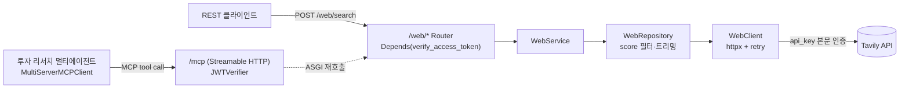

# web-mcp-service — Tavily 웹 검색 MCP 서버 (:8007)

> 하나의 FastAPI 앱이 REST API(`/web/*`)와 MCP tool(`/mcp`)을 **동시에** 서빙한다. Tavily 웹 검색을 단일 tool(`web_search`)로 노출해, 투자 리서치 멀티에이전트가 시장·종목·매크로의 최신 뉴스·업황 동향·실시간 정보를 **검색 근거**로 사용하게 하는 도메인 전용 MCP 서버. DB·LLM 없음.

## 핵심 (이 서비스가 보여주는 것)

- **REST → MCP 자동 변환 (FastMCP `from_fastapi`)**: 기존 `@inject` 라우터 → Service → Repository → 외부 API 스택을 그대로 둔 채, `from_fastapi` 가 같은 앱의 라우트를 MCP tool 로 변환한다. `operation_id` = tool 이름, docstring = tool 설명, Pydantic In/Out = tool 입출력 스키마. REST 와 MCP 가 하나의 코드/한 프로세스에서 나온다.
- **operation_id 가 tool 이름의 SoT (lockstep)**: `web_search` operation_id 가 MCP 소비자(multi-agent / single-agent service)의 tool 바인딩 이름과 byte-단위로 결합 — 한쪽 변경 시 양쪽이 함께 움직인다.
- **few-shot 예시를 서버가 소유**: 라우터 데코레이터의 `openapi_extra=few_shot([{질문, 호출}])` 선언 → `mcp_component_fn` 훅이 tool `_meta.few_shot_examples` 로 부착. 에이전트는 이 메타를 모아 시스템 프롬프트에 주입한다 (서버=예시 소유, 소비자=수집). 기동 시 부착 개수를 로그로 가시화해 "조용한 누락"을 방지.
- **이중 인증 경계**: MCP transport 는 `JWTVerifier`(HS256), REST `/web/*` 는 라우터 `Depends(verify_access_token)`. MCP tool 내부 호출 시 미들웨어가 FastMCP ContextVar 의 Authorization 을 ASGI scope 로 주입해 동일 JWT 인증을 재사용. 서비스 간 호출은 `create_access_token`(sub=SERVICE_NAME) 서비스 토큰.
- **얇은 레이어 + 외부 API 의 store 화**: 외부 검색을 store 로 간주해 `WebClient`(transport·연결·재시도) → `WebRepository`(데이터 접근: score 필터·필드 트리밍) → `WebService` → Router 로 분리. SQL·Milvus 데이터소스와 동일한 구조를 외부 HTTP API 에 적용.
- **운용 견고성**: `tenacity` 기반 재시도(HTTP 502·503·504 + 네트워크 오류 자동 분류), 도메인/표준 예외를 HTTP status 로 일괄 매핑하는 exception handler, `httpx.AsyncClient` 연결 풀 재사용 + lifespan 정리.

## 기술 스택

- **FastAPI** + **FastMCP** (`from_fastapi`, Streamable HTTP transport, `JWTVerifier`)
- **dependency-injector** (`DeclarativeContainer` — config → client → repository → service)
- **httpx** AsyncClient (Tavily API transport) + **tenacity** (재시도)
- **Pydantic / pydantic-settings** (tool 입출력 스키마 + 환경 분리 설정)
- **PyJWT** HS256 (사용자·에이전트 JWT + 서비스 토큰)
- Python 3.12, **uv** 의존성 관리, ruff

## 아키텍처 / 동작



- **MCP tool (operation_id)**: `web_search` — 시장·종목·매크로 뉴스, 업황 동향, 실시간 정보 검색. multi-agent 의 `macro_sub`·`sentiment_sub` 가 이 tool 을 바인딩한다.
- **단일 앱, 두 표면**: `main.py` 는 REST 앱(`/web/*`, `/openapi.json`)을 먼저 등록하고 나머지를 `mcp_app` 에 마운트한다. MCP tool 실행은 ASGI 로 다시 같은 앱의 라우트를 호출하므로 REST·MCP 가 동일 Service/Repository 로직을 공유한다.
- **lifespan**: `mcp_app.lifespan` 이 StreamableHTTP 세션매니저 task group 을 띄운 컨텍스트 안에서 서비스가 돌고, 종료 시 `web_client.aclose()` 로 연결 풀을 정리한다.
- **결과 가공 (`WebRepository`)**: 관련도 score < 0.15 결과 제외, 제목 150자·내용 500자 트리밍, Tavily 생성 답변(`answer`)·이미지 URL 포함. `WebClient` 는 SNS 도메인(instagram/facebook/tiktok) 제외 + `max_results` 상한 10.
- **tool 입력 스키마**: `query`, `max_results`(1–10), `search_depth`(basic/advanced), `include_images`. 검색 깊이·0건 처리 정책은 docstring·스키마가 SoT.

> 다른 금융 MCP 서버(market-data·disclosure·news·doc-search)는 키 없이 mock 데이터로 즉시 기동되지만, web-mcp 는 실시간 외부 검색이라 `TAVILY_API_KEY` 가 필요하다.

## 실행

```bash
uv sync --locked                          # 의존성 설치
cp app/.env.example app/.env.development   # 환경 파일 작성 (CHANGE_ME 채우기)
cd app && uv run uvicorn main:app --reload --port 8007
```

- 포트 **8007** — MCP `:8007/mcp`, REST `:8007/web/search`, 스키마 `:8007/openapi.json`
- 필수 env (`app/.env.example`): `TAVILY_API_KEY`, `JWT_SECRET`(frontend·backend·소비 서비스와 **동일값**). 비-dev 에서 빈 `JWT_SECRET` 기동은 fail-fast 로 차단.
- dev 멀티서비스 일괄 기동은 상위 템플릿의 `process-compose up`.

## 구조

```
app/
├── main.py                  # FastAPI + from_fastapi(MCP 변환) + lifespan/마운트
├── core/
│   ├── container.py         # DI: config → web_client → web_repository → web_service
│   ├── security.py          # verify_access_token (JWT HS256) + create_access_token (서비스 토큰)
│   ├── middlewares.py       # McpHeaderMiddleware (MCP 호출 시 Authorization 주입) + CORS
│   ├── exception_handler.py # 도메인/표준 예외 → HTTP status 매핑
│   └── config.py            # pydantic-settings (.env.<APP_ENV>)
├── routers/web/             # /web/search 라우터 (operation_id=web_search, few-shot 선언)
├── services/web/            # WebService — 도메인 로직 (LLM 없음)
├── repositories/web/        # WebRepository — score 필터·필드 트리밍 (검색 store 접근)
├── clients/web/             # WebClient — Tavily transport (httpx + tenacity 재시도)
├── schemas/web/             # WebSearchIn / WebSearchOut (= MCP tool 입출력 스키마)
└── utils/common/few_shot.py # few-shot 선언/부착 훅 + 부착 가시화
```
